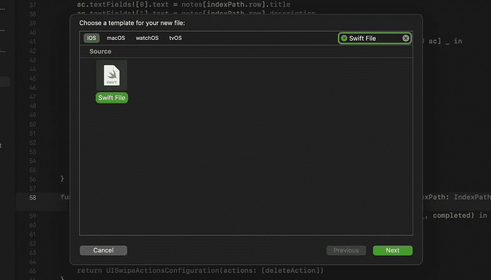
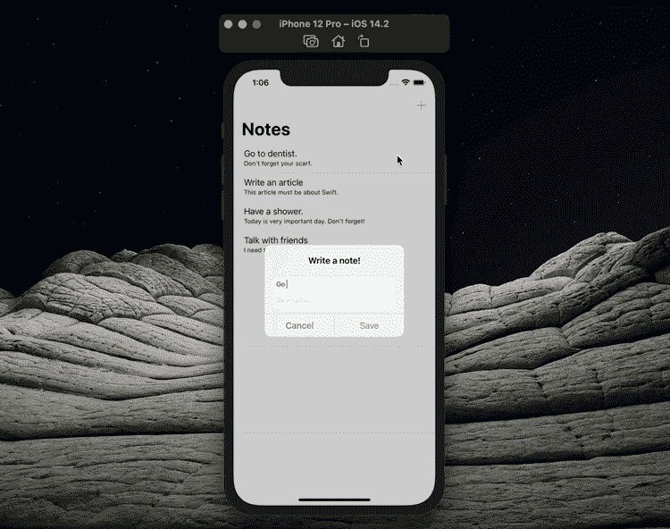

# 开始使用 iOS 应用程序中的 FileManager

> 原文：<https://betterprogramming.pub/getting-started-with-the-filemanager-in-your-ios-app-acd81b171f7d>

## 检查文件系统的内容，并对其进行更改


作者照片。

在本文中，我们将了解什么是文件管理器以及如何使用它。我们将学习如何在一个简单的 UIKit 项目中使用 FileManager。让我们从什么是 FileManager 开始。

# 什么是文件管理器？

`FileManager`类提供了对共享文件管理器对象的方便访问，该对象适用于大多数类型的文件相关操作。文件管理器对象通常是您与文件系统交互的主要模式。您可以使用它来定位、创建、复制和移动文件和目录。您还可以使用它来获取有关文件或目录的信息，或者更改它的一些属性。

我喜欢 FileManager 的最大原因是它非常容易使用。这就是为什么我通常在我的小项目中使用它。如果你想开发自己的应用并在 App Store 发布，FileManager 会很有用。

# 如何使用 FileManager？

在这一部分中，我们将确保在 notes 应用程序中使用 FileManager 创建的笔记保存在应用程序中。

首先，我们需要下载启动项目。你可以从下面的链接下载这个项目。(在您下载的文件夹中，将有两个名为“Starter”和“Final”的文件夹。我们将使用“Starter”文件夹。)

[](https://github.com/canbalkya/FileManager-Example) [## canbalkya/file manager-示例

### 这个项目是为我的文章创建的。你可以在这里看我的文章…

github.com](https://github.com/canbalkya/FileManager-Example) 

***重要提示！***

第一次打开项目时，您可能会看到一个错误。这是因为您没有使用 Apple ID 登录项目。如果您在“签名&功能”选项卡的“团队”部分输入您自己的帐户，问题将会得到解决。

如果你已经下载了项目，我们就可以开始了！首先，转到“Helpers”文件夹并点击 cmd+N，然后创建一个新的 Swift 文件。



我们姑且称这个 Swift 文件为`NoteManager`。这也是我们班的名字。

```
**class** NoteManager {}
```

在我们开始写代码之前，我们需要导入`UIKit`框架。

```
**import** UIKit**class** NoteManager {}
```

定义我们将在类中使用的所有属性。当然，我们需要一个初始化器。(我们将在下面几行中这样做。)

```
**class** NoteManager { // MARK: - Properties
    **private let** dataSourceURL: URL
    **private var** allNotes: [Note] { }
}
```

当我们对`allNotes`属性进行任何更改时，我们使用`get-set`来立即保存用`FileManager`所做的更改。这很酷，对吧？

```
// MARK: - Properties
**private let** dataSourceURL: URL
**private var** allNotes: [Note] {
    get {
        do { } catch { }
    }
    **set** {
        **do** { } **catch** { }
    }
}
```

在`get`部分，我们必须得到`allNotes`值，在 set 部分，我们必须给它设置一个新值。为此，我们来编写以下代码。

```
**private** var allNotes: [Note] {
    **get** {
        **do** {
            **let** decoder = PropertyListDecoder()
            **let** data = **try** Data(contentsOf: dataSourceURL)
            **let** decodedNotes = **try**! decoder.decode([Note].**self**, from: data) **return** decodedNotes
        } **catch** {
            **return** []
        }
    }
    **set** {
        **do** {
            **let** encoder = PropertyListEncoder()
            **let** data = **try** encoder.encode(newValue) **try** data.write(to: dataSourceURL)
        } **catch** { }
    }
}
```

现在，为了初始化我们的`NoteManager`类，我们必须在`init`函数中定义`dataSourceURL`元素。

```
// MARK: - Life Cycle
**init**() {
    **let** documentsPath = FileManager.default.urls(for: .documentDirectory, in: .userDomainMask)[0]
    **let** notesPath = documentsPath.appendingPathComponent("notes").appendingPathExtension("plist") dataSourceURL = notesPath
}
```

在上面的代码中，我们表示将把我们的`Note`对象保存在一个 plist 文件中。您还可以将`Note`对象保存为其他文件类型，比如 JSON。

现在，我们在这个类中要做的就是定义这个类的函数。我们在这里定义的函数对我们类的层次结构非常重要。

如你所见，`allNotes`的属性是私有的，我们不能从类外访问`allNotes`。这就是为什么我们创建一个函数来从外部访问`allNotes`属性。

```
// MARK: - Functions
**func** getAllNotes() -> [Note] {
    **return** allNotes
}
```

创建一个函数向`allNotes`数组添加一个新元素。

```
// MARK: - Functions
**func** create(note: Note) {
    allNotes.insert(note, at: 0)
}
```

编写以下函数来改变任何`Note`对象。

```
**func** setComplete(note: Note, index: Int) {
    allNotes[index] = note
}
```

最后，创建一个函数来删除任何`Note`对象。

```
**func** delete(note: Note) {
    **if let** index = allNotes.firstIndex(where: { $0.id == note.id }) {
        allNotes.remove(at: index)
}
```

感谢`Note`对象中的`id`属性，我们能够在上面的函数中找到具有相同`id`的`Note`对象。

我们很快就会看到，我们只需要使用简单的数组方法来修改`allNotes`属性。

现在是时候使用我们在应用程序的 UI 部件中创建的类了！首先，进入`MainViewController.swift`。

首先，我们需要定义`NoteManager`对象。为此，删除`notes`数组并定义`NoteManager`对象而不是`notes`数组。

```
// MARK: - Properties
**var** noteManager = NoteManager()
```

我们改变`numberOfRowsInSection`方法来改变`TableView`的细胞计数:

```
// MARK: - Functions
**func** tableView(_ tableView: UITableView, numberOfRowsInSection section: Int) -> Int {
    **return** noteManager.getAllNotes().count
}
```

更改`cellForRowAtIndexPath`方法中的`note`元素，以确定每个单元格中将显示什么信息:

```
**func** tableView(_ tableView: UITableView, cellForRowAt indexPath: IndexPath) -> UITableViewCell {
    **let** cell = tableView.dequeueReusableCell(withIdentifier: "NoteCell") **as**? NoteTableViewCell
    **let** note = noteManager.getAllNotes()[indexPath.row]
    cell!.prepare(with: note) **return** cell!
}
```

要保存所做的更改，请更改`didSelectRowAt`方法:

```
**func** tableView(_ tableView: UITableView, didSelectRowAt indexPath: IndexPath) {
    tableView.deselectRow(at: indexPath, animated: **false**) **let** ac = UIAlertController(title: "Change your note!", message: nil, preferredStyle: .alert)
    ac.addTextField()
    ac.addTextField()
    ac.textFields![0].text = noteManager.getAllNotes()[indexPath.row].title
    ac.textFields![1].text = noteManager.getAllNotes()[indexPath.row].description **let** cancelAction = UIAlertAction(title: "Cancel", style: .cancel)
    **let** changeAction = UIAlertAction(title: "Change", style: .default) { [self, unowned ac] _ **in**
        **let** title = ac.textFields![0].text!
        **let** description = ac.textFields![1].text!
        **let** note = Note(title: title, description: description) **self**.noteManager.setComplete(note: note, index: indexPath.row)
        DispatchQueue.main.asyncAfter(deadline: .now() + 0.5) {
            **self**.tableView.reloadRows(at: [indexPath], with: .automatic)
        }
    } ac.addAction(cancelAction)
    ac.addAction(changeAction) present(ac, animated: **true**)
}
```

更改`trailingSwipeActionsConfigurationForRowAt`方法以删除正确的单元格:

```
**func** tableView(_ tableView: UITableView, trailingSwipeActionsConfigurationForRowAt indexPath: IndexPath) -> UISwipeActionsConfiguration? {
    **let** noteToDelete = noteManager.getAllNotes()[indexPath.row] **let** deleteAction = UIContextualAction(style: .destructive, title: "Delete") { (_, _, completed) **in**
        completed(**true**)
        **self**.noteManager.delete(note: noteToDelete)
        tableView.deleteRows(at: [indexPath], with: .fade)
    } **return** UISwipeActionsConfiguration(actions: [deleteAction])
}
```

最后，如下更改`addButtonTapped`动作，用`FileManager`保存该注释。

```
**let** submitAction = UIAlertAction(title: "Save", style: .default) { [**self**, unowned ac] _ **in**
    **let** title = ac.textFields![0].text!
    **let** description = ac.textFields![1].text!
    **let** note = Note(title: title, description: description) **self**.noteManager.create(note: note)
    DispatchQueue.main.asyncAfter(deadline: .now() + 0.5) {
        **let** newIndexPath = IndexPath(row: 0, section: 0)
        **self**.tableView.insertRows(at: [newIndexPath], with: .automatic)
    }
}
```

完了！一切都准备好了——让我们看看吧！



如您所见，我们可以添加新的注释，对现有的注释进行更改，以及删除它们。

我希望您已经通过这篇文章理解了 FileManager 技术。我们项目的最终版本在我在文章开头分享的 repo 的“final”文件夹里。

```
**My Other Articles** -[Build a TextField for Numbers in SwiftUI](/build-a-textfield-for-numbers-in-swiftui-21030b58a41)
- [Animation in SwiftUI: Get to Know Transactions](/animation-in-swiftui-get-to-know-transactions-7cd57cfb299f)
- [Get to Know SwiftUI’s GroupBox](/get-to-know-swiftuis-groupbox-c33ee71ff895)
```

如果你想见我或有关于 iOS 开发等问题。你可以在这里和我进行一对一的会谈。