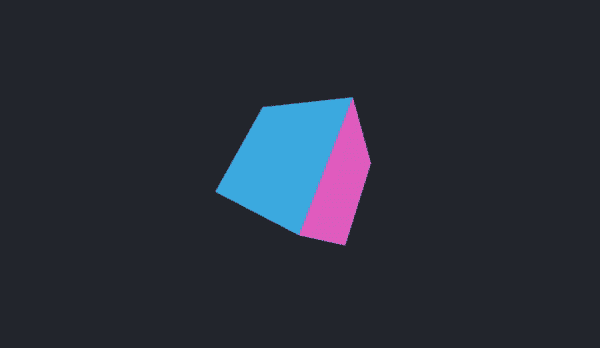
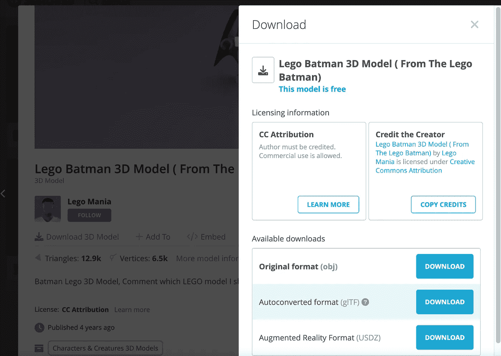
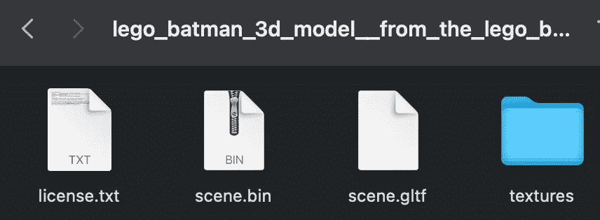
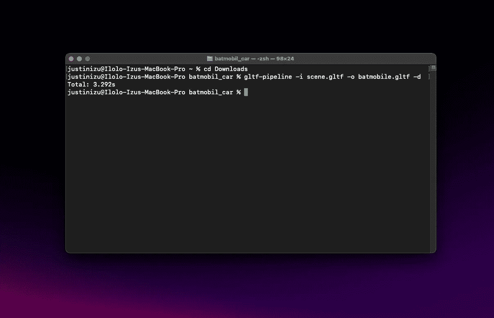
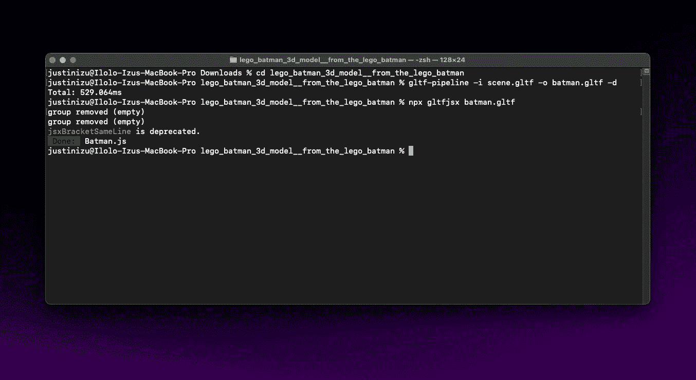
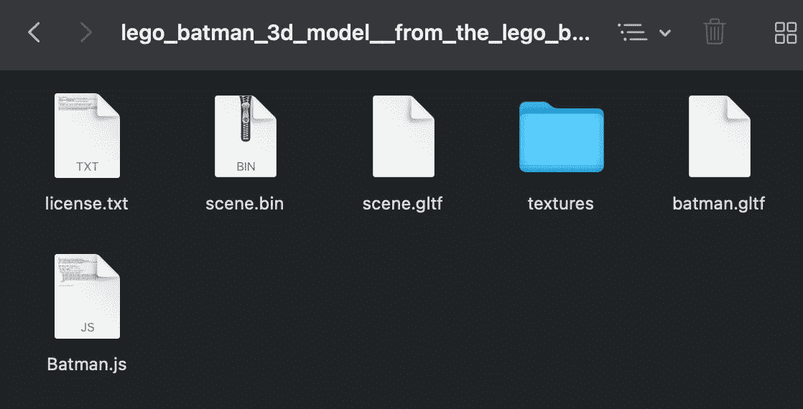

# Three.js 入门

> 原文：<https://betterprogramming.pub/getting-started-with-three-js-7a9031379847>

## 将您的第一个 3D 模型导入 React



今天，2022 年 4 月，我们在建造什么

如果你曾经使用过 [Blender](https://en.wikipedia.org/wiki/Blender_(software)) ，或者任何其他的 3D 建模程序，并且想要将你的模型整合到你的 ReactJS 应用程序中，这是为你准备的博客文章。*或*，如果你有*从未*使用过 blender 或其他任何 3D 建模程序，并且想第一次尝试使用 [Three.js](https://threejs.org/) ，这是给你的！今天，我们将在 React 应用程序中渲染一个彩色的盒子。

这里是[回购链接](https://github.com/iloloizu/ThreeJS-Blog-Test)如果要分叉的话。

首先，让我们从基础开始。

# Three.js 是什么？

一个 JavaScript 3D 库，

> Three.js 是一个开源的 JavaScript 库，用于在 web 浏览器上显示图形、3D 和 2D 对象。它在幕后使用 WebGL API。Three.js 允许您使用 GPU(图形处理单元)在 web 浏览器的画布上渲染图形和 3D 对象。因为我们使用 JavaScript，所以我们也可以与其他 HTML 元素交互。Three.js 由 Ricardo Cabello 于 2010 年 4 月发布。— GeeksforGeeks

# 让我们开始吧:

## 安装 Three.js

在您的终端中，您需要完成的第一个目标是运行以下命令:

```
npm install --save three
npm install three @react-three/fiber 
npm install @react-three/drei
```

## 创建容器组件

安装完必要的项目后，我们将使用以下内容创建一个新的 react 应用程序:

```
npx create-react-app three-js-box-test
```

…或者在 react 应用程序中创建一个新页面，并将以下内容作为另一个组件导入。

我们需要创建一个组件来保存我们今天要呈现的实际盒子。这将看起来像 React 中的典型组件。

## 创建盒子

在这之后，你会注意到我们添加的唯一有趣的项目是一个画布。画布是我们 3D 模型的容器。现在，我们需要添加另一个名为 Box.js 的文件。在 Box 中，我们将创建我们想要渲染的实际 3D 项目。

现在…你不能告诉我那不容易！当你看到

```
<boxBufferGeometry attach="geometry" args={[3,3,3]} />
```

你会注意到有一个名为“args”的属性，我建议你试试这个属性，这样你就可以改变盒子的尺寸了！从立方体到矩形棱柱，您可以用这些数字中的每一个来改变长度、宽度和高度。例如，试试这个:

```
<boxBufferGeometry attach="geometry" args={[2,3,1]} />
```

meshNormalMateral 为每个矢量变量添加了不同的光线，这允许一个非常漂亮和美观的盒子，你也可以导入更多的网格甚至你自己的纹理。看看[文档](https://threejs.org/docs/index.html#api/en/constants/Materials)就知道了！

## **渲染盒子**

最后，我们要做的是渲染盒子，用 Three.js 的纯粹的魔法和美丽。

嘣！！！我们拿到了。这是最终容器组件的外观。

您会注意到添加了三个项目。让我来解释一下:

```
<ambientLight intensity={1}/> 
//Light is a necessity to see the object <directionalLight position={[-2,5,2]} intensity={1}/> 
//This light changes the intensity from different axes <OrbitControls enableZoom={false} autoRotate={true}/> 
//This is what allows the box to be dynamically controlled by the user. AutoRotate is just a really cool added effect 
```

# 渲染您自己的自定义 3D 模型


渲染乐高蝙蝠侠，2022 年 4 月

现在，更详细的部分来了，假设你已经有了一个自己的 3D 物体，或者你从像 [Sketchfab](https://sketchfab.com/search) 这样的网站上下载了一个 3D 物体来渲染它。乐高蝙蝠侠下载[链接](https://sketchfab.com/3d-models/lego-batman-3d-model-from-the-lego-batman-fe0de34081854108b3899bbcc4c42b4b#download)。



从 Sketchfab 下载文件，2022 年 4 月

首先你需要确定的是文件是. glTF。之后，如果你从 Sketchfab 下载了文件，你希望自动转换的文件显示在上面。下载文件时，解压并检查内容。您应该会看到一个 scene.glTF 文件。

## 。为德拉科干杯。glTF



解压文件夹！2022 年 4 月

我们需要做的是在终端中运行命令，将 scene.glTF 转换为 Draco。我们可以使用的 glTF 文件。我们将使用 [glTF 管道](https://github.com/CesiumGS/gltf-pipeline)来转换我们的场景，在终端中，从保存 scene.glTF 文件的文件夹位置运行:

```
glgltf-pipeline -i model.gltf -o {your chosen model name}.gltf -d
```

如果该权限被拒绝，请在上面的代码前面添加 **sudo** 。



2022 年 4 月，在终端进行转换

运行时，我们会看到一个名为{您选择的型号名称}的新文件。或者在我看来是蝙蝠侠。

## 德拉科。glTF to。射流研究…

在这之后，你需要转化新的德拉科。glTF 转换成一个. js 文件，这样我们就可以在 react 中将它作为一个组件来呈现。我们将使用 [gltfjsx](https://github.com/pmndrs/gltfjsx) 来做这件事，我保证这很容易。

```
npx gltfjsx {your chosen model name}.gltf
```



航站楼的最终外观，2022 年 4 月

现在，您会注意到下载文件夹中的另一个文件！



我们的 JS 模型在这里，2022 年 4 月

在此之后，我们应该可以点击并拖动 Batman.js 或{您选择的型号名称}。js 到我们的项目中，并呈现组件，就像我们之前对盒子所做的那样。

我想我会是第一个说的人。恭喜，您已经正式将您的第一个 3D 模型导入 React。希望你喜欢这篇博文！