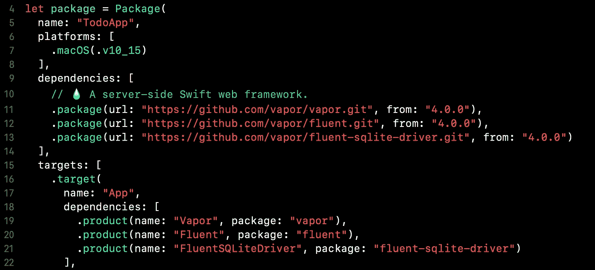

# Vapor 4 入门—通过构建 Todo 应用程序来学习

> 原文：<https://betterprogramming.pub/getting-started-with-vapor-4-part-1-3d731e64fb45>

## 了解这一以 Swift 编写的服务器优先工具的基础知识(不那么基础)


# 介绍

我必须说，我在构建 web 应用程序方面没有太多经验，但作为一名 iOS/macOS 开发人员，我非常了解 Swift。我以前听说过 Vapor，但我从未深入研究过这个框架。我必须说，在花了一些时间通读他们的文件并试用之后，我很高兴。

在这一系列文章中，我将解释 Vapor 必须提供的一些功能，同时我们将构建一个待办事项应用程序。这篇文章将主要关注于给出“什么是 Vapor”的一点上下文，并且将覆盖一些基础知识，同时让我们接触这个框架。

你可以在我的回购协议中找到完整的实现:

[https://github.com/fermoya/vapor-tutorial](https://github.com/fermoya/vapor-tutorial)

# 概观

## 什么是蒸汽？

[Vapor](https://vapor.codes) 是用 Swift 编写的服务器端框架。它提供了一套工具来帮助您轻松地从头开始创建 web 应用程序和/或定义 API 来支持您的移动客户端。我们可以在其他著名的 web 应用程序框架中找到相似之处:

*   [轨道上的红宝石](https://www.google.com/url?sa=t&rct=j&q=&esrc=s&source=web&cd=&cad=rja&uact=8&ved=2ahUKEwjKvdbNg67wAhW5ahUIHSzsC1MQFjAAegQICBAD&url=http%3A%2F%2Frubyonrails.org%2F&usg=AOvVaw0epiqyAbLyZLd_L0nxpc1u)(红宝石)
*   Django (Python)
*   [交响乐](https://symfony.com) (PHP)
*   [Spring](https://spring.io/projects/spring-framework) (Java)

## 为什么是蒸汽？

经过一些研究，我发现 Vapor 被社区广泛接受。这是一个非常成熟的框架，提供了大量的可能性，易于使用，并且正是我所努力的。只需很少的配置，您就可以立即启动并运行它。

另外，它是用我熟悉的 Swift 编写的，可以从 Xcode 使用，也可以从终端使用。不仅如此，Vapor 可以在 macOS 和 Linux 上安装，甚至可以创建一个映像在 Docker 上运行。

## 它是唯一的服务器端 Swift 框架吗？

一点也不。目前，还有其他选择。还有[基图拉](https://github.com/Kitura/Kitura)和[完美](https://www.perfect.org)。然而，它们都没有像 Vapor 那样被广泛接受。

# 创建你的第一个应用程序:TodoApp

如果不是通过创建一个示例应用程序，告诉你什么是 Vapor 的最好方法是什么？让我们一起运行一个简单的例子来看看它是如何工作的。我们将创建一个待办事项应用程序，并使用您的终端、 [Postman](https://www.postman.com) 或您可能喜欢的任何其他 API 客户端进行测试。

## 装置

如果您还没有安装它，请继续运行`brew install vapor`。确保您已经安装了 [Homebrew](https://brew.sh) ，并且您的 Swift 版本是 5.2+。

或者，如果你使用的是 Linux，请遵循这里的说明。

## 新项目

要从模板创建一个新项目，您只需要运行`vapor new <project_name>`。默认情况下，Vapor 会询问您是否愿意使用 Leaf 和/或 Fluent(稍后会详细介绍)。用`n`来回答这两个问题。或者，运行带有`-n`选项的命令:

```
$ vapor new TodoApp -n
```

## 项目结构

让我们快速看一下项目结构:

```
.
├── Dockerfile
├── Package.swift
├── Sources
│   ├── App
│   │   ├── Controllers
│   │   ├── configure.swift
│   │   └── routes.swift
│   └── Run
│       └── main.swift
├── Tests
│   └── AppTests
│       └── AppTests.swift
└── docker-compose.yml
```

您应该熟悉三个文件:

*   `main.swift`。这里是你的`Application`被定义的地方。您可能希望这个文件基本上保持不变。
*   `configure.swift`。这是注册服务、配置数据库、定义一些中间件或启动队列系统等的最佳场所。您还可以更改 HTTP 配置(主机名、端口等)。
*   `routes.swift`。使用此文件定义应用程序的端点和路由。在真实的应用程序中，您将处理数十个端点(如果不是更多的话)，因此，您会想要将相关的端点分组到`Controllers`中。

## 运行应用程序

默认情况下，Vapor 已经从一个模板创建了您的项目，因此您应该已经定义了几个端点(您可以在您的`routes.swift`文件中仔细检查)。

运行应用程序有两种选择:

*   从 Xcode:在项目文件夹中运行`vapor xcode`，然后运行⌘R。
*   从终端:运行`vapor run serve`

默认情况下，您的应用程序在`127.0.0.1:8080`(或`localhost:8080`)中运行。您可以使用以下命令轻松测试这一点:

```
$ curl localhost:8080/hello
Hello, world!**%**
```

# 待办事项列表:CRUD 操作

此时，我们的应用程序与待办事项列表唯一相关的就是项目名称。让我们通过让应用程序客户端创建一个新的待办事项列表来改变这一点。

## Fluent 和 SQLite

[流质](https://docs.vapor.codes/4.0/fluent/overview/)是在蒸汽中支撑的[形态](https://en.wikipedia.org/wiki/Object–relational_mapping)。它正式支持 SQLite、MySQL、PostgreSQL 和 MongoDB。由于我们的应用程序处于早期阶段，我们将使用支持内存数据库的 SQLite 的驱动程序。在实际应用程序中，您可能希望使用持久数据库，但是对于本教程来说，内存数据库也可以。

要配置 Fluent 和 SQLite，请转到您的`Package.swift`并添加 Fluent 和 FluentSQLiteDriver。它应该是这样的:



保持文件的其余部分不变。最后，在您的`configure.swift`中，添加以下内容:

```
import Vapor
import Fluent
import FluentSQLiteDriverpublic func configure(_ app: Application) throws {
  app.databases.use(.sqlite(.memory), as: .sqlite)
  try routes(app)
}
```

## 模型和迁移

`Model`是 Fluent 理解的实体，而迁移是负责创建/更新数据库表的代码。有点像所有变更的记录簿或版本控制(因此，它们添加的顺序很重要)。

让我们从我们的`Model`开始，定义我们的`TodoList`将会是什么样子，如下所示:

目前，一个`TodoList`将只包含一个`name`。注意`@ID`和`@Field`的使用。前者指示哪个字段将被视为表查找键。后者用于定义表列的名称。也就是说，`Model`定义了一个数据库表，因此它也通过定义`schema`来定义其名称。

一旦我们的模型被定义，我们唯一需要做的事情就是创建一个`Migration`来创建表格，如下所示:

注意这里迁移将如何创建一个包含两列的表:一个`id`和一个`name`。确保这些名称与模型中定义的名称相同。如果要恢复这个迁移，操作将是相反的:删除表。

最后，在您的`configure.swift`中注册您的迁移，如下所示:

```
// after registering your database...
app.migrations.add(TodoMigration(), to: .sqlite)try app.autoMigrate().wait()
```

**注意:**当我们使用内存数据库时，需要自动迁移。

## 路线

此时，我们已经准备好开始定义一些端点。我们将考虑两种操作:

*   GET:我们将返回所有可用的`TodoList`
*   帖子:我们将允许客户端创建一个新的`TodoList`

端点在`routes.swift`中定义。打开它，您会注意到一个`func routes(_:)`，它将一个`Application`作为参数。该功能从`configure.swift`调用，用于定义您的应用程序允许的所有路线。

继续将下面的代码放入其中:

```
app.get("todo-lists") { req in
  TodoList.query(on: req.db)
    .all()
    .encodeResponse(for: req)
}
```

下面是这段代码的作用:

*   它定义了一个路径为`todo-lists`的`GET`路由/端点
*   当被调用时，我们查询`database`以返回所有可用的`TodoList`
*   最后，返回数组`[TodoList]`作为响应

在继续之前，您会注意到一个编译器错误。这是因为，为了将实体编码为 JSON 响应以从请求中解码，实体/模型需要符合`Content`:

```
import Vaporextension TodoList: Content { }
```

您定义的每个新端点都需要返回 and `EventLoopFuture`。这只是一个异步操作的包装器，每当您的端点被调用时都会运行。Vapor 建立在 SwiftNIO 之上。

**注:**从最新的 Vapor 版本开始， [Vapor 支持](https://docs.vapor.codes/4.0/async/) `[async/await](https://docs.vapor.codes/4.0/async/)`。这意味着先前定义的端点也可以表示如下:

```
app.get("todo-lists") { req in
  try await TodoList
    .query(on: req.db)
    .all()
    .get()
}
```

为了兼容，我们将坚持使用`EventLoopFuture`的方式。

类似地，我们可以定义一个`POST`操作来创建一个`TodoList`:

```
app.post("todo-lists") { req in
  try req.content
    .decode(TodoList.self)
    .save(on: req.db)
    .transform(to: Response(status: .created))
}
```

在这种情况下，我们使用`post(_:use:)`来定义一个`POST`操作，其中我们:

*   尝试从请求内容中解码出一个`TodoList`
*   我们将它保存在数据库中
*   我们将结果转换成一个`HTTP 201 Created`响应

让我们试一试:

```
$ curl localhost:8080/todo-lists
[]**%** $ curl -X POST localhost:8080/todo-lists -H "Content-Type:application/json" --data "{ \"name\": \"My first TODO list\" }"
$ curl localhost:8080/todo-lists | jq
[
  {
    "id": "77D8FD15-D6C4-4EE1-9996-601370ED3329",
    "name": "My first TODO list"
  }
]
```

干得好，这真是太棒了！我们目前已经设置了创建读取操作。我将把更新和删除的实现作为完成所有 CRUD 的练习。提示:`app`定义了一个`put`(也是一个`path`)和一个`delete`方法。

# 结论

至此，您将有希望有机会掌握 Vapor，并像我一样热爱它。在后面的文章中，我们将继续扩展 TodoApp 并涵盖:

*   高级路由
*   参数和查询参数
*   模型关系

[](/getting-started-with-vapor-4-model-relationships-e6e73d6c2412) [## Vapor 4 入门—模型关系

### 扩展待办事项应用程序，了解这一以 Swift 编写的服务器优先工具的更多高级功能

better 编程. pub](/getting-started-with-vapor-4-model-relationships-e6e73d6c2412) 

感谢阅读！

祝你好运。