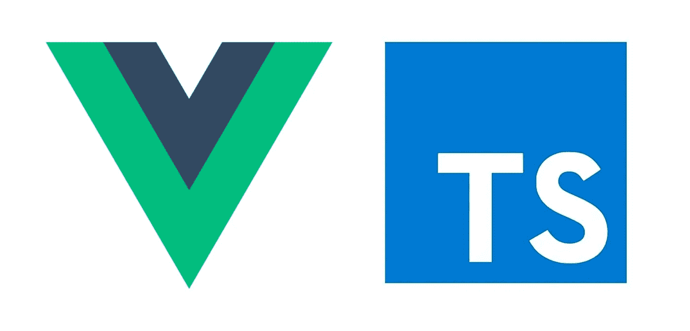
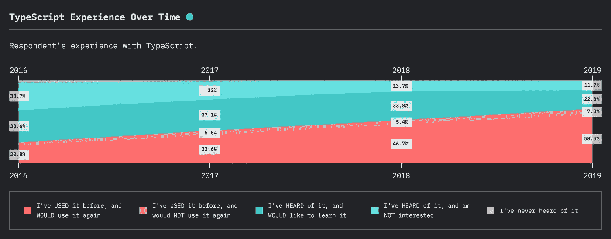
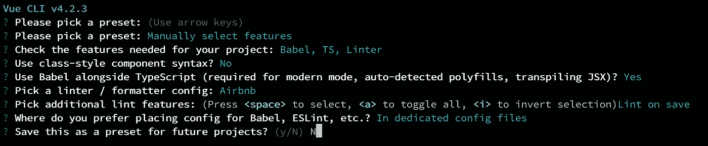

# Vue.js 和 TypeScript 入门

> 原文：<https://betterprogramming.pub/getting-started-with-vue-js-and-typescript-2e2d0e9cfa71>

## 向您的 Vue 代码添加类型安全



我使用 JavaScript 已经很多年了，尽管我是一个热情的用户，但我并不是这种语言本身的狂热爱好者——即使它在过去几年里确实朝着好的方向发展了。我一直缺少的主要东西是显式定义类型的能力。

TypeScript 是 JavaScript 的超集，通过添加*静态类型来解决这个问题。*从 2012 年就有了(！)在过去的几年里，它越来越受欢迎([来源](https://2019.stateofjs.com/javascript-flavors/typescript/))。

对大多数人来说，这可能并不新鲜，但对我来说，这是我想尝试的事情之一，我还没有真正抽出时间去做。似乎我并不孤单，在这次调查中有 22%的开发者表示他们想尝试 TypeScript。



TypeScript 上 JavaScript 2019 的状态

正如我刚刚发现的，它非常容易开始，我不知道为什么我等了这么多年…

无论如何，通过 Vue CLI，您可以用一个命令创建样板应用程序。如果您还没有安装，请在您喜欢的终端中运行以下命令进行安装。

```
> npm install -g @vue-cli
```

然后，使用以下内容创建一个新项目:

```
> vue create <app-name>
```

首先，选择*手动选择特性*，然后进行以下选择。

然而，选择*类型脚本*和对类样式组件语法说*不*(我是模板语法的粉丝)是本文中唯一必须遵循的。



终端配置新的 Vue 应用程序

瞧啊。你现在有一个样板应用程序！

与使用普通 JavaScript 相比，您会得到更多的配置文件，但是您不必关心这些。至少现在没有。

在文件`<app-name>/src/App.vue`中，`<script>`部分会有一些不同。您现在将拥有:

而不是:

这些确保 transpiler 知道脚本应该被视为 TypeScript 而不是 JavaScript，并让 TypeScript 推断 Vue 组件选项中的类型。

我们现在可以实现如下方法:

并保证传入的参数实际上是一个*字符串*，否则至少会得到一个错误。

我不会在这里深入探究各种可能性，我的目标只是向你展示开始是多么容易，如果有像我一样的人，或许可以降低障碍。

现在我们可以探索 TypeScript 的世界了！

感谢阅读。