# W3 入门。半铸钢ˌ钢性铸铁(Cast Semi-Steel)

> 原文：<https://betterprogramming.pub/getting-started-with-w3-css-379ff93463d1>

## 通过名为 W3 的轻量级响应 CSS 框架启动您的 web 开发项目。半铸钢ˌ钢性铸铁(Cast Semi-Steel)

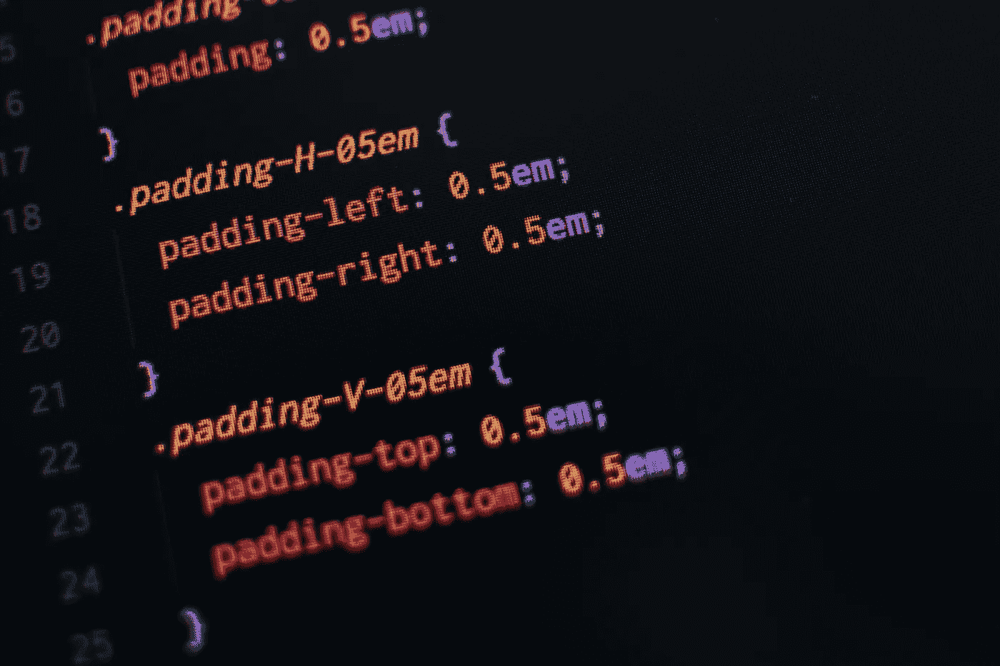

照片由 [Pankaj Patel](https://unsplash.com/@pankajpatel?utm_source=unsplash&utm_medium=referral&utm_content=creditCopyText) 在 [Unsplash](https://unsplash.com/search/photos/css?utm_source=unsplash&utm_medium=referral&utm_content=creditCopyText) 上拍摄

在本文中，我将介绍一个简单易用的框架，叫做 W3.CSS。

请注意:这个框架是为轻量级项目设计的。为了熟悉 CSS，我强烈推荐那些刚开始从事 web 开发的人。

对于一个简单的网站来说，现有的功能已经足够好了。基于官方网站:

> W3。CSS 是一个具有内置响应能力的现代 CSS 框架。它默认支持响应式移动优先设计，比类似的 CSS 框架更小更快。
> 
> W3。CSS 还可以加快和简化 web 开发，因为它比其他 CSS 框架更容易学习和使用。

主要优点是它可以免费使用，不需要任何许可。最重要的是，您可以轻松地将它包含在您的项目中，只需一行代码。在本文中，我们将涵盖三个主要领域:

1.  安装
2.  基本用法
3.  结论

# 安装

## 版本

有两种不同的版本可供选择:

1.  **默认:**官方网站提供的原版。在撰写本文时，最新版本是 4.13。
2.  **专业**:免费使用，跟默认版本一样。专业版更小更快，因为它没有定义颜色。专业版设计用于开发人员提供的主题或其他颜色类别。

## [计] 下载

您可以下载 CSS 脚本并在本地链接它，或者只需遵循此[链接](https://www.w3schools.com/w3css/4/w3.css)中提供的代码:

```
<link rel="stylesheet" href="https://www.w3schools.com/w3css/4/w3.css">
```

对于专业版，可以使用以下[链接](https://www.w3schools.com/w3css/4/w3pro.css):

```
<link rel="stylesheet" href="https://www.w3schools.com/w3css/4/w3.css">
```

如果您使用的是专业版，可以使用 style 标签定义自己的颜色:

```
<link rel="stylesheet" href="https://www.w3schools.com/w3css/4/w3pro.css"><style>
.w3-amber{color:#000!important;background-color:#ffc107!important}
</style>
```

此外，你也可以加载你自己的主题，就像下面的[例子](https://www.w3schools.com/w3css/tryit.asp?filename=tryw3css_pro_theme):

```
<link rel="stylesheet" href="https://www.w3schools.com/w3css/4/w3pro.css">
<link rel="stylesheet" href="https://www.w3schools.com/lib/w3-theme-amber.css">
```

每个主题都有以下类别:

*   `w3-theme-l5`
*   `w3-theme-l4`
*   `w3-theme-l3`
*   `w3-theme-l2`
*   `w3-theme-l1`
*   `w3-theme`
*   `w3-theme-d1`
*   `w3-theme-d2`
*   `w3-theme-d3`
*   `w3-theme-d4`
*   `w3-theme-d5`

# 基本用法

所有的 CSS 类都以一个`w3-`前缀开始。您可以轻松地将它内联添加到标签的类中。在本文中，我将列出几个重要的类，我们可以用它们来设计我们的页面。让我们看看下面的一个容器类:

```
<div class="w3-container"></div>
```

## 背景颜色

您可以使用`w3-<name of the color>`类轻松地为 div 标签添加颜色。您可以通过下面的[链接](https://www.w3schools.com/w3css/w3css_colors.asp)查看可用类的完整列表。

```
<div class="w3-container w3-blue">
  <p>Welcome to Medium!</p>
</div>
```

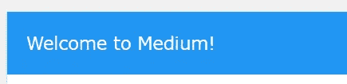

作者图片

## 文本颜色

文本颜色与背景颜色相同，只是类别不同(`w3-text-<name of the color>`)。

```
<div class="w3-container w3-red">
  <p class="w3-text-black">Welcome to Medium!</p>
</div>
```

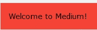

作者图片

## 悬停颜色

你可以使用`w3-hover-<name of the color>`类改变鼠标悬停时的颜色。

```
<div class="w3-container w3-blue w3-hover-black">
  <p>Welcome to Medium!</p>
</div>
```

您也可以对文本上的悬停效果进行同样的操作。记住不要过度。

## 容器和面板

这是最重要的类之一，通常用于 div、header 和 footer 标签。

它为标签提供了一种通用的样式。`w3-container`类向元素添加 16px 的左右填充，而`w3-panel`类向元素添加 16px 的上下边距和 16px 的左右填充。

下图显示了`w3-container`和`w3-panel`的区别。

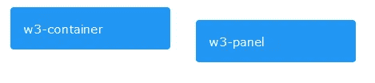

作者图片

## 边境

您可以通过`w3-border` [类](https://www.w3schools.com/w3css/w3css_borders.asp)显示边框。您可以指定显示哪一侧，以及边框是细还是粗。也可以定义边框颜色。

让我们看一下下面的例子:

```
<div class="w3-panel w3-border w3-border-blue">
    <p>Showing a blue border.</p>
</div>
```

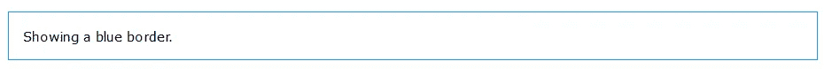

作者图片

## 卡片

`w3-card`是一个提供类似纸张效果的有用类。它最常用于显示表单或图像的模态中。

让我们根据边缘阴影的强度尝试三种不同的版本:

```
<div class="w3-panel w3-card"><p>w3-card</p></div>
<div class="w3-panel w3-card-2"><p>w3-card-2</p></div>
<div class="w3-panel w3-card-4"><p>w3-card-4</p></div>
```

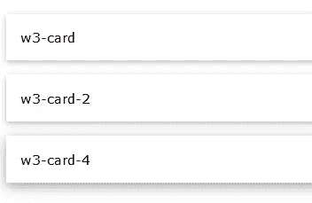

作者图片

## 显示

您可以通过 display 类在特定位置显示元素。您需要有一个父 div 作为容器。

让我们用下面的代码试试看:

```
<div class="w3-display-container w3-red" style="height:300px;">
    <div class="w3-display-topleft">Top Left</div>
    <div class="w3-display-topright">Top Right</div>
    <div class="w3-display-bottomleft">Bottom Left</div>
    <div class="w3-display-bottomright">Bottom Right</div>
    <div class="w3-display-left">Left</div>
    <div class="w3-display-right">Right</div>
    <div class="w3-display-middle">Middle</div>
    <div class="w3-display-topmiddle">Top Middle</div>
    <div class="w3-display-bottommiddle">Bottom Middle</div>
</div>
```

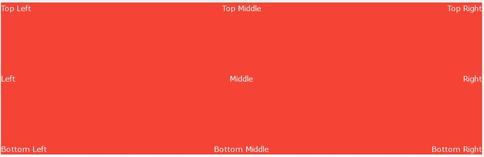

作者图片

## 轮次

您可以使用`w3-round`语法为一个元素添加圆角——无论它是一个 div 还是一个图像。它还支持不同的边框半径变化:

*   `w3-round` —元素圆形(边框半径)4px
*   `w3-round-small` —元素圆形(边界半径)2px
*   `w3-round-medium` —元素圆形(边界半径)4px
*   `w3-round-large` —元素圆形(边框半径)8px
*   `w3-round-xlarge` —元素圆形(边框半径)16px
*   `w3-round-xxlarge` —元素圆形(边框半径)32px

```
<div class="w3-round w3-blue">w3-round</div>
<div class="w3-round-small w3-blue">w3-round</div>
<div class="w3-round-medium w3-blue">w3-round</div>
<div class="w3-round-large w3-blue">w3-round</div>
```

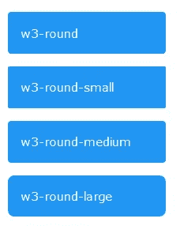

作者图片

## 纽扣

`w3-button`类可以很容易地与任何`w3-<color>`类配对来创建你自己想要的按钮。让我们来看看可用按钮类的一些变体:

*   `w3-button` —具有灰色悬停效果的矩形按钮。W3 中的默认颜色是浅灰色。CSS 版本 3。默认颜色继承自版本 4 中的父元素。
*   `w3-bar` —可用于将按钮组合在一起的水平条
    (非常适合水平导航菜单)
*   `w3-block` —可用于定义全角(100%)按钮的类
*   `w3-circle` —可用于定义一个圆形按钮

```
<button class="w3-button w3-green">w3-button</button>
<button class="w3-button w3-block w3-blue">w3-block</button>
<button class="w3-button w3-circle w3-red">+</button>
```

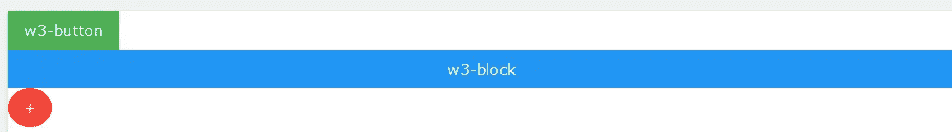

作者图片

## 酒吧

您可以使用`w3-bar`类为菜单选择创建自己的水平条。以下示例基于短宽度和垂直条的`w3-bar-block`:

```
<div class="w3-bar-block w3-black" style="width:120px">
  <div class="w3-bar-item w3-red">London</div>
  <div class="w3-bar-item w3-green ">Paris</div>
  <div class="w3-bar-item w3-blue">Tokyo</div>
</div>
```

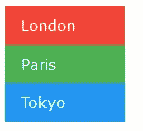

作者图片

## 桌子

W3。CSS 提供了一些不同的类来设计表格的样式。最简单的方法是依靠`w3-table-all`并对其进行相应的修改。

*   `w3-table`—HTML 表格的容器
*   `w3-striped` —条纹台`w3-border`—加边台
*   `w3-bordered` —带边框的线条
*   `w3-centered` —居中的表格内容
*   `w3-hoverable` —可悬浮的表格
*   `w3-table-all` —所有属性集

```
<table class="w3-table-all">
    <thead>
      <tr class="w3-red">
        <th>Article Name</th>
        <th>Author</th>
        <th>Fans</th>
      </tr>
    </thead>
    <tr>
      <td>Emoji Are the Future of Effective Web Design</td>
      <td>Ng Wai Foong</td>
      <td>11</td>
    </tr>
    <tr>
      <td>A Beginner’s Guide to Rasa NLU for Intent Classification</td>
      <td>Ng Wai Foong</td>
      <td>29</td>
    </tr>
</table>
```

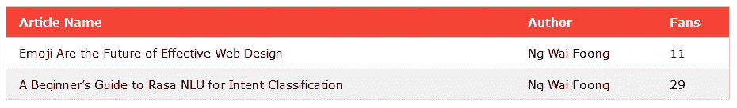

作者图片

## 目录

你只需要把`w3-ul`类放到`ul`标签中来设计你的列表。您可以添加`w3-border`或`w3-<color>`类来进一步改进列表的设计。

```
<ul class="w3-ul w3-border" style="width:300px">
    <li>1</li>
    <li>2</li>
    <li>3</li>
</ul>
```

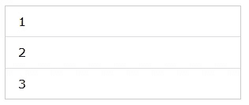

作者图片

## 图像

您可以使用`w3-image`类来创建一个响应图像，它会随着窗口的大小而缩小，但不会比原始图像大。还有其他有用的类可以改变图像并提供一些惊人的效果:

*   `w3-opacity` —向元素添加不透明度/透明度(不透明度:0.6)
*   `w3-grayscale` —为元素添加灰度效果(灰度:75%)
*   `w3-sepia` —为元素添加棕褐色效果(棕褐色:75%)

```
<p>Normal (100% opacity):</p>
  
  <p>w3-sepia:</p>
  
  <p>w3-opacity (60% opacity):</p>
  
  <p>w3-grayscale:</p>
  
```

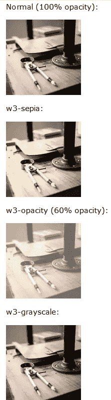

作者图片

## 投入

你可以用你的`w3-input`类轻松地设计一个文本输入。

默认情况下，它将只显示一条直线作为输入，但是您可以通过`w3-border`类给它添加一个边框。

```
<p><label class="w3-text-blue"><b>Without border</b></label>
<input class="w3-input" name="first" type="text"></p>
<p><label class="w3-text-blue"><b>With border</b></label>
<input class="w3-input w3-border" name="last" type="text"></p>
```

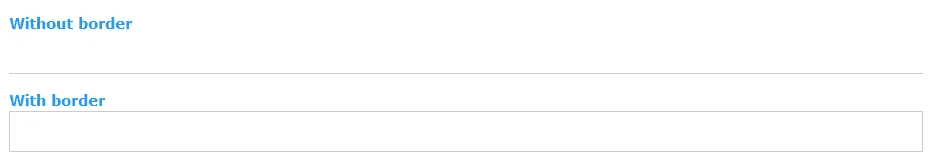

作者图片

## 检验盒

用`w3-check`类设计复选框非常简单。

```
<p><input class="w3-check" type="checkbox" checked="checked">
<label>Checked</label></p>
<p><input class="w3-check" type="checkbox">
<label>Unchecked</label></p>
<p><input class="w3-check" type="checkbox" disabled>
<label>Disabled</label></p>
```

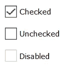

作者图片

## 收音机

同样，您可以为单选按钮使用一个`w3-radio`类。

```
<p><input class="w3-radio" type="radio" checked><label>Check</label></p>
<p><input class="w3-radio" type="radio">
<label>Unchecked</label></p>
<p><input class="w3-radio" type="radio" disabled><label>Disabled</label></p>
```

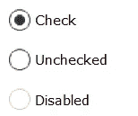

作者图片

## 挑选

使用`w3-select`来设置选择标签的样式。如果你想显示一个边框，记得添加`w3-border`。

```
<select class="w3-select w3-border" name="option">
    <option value="" disabled selected>Choose your option</option>
    <option value="1">Option 1</option>
    <option value="2">Option 2</option>
    <option value="3">Option 3</option>
</select>
```

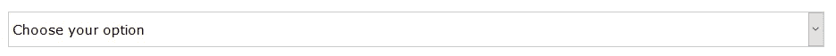

作者图片

# 结论

恭喜你读到了这篇文章的结尾。让我们回顾一下今天所学的内容。

首先，我们探索了几种安装和设置 W3.CSS 的方法。

然后，我们继续这个框架的基本用法。我们可以轻松地内联定义我们的类，所有的类都使用`w3-`前缀。我们可以很容易地使用基类来设计我们的元素。您还可以在每个类的顶部内联添加类，以创建您想要的样式。

W3。对于刚开始做 web 开发的人来说，CSS 绝对是一个很棒的框架。它省去了您在开始编码之前必须正确配置和设置的麻烦。

查看下面的[链接](https://www.w3schools.com/w3css/w3css_references.asp)，了解更多关于其他可用课程的信息。感谢阅读——我将在下一篇文章中写一些涉及 JavaScript 的高级课程。

# 参考

1.  [https://github.com/JaniRefsnes/w3css](https://github.com/JaniRefsnes/w3css)
2.  [https://www.w3schools.com/w3css/w3css_downloads.asp](https://www.w3schools.com/w3css/w3css_downloads.asp)
3.  [https://www.w3schools.com/w3css/w3css_intro.asp](https://www.w3schools.com/w3css/w3css_intro.asp)
4.  [https://www.w3schools.com/w3css/w3css_references.asp](https://www.w3schools.com/w3css/w3css_references.asp)