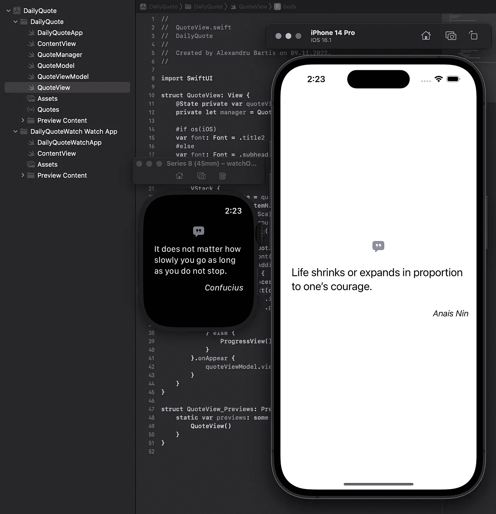
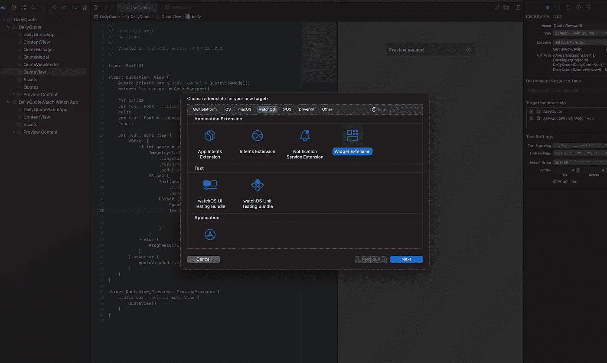
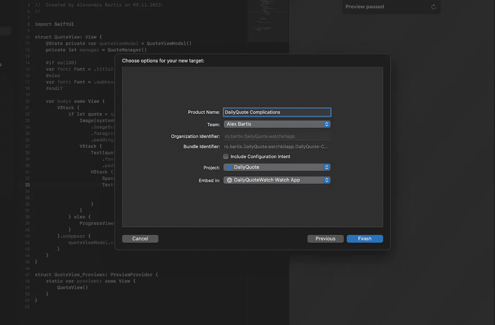
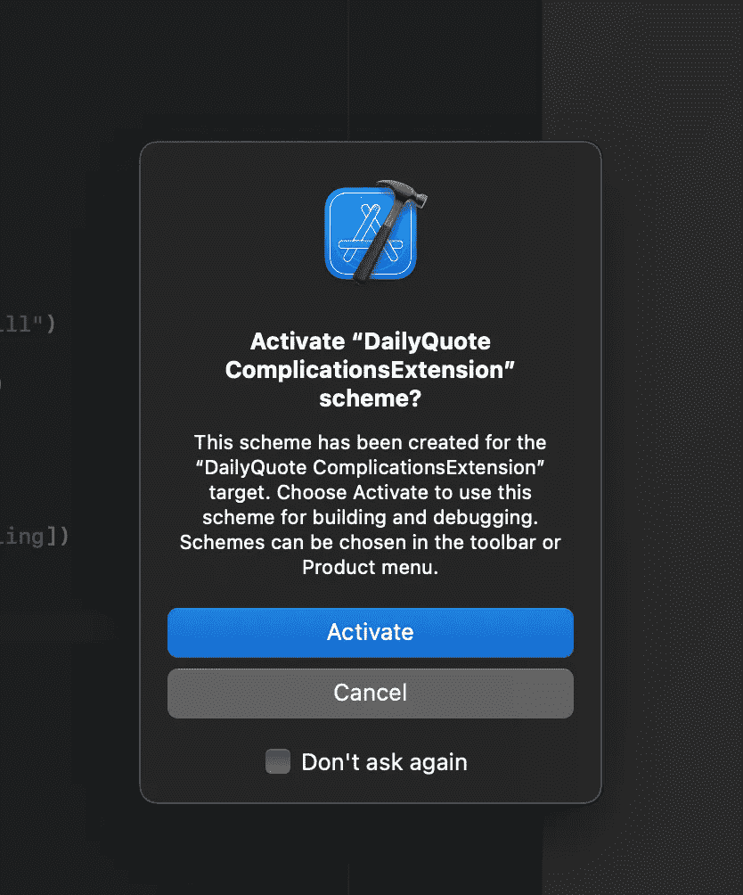
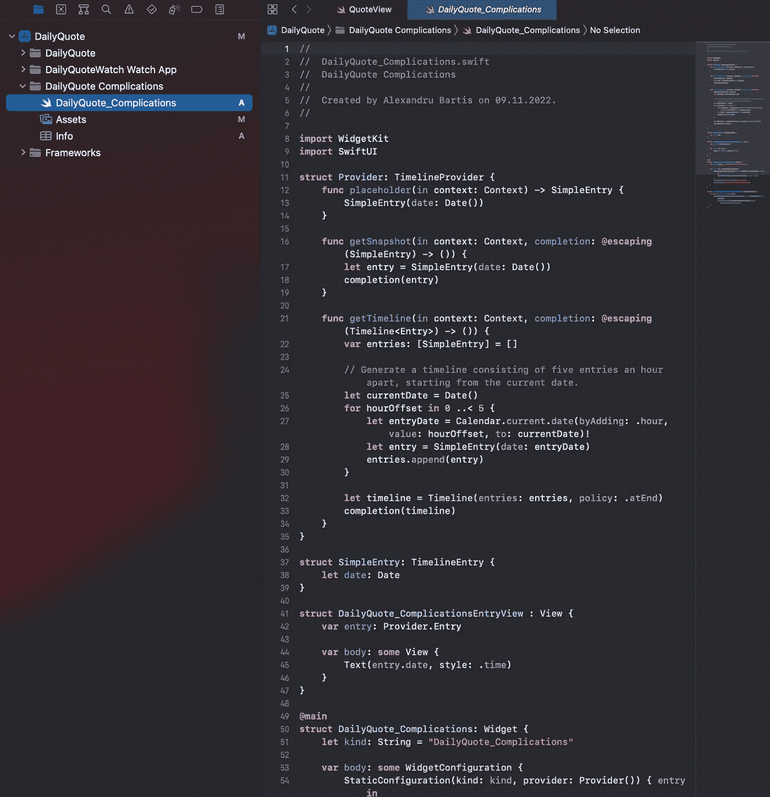
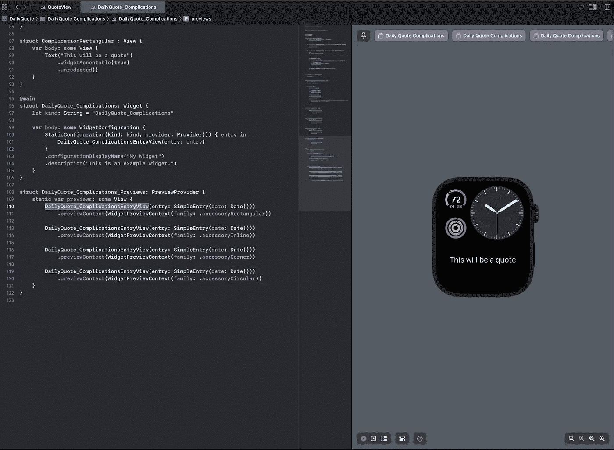
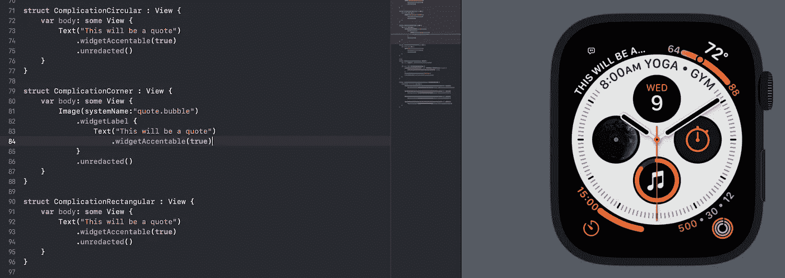
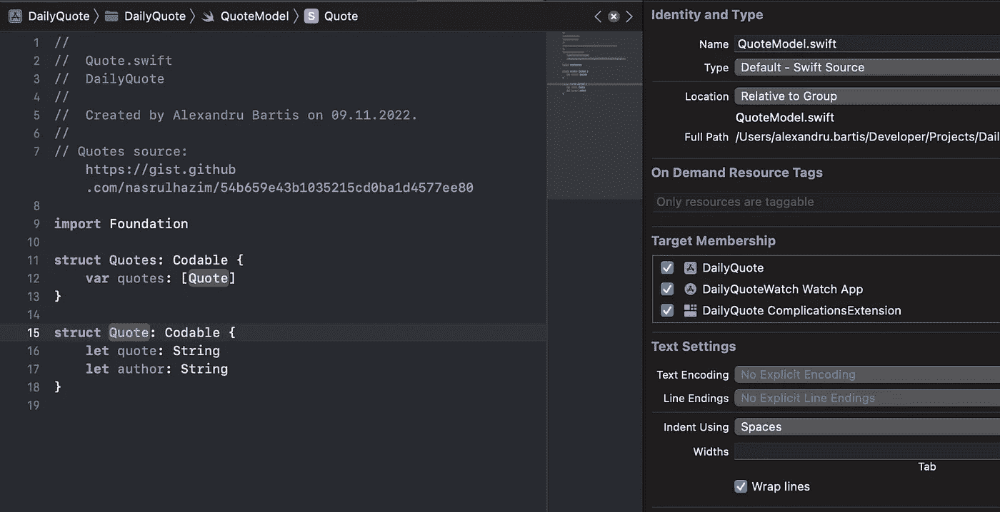

# WidgetKit 中的 watchOS 9 复杂功能入门

> 原文：<https://betterprogramming.pub/getting-started-with-watchos-9-complications-in-widgetkit-88dbf08fa1c1>

## 创建一个惊人的每日报价应用程序的深入指南


阿尔瓦罗·佩雷兹在 [Unsplash](https://unsplash.com?utm_source=medium&utm_medium=referral) 上的照片

最近，当我直接进入“新”WidgetKit 框架时，我在我的力量训练应用程序 [Strength++](https://apps.apple.com/us/app/strength/id1609468372) 中添加了一些复杂功能，这很有趣。它实际上并不是新的，但 wOS 9 中的新内容是，你可以使用 WidgetKit 而不是旧的 ClockKit 来为手表创建复杂功能。

我们别浪费时间了，开始工作吧。您将在这里找到代码，如果您想继续编码，可以在初始版本中找到，如果您想查看所有内容，可以在最终版本中找到。

我们正在使用我为此创建的 DailyQuote 应用程序，它在 iOS 和 watchOS 应用程序之间共享其大部分代码库。iOS app 针对的是 iOS 16，watchOS 当然有最低版本的 wOS 9。



在手表和 iPhone 模拟器上运行的应用程序

我们首先需要为复杂功能添加一个扩展，所以在 Xcode 中，进入文件->新建->目标，选择 watchOS 选项卡，然后选择小部件扩展。



Xcode 新目标 watchOS Widget 扩展

*   点击下一步。
*   插入产品名称。

我去了每日引用并发症。

*   取消选中包括配置意图，因为我们今天构建的这些复杂性是不可配置的
*   确保您的项目在下拉列表中被选中，并且嵌入到您的手表应用程序中。



配置目标

点击完成并激活以激活您的新目标。



激活新目标

您现在可以在 project navigator 中看到，以您之前提供的名称命名的新文件夹包含一个 swift 文件、一个 Assets 文件夹和一个`Info.plist`文件。继续打开新创建的 swift 文件，让我们开始设计我们的小部件。



在这一点上，我希望你打开来自苹果的[这个链接](https://developer.apple.com/documentation/widgetkit/converting-a-clockkit-app)，因为它是我们在这里所做的事情的官方文档，如果我没有给你足够的信息或者你有一些问题，你可能会找到答案。

# 设计用户界面

复杂 UI 的硬提升将由`EntryView`结构来完成，在我的例子中是`DailyQuote_ComplicationsEntryView`。

让我们首先添加一个属性来标识我们正在设计的小部件系列:

```
struct DailyQuote_ComplicationsEntryView : View {@Environment(\.widgetFamily) var widgetFamilyvar entry: Provider.Entry
    var body: some View {Text(entry.date, style: .time)}}
```

所以我添加了`widgetFamily`变量，它从`Environment`对象中提取`widgetFamily`的值。此时，您需要了解并发症是如何分组的。有四个小组正在研究 wOS 并发症:

*   `accessoryInline`
*   `accessoryCorner`
*   `accessoryRectangular`
*   `accessoryCircular`

你可以选择和支持任何你想要的，但今天我们要去为每一个人制造麻烦。因此，让我们创建四个 SwiftUI 视图:

在我应用的这一点上，每个复杂视图都有一个单独的`Text`:

*   `widgetAccentable`，将视图及其所有子视图添加到重音组。
*   `unredacted`，它告诉操作系统这个特定的视图在任何时候都不需要编辑(意味着模糊)

现在，让我们回到`EntryView`，将我们的视图链接到每个小部件系列:

现在，让我们为所有的复杂情况添加一些预览。

*   转到生成的 `_preview struct`
*   为每种并发症类型复制现有的`EntryView`四次

现在，您将在画布中看到四个预览。



开始有点像了，对吧？

现在，我不会深入介绍每种复杂功能的设计，因为最终，您可以选择自己想要的外观，但我会介绍我最喜欢的一种:`corner`。



对于这个特定的例子，我已经添加了一个来自 SF 符号的图像(注意，它显示得很小，所以在设计复杂功能时要考虑到这一点)并使用了`widgetLabel`函数。根据苹果公司的说法，该功能“创建了一个标签，用于显示附件系列小部件的主 SwiftUI 视图之外的附加内容。”这是简短的版本。

`Alt + Tap`在上面阅读完整的文档。

我们现在要为 UI 端做的最后一件事是更新`Widget`结构，以便更好地向系统和用户“描述”我们的小部件。因此，转到`struct DailyQuote_Complications: Widget`并更新它:

我们刚刚完成了以下工作:

*   硬编码一个`kind`,这是这个小部件的唯一标识符(如果您有更多的话)
*   更新了`configurationDisplayName`，这是我们的并发症在并发症选择器中显示的名称
*   当用户添加或编辑小部件时，为小部件显示的`description`

# 没有数据就没有 UI

你的复杂是由`TimelineEntry` …条目驱动的。这就是为什么 Xcode 生成了那个`SimpleEntry: TimelineEntry`，我们现在需要将其重命名为`QuoteEntry`。


并给它添加一个新属性，一个`Quote`。

```
struct QuoteEntry: TimelineEntry {let date: Datelet quote: Quote}
```

不要忘记将`Quote` 添加到 ComplicationExtension 的目标成员中。



现在您的整个文件是红色的，因为每个`QuoteEntry` 的实例化都缺少了`Quote`参数。让我们开始更新它们。

第一个是`func`占位符(在上下文中):> QuoteEntry。
这个方法返回一个硬编码的`QuoteEntry`用于特定的场景，其中操作系统在一个“敏感”的上下文中显示您的复杂情况(如果您需要了解更多这方面的内容，请查看文档)。

```
func placeholder(in context: Context) -> QuoteEntry {let quote = Quote(quote: "Roses are red", author: "Nobody knows")return QuoteEntry(date: Date(), quote: quote)
}
```

接下来是`func getSnapshot(in context: Context, completion: @escaping (QuoteEntry) -> ())`，根据苹果公司的说法，这是一个时间轴条目，表示小部件的当前时间和状态。在这种情况下，我们需要根据上下文处理两种情况，因为上下文可能是复杂功能的预览，也可能是腕表上运行的实际复杂功能。

为此，我们需要引入`QuoteManager`，以便在我们的结构中声明它(同样，不要忘记设置它的目标成员)。如果我们不是在看预览，我们希望从我们的数据层中实际带出一个真实的引用。

我们需要做的最后一件事是为我们的小部件创建一个时间线，所以让我们修改`*getTimeline()*` *:*

为了避免不言自明，我们创建了一个包含五个条目的时间线，每个条目间隔一分钟，每个条目从我们的存储中提取不同的报价。

# 现在，让我们把一切联系起来

我们有了数据和 UI，所以让我们用一个从`EntryView`传递来的`QuoteEntry`属性来修改我们所有的`Complication`视图。我们还将把条目中的`.quote`属性设置为 UI 上的`Text` 的参数。

提示:此时，您需要为 ComplicationsExtension 目标的`Quotes.json`文件再次设置目标成员。

这就是了！在手表模拟器上运行复杂功能目标(当然，使用复杂功能)，现在显示我们性感的新复杂功能，包含一个花哨的每日报价。


感谢阅读。