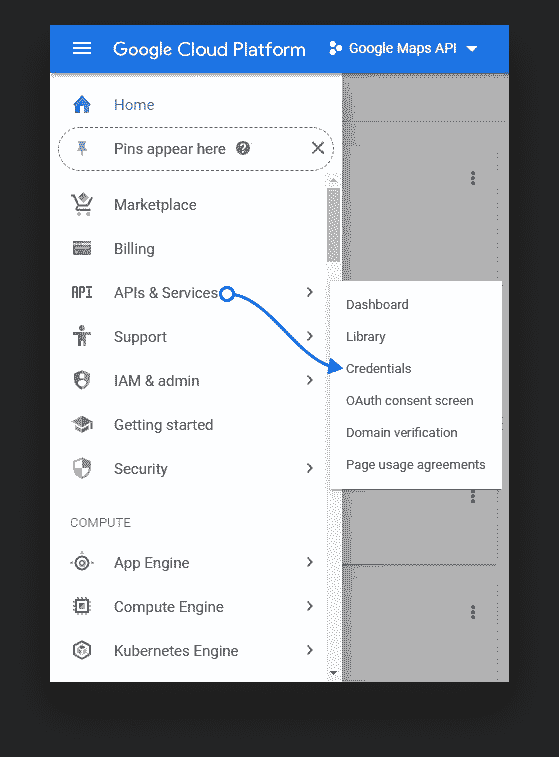
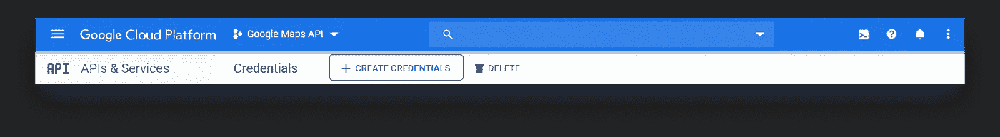
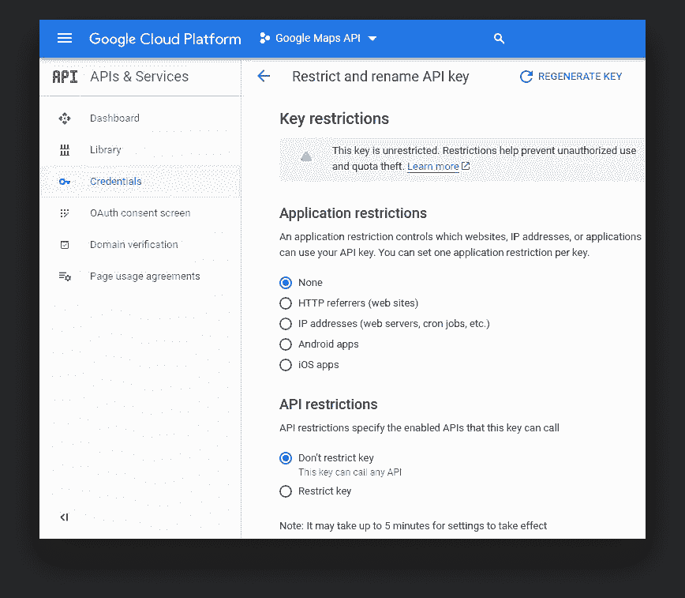
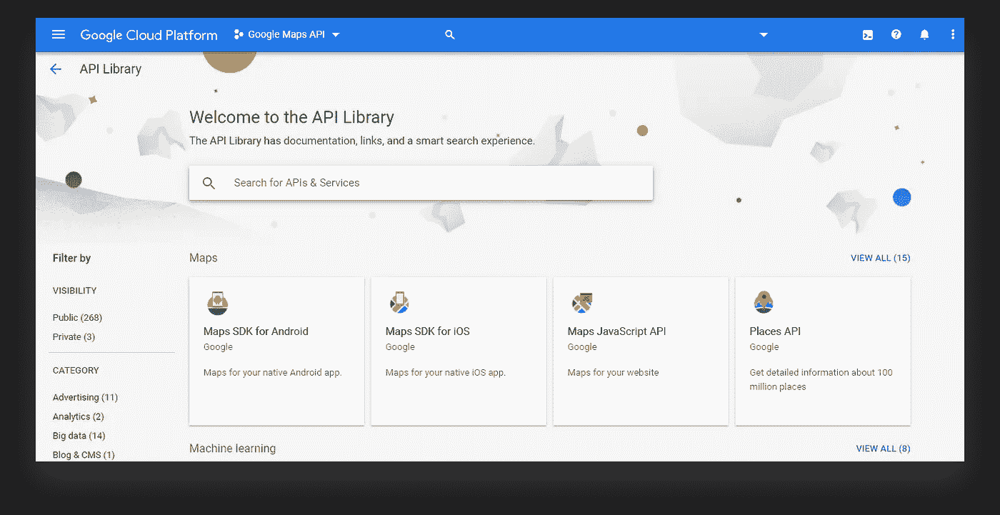
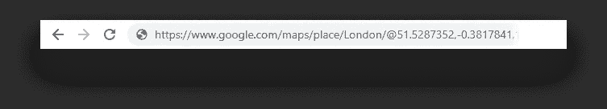
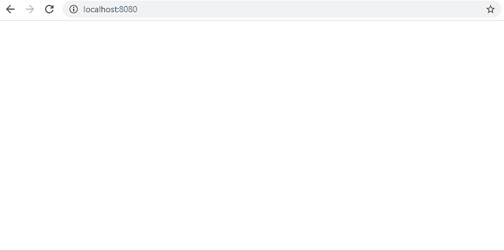

# 使用谷歌地图 API 获取城市中的最佳位置

> 原文：<https://betterprogramming.pub/getting-the-best-places-in-town-with-the-google-maps-api-b23e2ab12510>

## 搜索谷歌地图并按评分排序


照片由[亨利·佩克斯](https://unsplash.com/@hjkp?utm_source=medium&utm_medium=referral)在 [Unsplash](https://unsplash.com?utm_source=medium&utm_medium=referral) 上拍摄

[](https://www.webtips.dev/getting-the-best-places-in-town-with-the-google-maps-api)

如果你和我一样，你可能在生活中的某个时候问过自己这个问题，一个没有人知道答案的问题:我们应该在哪里/吃什么？因为我是一名开发人员，我觉得我已经受够了，让计算机给我一些建议。这时候，我们有了一个想法，让谷歌地图列出附近最好的餐馆/酒吧/任何其他东西，这样我们就可以更容易地选择。

幸运的是，Google Maps API 有能力通过其 Places API 的组合来做到这一点。所以今天，我想向你展示你如何做同样的事情。

这一努力的第一步是接收一个 API 密钥。

# 正在检索 API 密钥

API 键将用于调用不同的 API。要获得 API 密钥，请前往您的[谷歌云平台](https://cloud.google.com/console/google/maps-apis/overview)仪表盘。选择一个项目或创建一个新项目(如果您还没有开始一个项目)。


我这里叫做“谷歌地图应用编程接口”

转到菜单按钮，选择 API & Services 下的 Credentials 选项卡。



单击 Create Credentials 按钮，您新创建的 API 密匙将会弹出。



在生产环境中使用 API 密钥之前对其进行限制是一个好主意，这样可以避免意外开支并防止配额被盗用。您可以在凭证选项卡下的 APIs & Services 菜单中设置限制。



请注意，为了使用谷歌云服务，您可能需要将您的项目链接到一个计费帐户。对我们来说幸运的是，谷歌地图 API 仍然是免费的，每月最高 200 美元。这相当于每月约 28，000 个电话。要了解更多关于定价的信息，请访问 Google Cloud 上的[定价&计划](https://cloud.google.com/maps-platform/pricing/)或[定价表](https://cloud.google.com/maps-platform/pricing/sheet/)部分。

如果你更喜欢阅读 Google 关于如何获得 API 密匙的逐步指南，你可以参考他们自己的文档。

# 设置地点 API

为了获得地图上的地点信息，我们将使用 Places API。为了能够使用它，您需要在您的云平台控制台中启用它。

转到您刚刚创建的项目，单击导航菜单，并选择 API & Services 下的库选项。您将看到以下页面:



搜索“位置 API”并选择启用。就像谷歌地图 API 一样，Places API 的附近搜索功能——我们将使用的*——每月最多可免费调用 5000 次。*

既然您已经做好了管理方面的准备，我们可以开始编码了。

# 设置项目

创建一个新文件夹，并添加以下`index.html`文件:

我们不会有一个实际的谷歌地图，因为我们将在一个有序的列表中显示结果。您还想包含 API 库，并且不要忘记用您实际的 API 键替换`YOUR_API_KEY`。我们还将利用 Places API —您需要将其指定为查询字符串。这是`&libraries=places`应该做的。

我还创建了一个`places.js`，我们自己的实现将放在那里。您也可以将其添加到项目文件夹中。这就是我们所需要的。其他的都将放入`places.js`文件中。

# 得到一些结果

在开始获取结果之前，我们需要创建一些变量:

我们将把所有内容存储在一个`results`数组中，并且我们还获得了一个对`places`元素的引用。但是这里有趣的部分是我们创造的`request`和`service`。该服务将负责请求位置。可以将任何 DOM 元素传入`PlacesService`；它不一定是谷歌地图对象。如果您仍想在地图上显示结果，您需要将`places`变量更改为以下内容:

一旦我们有了`service`，我们就可以用一个`request`对象和一个`callback`函数来调用`nearbySearch`方法。我们需要在请求中指定的三个主要内容是:

*   位置:坐标是根据纬度和经度值创建的。它接受一个`google.maps.LatLng`对象。
*   半径:以米为单位表示圆的半径，圆的中间是水平位置。这里的最大值可以是 50，000。
*   类型数组:我们要寻找的位置的类型。因为我们饿了，我们希望餐馆被退回。关于支持类型的完整列表，可以参考谷歌地图平台上的[文档](https://developers.google.com/places/web-service/supported_types)。

坐标指向伦敦。要获得一个城市的坐标，只需前往[maps.google.com](http://maps.google.com/)并搜索该城市。纬度坐标将出现在地址栏中:



我们还有一个尚未定义的回调函数，所以我们现在就开始吧！

回调期望的三样东西是一个存储服务返回的所有内容的`response`对象，一个表示调用成功或失败的`status`，以及一个可选的分页对象。

默认情况下，对服务的每个查询返回 20 个结果。然而，它可以扩展到 60 分跨三页。这就是为什么我们必须使用分页。`pagination.nextPage`函数将再次调用这个`callback`函数。

您可能还注意到对分页函数的调用被包装在一个`setTimeout`中。这是因为在下一页结果出现之前，您必须等待至少两秒钟。这也意味着，由于获取所有结果需要时间，理想情况下，您应该显示某种加载指示器，以向用户显示后台正在进行的操作。

现在，如果服务返回所有内容，`pagination.hasNextPage`将不再存在，让我们跳转到 else 块，在那里我们最终显示结果。我将这里的代码外包给了不同的功能，这样我们就有了某种分离。

# 显示所有内容

`displayResults`功能将非常简单。让我们看看我们有什么:

首先，我们需要过滤结果列表。可能会有评级缺失的情况。那样的话，我们就不知道这个地方是否值得信任。简单地说…

```
result => result.rating
```

…我们告诉 JavaScript 只包含含有评级的结果。如果`result.rating`未定义，它将从结果集中省略。

接下来，我们需要根据评级对其进行排序，这样我们就可以从最顶端选择最佳选项。最后，我们可以在一个`forEach`循环中显示他们的名字和评级。

值得一提的是，从性能角度来看，这并不是在`forEach`的每个循环中操作 DOM 的最佳方式。一种替代方法是在循环中创建字符串，并在循环结束后才将其添加到 DOM 中。

现在，如果您返回浏览器并刷新页面，您应该会看到 60 个结果*(如果每个结果都有评级)*按评级排序，最高评级在最上面。



看来是红玫瑰了

# 摘要

口袋里有了这个工具，你就再也不用挨饿了。剩下要做的就是创建一个漂亮的用户界面，这样您就可以根据选择的半径和选择的地点类型动态地选择城市。

和往常一样，你可以在我的 GitHub 上的 [places repo](https://github.com/flowforfrank/places) 找到整个项目。随时调整它，让我知道你在 comments️.的建议现在该去吃点东西了。

[](https://medium.com/@ferencalmasi/membership)[](https://www.webtips.dev/)