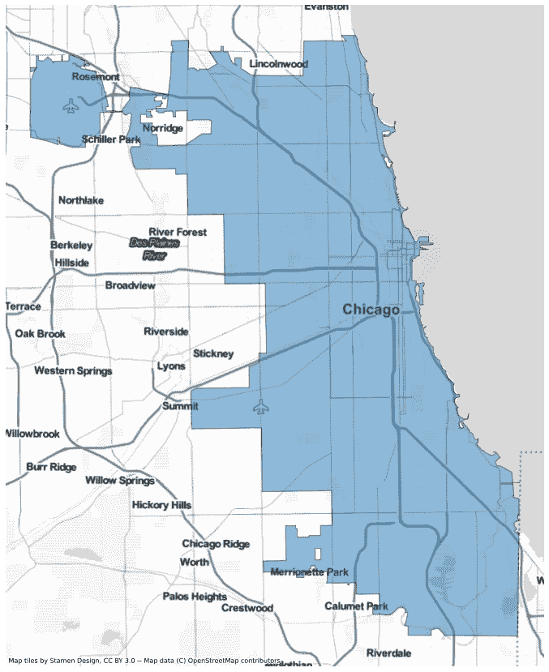
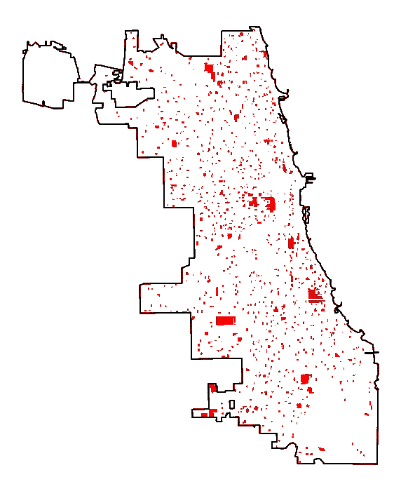
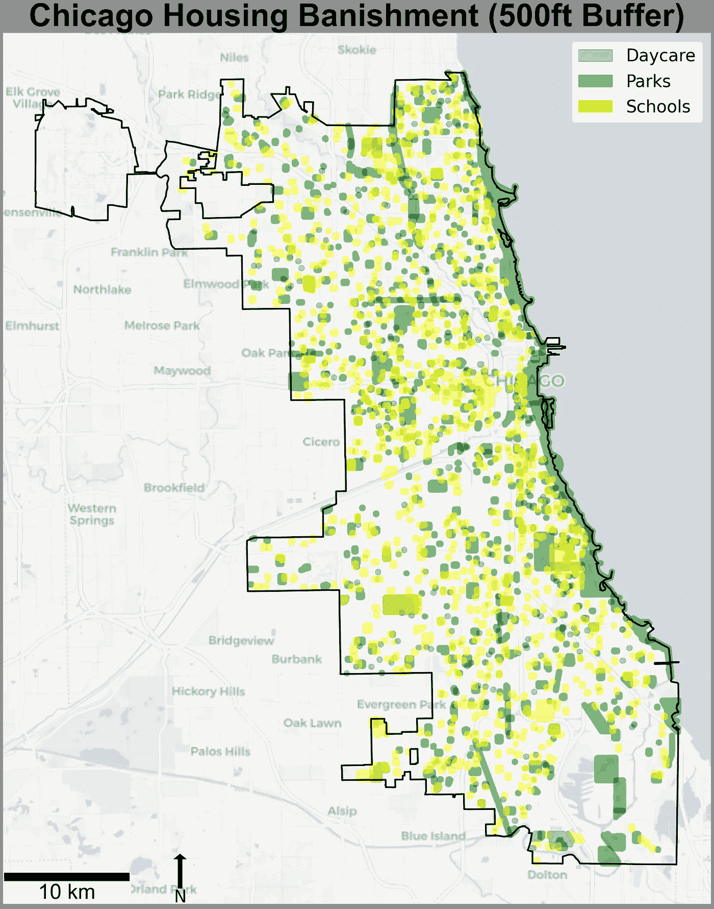
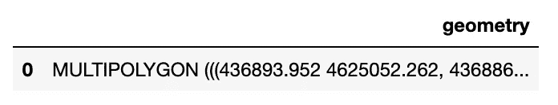
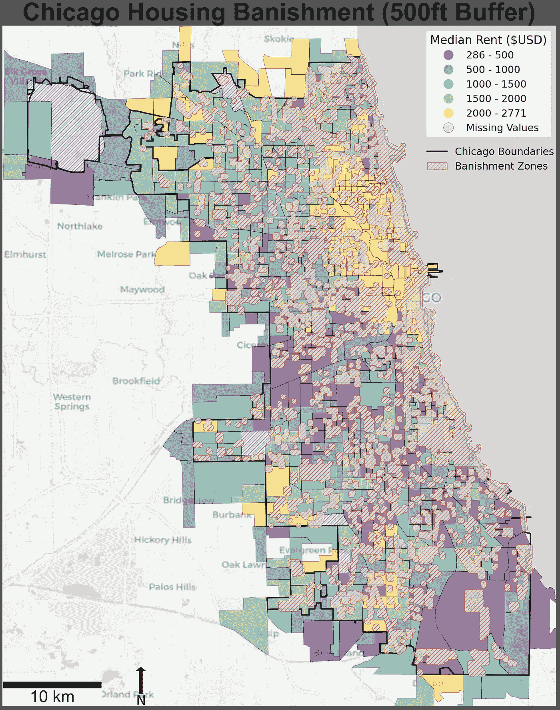

# 使用 Python 和 GeoPandas 的 GIS 项目

> 原文：<https://betterprogramming.pub/gis-project-with-geopandas-56a83aa89dbc>

## 一个完全用 Python 实现的 GIS 项目

照片由 [GeoJango 地图](https://unsplash.com/@geojango_maps) s 在 [Unsplash](https://unsplash.com/) 上拍摄

# 序文

一些背景信息……我最近注册了[无国界统计组织](https://www.statisticswithoutborders.org/)的志愿者，该组织提供统计和数据科学方面的公益服务。

作为一名热衷于环境责任、社会公平和可持续发展的数据分析师/科学家，我觉得将我的技能用于社会公益是有意义的。这个项目是为芝加哥 400 人服务的，他们代表有前科的芝加哥人进行竞选活动。目标是创建静态和 web 地图，为有前科的芝加哥人勾勒出流放区。我决定挑战自己，在这个项目中完全使用 Python，这样它可以部署在 Github 上，并与其他想做同样事情的人共享代码。

此外，我很难找到任何能够涵盖完整 GIS 地图所需所有方面的 Python GIS 教程。我想为那些希望摆脱桌面 GIS 系统束缚的人们提供这一点。

现在手续都办完了…让我们来点代码吧！

## 获取数据

我需要做的第一件事是获取数据。芝加哥有一个[开放数据门户](https://data.cityofchicago.org/) (ODP)，里面有大量免费提供的信息。放逐区分为两个不同的类别:一个是住房放逐(人们不能居住)，另一个是公共放逐(人们不能在场)。

我将在这里坚持住房驱逐代码，项目代码的全部可以在我的 GitHub [repo](https://github.com/justinm0rgan/chicago400) 中查看。住房驱逐地理需要，包括学校，公园和日托中心。

从 ODP 中获得数据后，就可以使用 GeoPandas 作为地理数据框架(GDF)将数据导入 Python，并在同一个坐标参考系统(CRS)中获取所有数据。

对于这个项目，我选择将它们全部投射在 EPSG:WGS 84 区 32616 号 zone 16N 区。有关基本的导入和 CRS 转换，请参见下面的代码:

将 ShapeFile 作为地理数据框架导入并设置 CRS

## 探索性数据分析

一旦数据作为 GDF 和 CRS 集导入到 Python 环境中，我就需要执行某种探索性数据分析(EDA)来获得可视化效果。

首先，我想根据底图预览芝加哥的边界。为此，我们可以结合使用[包和 GeoPandas `.plot()`方法。上下文为底图切片提供了许多选项，但我觉得`Stamen.TonerLite`最适合这张地图。](https://contextily.readthedocs.io/en/latest/index.html)

可自定义上下文底图

芝加哥边界 w/ StamenToner Lite 底图

在确认这一工作并找到一个好的图块底图后，我开始预览其他各种 GDF(为了简洁起见，这里没有画出来)。

其中包括:

*   *租金中位数*
*   *学校*
*   *日托*
*   *自行车路线*
*   *林业*
*   *公园*
*   *空地(林荫大道)*

# GIS 操作

## 剪辑到芝加哥

一些 GDF 是针对伊利诺伊州内的更大区域的，因此它们需要被剪切到芝加哥。下面您可以看到使用 GeoPandas 将一个几何图形裁剪到另一个几何图形的代码。

将学校剪贴到芝加哥边界

## 缓冲几何图形

住房驱逐法规定，被判有罪的人不能住在学校、公园或日托设施 500 英尺以内。因此，下一步是缓冲各自的形状文件。Chicago400 需要一个视觉效果来探索将 500 英尺的缓冲区减少到 250 英尺的差异，因此也完成了这项工作。由于 CRS 设置为米，我必须将英尺转换为米，也就是 1 英尺等于 0.3048 米

要预览缓冲的几何图形，我们可以使用 GeoPandas 绘制它。图例必须用`[mpatches](https://matplotlib.org/stable/api/_as_gen/matplotlib.patches.Patch.html)`构造，因为简单地利用`.plot()`方法的内置图例参数不会产生包含多个图层的图例。

此外，您可以看到专用于指北针和比例尺的代码部分。这些方面需要特意添加自己的代码部分，但对于构建专业外观的地图来说是必不可少的。

## 解散(一元联盟)和联盟 GDF 的

下一步是将每个 GDF 融合到其一个几何图形中，并将其合并，使我们能够在美国社区调查(ACS)2012-16 年租金中位数数据上进行分层。

要在 GeoPandas 中实现这一点，可以执行以下命令:

结果是一个 GDF 包含所有 GDF 的一个多重多边形集合。

单一多面 GDF

# 等值区域图

现在，我们已经解散并执行了公园、学校和日托中心的联合，我们可以将它们绘制为一个几何图形，并引入 ACS 中值租金数据。

这将让我们了解有前科的人可以住在哪里，以及特定人口普查区域的可负担性。

## 传说

在上面地图的代码中，我必须结合两种不同类型的图例。

1.  使用来自`.plot()`方法的默认`legend = True`参数
2.  使用`maptches.Patch()`方法并用`add_artist()`将其添加到底图中。

`legend = true`方法允许我们从`mapclassify`开始用`UserDefined()`休息。但是，如果我们愿意，我们可以使用其他类型的分段，即自然分段或 Jenks，但我希望指定分段的值，为最终用户提供一种快速简单的方法来分析中值租金数据。

要设置用户定义的断点，可以简单地将其添加到`bins`参数中，然而，要获取和格式化所有边界，需要添加更多的 Python 代码。你可以在下面的代码中的`# format legend numbers`注释下看到前面提到的。

# 结论

该项目的目的是仅使用 Python 而不是桌面系统来实现一个标准的 GIS 项目。我对结果非常满意。你可以在我的 GitHub repo [这里](https://github.com/justinm0rgan/chicago400)查看所有代码的笔记本和关于项目范围的更多细节。