# 这里有一个 Git 分支策略，用于更好的团队协作

> 原文：<https://betterprogramming.pub/git-branching-strategy-for-better-team-collaboration-aacb5f235d05>

## 通过避免团队中不必要的合并冲突，快速发布特性

照片由[布鲁克·卡吉尔](https://unsplash.com/@brookecagle?utm_source=medium&utm_medium=referral)在 [Unsplash](https://unsplash.com?utm_source=medium&utm_medium=referral) 上拍摄

Git 是一个分布式、开源的版本控制系统(DVCS ),它使您能够存储代码、跟踪修订历史、合并代码更改，并在需要时恢复到早期的代码版本。

它是一个成熟的、积极维护的开源项目，最初由 Linux 操作系统内核的著名创建者 Linus Torvalds 于 2005 年开发。数量惊人的软件项目依赖 Git 进行版本控制，包括商业项目和开源项目。

在这篇博客中，我将展示一个有效的 Git 分支策略，以便在大型团队中更好地协作，从而确保高效的持续交付。

# 先决条件

按照本博客中提供的步骤和概念，需要对 Git 是什么以及它是如何工作的有一个基本的理解。

让我们开始吧。

# 什么是分支策略，为什么它很重要？

Git 分支只是源代码的简单版本。它有助于将当前正在开发的代码与生产环境中实际工作的稳定代码分开。

在开始使用 Git 进行版本控制之前，您应该能够回答以下问题。

*   应该从哪个分支剪切特征分支？
*   代码完成后，您应该在哪个分支中为代码审查和测试提出 MR(合并请求)/PR(拉请求)？
*   在完成测试和评审之后，这个特性分支应该合并到哪个分支中？

分支策略的目的是提高代码稳定性、开发人员的生产率，并避免不必要的合并冲突。

# **用例**

为了更好地展示 Git 中的分支策略，我将使用一个非常简单的案例研究。

假设您的任务是创建一个应用程序，它将根据用户的年龄打印用户是否有资格投票。您有 3 名开发人员(Eric、Adam 和 Lucy)负责以下功能:

*   向用户显示问候信息并询问他/她的名字。
*   `Feature-B`:询问用户年龄。只有年龄大于或等于 18 岁的用户才有资格投票。
*   `Feature-C`:最后，请用户参与一个简单的调查，以确定他们的体验(从 1 到 5)。

# 分支策略

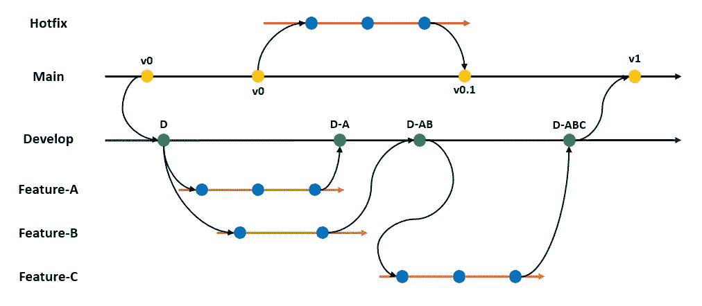

## Eric 正在开发特性 A

Eric 首先创建一个 git 分支(`feature-a`)，并在`feature-a`分支中提交下面的 python 代码库。

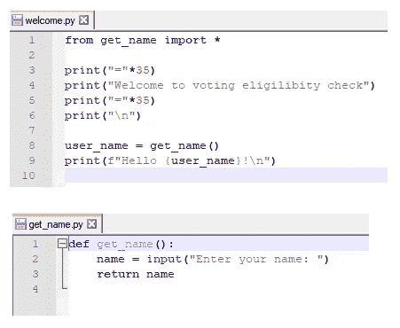

以下是他执行的 git 命令:

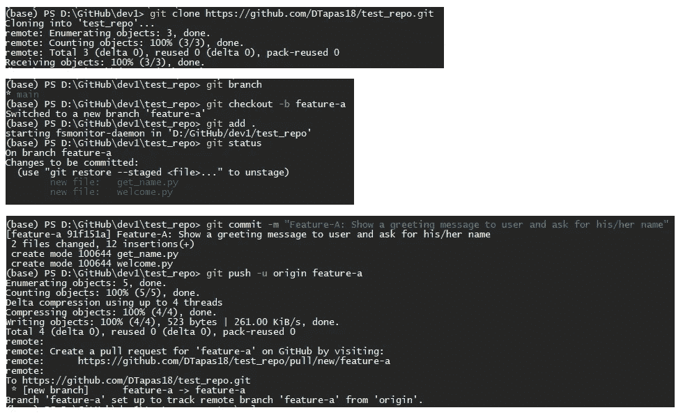

作者图片

既然 feature-a 分支被推送到 GitHub repo，Eric 通过提出一个 pull 请求将其与`Develop`分支合并。

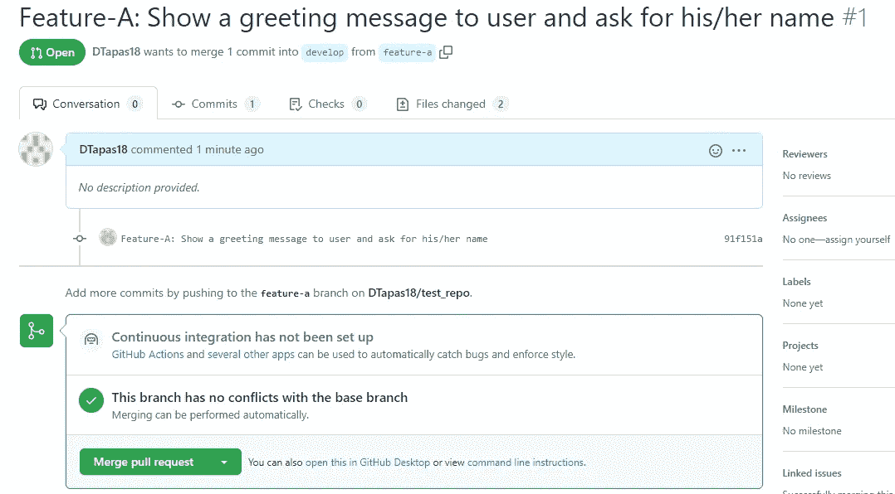

以下是“开发”分支在“拉”请求获得批准后的当前状态:

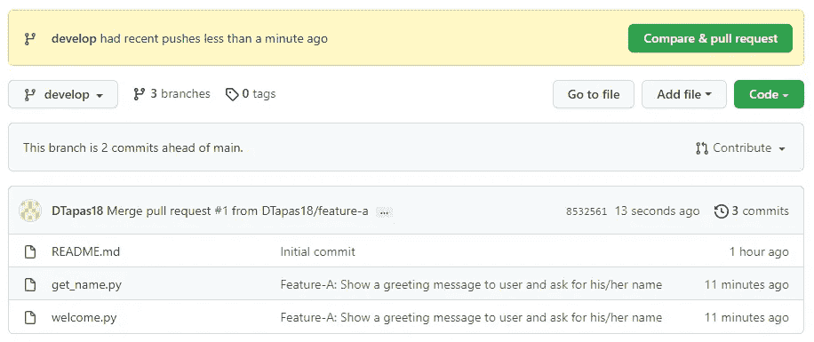

## Lucy 正在开发功能 B

Lucy 以与 Eric 相同的方式开始，首先创建一个`feature-b`分支，然后将下面的 Python 代码库提交到同一个分支中。

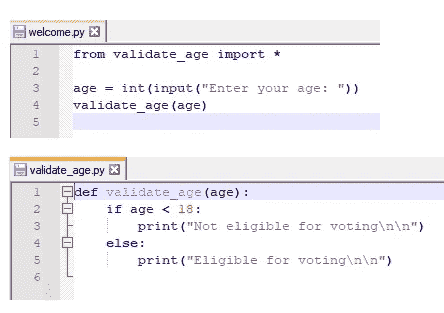

一旦`feature-b`分支被推送到 GitHub repo，Lucy 通过提出一个拉请求，试图将其与`Develop` 分支合并。然而，她在试图与`Develop`分支合并变更时，得到了下面的合并冲突。

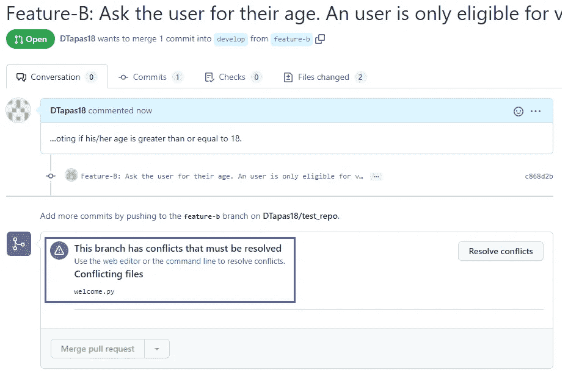

Git 在`welcome.py`代码库中检测到冲突，并停止了合并请求。让我们更深入地了解是什么导致了冲突。

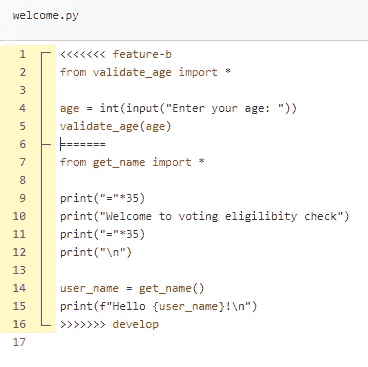

如上图所示，第 1–5 行由 Lucy 提交，第 7–15 行由 Eric 提交。Git 无法决定与`Develop`分支合并时应该保留哪些行。因此出现了合并冲突。

Lucy 通过在`welcome.py`文件中手动合并她和 Eric 的更改来手动解决这个问题。

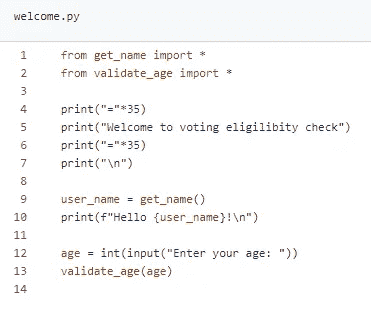

现在 Git 没有显示任何冲突，并允许合并请求通过。

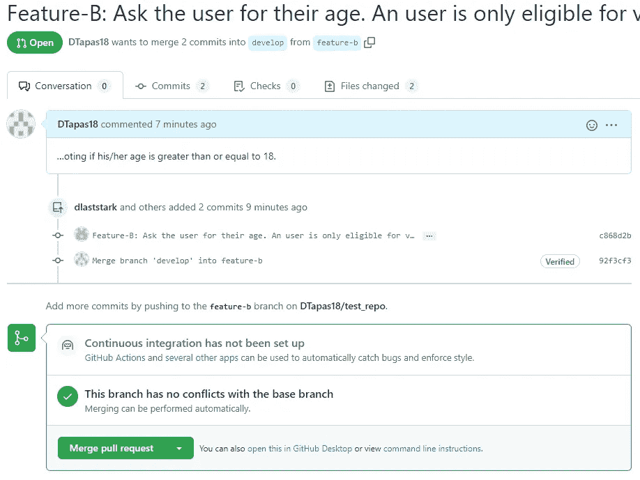

下面是`Develop`分支在拉取请求被批准后的当前状态。

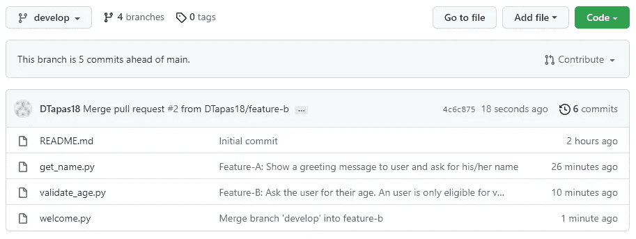

## Adam 正在开发特性 C

亚当开始做`feature-C`有点晚了。所以他决定不从`Main` 分支克隆代码库，而是从 Eric 和 Lucy 提交到 Develop 分支的最新变更中剪切他的特性分支(`feature-c`)。

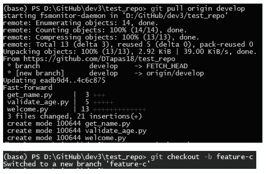

接下来，他将下面针对`feature-C`的 Python 代码库提交到 Git 分支中:

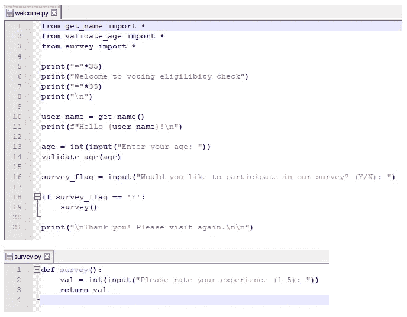

合并 Adam 的更改后，下面是`Develop`分支的当前状态。

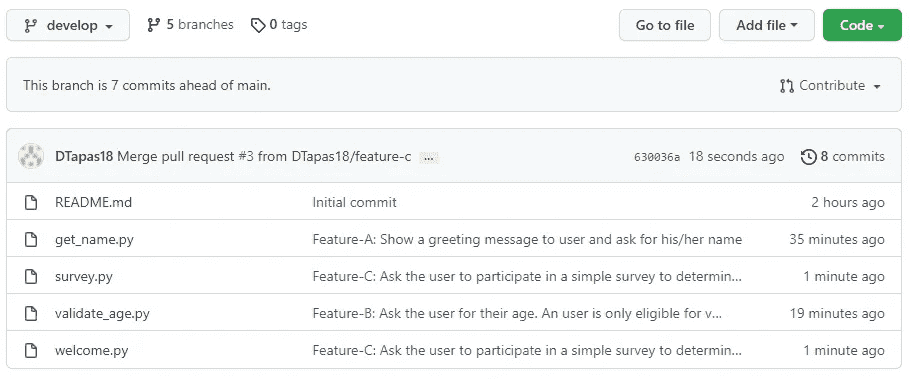

现在我们已经将所有需要的特性集成到了`Develop`分支中。让我们看看最终的应用程序会是什么样子(为了集成测试的缘故，用*)。*

*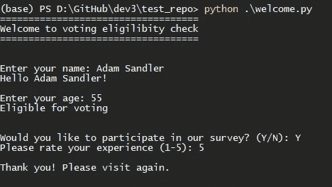*

*看起来很整洁！*

## *与主枝融合发展*

*既然集成测试成功了，我们可以继续合并`Develop`分支和`Main`分支(稳定的产品代码库)。*

*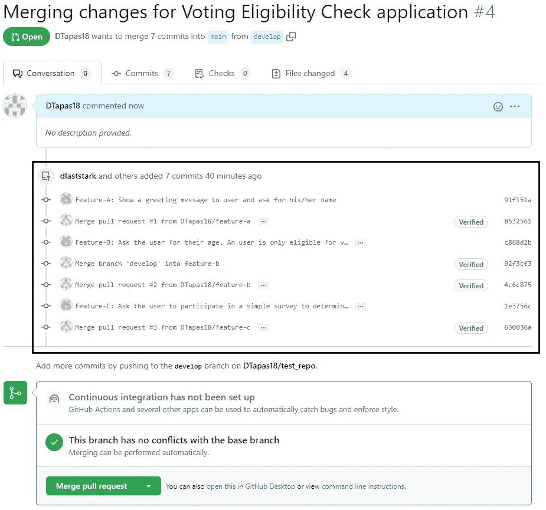*

*如上图所示，Git 将在合并请求期间显示整个提交/合并历史。这有助于跟踪开发生命周期中发生的所有变更。*

*下面是合并请求被批准后`Main`分支的当前状态。*

*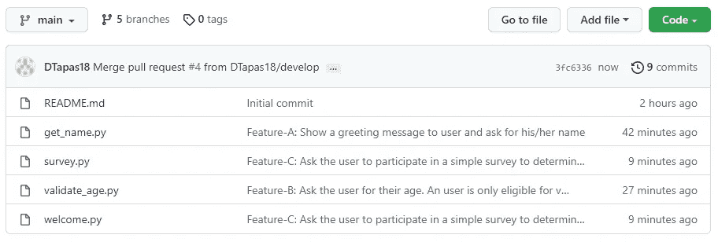*

# *定义 Git 分支*

*我已经在前一部分展示了下图。让我们回顾一下每个分支类型的含义及其重要性。*

*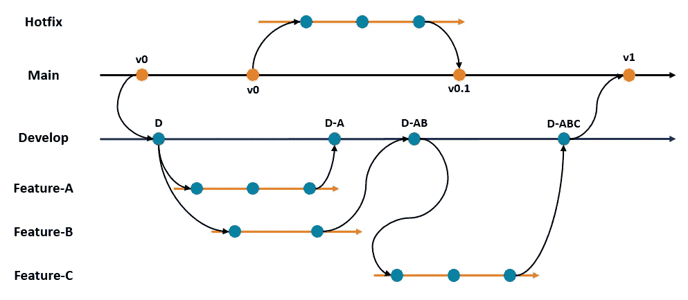*

## *枝*

*   *我们可以称之为生产部门。经过充分测试的稳定代码就在这里。*
*   *这是上一个版本应该离开的分支，下一个版本也应该离开。*
*   *它应该只接受来自`Develop`分支的合并。*
*   *使`Main`分支受到保护，这样任何人都不能对这个分支进行直接提交。仅允许合并请求或拉请求。*

## *开发分支*

*   *该分支比主分支低一级。*
*   *开始开发一个特性的开发人员从这个树枝上剪下一个新的树枝。*
*   *一旦开发人员对他们的测试感到满意，他们就可以将他们的特性分支合并到开发分支中，实质上是将他们的变更推进到开发环境中。*
*   *在发布的时候，一个合并从这个分支到主分支。主分支是被释放的。*

## *特征分支*

*   *从`Develop`分出的一个分支，致力于下一个版本中计划的特性。*
*   *一般来说，一个开发人员处理一个特性分支。*
*   *功能分支刚刚进行了生产+此功能相关的提交。*
*   *如果在这个特性还在开发中的时候发布了其他的特性，开发人员需要用`Main`重新设定基础。否则他们无法将它合并到主分支。*

*下面是一篇便于理解 Git Rebase 及其工作原理的博客文章:*

* [## 不要为 Git Rebase 烦恼

### 无论你的队友会告诉你什么，重新构建 Git 分支都是一件轻而易举的事情

better 编程. pub](/dont-fret-with-git-rebase-75fe3ed5ca8f) 

## 修补程序分支

*   如果在`Production`环境中的任何一点有 bug，开发者将需要应用补丁。
*   这些是通过从`Main`分支创建一个热修复分支，应用修改，并将热修复分支合并回它的主分支来完成的。
*   修补程序可以绕过必须通过`DEV`的过程。必要时可以直接合并到`MAIN`中。
*   合并后，分支也相应地被标记。该分支还必须同步到相关分支中。例如，一个热修复程序被合并到主。然后开发人员必须将`Main`同步到`Develop`和`Feature`分支中，以便这些分支也包含修复。* 

# *结论*

*如果你读到这里，你一定对无聊的东西情有独钟。当我告诉我的大多数朋友 Git 树枝的时候，他们都睡着了，他们不知道我热爱自然。Lol！*

*最初，我们采用这种方法会有心理障碍。特别是如果我们是从被提升到不同环境并最终进入生产的特性中来的。但是一旦我们尝试了几次，就很难再回到以前的方式了。*

> *就像很难从 SVN 迁移到 GIT，一旦我们迁移，现在回到 SVN 的版本控制是非常困难的。*

*在解决合并冲突和保持特性分支与生产同步方面，开发人员需要付出更多的努力和纪律。但是这些带来了快速发布特性和停止延迟发布的良好实践。经过一段时间，每周发布多个版本成为一种常态。*