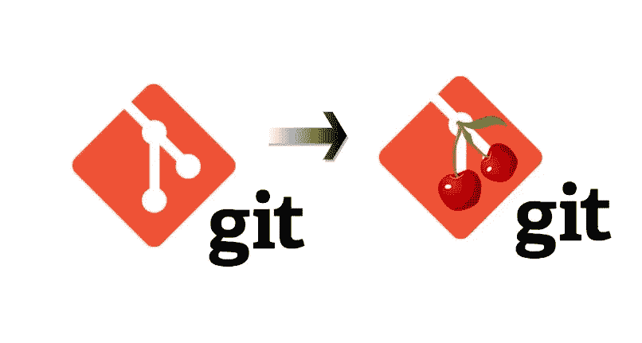
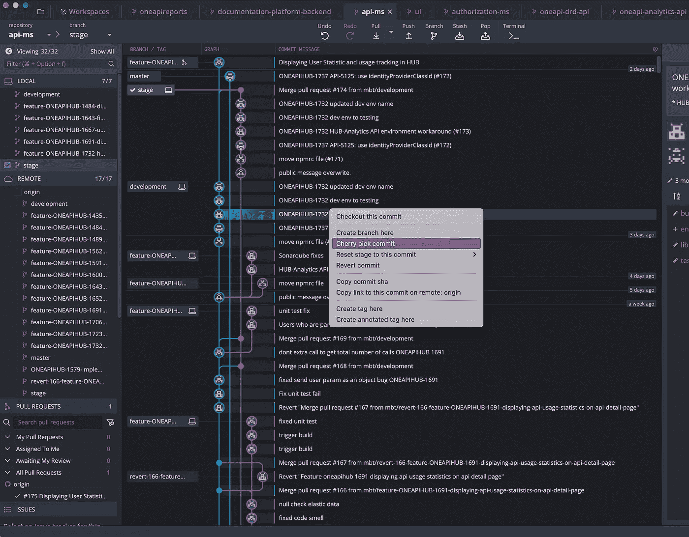
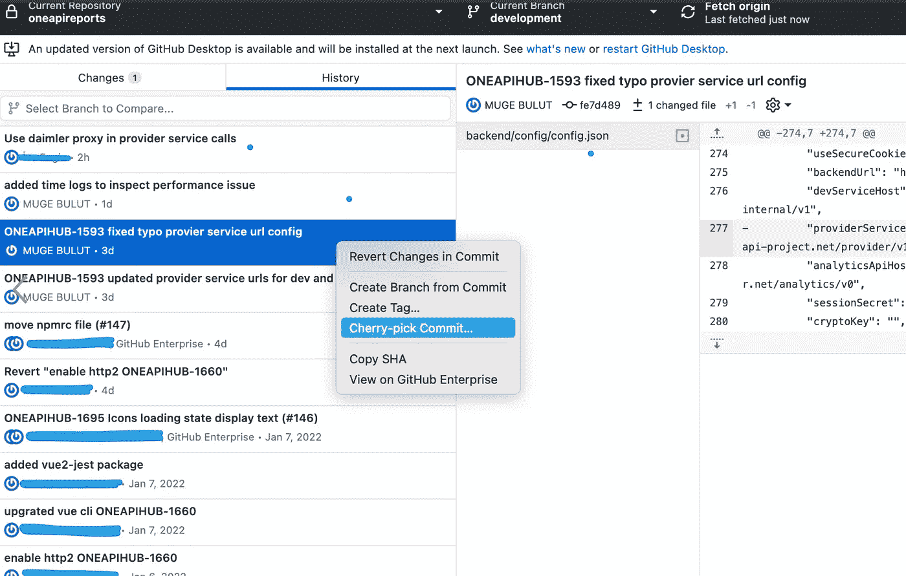
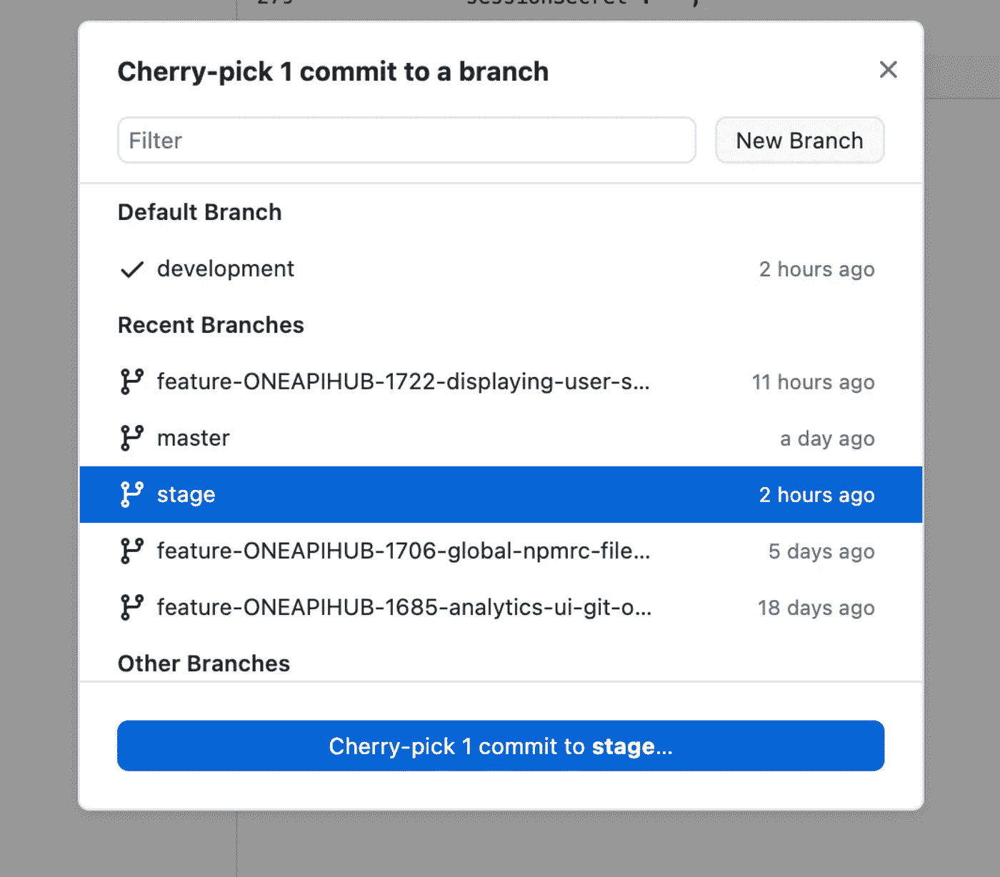

# Git 精选:在 Git CLI 和 GUI 中只合并选中的提交

> 原文：<https://betterprogramming.pub/git-cherry-pick-merge-only-the-selected-commits-in-git-cli-and-gui-99259de728e3>

## 用 Git 挑选提交是什么意思？



作者图片

管理大型团队和项目中的开发和分支可能会令人疲惫不堪。您可能会将未完成的工作发送到生产环境中，从而导致错误。对于团队来说，拥有防止这种情况发生的心态和规则是非常重要的。

事实上，我的团队过去也遇到过类似的情况。当时，我们是一个新团队，总是急于向组织证明我们的价值，我们有一个开发思维，但有一些规则，如完成的定义、部署清单等。仍在进行中。

我们有三个分支和环境；开发、试运行和生产。我们直接将开发与试运行以及试运行与生产相结合。

开发环境中的一个特性是依赖于另一个团队的第三方 API。另一个团队只在他们的开发环境中完成了他们的开发，但是由于某种原因(他们依赖于另一个客户或其他东西，我不记得确切的原因了)没有将这种改变推到他们的生产环境中。我们急着进行部署来修复一个生产缺陷。

在这一点上，我们忘记了依赖关系，并将所有内容合并到生产分支。我们在一个小时内意识到并回滚到前一个版本，但由于是在工作日的中间，我们已经收到了用户报告的几个错误。

这是我们对工作流程和规则的呼吁。根据这个要求，我们将 git cherry-pick 引入到我们的开发过程中。

# 什么是樱桃采摘？

有时需要将一个特性进展到另一个分支，而不需要源分支中的其他提交。为此，git 提供了`cherry-pick` 命令。

Git 中的精选意味着从一个分支中选择一个提交，并将其应用到另一个分支。这与其他方式形成对比，例如`merge`和`rebase`，它们通常将许多提交应用到另一个分支。

# Git CLI 解决方案

作为一个简单的开始，假设我们已经开发了一个特性， **C** ，目前在开发分支中与其他开发 A、B 和 d 一起可用。如果我们希望特性 C 在 staging 分支中，那么我们应该使用`cherry-pick`命令来实现这一点。

采摘樱桃的步骤:

1.  首先，确定你的主管部门是发展部:

```
git checkout development
```

2.其次，您应该获得特性 c 的提交 SHA id。您可以通过以下两种方式之一来完成此操作:

a.提交功能 C 后，运行以下命令:

```
git rev-parse development
```

这将为您提供已经在开发分支上完成的`__latest__`提交 id。

b.如果提交不是最新的，那么运行下面的命令来查看对开发的最后 5 次提交:

```
git log -5
```

复制要素的提交 id。

3.现在把头换成 staging。

```
git checkout stage
```

4.使用您的提交 id 运行以下精选命令:

```
git cherry-pick -x b29e6aaxx0c315ba94afc0xx35ff7b2b76f9xx03
```

-x 参数提供了您为这个新提交执行的特性 C 输入的解释。在这一步，您已经完成了本地提交操作。

5.现在是推动的时候了

```
git push
```

6 -现在应该没问题了，您的更改应该被推送到登台分支。不要忘记使用下面的命令切换回开发分支:

```
git checkout development
```

# Git GUI 解决方案

使用 GUI 会容易得多，现在几乎每个 Git GUI 应用程序都支持挑选。下面，我用 Git 的两个最流行的 GUI 应用程序演示了挑选。

假设我们在开发分支上有一个提交，我们希望将它转移到登台分支中。

## 基特克拉肯

这部分是关于 [GitKraken](https://www.gitkraken.com/) 中快乐采摘的说明。

第一个 checkout stage 分支，右键单击我们想要的 commit 并选择“Cherry-pick commit”选项。



作者图片

像下面这样的通知会在应用程序的顶部弹出，你只需点击是，然后将更改推送到原点。


作者图片

## GitHub 桌面

这部分是关于 [GitHub 桌面](https://desktop.github.com/)中的快乐采摘说明。

第一个 checkout stage 分支，转到 history 选项卡，右键单击特定的提交(可以通过点击 shift 按钮选择多个提交)，然后选择“Cherry-pick commit”选项。



作者图片

它将打开一个弹出窗口，您可以选择目标分支，然后将更改推送到服务器。



作者图片

现在，您已经掌握了 git cherry-pick 的基本用法。Git cherry-pick 有更多的选项可以满足您的需求。要了解更多信息，请查看下面链接的 git 精选文档:

[](https://git-scm.com/docs/git-cherry-pick) [## git-git-樱桃-pick 文档

### git cherry-pick master 在 master 分支的顶端应用由 commit 引入的更改，并创建一个新的…

git-scm.com](https://git-scm.com/docs/git-cherry-pick) 

感谢阅读！