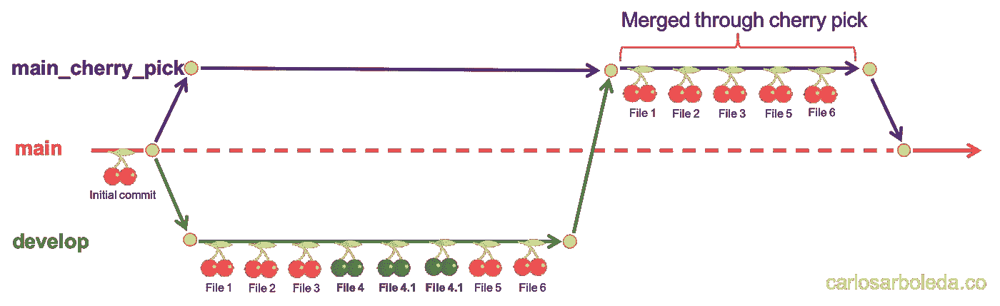
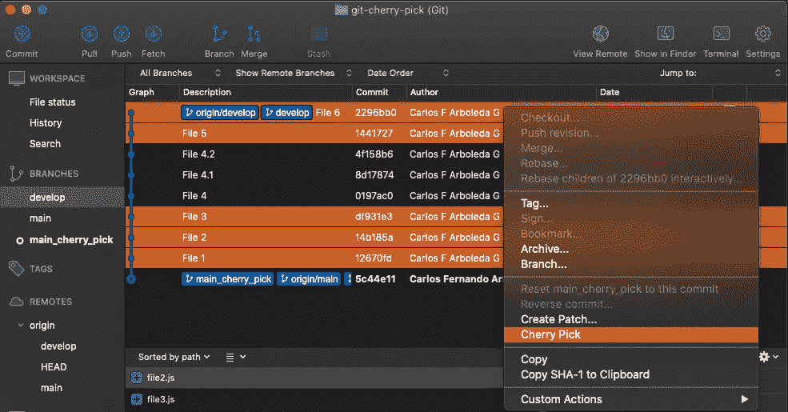
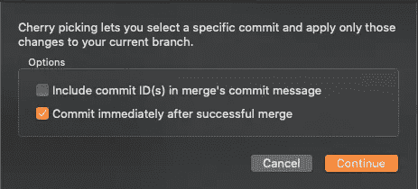
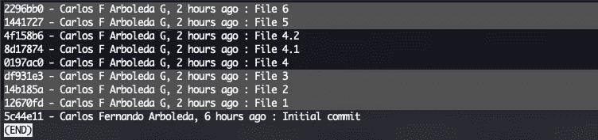
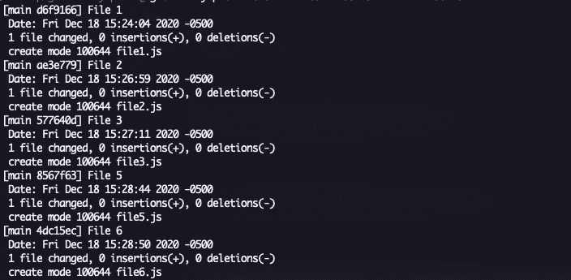

# Git 精选——选择要合并的特定提交

> 原文：<https://betterprogramming.pub/git-cherry-pick-selecting-specific-commits-to-merge-f1bf245e052a>

## 如何通过挑选特定的提交来合并分支


照片由 [Yancy Min](https://unsplash.com/@yancymin?utm_source=medium&utm_medium=referral) 在 [Unsplash](https://unsplash.com?utm_source=medium&utm_medium=referral) 上拍摄。

正如你所知道的，当你使用 [Git](https://git-scm.com) 并且需要在两个分支之间进行合并时，在*源*分支中的每一个提交都会被合并到*目标*分支中，没有例外。好吧，我要告诉你一个关于这个话题的恐怖故事，以及我是如何解决这个问题的。

最近，我加入了一个新的软件公司，叫做[巴塔哥尼亚](https://patagonian.it)。我在那里开始工作几天后，项目经理给我分配了一个属于更大任务的任务([一个史诗任务](https://www.productboard.com/glossary/epics))。

当我完成我的任务时，我创建了一个拉请求，合并到`develop`分支，并继续我的下一个任务。几天后，我们需要发布到 staging，然后到 production，但是……一个不完整的 epic 任务被合并到`develop`中，并将成为下一个发布的一部分。

因此，我们不能通过将`develop`合并到`staging`来进行正常的发布。实际上，我们需要从发布中排除史诗任务的提交。你能想象我的担心吗？

幸运的是，我的队友们之前已经解决了这个问题，他们还有一张王牌:`[git cherry-pick](https://git-scm.com/docs/git-cherry-pick)`。这个 Git 命令通过选择您需要的特定提交，使得将现有提交应用到另一个分支成为可能。

# 挑选

正如您在官方文档中看到的那样，`cherry-pick`命令允许您选择特定的现有提交来包含在另一个分支中。

为了更容易理解，我将使用一个图形化的例子。假设您有一个存储库，在您的`develop`分支中有一些提交，但是一些变更是被错误合并的不完整特性的一部分(绿樱桃)。在这种情况下，您只需要将与完成的特性(红樱桃)相关的提交传递给`main`分支。



樱桃采摘命令的插图。

这里有一些截图展示了如何使用 [Sourcetree](https://www.sourcetreeapp.com) 创建一个`cherry-pick`。如果你想了解它是如何工作的，请继续阅读终端解释。



选择要包含在精选命令中的提交



使用 Sourcetree 设置和创建樱桃采摘

# 我如何在终端上使用它？

如果你是终端爱好者，也许你会想用你漂亮的终端来完成这个过程。好吧，考虑以下步骤。

首先，您必须从您的目标分支`main`创建一个名为`main_cherry_pick`的新分支。这个分支将用于应用所选择的提交，然后将它们合并到`main`分支中。

其次，您需要知道想要包含的提交 id。在`develop`分支中，执行下一个[日志命令](https://git-scm.com/book/en/v2/Git-Basics-Viewing-the-Commit-History)，该命令将显示每次提交的散列和消息:

```
git log --pretty=format:"%h %s" 
```

您应该会看到类似这样的内容:



Git 日志命令的结果

下一步是检查目标分支。然后复制需要的 id 并执行`cherry-pick`命令。在这种情况下，我将复制与文件 1、2、3、5 和 6 相关的提交 id，忽略文件 4、4.1 和 4.2，因为它们属于不完整的特性。

```
git checkout main
git cherry-pick 12670fd 14b185a df931e3 1441727 2296bb0
```

如果没有任何冲突，您将在您的`cherry-pick`命令中看到每个选择/包含提交的一个提交确认:



最后，您需要将您的`main_cherry_pick`中的更改推送到远程分支。然后你必须做一个从`main_cherry_pick`到`main`分支的普通合并。

# 结论

我在这里解释的是`git cherry-pick`最基本的用法。您可以在官方文档中查看几个选项:

[](https://git-scm.com/docs/git-cherry-pick) [## git-git-樱桃-pick 文档

### git cherry-pick master 在 master 分支的顶端应用由 commit 引入的更改，并创建一个新的…

git-scm.com](https://git-scm.com/docs/git-cherry-pick) [](https://github.com/carboleda/git-cherry-pick) [## carboleda/git-cherry-pick

### 在 GitHub 上创建一个帐户，为 carboleda/git-cherry-pick 开发做贡献。

github.com](https://github.com/carboleda/git-cherry-pick) 

感谢阅读！我希望这篇文章对您有所帮助。欢迎所有建设性的反馈。