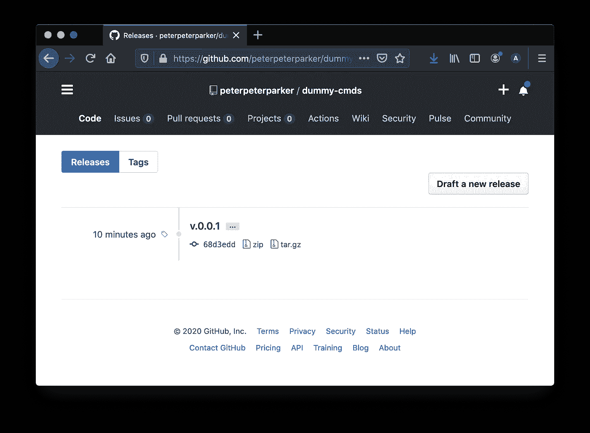

# 我总是忘记 Git 命令

> 原文：<https://betterprogramming.pub/git-commands-i-always-forget-24cbb71c502a>

## 恢复上次提交、更改上次或多次提交消息或删除标签


Jonatan Lewczuk 在 [Unsplash](https://unsplash.com/s/photos/free?utm_source=unsplash&utm_medium=referral&utm_content=creditCopyText) 上拍摄的照片

我每天分享[一个小技巧](https://medium.com/@david.dalbusco/one-trick-a-day-d-34-469a0336a07e)直到原定的新冠肺炎隔离期结束——2020 年 4 月 19 日。离第一个里程碑还有三天。希望更好的日子就在前面。

说到 [Git](https://git-scm.com/) ，我可能过于依赖它对我的编辑器 [WebStorm](https://www.jetbrains.com/webstorm/) 的出色集成。这导致我有时会忘记有用的命令，甚至是简单的命令，我很少在终端中运行这些命令。

这就是我分享这篇博客的原因——主要是为了我未来的自己！

# 恢复您上次提交的内容

要恢复尚未提交的最后一次提交，您可以借助`reset`命令从上一步回滚历史:

```
git reset --soft HEAD~1
```

但是，如果您的提交已经被推送，您可以保留您的历史并运行一个`revert`命令(其中`eec47301`是要恢复的提交的修订号——这可以在`git log`命令的帮助下找到),然后是一个提交和推送:

```
git revert eec47301
```

或者，在`reset`命令和选项`--hard`的帮助下，在不保存历史的情况下恢复，然后用选项`--force`按下:

```
git reset --hard eec47301
```

不用说，它必须被明智地使用。

# 更改上次提交的消息

例如，如果您的最后一个提交消息是错误的，或者如果您有一个打字错误，您可以使用选项`--amend`修改最后或最近的提交消息:

```
git commit --amend
```

如果你的提交还没有完成，那就没什么可做的了。如果您已经推送过，您可以使用`--force`更新您的回购:

```
git push --force
```

# 更改多个提交消息

如果您想要修改多个提交消息，例如，如果您忘记指定相关的问题编号，这种情况可能会发生，您可以在`rebase`的帮助下继续。这个解决方案的功劳归于[张博·普雷托里乌斯](https://jacopretorius.net/2013/05/amend-multiple-commit-messages-with-git.html)和[里努西泽](https://linuxize.com/post/change-git-commit-message/)提供的——不是所有的英雄都穿斗篷！

为了开始修改，我们运行下面的命令，其中`2`是我们想要执行`rebase`的提交次数。

```
git rebase -i HEAD~2
```

这将打开一个提示，允许我们在每次提交时指定更改。

```
pick e68a142 my frst update
pick 1613f1e my scnd update

*# Rebase 9703490..1613f1e onto 9703490 (2 commands)
#
# Commands:
# p, pick <commit> = use commit
# r, reword <commit> = use commit, but edit the commit message
# e, edit <commit> = use commit, but stop for amending
# s, squash <commit> = use commit, but meld into previous commit
# f, fixup <commit> = like "squash", but discard this commit's log message
# x, exec <command> = run command (the rest of the line) using shell
# b, break = stop here (continue rebase later with 'git rebase --continue')
# d, drop <commit> = remove commit
# l, label <label> = label current HEAD with a name
# t, reset <label> = reset HEAD to a label
# m, merge [-C <commit> | -c <commit>] <label> [# <oneline>]
# .       create a merge commit using the original merge commit's
# .       message (or the oneline, if no original merge commit was
# .       specified). Use -c <commit> to reword the commit message.
#*
```

因为我们想改变提交消息，所以我们用`reword`(或者简称`r`)来修改`pick`。

```
reword e68a142 my frst update
reword 1613f1e my scnd update
```

完成后，我们保存(`:wq`)，提示将自动引导我们选择我们想要更改的第一个提交:

```
my frst update
```

我们可以更正消息(`x`删除一个字符，`i`切换到插入模式，`a`追加，总是`Esc`退出编辑模式)。保存它，提示将再次自动引导我们到下一个我们想要更改的提交消息，等等。

```
my snd update
```

完成后，我们的终端将如下所示:

```
**❯** git rebase -i HEAD~2[detached HEAD 1f02610] my first updateDate: Thu Apr 16 15:55:09 2020 +02001 file changed, 1 insertion(+), 1 deletion(-)[detached HEAD 68d3edd] my second updateDate: Thu Apr 16 16:00:29 2020 +02001 file changed, 4 insertions(+)Successfully rebased and updated refs/heads/master.
```

在这一点上，我们的历史被本地重写，但尚未在我们的回购中更新，这就是我们推这些的原因:

```
git push --force
```

# 中止重置基础

如果您在运行上述过程时遇到问题，您可以使用`--abort`取消重置基础操作。

```
git rebase --abort
```

# 中止合并

说到中止，也可以在使用相同选项时退出合并:

```
git merge --abort
```

# 删除标签

当您在 [GitHub](https://github.com/) 上删除一个发布时，它会删除它，但不会删除相关的标签。通常，如果您使用浏览器返回回购，它仍会显示。



如果您想要删除这样的标签，您可以借助 Git push 和选项`--delete`来完成，后面是要删除的标签的名称。

```
git push --delete origin v0.0.1
```

# 摘要

希望这次我能记住这些命令行。如果没有，至少我知道在哪里可以找到他们！

呆在家里，注意安全。

大卫