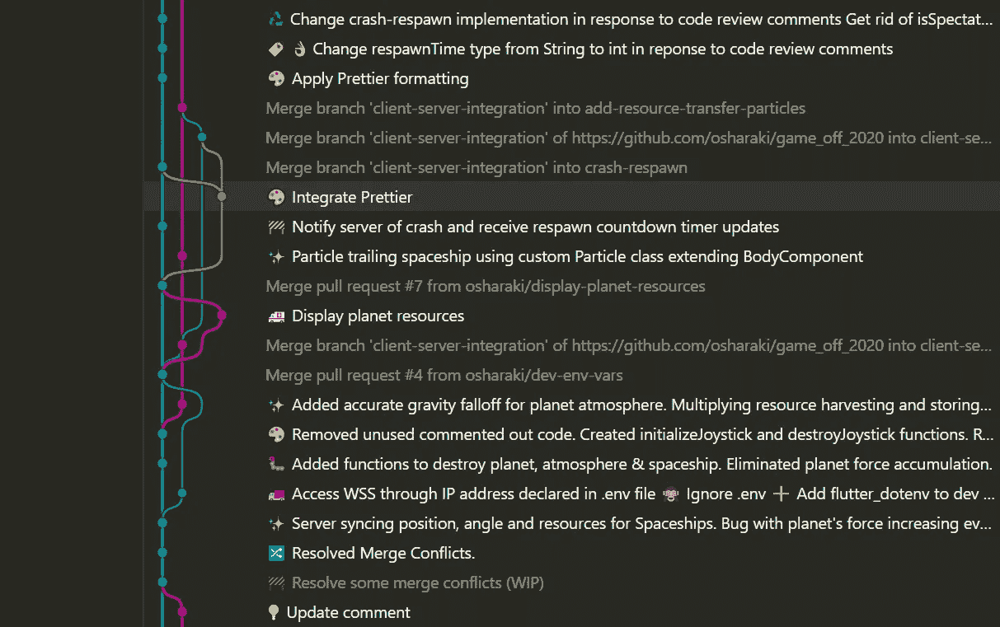
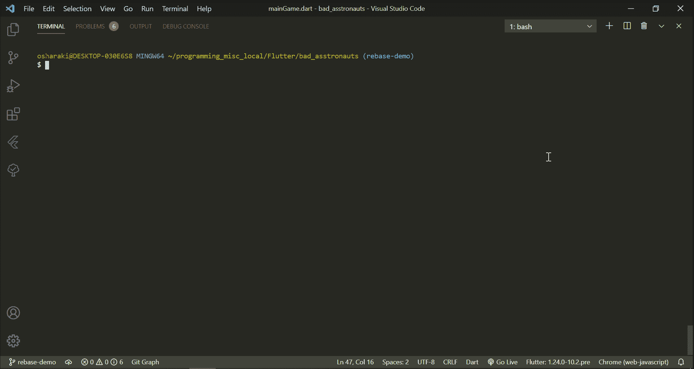
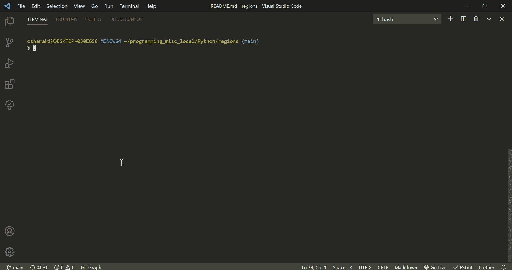
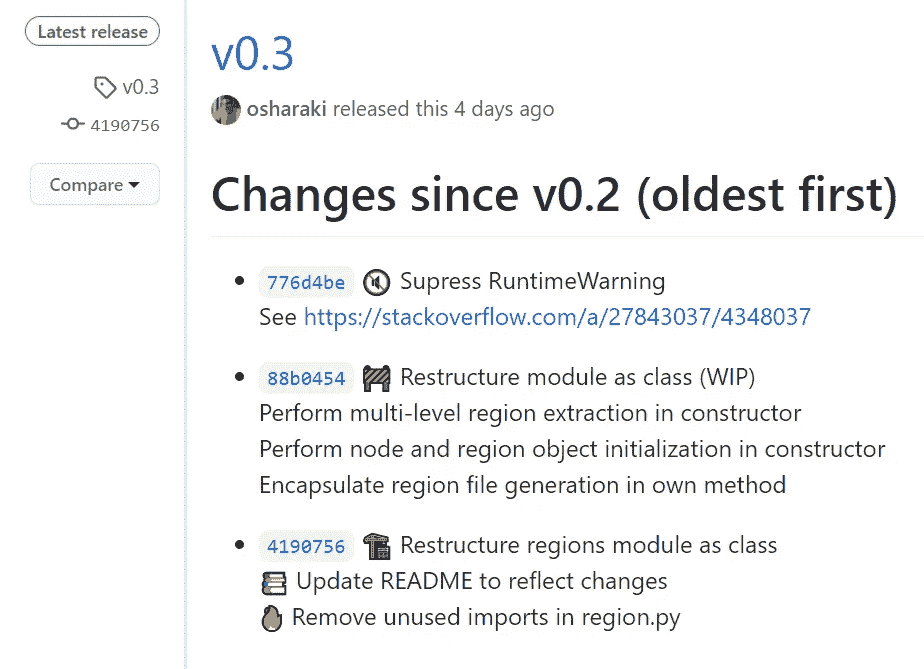

# Git 命令赖以生存

> 原文：<https://betterprogramming.pub/git-commands-to-live-by-349ab1fe3139>

## 超出 Git 基础的备忘单



我的一个项目的 Git 图

一段时间以来，我已经自己记下了从命令行工作时必须查找的每个 Git 命令。每当我这样做时，我都会记下正确的语法、最常见的选项以及我从哪里获得的信息。随着时间的推移，随着我的列表越来越多，我开始越来越少地依赖谷歌，更多地依赖我的列表来快速查阅。

典型用例(想想普通的`git add`或`git commit`)不会在这里出现，而是选择一些不太经常出现但却很重要的用例。

**注意:**链接的参考资料通常会提到稍有不同的、更简洁的 Git 新版本命令。所以如果你想要最新最棒的，一定要给他们看看。

## 概观

```
1\. [Check Out Remote Branches](#e221)
2\. [Delete Remote Branches](#d201)
3\. [Change Remote URL](#1ef3)
4\. [Stash Individual Files](#6a0c)
5\. [Show Content of Most Recent Stash](#203c)
6\. [Apply a Stash Without Deleting It From the Stash List](#bde6)
7\. [Check Out File From Another Branch](#5036)
8\. [Work With Multiple Branches Simultaneously](#df30)
9\. [Show Commit Content](#80a5)
10\. [Compare Files Between Branches/Commits](#e2ef)
11\. [Reset a Single File to Most Recent Commit](#691a)
12\. [Change Last Commit Message](#a59f)
13\. [Change a Specific Commit Message](#8065)
14\. [Delete Last Commit but Keep the Changes](#708c)
15\. [Unstage a File](#07ff)
16\. [Remove Ignored Files From Remote](#9807)
17\. [Create GitHub Releases](#c0f6)
```

## 关于语法的快速注释

*   `[]`:可选内容
*   `<>`:运行命令时应替换为实际值

# 查看远程分支机构

我们可能都很熟悉`git pull`,它能让我们当地的分支机构跟上远程分支机构的速度。然而，如果这是我们第一次使用远程分支——也就是说，它没有被本地存储库中的任何分支跟踪——我们首先需要设置它。

**注意:**运行`git fetch` 来确保我们使用的是最新版本的`remote`是个好主意。

*   **命令:**
*   **举例:** `git checkout -t origin/my-awesome-feature`
*   **解释:**这将把`origin/my-awesome-feature`拉入一个同名的新本地分支，并将其设置为跟踪`origin/my-awesome-feature`。`-b`将做同样的事情，只是本地分支的名称将被设置为指定的名称。

## **资源**

*   “我如何签出一个远程 Git 分支？”|堆栈溢出

[⬆](#f578)

# 删除远程分支

删除本地分支就像写`git branch -d <branch>`一样简单。但是删除远程分支需要不同的命令。

*   **命令:** `git push <remote> -d <branch>`或`git push <remote> :<branch>`
*   **例如:**

## 资源

*   [“如何在本地和远程删除 Git 分支？”|堆栈溢出](https://stackoverflow.com/a/2003515/4348037)

[⬆](#f578)

# 更改远程 URL

这是为了当你需要改变 URL `<remote>`实际指向的时候。例如，如果您更改了存储库的名称，Git 会要求您这样做。以下是方法。

*   **命令:**
*   **举例:**

## 资源

*   git-remote | Git

[⬆](#f578)

# 隐藏单个文件

`git stash`经常用于暂时搁置所有未提交的更改，并将分支重置为最近的提交。但是如果您只想隐藏特定的文件呢？

*   **命令:**
*   **举例:** `git stash push -- src/index.js README.md`

## 资源

*   [“只隐藏用 Git 修改过的多个文件中的一个吗？”|堆栈溢出](https://stackoverflow.com/questions/3040833/stash-only-one-file-out-of-multiple-files-that-have-changed-with-git#comment78345399_3040833)

[⬆](#f578)

# 显示最近收藏的内容

如果您想在应用更改之前查看一个存储库将应用的更改，这个选项很有用。

*   **命令:** `git stash show -p [stash@{<n>}]`
*   **解释:** `-p`表示我们希望看到隐藏的实际内容。省略它将只显示文件名。
    `[stash@{<n>}](https://git-scm.com/docs/git-stash#Documentation/git-stash.txt-ltstashgt)`允许我们指定某个藏匿点，用`n`表示(0 是最近的一个)。
*   **举例:** `git stash show -p stash@{1}`
*   **效果:**显示第二个最新存储的内容

## 资源

*   [“查看存储中的内容而不应用它”|存储溢出](https://stackoverflow.com/a/10726185/4348037)
*   git-stash | Git

[⬆](#f578)

# 应用存储，而不从存储列表中删除它

说到应用存储，`git stash pop`通常是这个 and 的首选命令，它将应用存储列表上的第一个存储(用`git stash list`查看)。然而，副作用是，在这个过程中，隐藏的内容被从列表中删除了。但如果你想留着它，Git 会帮你搞定的。

*   **命令:**
*   **效果:**应用列表中的第一个隐藏而不移除它
*   **提示:**就像`git stash show`一样，你可以通过添加`stash@{<n>}`来指定应用哪个隐藏

## 资源

*   git-stash | Git

[⬆](#f578)

# 从另一个分支签出文件

`git checkout <branch>`对于大多数 Git 用户来说并不陌生。它确实如它所说的那样，检查一个特定的分支。但是如果需要，同样的命令也可以用来签出单个文件。

*   **命令:**
*   **举例:** `git checkout my-awesome-feature src/lasers.js`
*   **效果:**从`my-awesome-feature`中检出`src/lasers.js`
*   **提示:**你可能也很熟悉`git checkout <commit>`。这种变体可以以同样的方式从特定的提交而不是特定的分支中签出文件。

## 资源

*   [“Git 提示:如何从另一个分支‘合并’特定文件](https://jasonrudolph.com/blog/2009/02/25/git-tip-how-to-merge-specific-files-from-another-branch/)”

[⬆](#f578)

# 同时处理多个分支

如果你发现自己经常不得不检查一个特定的分支，例如在另一个分支上工作时作为参考，`git worktree`提供了一个更好的选择。

*   **命令:** `git worktree add <path> <branch>`
    当你不再需要它的时候，运行:
    `git worktree remove [-f] <path>`
*   **举例:** 1。`git worktree add my-other-awesome-feature ../my-other-awesome-feature`
    2。`git worktree remove ../my-other-awesome-feature`
*   **解释:**创建一个[链接的工作树](https://git-scm.com/docs/git-worktree#_description)(即文件系统上与回购相关联的另一个目录)，名为`my-other-awesome-feature`，在你当前工作目录的上一级，指定的分支被检出。例如，您可以在另一个代码编辑器实例中打开这个目录，或者在当前实例中打开其中的单个文件。
    一旦你完成了链接的工作树，用
    `-f`移除它将强制移除带有未提交变更的工作树。

## 资源

*   [“git 同时处理两个分支”|堆栈溢出](https://stackoverflow.com/a/30186843/4348037)
*   [git-worktree | Git](https://git-scm.com/docs/git-worktree)

[⬆](#f578)

# 显示提交内容

与`git stash show`有些类似，查看特定提交引入的更改通常很有用。

*   **命令:** `git show <commit>`
    或者，运行
    `git diff <commit-a> <commit-b>`来查看两个具体提交之间的变化
*   **举例:**
*   **效果:**显示`HEAD`与其直接祖先的区别，相当于`git show`

## 资源

*   [“如何查看 Git 提交中的变化？”堆栈溢出](https://stackoverflow.com/questions/17563726/how-to-see-the-changes-in-a-git-commit/)
*   [“提交是快照，不是差异”GitHub 博客](https://github.blog/2020-12-17-commits-are-snapshots-not-diffs)
*   [git-log | Git](https://git-scm.com/docs/git-log)
*   [“Git 基础知识—查看提交历史”| Git](https://git-scm.com/book/en/v2/Git-Basics-Viewing-the-Commit-History)

[⬆](#f578)

# 比较分支/提交之间的文件

正如我们刚刚看到的,`git diff`的威力不仅仅局限于整个提交，还可以用于针对单个文件。

*   **命令:**
*   **例如:**
*   **效果:**显示一次提交的文件与另一次提交的文件有何不同。
    这里也可以使用分支名称来代替提交，以便跨分支比较文件。
*   **提示:**要比较不同的文件，使用
    

## 资源

*   [“如何比较两个不同分支的文件？”|堆栈溢出](https://stackoverflow.com/questions/4099742/how-to-compare-files-from-two-different-branches)

[⬆](#f578)

# 将单个文件重置为最近提交的文件

`git reset --hard`是一个天赐良机，当你需要回到上一个稳定的状态时，例如在一些不想要的或意想不到的变化之后，但是它影响了整个工作树。不过，实现相同效果但本地化到一个文件的命令应该并不陌生。

*   **命令:**
*   **举例:** `git checkout -- README.md`
*   **效果:**这将把`README.md`重置为最近一次提交的版本(或者一次特定的提交，如果指定的话)

## 资源

*   [“单个文件的硬复位”|堆栈溢出](https://stackoverflow.com/questions/7147270/hard-reset-of-a-single-file)

[⬆](#f578)

# 更改上次提交的消息

曾经提交的更改只是为了以后想要编辑提交消息吗？

*   **命令:** `git commit --amend [-m '<message>']`
    如果已经推送了旧的提交，则需要额外运行
    `git push --force-with-lease <remote> <branch>`。**注意:**作为一般规则，尤其是如果你正在和别人一起工作，对已经提交的提交进行任何更改时，小心是很重要的。
*   **效果:**将任何暂存的更改添加到最后一次提交。如果消息包含在`-m`选项中，则最后一次提交的消息将被替换。否则，这将在最后一条提交消息时打开编辑器。
*   **提示:**您可能已经知道，`git commit --amend`不仅仅可以用来改变提交的消息。例如，进行更改并用`--amend`选项提交它们会导致这些更改被添加到最后一次提交中，而不是创建一个新的。

## 资源

*   git 提交| Git
*   [“推送后更改 git 提交消息(假设无人从远程拉取)”|堆栈溢出](https://stackoverflow.com/a/8981216/4348037)

[⬆](#f578)

# 更改特定的提交消息

改变一个特定的提交消息怎么样？

*   **命令:**
*   **示例(见下面演示):** `git rebase -i HEAD~3`
*   **效果:**打开一个编辑器，列出提交的内容，从指定的内容开始，一直到当前的内容。在上面的例子中，这个列表将由最后三个提交组成。
    将`pick`替换为`reword`对于那些您希望更改消息并保存的提交，这将允许您这样做。
    **注:**实际变化在下一步进行。此时更改消息将不会有任何效果！



使用 Git Rebase 更改特定的提交消息

## 资源

*   [“更改 Git 上的旧提交消息”|堆栈溢出](https://stackoverflow.com/questions/1884474/change-old-commit-message-on-git)

[⬆](#f578)

# 删除上次提交，但保留更改

您已经提交了想要保留的更改，但是出于某种原因，您不想提交它本身。不要烦恼！

*   **命令:** `git reset HEAD^` **注意:**关于对已经推送的内容进行更改的警告在这里也同样有效！
*   **效果:**移动`HEAD`指向先前的提交，而不做任何文件更改，有效地删除当前的提交
*   **提示:**这种方法的另一种选择是等到你准备好下一次提交，而不是像通常的`git commit`那样，使用我们的老朋友`git commit --amend`。这将具有相同的预期效果。

## 资源

*   [“我可以删除 git 提交但保留更改吗？”|堆栈溢出](https://stackoverflow.com/a/15772171/4348037)

[⬆](#f578)

# 取消文件暂存

`git add`的反义词是什么？我给你一个提示。不是`git remove`。

*   **命令:**
*   **效果:**从索引中删除给定的文件。当您准备下一次提交并决定之前用`git add`暂存的文件不再是它的一部分时，这很有用。这个*不影响*文件本身。所以你不用担心弄坏什么东西。

## 资源:

*   [Unstage | GitLab](https://docs.gitlab.com/ee/university/training/topics/unstage.html)
*   [“Git 工具—重置解密”| Git](https://git-scm.com/book/en/v2/Git-Tools-Reset-Demystified)

[⬆](#f578)

# 从远程删除忽略的文件

如果您已经推送了文件，然后决定`.gitignore`它们，这些文件仍然会保存在您的远程存储库中。为了补救这一点，`git rm`是这项工作的工具。

*   **命令:** `git rm [-r] [-n] --cached <path(s)>`。
    然后，简单的说`add`、`commit`、`push`。
*   **说明:**
    `--cached`确保文件保留在工作树中。
    `-n`执行一次试运行，本质上是一次健全性检查，允许您在实际执行命令之前首先查看哪些文件将受到影响。如果您对结果满意，只需在没有它的情况下再次运行该命令。
    `-r`用于文件夹被移除的情况，允许递归移除。
*   **举例:** (1) `git rm -r -n --cached .`(检查受影响的文件)
    (2)`git rm -r --cached .`
    (3)`git add .`
    (4)`git commit -m "Remove ignored files"`
    (5)`git push`
*   效果:这是一种积极但有用的命令形式。结果是，您的 repo 将清除包含在您的`.gitignore`中的任何文件，而无需您明确列出每一个文件。

## 资源

*   [“如何让 Git 忘记’一个曾经被跟踪但现在还在的文件。gitignore？”|堆栈溢出](https://stackoverflow.com/questions/1274057/how-to-make-git-forget-about-a-file-that-was-tracked-but-is-now-in-gitignore)
*   ["已基于将取消跟踪文件添加到 git 仓库。gitignore" | CodeBlocQ](https://www.codeblocq.com/2016/01/Untrack-files-already-added-to-git-repository-based-on-gitignore)
*   [“‘git RM-cached x’vs‘git reset head-x’？”|堆栈溢出](https://stackoverflow.com/questions/5798930/git-rm-cached-x-vs-git-reset-head-x)

[⬆](#f578)

# 创建 GitHub 版本

最后，这里有一个我最近开始使用的宝石。严格来说，这个命令本身不是 Git 命令，而是 GitHub CLI 提供的。所以如果你还没有下载的话，你必须先下载。

*   **命令:**命令:`gh release create <version>`
*   **示例(见下面演示):** `gh release create v0.3`
*   **效果:**这将打开一个交互式命令行菜单，引导您完成创建您的发布的过程。结果将是从提供的版本[标签](https://git-scm.com/book/en/v2/Git-Basics-Tagging)创建的 GitHub 版本(如果您的 repo 中不存在这样的标签，将创建一个新标签)。



使用 GitHub CLI 从命令行创建 GitHub 版本

*   **提示:**在`Release notes` 提示*，*选择`Write using commit log as template`为有意义的发行说明提供一个良好的起点。最好事先运行`git fetch --all --tags`来确保模板中只包含最后一个标签之后的提交。
    如果打开了非默认的编辑器，使用`gh config set editor <editor>`将其设置为您选择的一个，例如`gh config set editor nano`。

以下是最近[版本](https://github.com/osharaki/travel_regions/releases/tag/v0.3)的发行说明示例:



## 资源

*   [gh 发布创建| GitHub CLI](https://cli.github.com/manual/gh_release_create)
*   [gh 配置集| GitHub CLI](https://cli.github.com/manual/gh_config_set)

[⬆](#f578)

# 结论

现在你知道了。这些命令中有多少是你能不假思索就知道的，你还使用过哪些不太为人知但却很强大的命令？

一如既往，很高兴听到你的想法，回答任何问题！