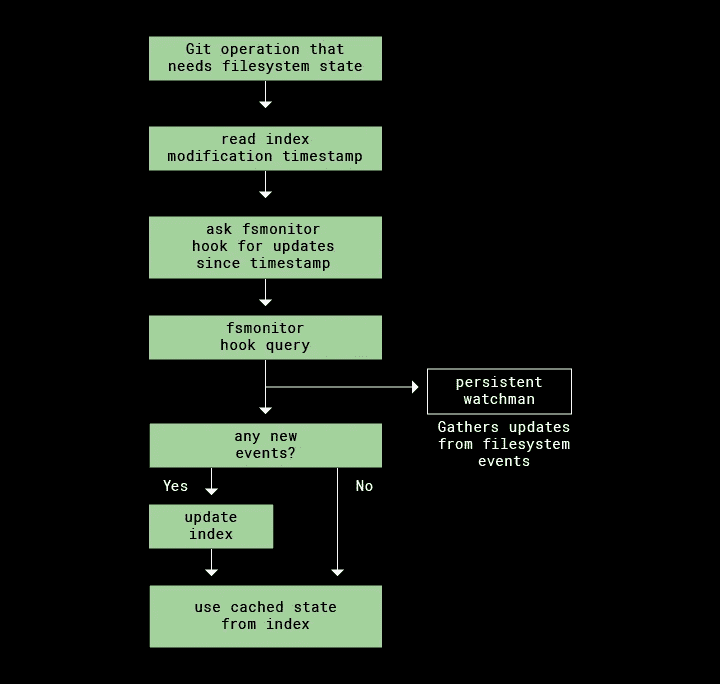

# 吉特古德

> 原文：<https://betterprogramming.pub/git-gud-dbe567c05e2a>

## 创建高性能 git 命令


照片由[罗曼·辛克维奇·🇺🇦](https://unsplash.com/@synkevych?utm_source=medium&utm_medium=referral)在 [Unsplash](https://unsplash.com?utm_source=medium&utm_medium=referral) 拍摄

经历缓慢的加工？本文最初是在规模越来越大的 monorepo 的成长过程中撰写的，在 mono repo 中，git 命令可能需要 10 秒以上才能执行。对于做大量上下文切换的开发人员，以及有许多贡献者的回购——这就增加了。

这里有很多前言。如果您只是在寻找改进，请随意向下滚动到“好的，那么，我如何获得 gud？”部分。

# 见过慢回购吗？

*在完全安装的 5.9GB 回购上测试*

## 第一次尝试(git 状态)

```
It took 10.88 seconds to enumerate untracked files. ‘status -uno’ may speed it up, but you have to be careful not to forget to add new files yourself (see ‘git help status’).nothing to commit, working tree cleangit status 0.45s user2.25s system 24% cpu **11.109 total**
```

## **第二次尝试(git gc)**

```
It took 6.87 seconds to...git status 0.41s user 1.99s system 33% cpu **7.137 total**
```

## **第三次尝试(git gc - aggressive)**

```
It took 3.55 seconds to...git status 0.42s user 2.10s system 69% cpu **3.658 total**
```

## **第四次尝试(git 状态-uno)**

```
nothing to commit (use -u to show untracked files)git status -uno 0.06s user 0.56s system 556% cpu **0.112 total**
```

## **第五次尝试(fsmonitor-watchman)**

```
nothing to commit, working tree cleangit status 0.31s user 1.02s system 92% cpu **1.435 total**
```

# git 基础知识一览

## **git 克隆**

*O(n)* 其中“n”包括历史上的每一次提交，这意味着它包括曾经提交给存储库的每一个文件——即使当前已被删除。它还包括分支引用的每个提交，这可能包括标准“干净”回购检出中不存在的附加文件。

这些可以分别用`--depth`和`--branch`调谐。但是这些克隆标志可能仅在用户不需要历史和/或不需要检验不同分支的某些情况下有用。

感谢一位同事在这一部分提供支持信息！

## **git 状态**

居然跑了两次`git diff`*。一次将 HEAD 与 staging area 进行比较，另一次将 staging 与您的工作树进行比较。*

根据官方文件，`git diff`可以使用以下四种算法中的任意一种:`--diff-algorithm={patience|minimal|histogram|myers}`。默认是 Myers diff 算法，它在理论上的 *O(ND)* 时间和空间中运行，其中 N =输入长度，D =编辑距离。它的预期运行时间是`O(N+D²)`。不可怕，但是运行时间在大型回购中会被严重放大。

来源:[Myers diff 算法:第 1 部分—If 工作原理](https://blog.jcoglan.com/2017/02/12/the-myers-diff-algorithm-part-1/)

## **git 添加**

将您的工作树添加到暂存区，必须快速进行 *O(n)*


你的 git zoomin

指定路径`git add <path>/*`而不是`git add --all`显然更快

## **git 提交**

像`git add`一样，提交应该很快，但是当你的 repo 有一个 5 种语言的格式化程序，2 个类型检查器，和清理脚本捆绑在一起成为预提交钩子膨胀软件时，提交就会陷入困境。*阿(* ∞ⁿ *)*

如果`git commit`出问题了，你也可以运行`git commit -n`来跳过提交钩子

## **git 推/拉**

取决于你的 isp 的感受。当尝试基于您的首选策略进行重置/合并时，Pull 也会进行区分。

## **git rebase/merge**

Rebase 和 merge 具有类似的效果，并且编写方式类似。合并策略选项:`--strategy={ort|resolve|recursive|octopus|ours|subtree}`。当拉一个分支时，默认的合并策略是`ort`(表面上是递归的孪生兄弟)，当处理 2+头时是`octopus`。注`ort`在 2021 年第三季度取代了旧的默认`recursive`方法。在引擎盖下，`ort`和`recursive`也用默认的 myer diffing 算法调用`git diff`，这就是为什么它也可能很慢。

来源: [git 合并策略](https://git-scm.com/docs/git-merge#_merge_strategies)

> TL；dr，任何需要读写你的索引的操作都会对你的索引执行一次**完整的**读写，不管你实际更改了多少个文件。

有时暂存区/索引被称为缓存。

# 统计，为了好玩📈


monorepo 示例

典型主动回购大小: **5.9gb** (安装后)
全新克隆回购大小: **3.0gb**

`.git`大小(一致): **2.4gb** 。拆开它进一步揭示了一个 **2.3gb** `.git/objects/pack`，它充当回购历史的数据库。

# 好吧，那么，我怎么得到 gud？🧐

## **1。启用 fsmonitor-watchman**

来源:[用< 200 行代码加速 Dropbox 上的 Git mono repo—Dropbox](https://dropbox.tech/application/speeding-up-a-git-monorepo-at-dropbox-with--200-lines-of-code)



使用`[git/hooks — fsmonitor-watchman.sample](https://github.com/git/git/blob/master/templates/hooks--fsmonitor-watchman.sample)`启用(已经在您的 repo 中！)

1.`cp .git/hooks/fsmonitor-watchman.sample .git/hooks/fsmonitor-watchman`
2。`git config core.fsmonitor .git/hooks/fsmonitor-watchman` 3。`git update-index --fsmonitor`

注意事项:

*   你需要安装[看守人](https://facebook.github.io/watchman/docs/install.html)
*   如果你在 *3/22/2020* 之前克隆了你的回购，或者你的 git 是< *v2.26* ，那么你有一个过时的`fsmonitor-watchman.sample`文件。您可以从源代码中复制更新的版本，或者更新`git`然后`git init`一个空的 repo 来获得它。
*   锈实现[https://github.com/jgavris/rs-git-fsmonitor](https://github.com/jgavris/rs-git-fsmonitor)更快

## **2。使用未跟踪缓存**

来源:[https://git-scm.com/docs/git-update-index](https://git-scm.com/docs/git-update-index)

```
git update-index --test-untracked-cache
```

如果返回 OK，运行:

```
git config core.untrackedCache true && git update-index --untracked-cache
```

## **3。使用分割索引**

来源:[https://git-scm.com/docs/git-update-index](https://git-scm.com/docs/git-update-index)

```
git config core.splitIndex true && git update-index --split-index
```

## **4。增加虚拟节点缓存大小**

来源:[https://chromium.googlesource.com](https://chromium.googlesource.com)

默认的内核虚拟节点大小是`kern.maxvnodes` : *263168 (257 * 1024)* 。要为您的会话增加，请运行:

```
sudo sysctl kern.maxvnodes=$((512*1024))
```

该设置将在重新启动时重置，启动参数可以通过以下方式永久设置:

```
echo kern.maxvnodes=$((512*1024)) | sudo tee -a /etc/sysctl.conf
```

## **5。使用 git 状态-uno**

来源:[https://git-scm.com/docs/git-status](https://git-scm.com/docs/git-status)

```
git status -uno
```

警告:`-uno`不会显示未跟踪的文件，这意味着新创建的文件不会显示。

## **6。将 git gc 整合到您的工作流程中**

来源:https://git-scm.com/docs/git-gc

按递增顺序排列(子集):

1.  `git prune`
2.  `git gc`
3.  `git gc --aggressive`
4.  `git gc --aggressive --prune=now`

## 7 .**。自动删除旧分支**

[](https://github.com/not-an-aardvark/git-delete-squashed) [## GitHub-not-an-aardvark/git-Delete-squashed:删除已经被压扁合并的分支…

### 这是一个删除所有已经被“挤压合并”到 master 中的 git 分支的工具。这很有用，如果你…

github.com](https://github.com/not-an-aardvark/git-delete-squashed) 

来自创造者:

这是一个删除所有已经被“挤压合并”到 master 中的 git 分支的工具。

如果您处理的项目将分支压缩为主分支，这将非常有用。在您的分支被压缩和合并后，您可以使用此工具清理本地分支。

## **8。手动删除旧分支**

要做到这一点，请跟随这个 [StackOverflow](https://stackoverflow.com/questions/2003505/how-do-i-delete-a-git-branch-locally-and-remotely) 帖子的顶部答案:

**删除远程和本地分支**

```
git push -d <remote_name> <branchname>
git branch -d <branchname>
```

请注意，在大多数情况下，远程名称是 origin。在这种情况下，您必须像这样使用命令。

```
git push -d origin <branch_name>
```

**删除本地分支** 使用以下方法之一删除本地分支:

```
git branch -d <branch_name>
git branch -D <branch_name>
```

## **9。切换到 Linux**

根据 dropbox 的文章，速度提高了 5 到 10 倍

# 快了多少？🚀

使用 [hyperfine](https://github.com/sharkdp/hyperfine) 测试 git 状态的结果，有 3 次预热操作，min 30 在没有任何插件的基础 bash 终端上运行。

在这个科学但不科学的测试中我:

*   在上面的统计信息部分运行了**示例清理回购 3.0gb**
*   用了一个 **2019 16 寸 Macbook Pro** (英特尔芯片，可能是最低配置)
*   用在后台运行的 intellij、slack 和 chrome 模拟了一般的开发人员

## **0。控制 git 状态:**

```
Time (mean ± σ): **1.487 s** ± 0.045 s [User: 324.1 ms, System: 1470.8 ms]
Range (min … max): 1.408 s … 1.587 s 30 runs
```

## **1。监督-看守人(9.28%):**

```
perl (6.99%)
Time (mean ± σ): **1.383 s ✅** ± 0.061 s [User: 293.8 ms, System: 976.0 ms]
Range (min … max): 1.326 s … 1.645 s 30 runsrust (9.28%)
Time (mean ± σ): **1.349 s ✅**± 0.036 s [User: 275.2 ms, System: 968.9 ms]
Range (min … max): 1.309 s … 1.457 s 30 runs
```

## **2。未跟踪缓存(5.85%)**

```
Time (mean ± σ): **1.400 s ✅**± 0.042 s [User: 311.9 ms, System: 1414.0 ms]
Range (min … max): 1.340 s … 1.527 s 30 runs
```

## **3。分割指数(5.98%)**

```
Time (mean ± σ): **1.398 s ✅**± 0.072 s [User: 305.8 ms, System: 1404.7 ms]
Range (min … max): 1.323 s … 1.666 s 30 runs
```

## **4。增加虚拟节点缓存大小(2.96%)**

```
Time (mean ± σ): **1.443 s 👌** ± 0.069 s [User: 316.3 ms, System: 1439.3 ms]
Range (min … max): 1.315 s … 1.562 s 30 runs
```

## **5。git 状态-uno (96.1%)**

```
Time (mean ± σ): **57.1 ms** **✅** ± 1.0 ms [User: 49.0 ms, System: 431.7 ms]
Range (min … max): 55.2 ms … 59.5 ms 50 runs
```

## **1–4。全部* (86.14%)**

```
Time (mean ± σ): **206.1 ms ✅**±100.0 ms [User: 126.9 ms, System: 43.4 ms]
Range (min … max): 181.4 ms … 735.3 ms 30 runs
```

**上次测试和这次测试之间我走开看了一集火影忍者，所以这里可能发生了什么诡异的事情。不确定是否可以信任这个数据点 tbh。*

# 结束语

正如我提到的，这是我一年多前在 2021 年 5 月左右写的私人笔记。从那以后，我不再从事回购业务，也不再关注单一回购的现状。也许有更好的版本控制工具，特别是如果开发环境正在转向云基础设施，如 GitHub 代码空间，在那里机器能力不再是一个问题。

是的，我曾与 FB 的 Mercurial 和 salesforce 的 Perforce 一起工作过，我对它们都没有太大的异议。我选择相信那里的工程师已经把它们束缚到了极限。这篇文章或多或少是写给那些在早期就选择了 git，并且没有改变版本控制或回购结构的创业公司和公司的。

想到的一些其他改进是，如果您出于任何原因在管道中使用版本控制来区分，那么在 CI/CD 中启用这一点。您还可以在 onboarding eng 中包含这些现成的改进，并使用一个脚本来自动执行这些建议。如果你有一个集中管理的开发工具发行版，你也可以用它来更新你所有的开发机器。

我将感谢任何建议，见解，或评论！

```
**Want to Connect?**You can reach out on my [site](https://www.danielho.xyz/) or [Twitter](https://twitter.com/donutdho) :)
```