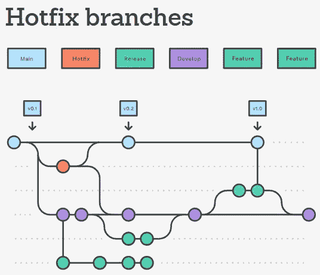
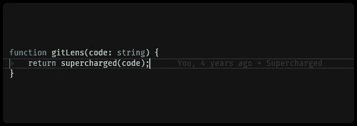
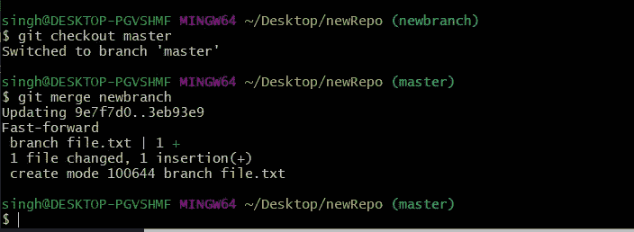
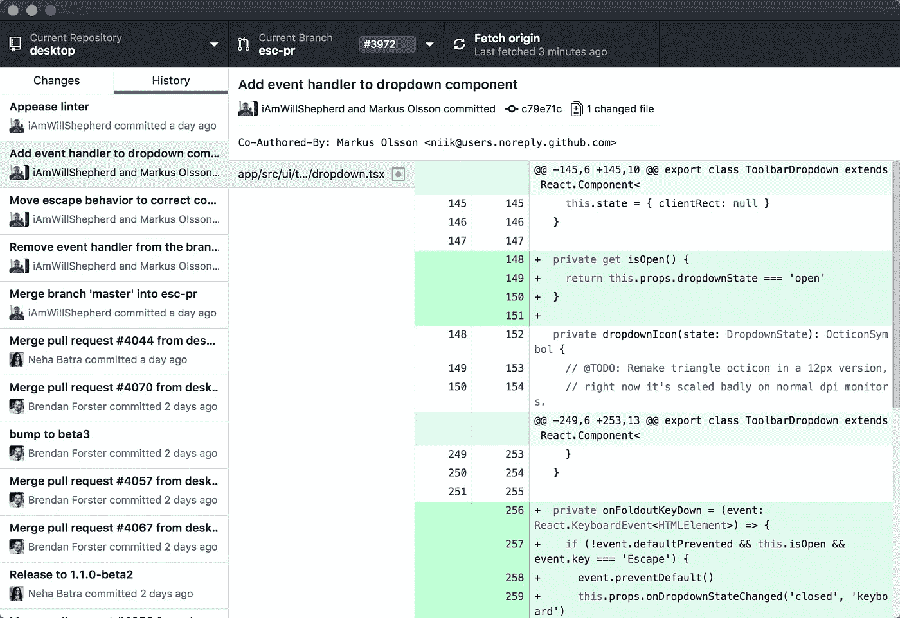

# Git 大师:每个工程团队的无名英雄

> 原文：<https://betterprogramming.pub/git-guru-the-unsung-hero-of-every-engineering-team-23264e3316c3>

## 你能为自己做的最大的事情就是成为这个人


照片由 [Obi - @pixel6propix](https://unsplash.com/@obionyeador?utm_source=medium&utm_medium=referral) 在 [Unsplash](https://unsplash.com?utm_source=medium&utm_medium=referral) 上拍摄

我参加过许多不同的软件工程团队，总是有一种技能将专业人员和业余人员区分开来。在危机时刻，当错误的代码交付到产品中，而您需要恢复到两天前的代码版本时，您会向谁求助呢？

你不会求助于拥有最强 Python 技能的开发人员或负责部署代码的 DevOps 工程师。不，你可以求助于最优雅和最有效地处理这个版本控制问题的人:Git 大师。

那么，一个人如何成为 Git 大师呢？你很幸运，在我的软件开发生涯中，我已经成长为这个角色，并且在这里与你分享我的学习。

# 目标

了解 Git 能力的重要性以及如何成为组织中的佼佼者。

# 目录

```
[The Importance of Git](#d76e)
[Establishing and Understanding Gitflow](#8741)
[Git Tools & Resources](#d566)
[Becoming the Git Guru](#cd02)
```

# Git 的重要性

不管我们喜欢与否，版本控制将永远是软件开发的一部分。这可能会令人困惑和沮丧，但最终，大规模构建软件是必要的。我们会复制粘贴代码，然后把它发送到我们队友的邮箱里，而不需要它。恶心！

Git 是传奇人物 Linus Torvalds 在 2005 年开发 Linux 内核时发明的。为了让其他开发人员以一种简化和有组织的方式为他的项目贡献源代码，Git 诞生了。

从那时起，Git 已经发展成为最广泛采用的版本控制系统，所以如果你在任何软件开发团队中工作，你很可能会使用 Git。

# 建立和理解 Gitflow

虽然不可否认 Git 是一项重要的技能，但是在您的组织中拥有一个经过深思熟虑的 Gitflow 工作流也是非常重要的。如果您的团队不存在这种情况，请尽快这样做。当您开始进行每月、每周和每天的部署时，它将为您省去许多麻烦。

我所说的有一个可靠的和已建立的 GitFlow 是指创建一个图表来说明代码从本地开发环境到生产的流程。下面是一个例子，如果你对这个概念不熟悉，我强烈推荐你通过[的链接](https://www.atlassian.com/git/tutorials/comparing-workflows/gitflow-workflow)阅读:



图片来自[https://www . atlassian . com/git/tutorials/comparising-workflows/git flow-workflow](https://www.atlassian.com/git/tutorials/comparing-workflows/gitflow-workflow)

要想在多个团队参与的情况下成功完成预定的发布周期，Gitflow 是您最好的选择。

# Git 工具和资源

开发人员社区做了出色的工作，为我们提供了成功使用 Git 所需的所有工具。此外，VSCode 提供了许多扩展和内置功能，使得解决合并冲突变得非常容易。

## GitLens — Git 增压

GitLens 可能是我最喜欢的 Git 工具，它以 VSCode 扩展的形式出现。因此，每当一个开发者在一次同行编程会议上分享他们的屏幕，而我没有看到 GitLens 扩展在使用，我会立即让他们安装它。

GitLens 是可视化代码创作的游戏改变者。它提供了一种方法，通过下面可以看到的当前行责备特性，可以准确地看到是谁写了哪几行代码(请参见 return 语句右侧的褪色文本)。



图片来自 [VSCode Marketplace](https://marketplace.visualstudio.com/items?itemName=eamodio.gitlens)

这个扩展的主要用途是当麻烦出现时，你需要知道该责怪谁，但是我发现这个扩展最有价值的部分是知识转移。

GitLens 可以让你看到是谁在什么时候写了这一行代码。因此，对于不熟悉代码库的人来说，很容易看到谁写了什么，并很快找到那个人。

## 饭桶狂欢

从很久以前开始开发软件开始，我就一直在使用 Git Bash(一个 Windows 命令行应用程序)。因为 Git 是用于 Unix 风格的环境，所以这个应用程序是对 Windows 用户的模拟。Git Bash 允许用户从命令行直接与存储库和 Git 元素交互。

许多开发人员已经开始通过 GUI 客户端执行所有 git 命令。然而，在使用这样的客户端之前，理解正在发生的事情是很重要的，我仍然更喜欢它而不是 GUI 客户端。



图片来自 https://www.geeksforgeeks.org/working-on-git-bash/

另外，您可以通过从终端运行几个 git 命令来展示您的命令行技巧；).

## GitHub GUI 客户端

我喜欢使用的另一个工具是 GitHub 桌面应用程序。我一直是 Git bash 的忠实用户，但有时有一个 GUI 客户端来可视化差异会有所帮助。尤其是在大型团队中工作时，需要滚动查看以前的提交以找到旧的更改(应该或不应该在那里)，GitHub 使这变得非常简单。



图片来自 [GitHub](https://desktop.github.com/)

GitHub GUI 客户端的美妙之处在于，不管您使用的是什么远程存储库，它都可以工作。我曾在使用 GitLab、BitBucket 和 GitHub 的团队中工作过，它们的工作原理是一样的。

# 成为 Git 大师

您应该熟悉几个 git 概念和流程:

*   [git 拉取/添加/提交/推送](https://education.github.com/git-cheat-sheet-education.pdf) (git 备忘单)
*   [编写有效的提交消息](https://gist.github.com/robertpainsi/b632364184e70900af4ab688decf6f53)
*   [Git 与 JIRA 的互动](https://rozdoum.com/blog/why-should-you-integrate-git-with-jira.html)
*   [分支](https://www.gitkraken.com/learn/git/best-practices/git-branch-strategy)
*   [解决合并冲突](https://docs.github.com/en/pull-requests/collaborating-with-pull-requests/addressing-merge-conflicts/resolving-a-merge-conflict-using-the-command-line)
*   [设计 Gitflow 以帮助简化您组织的部署](https://www.atlassian.com/git/tutorials/comparing-workflows/gitflow-workflow)

对于成为一个有经验的 Git 用户，我最大的建议是熟悉我推荐的工具和资源——并进行实践。我发现拥有 Git 的最优秀的人都有被卡住的历史，并且一直坚持到被解开。

每当同事遇到 git 问题时，我建议和他们坐在一起，直到问题得到解决。接触不同类型的 git 问题越多越好。

与获得任何技能类似，理解其背后的理论并将其应用于实践是至关重要的。因此，我建议每次看到你不理解的单词或概念时，通读一下 [git 文档](https://git-scm.com/doc)。你在 Git 中看到的所有东西都有视频和用户友好的文章。

请记住，当你陷入一个混乱的 git 局面时(相信我，那些时刻会到来)，保持冷静，继续前进。

# 赖安·格里森报道

喜欢你看到的吗？注册媒体阅读我所有的文章！[https://ryan-james.medium.com/membership](https://ryan-james.medium.com/membership)

[](https://medium.com/swlh/a-software-engineers-guide-to-employee-stock-options-4cb0f7830955) [## 第一次收到员工股票期权？读读这个。

### 从非财务角度理解股票期权是如何运作的

medium.com](https://medium.com/swlh/a-software-engineers-guide-to-employee-stock-options-4cb0f7830955) [](https://towardsdatascience.com/solutions-architect-vs-developer-an-aws-certification-breakdown-4a7a28a8d7bd) [## 解决方案架构师与开发人员:AWS 认证细分

### 哪个适合你？

towardsdatascience.com](https://towardsdatascience.com/solutions-architect-vs-developer-an-aws-certification-breakdown-4a7a28a8d7bd) [](/node-js-vs-spring-boot-which-should-you-choose-2366c2f76587) [## Node.js 与 Spring Boot——你该选择哪一个？

### 轻松点。Spring Boot。对吗？没那么快…

better 编程. pub](/node-js-vs-spring-boot-which-should-you-choose-2366c2f76587)