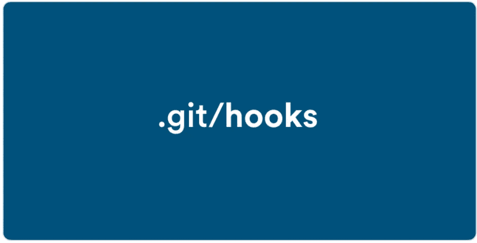

# 使用 Git 钩子运行 Rubocop、Brakeman 和 Rspec

> 原文：<https://betterprogramming.pub/git-hooks-for-your-rails-app-to-run-rubocop-brakeman-and-rspec-on-push-or-commit-ab51cd65e713>

## 确保高质量代码的逐步演练



在本文中，我将介绍如何为您的 Rails 应用程序设置 Git 挂钩，以确保并加强良好的代码质量。假设你已经有了一个 Rails 应用程序，并使用 [Rubocop](https://github.com/rubocop-hq/rubocop) 来保持你的代码整洁， [Brakeman](https://brakemanscanner.org/) 来保持你的应用程序安全， [Rspec](https://rspec.info/) 来运行你的测试用例。

让我们从在应用程序的根文件夹中创建一个`scripts`目录开始:

```
$ cd rails-app
$ mkdir scripts
```

现在，我们将为想要运行的每个命令创建三个不同的 bash 文件，在我们的例子中是 Rubocop、Brakeman 和 Rspec。以下是您可以使用并将其放入脚本文件夹的文件:

脚本/运行-rubocop.bash

脚本/运行-brakeman.bash

脚本/运行测试. bash

您可以在这里用任意多的命令创建任意多的文件。

现在，让我们创建`pre-commit`和`pre-push` bash 文件，我们将用符号链接到钩子所在的`.git`文件夹中:

脚本/预提交. bash

脚本/预推送. bash

接下来，我们想要编写一个 bash 脚本来创建这些文件和钩子之间的符号链接:

脚本/安装钩子. bash

我们需要的所有文件都已创建，但是在我们运行 install-hooks bash 文件来安装钩子之前，我们需要使这些文件成为可执行文件。这是通过以下命令完成的:

```
$ chmod +x scripts/*.bash
```

现在我们准备运行`install-hooks.bash`:

```
$ ./scripts/install-hooks.bash
Installing hooks...
Done!
```

一切都准备好了！尝试提交和推送您的代码。在提交之前，Rubocop 将运行，在推送之前，它将运行 Brakeman 和 Rspec。

如果你有任何问题，请随时通过评论联系我。

目前就这些。快乐编码。