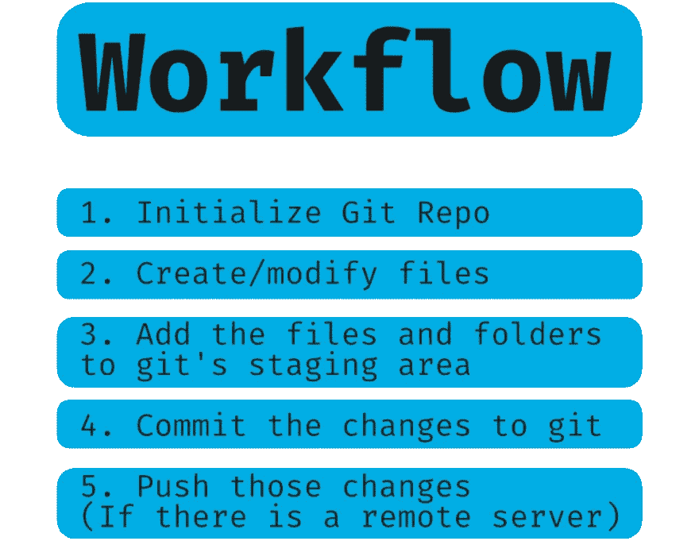

# “Git-ing”开始:Git 简介

> 原文：<https://betterprogramming.pub/git-ing-started-an-intro-to-git-1ec2b0624921>

## 了解什么、为什么和如何做

[https://unsplash.com/photos/vII7qKAk-9A](https://unsplash.com/photos/vII7qKAk-9A)

再说 Git。这是使用 Git 系列的第一篇文章。在这篇文章中，我将解释这些事情:

*   Git 是什么？
*   为什么你应该使用它
*   如何使用。

# Git 是什么？

Git 是“分布式版本控制”，这意味着它跟踪对文件所做的更改，世界上某个地方的远程服务器也有这些更改。一个常见的远程服务器是 [GitHub](https://github.com/) ，我会在下一篇文章中谈到。

基本上，它就像跟踪 Word 中的更改，但对于存储库或文件夹中的文件，这些文件存储在本地，如果需要，可以推送到远程服务器。这些文件可以是任何类型，但它最适合文本文件。

开发人员通常使用它来跟踪源代码中的所有更改，并在项目中进行协作——因为它支持处理项目的不同部分，并将它们合并在一起。由于每台计算机也获得了存储库或项目的完整历史，开发人员也可以回到另一个时间点并在那里进行调整。

这些优势也代表着作为一个单独的开发者，所以让我们来谈谈为什么你应该使用它。

# 为什么你应该使用它？

如果你不在一个团队中，我仍然建议你应该使用 Git，以下是我的理由:

1.  允许您查看所做的更改
2.  允许您在需要时轻松回滚更改
3.  如果使用 GitHub 这样的远程服务器，允许您备份您的开发人员环境

# 如何使用 Git？

我们已经讨论了为什么和什么是 Git，但是你实际上如何使用 Git 呢？比如，你需要什么软件，你是做什么的？

# 首先，下载并安装 Git

来自[git-scm.com](http://git-scm.com/)

这是您需要的唯一“额外”软件，因为 git 可以通过命令行运行

# 工作流程

1.  将 Git 初始化到存储库或项目文件夹中——从现在开始我称它为`repo`
2.  创建和/或修改文件夹和文件
3.  将这些文件和文件夹添加到 git 的暂存区域
4.  将更改提交给 git
5.  如果您有远程服务器，请推送这些更改

这五个步骤都有命令，所以让我们创建一个有 git 的基本网站。

示例:

# 1.为项目创建文件夹

创建一个新文件夹。我将在我的`ptd`文件夹中创建它，但是它可以在你计算机上的任何地方。

# 2.初始化 git

现在，我们将告诉 git 开始跟踪这个文件夹。

1.  打开终端应用程序(或您使用的任何程序)来访问命令行
2.  将您的工作目录更改为您刚刚创建的文件夹
3.  使用`cd`后跟目录路径来改变你的工作目录
4.  `cd developer/git-website`
5.  在终端中，键入`git init`。现在 git 正在做这个回购

# 3.创建一个 index.html 文件

现在，让我们创建一个简单的 index.html 文件，显示“Git 是最好的”，并确保将它保存在`git-website`文件夹中

# 4.暂存文件

由于文件已经创建，我们需要实际告诉 git 跟踪这个文件和文件的当前状态。为此，我们使用命令`git add {file path}`。对于您希望 git 存储的任何更改，都需要这样做。

将 index.html 添加到集结地`git add index.html`。

您可以根据需要对任意数量的文件重复此步骤。

# 5.记录变化

现在，实际上告诉 git 记录通过提交这些文件而添加的更改。提交文件时，必须指定一条消息。

`git commit -m “Adding the index file”`

# 6.推动这些变化

同样，这一步只有在设置了遥控器的情况下才会发生，我们在本文中没有这样做，但在下一篇文章中将会这样做！

推动改变的命令是`git push`。

在整个项目中，你会重复使用`git add`、`git commit`和`git push`，所以要习惯这些命令。

这是 git 是什么、为什么应该使用它以及如何实际使用它的基本知识。

在下一篇文章中，我将讨论添加远程服务器工具，这样您就可以将您的更改推送到远程 repo。

感谢阅读！