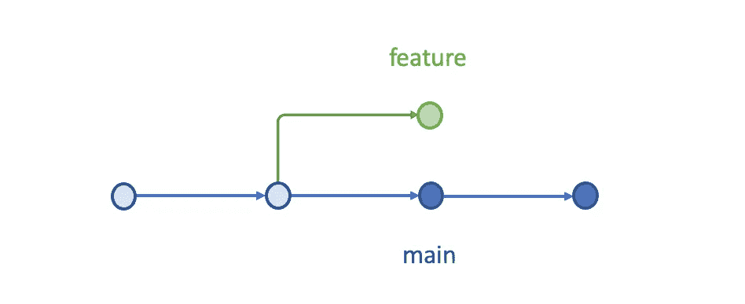
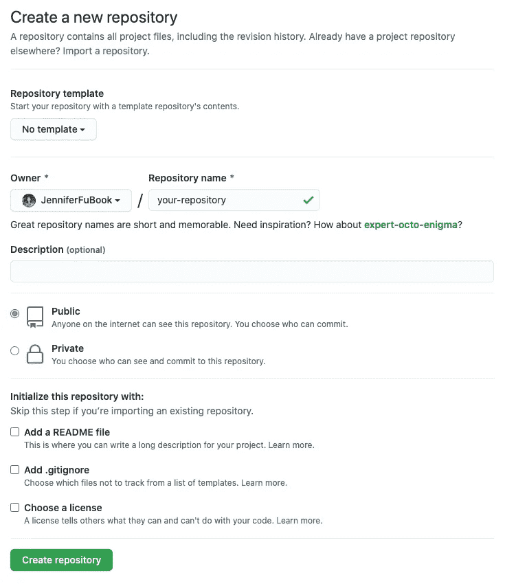
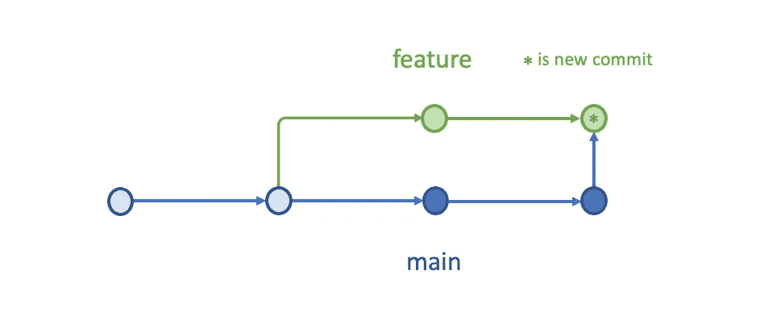
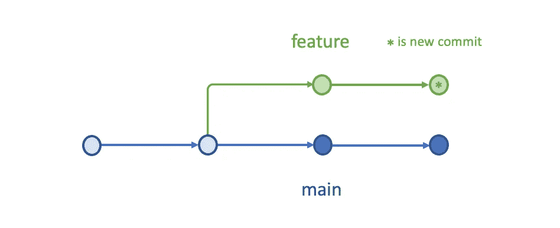
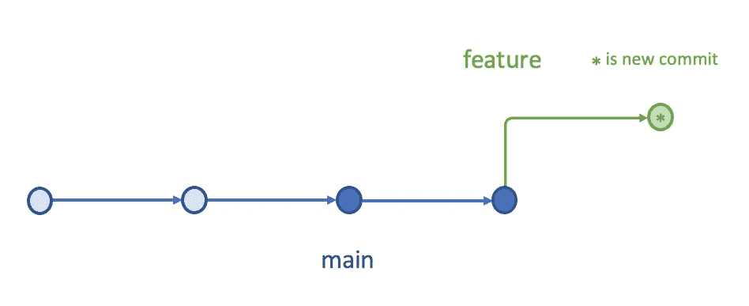

# Git 合并、挤压、重置或拉取——选择什么？

> 原文：<https://betterprogramming.pub/git-merge-squash-rebase-or-pull-what-to-choose-50b331d3e7c1>

## 解决 Git 冲突的分步比较


Paul Steuber 在 [Unsplash](https://unsplash.com?utm_source=medium&utm_medium=referral) 拍摄的照片

Git 是一个版本控制系统，它跟踪文件的变化。随着大量软件开发人员在不同的分支工作，合并每个人的工作并解决冲突成为一个持续的挑战。

在前一篇文章中，描述了 Git 引用、提交和分支。在一些 Git 命令的帮助下，我们演示了如何从合并混乱中恢复。

在本文中，我们将使用示例来展示如何使用合并、挤压、重定基础和拉的选择来避免合并混乱。

# 冲突案例

我们创建了一个有冲突的存储库，可以通过以下命令克隆它:

```
$ git clone [https://github.com/JenniferFuBook/git-merge-conflicts.git](https://github.com/JenniferFuBook/git-merge-conflicts.git)
```

存储库中有两个分支，`main`和`feature`。

正如我们在上一篇文章中所指出的，`git log —-graph`在输出的左侧绘制了提交历史的基于文本的图形表示。每个`*`代表一个提交，`*`下的进入行代表父提交。多个传入行表示合并，而传出行标记一个共同的祖先。

`--all`选项列出了所有分支的历史。

`feature`分支`main`后，都修改了`file.txt`(14 线和 8 线)。当`feature`与`main`同步时，它得到两个变化:

*   `main`创建的`newFile.txt`(第 2 行):没有冲突。
*   `file.txt`即`main`变化(第 8 行):有冲突。

我们现在的情况是`main`和`feature`随着新的变化出现分歧。



我们有许多解决冲突的方法。让我们来探索和比较这些选项。

# Git 合并

`git merge`不对存储库历史进行任何更改。它只是为合并创建了一个额外的提交。

## 第一步。克隆存储库

克隆冲突存储库:

```
$ git clone [https://github.com/JenniferFuBook/git-merge-conflicts.git](https://github.com/JenniferFuBook/git-merge-conflicts.git)
```

使用我们的示例存储库，您可以遵循几乎所有的步骤。推送至远程将失败，因为您未被授予合并权限。但是，您仍然可以探索本地分支上的所有内容。

这是可选的，但是您可以在`https://github.com/<your-repository>`创建一个 Git 存储库。



重置您克隆的存储库的上游，并推入所有代码。

有了自己的存储库，本文中的每一步都可以按原样执行。

## 第二步。执行合并

第 4–6 行显示了冲突，它们可以通过`git status`进行验证:

以下是矛盾的`file.txt`:

## 第三步。解决冲突

我们手动解决冲突:

准备并提交变更:

## 第四步。将合并推送到远程

运行`git push`，然后这个解析被推送到一个远程库。

## 第五步。检查合并历史

现在我们可以看到最终的变更被推送到 [git-merge 存储库](https://github.com/JenniferFuBook/git-merge)。

上面基于文本的图形表示展示了额外的合并提交`cf1129a756bd0f2ef1641e4f5fd4c65684286ffa`(第 2 行)。

下面是提交历史的概念图。



# Git 南瓜

在 Git 合并中，每次合并都会生成一个额外的提交。更频繁的合并会有更多的额外提交，这可能很烦人。

`git merge`有一个选项`--squash`。它产生工作树和索引状态的方式与真正的合并相同，但是合并历史被丢弃了。

除了以下几点之外，前面的五步合并是相同的:

## 第二步。使用挤压执行合并

```
git merge --squash origin/main
```

## 第五步。检查合并历史

最终的变更被推送到 [git-squash 库](https://github.com/JenniferFuBook/git-squash.git)。

上面基于文本的图形表示展示了额外的合并提交`8fe1ca0b47100ad13cf577efe364e2c3aed69008`(第 2 行)。提交看起来像是在`feature`上的普通提交。它将 main 上的提交(第 20 行和第 14 行)压缩成一个提交，并且没有来自`main`的提交路径。

`git merge --squash`改变提交历史，但产生更干净的历史。似乎所有的发展都只发生在`feature`。

这种策略经常在合并拉请求时使用——从`feature`合并到`main`。我们的例子是反方向的，虽然概念是一样的。在某种程度上，在特性分支上有多少个合并提交并不重要。当用 squash 将它们合并到主分支中时，它将所有的特性开发显示为一次提交。

下面是提交历史的概念图。



# Git Rebase

`git rebase`更改提交历史，但是通过将`feature`移动到`master`的顶端来创建线性历史。

## 第一步。克隆存储库

## 第二步。执行重置基础

第 4–6 行显示了冲突，它们可以通过`git status`来验证:

`git rebase`输出和`git status`都列出了三个选项:

1.  修复冲突，然后运行`git rebase —-continue`。
2.  使用`git rebase —-skip`跳过这个补丁。
3.  使用`git rebase —-abort`检查原始分支。

我们正处于重建基础的过程中:

不允许留下未完成的基础。

## 第三步。解决冲突

我们必须在三个选项中选择一个。选择选项 1 来手动解决冲突:

准备并提交变更，并完成基础变更。

## 第四步。将重置基础推至远程

我们已经准备好了。

发生了什么事？

是否应该按照输出中的建议去拉？

上面的输出清楚地表明这个建议是误导性的。

执行 rebase 命令后，远程分支不能快进到合并提交。`git push --force`是 rebase 所必需的。

转到 [git-rebase 库](https://github.com/JenniferFuBook/git-rebase)。现在，重定基础的结果被推送到远程存储库。

## 第五步。检查重置基础历史记录

检查重置基础历史记录:

上面基于文本的图形表示显示了漂亮的线性提交路径。从`main`(第 8 行)的顶端开始，`branch`上的提交被重写为`ba4c3fbd670c08f30d7a16371719a81714ea8899` (第 2 行)。rebase 不是创建额外的合并提交，而是通过为原始分支中的每个提交创建全新的提交来重写项目历史。最初的提交`d64444a78401995781a3efce9ab250d43c19a022`被替换为`ba4c3fbd670c08f30d7a16371719a81714ea8899`。

下面是提交历史的概念图。



Rebase 将`main`中的所有提交移动到`feature`的顶端。对于私人分行来说是可以的。然而，如果这个分支被仍在使用最初的`main`的开发人员共享，带有全新提交的重基础分支会让 Git 认为你的`main`分支的历史已经与其他人的历史不同。

因此，rebase 的黄金法则是永远不要在公共分支上使用它。

# Git 拉

`git pull [<repository>] [<reference>]`从另一个存储库或本地分支获取并与之集成。在默认模式下，`git pull`是`git fetch`后跟`git merge FETCH_HEAD`的简写。

`git fetch`用`<repository>`的`<reference>`更新，在我们的例子中是远程跟踪分支。它将远程提示临时保存到`FETCH_HEAD`。随后的合并或重定基础发生在引用上，`FETCH_HEAD`。

## 三种拉动策略

克隆我们的示例存储库并执行`git pull`。

提示显示有三种策略可以执行`git pull`:

1.  `git pull —-no-rebase`(默认策略)
2.  `git pull —-rebase`
3.  `git pull —-ff-only`

`git pull origin main`执行默认策略，与`git pull —-no-rebase origin main`相同。也和`git merge origin/main`一样。

如果继续下去，结果将与上面 Git 合并一节中描述的一样。

让我们退出与`git merge —-abort`的合并。

使用 rebase 尝试第二种策略:

如果继续下去，结果将与 Git Rebase 一节中描述的一样。

让我们用`git rebase —-abort`退出 rebase。

只看第三个策略快进。

`git pull` 有三个设置来指定如何处理合并:

*   `—-ff`是默认设置。如果可能，它只快进分支指针以匹配合并的分支(不创建合并提交)。当这不可能时，它创建一个合并提交。
*   `—-no-ff`在所有情况下都创建合并提交，即使合并可以被解析为快进。
*   `—-ff-only`尽可能将合并解析为快进。当这不可能时，它拒绝合并并以非零状态退出。

`git pull —-ff-only`是最安全的选择。当 pull 命令失败时，您可以决定使用哪种方法来解决冲突。

## Git 配置

`git config`可用于获取和设置存储库或全局选项。这是我们的默认设置:

您可以选择三种拉策略之一，将其设置到配置文件中:

1.  `git config pull.rebase false` #合并(默认策略)
2.  `git config pull.rebase true` # rebase
3.  `git config pull.ff only` #仅快进

通过配置设置，`git pull`将按照配置执行策略。

您也可以运行`git config —-unset pull.rebase`或`git config —-unset pull.ff`将其从配置文件中移除。

# 结论

要解决合并冲突，您可以从`git merge`、`git merge --squash`、`git rebase`或`git pull <option>`中选择。

你的偏好是什么？

感谢乌里扬·张、戈塔姆·穆塔和悉达多·钦塔帕利与我一起尝试这些选项！

感谢阅读。我希望这有所帮助。你可以在这里看到我的其他媒体出版物。