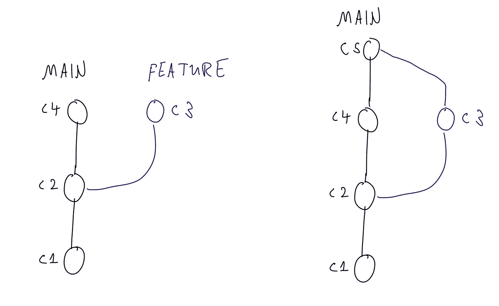
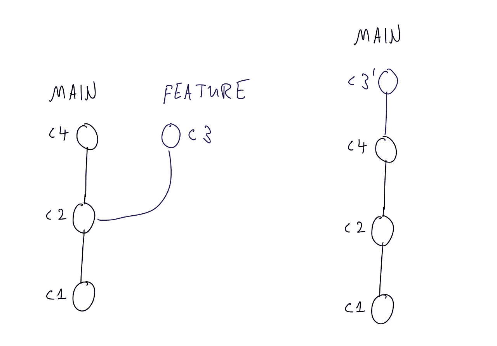
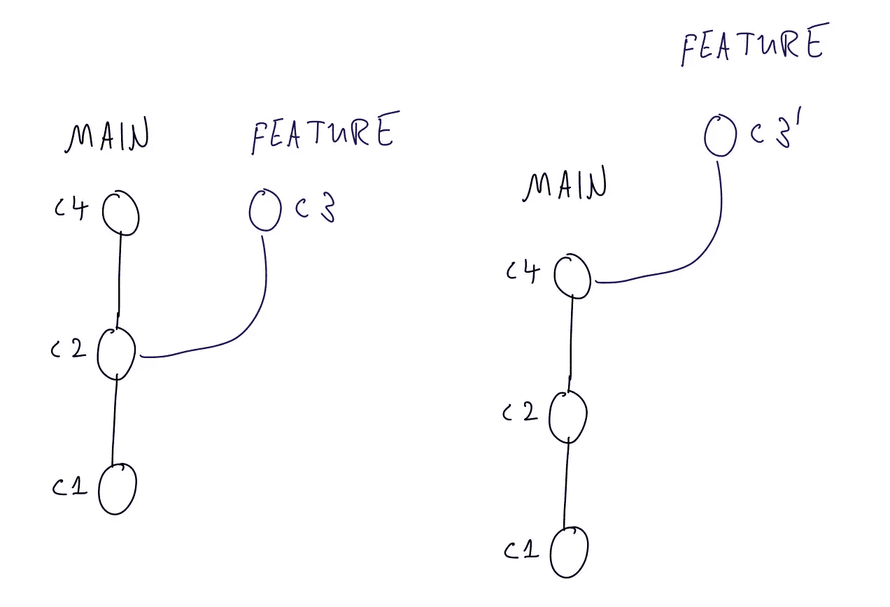
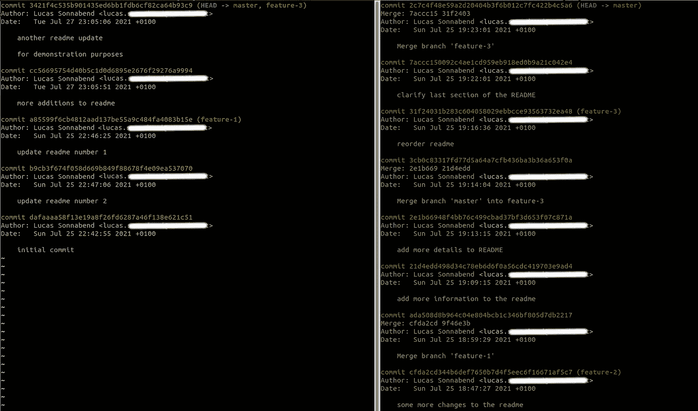
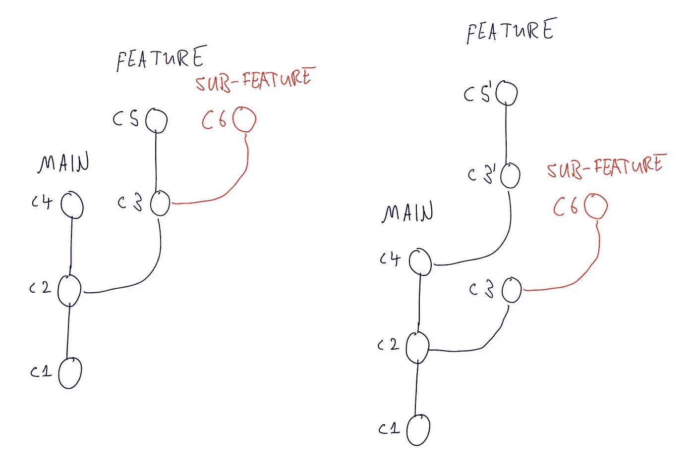
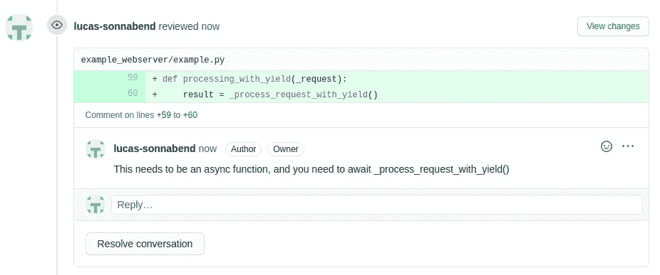

# Git 合并与 Git Rebase 工作流:哪个更好？

> 原文：<https://betterprogramming.pub/git-merge-vs-git-rebase-workflow-which-is-better-47511fba0a6a>

## 以及为什么我们的团队选择合并而不是重置基础

阿克塞尔·瓦兹奎在 [Unsplash](https://unsplash.com?utm_source=medium&utm_medium=referral) 上拍摄的照片

最近我在工作中进行了一次讨论:我们开始了一个新项目，一个新团队，和一个新的 git 库。每个开发人员开发一个特性分支，这个分支将被同事们评审，用来自`main`分支的最新变化进行更新，并最终包含在`main`中。那么，我们可以使用什么过程来充分利用 git 呢？

我们讨论的两个选项是关于合并和重定基础的工作流。在这篇文章中，我捕捉到了一些我们曾经有过的争论，并阐明了这些工作流的优势。

已经有[资源可以比我更好地解释合并和重定基础](https://www.atlassian.com/git/tutorials/merging-vs-rebasing)，所以我将总结这些资源，并为讨论差异和优势打下基础。最后，我将分享为什么我们的团队决定使用合并而不是重定基础，以及为什么你可能会为你的项目做出不同的决定。

但是让我们首先提醒自己，在合并和重定基数的过程中到底发生了什么。

# 合并要素分支

将特征分支合并回干管之前和之后

当您`git merge`您的特性分支时，您创建了一个单独的合并提交(上图中的 C5)。这在提交之间创建了一个偏序。就我们而言，C4 和 C3 之间没有直接关系。从非数学的角度来说，git 历史不会假设哪个提交先出现。

# 重置基础干线

将特征重置为主特征之前和之后

当重置基础时，你实际上做了两件事:首先，你`git rebase`在`main`之上的特征分支，然后你`git merge`特征分支进入`main`。

该合并是所谓的[快进合并](https://git-scm.com/docs/git-merge#_fast_forward_merge)，因此不需要创建合并提交。与基于合并的工作流相比，我们在`main`中以完全线性的 git 历史结束。C4 出现在 C3 面前，因为他们是按到达梅恩的时间顺序排列的。

# 将更新合并到要素分支中

将主分支合并到特征分支之前和之后

当您处理您的特征分支时，您周围的世界不会停止。`main`分支可能已经转移了，您想在您的特性分支中包含最新的变化。

使用`git merge main`您将完全做到这一点，这一次在您的特性分支上创建一个合并提交 C5。任何冲突通常都将作为合并提交的一部分得到解决。

# 将特征分支重置到主分支上

将特征支管重设基础之前和之后

将最新的`main`修改为`git rebase`很简单，因为这是将基础修改为`main`的第一步。不过，有一个问题。

因为特性分支中的提交被重定了基，所以提交散列将会改变(这就是为什么在图中它现在被称为`C3``，而之前它是`C3`)。这本身没关系，但是如果有其他东西引用了`C3`，你就有麻烦了。

要在远程存储库上推送更新的特性分支，您需要强制推送您的更改，这可能会覆盖同时进行的其他更改。

# 重定基数的优势

重置基础归结为两件事:首先，您允许“重写”特征分支的历史。当您将您的特性分支重置到最新的 main 上时，您的更改的提交散列将会改变。

您可能还需要修复冲突，这些修复将包含在您过去的提交中。这使得更改接近解释它们的提交消息。

*git rebase 允许你重写特性分支的历史。*

一旦你开始重写你的 git 提交(使用`[git commit --amend](https://git-scm.com/book/en/v2/Git-Tools-Rewriting-History)` [或](https://git-scm.com/book/en/v2/Git-Tools-Rewriting-History) `[git rebase -i](https://git-scm.com/book/en/v2/Git-Tools-Rewriting-History)`，你也将有机会重写和完善你的提交消息。Chris Beams 提供了一个明确的关于编写良好提交消息的指南。但是没有人是完美的，我不期望任何人第一次就能得到正确的提交消息。现在，我们刚刚为自己赢得了一个改善它们的机会。对于代码评审来说更是如此。

您可以在原始提交本身中进行这些更改，而不是用“地址注释”或“修复测试”这样的消息在提交后创建提交。

第二，当你更新`main`时，你把你的历史串联成一个线性顺序。一旦变更在`main`中，所有提交就有了一个总的顺序。我阅读历史的`main`方式是滚动和搜索日志。

当提交被序列化时，这就简单多了。当我查看一个提交时，我知道在那个提交之前的每一个提交都到达了之前的`main`，以及在那个提交之后的所有内容。

作为一个小陷阱，提交是按照它们到达`main`的时间排序的，而不是按照创建的时间，这可能是不同的。我从来不太关注创建时间，但是如果你的工作流依赖于它，那么你至少要小心。

git rebase 在 main 中生成了一个很好的序列化历史。

git 日志，带有 rebase 工作流(左)和合并工作流(右)

当你遵循 [**保持主绿**](https://kevincox.ca/2020/08/15/git-green-ci/) 的规则时，调整基线也是很自然的事情。

总之，不是在您的分支上运行 CI 测试，然后合并，而是在`main`之上重新调整您的变更，运行测试，并在成功时合并。这是用自动化机器人最容易做到的，如 [Bors](https://bors.tech/) 或 [Marge](https://github.com/smarkets/marge-bot) 。

使用 rebase 工作流的最后一个优点是，它消除了大量的合并提交，这些提交会使历史变得混乱，并且很难看出为什么代码被更改了。

例如，我在 VS 代码中使用 GitLens，当我不太明白一段代码在做什么时，我会寻找 commit 消息作为指导。我最不希望看到的就是一个“合并分支‘特征-xzy’”作为我唯一的参考。

# 重置基础时的一句警告

重定基础有一个重要的警告，以至于 Atlassian 称之为[黄金法则](https://www.atlassian.com/git/tutorials/merging-vs-rebasing) : **不要重定公共分支**。

对此，我反驳道:你什么时候想把一个部门上市？在他们的例子中，公共分支是一个被推到远程存储库的分支。他们是对的，如果你将你的特性转移到`main`上，而其他人正在处理它，这将导致一个难以解决的混乱。

但这真的取决于你的团队、公司或一般贡献者之间的合作规则。如果没有人编辑您的特征分支，除非他们明确地与您协调，那么不会发生任何不好的事情。

我以前用过这种设置，从来没有遇到过问题。如果其他人依赖于它，它也鼓励快速地将变化带入`main`。

*不要改变或重写你合作的分支机构的历史。*

这延伸到另一个用例。如果您有一个长期运行的特性分支，并且您开始基于它创建子特性分支，那会怎么样呢？

我的建议是:不要这样做。

你将花费越来越多的时间来更新你的所有分支，而不是写代码。但是让我们假设你发现自己处于这种情况。当您将特征分支重置到`main`上时，会发生以下情况:

重置具有特征分支的特征分支

如您所见，子特性分支仍然引用了被放弃的提交 C3。那么，如果您将子特性分支重置到`main`上会发生什么呢？

不幸的是，这要看情况。如果 C3 和 C3 '有完全相同的变化，git 会很好地解决这个问题，并且特性分支会看起来像这个`C4 -> C3` -> C5` -> C6`。

但是如果你不得不在`main`的基础上解决冲突。你以`C4 -> C3` -> C5` -> C3 -> C6`结束。您可以使用[交互式重定基础](https://git-scm.com/book/en/v2/Git-Tools-Rewriting-History)来删除某些提交来解决这个问题，但是这很复杂，需要对 git 有深入的了解。

这让我们回到我的建议:尽可能避免它！

# 合并的优势

从重定基础的陷阱中，让我们迅速转向合并的优势。通过合并，您可以保留准确的提交。

它鼓励您不要在您的特征分支中重写历史。相反，您总是在其上添加新的提交或合并提交。

*当你从不改变特性分支中的 git 历史时，git 合并工作得很好。*

你不需要一条金科玉律来告诉你不要做什么，它让分支机构之间的合作变得更加容易。

例如，您将永远不需要强制向上游推送，因此您不会覆盖其他人的更改。如果您的同事在没有与您协调的情况下对您的特征分支进行更改，这一点很重要。这是否有用真的取决于你如何合作。

合并在审查拉取请求时也非常有效。如果您总是添加到您的功能分支，您可以通过提交来查看 PR。

在第一次审阅和后续更改之后，您可以只审阅自那以后发生的更改。在重写提交的工作流中，这是不可能的。

*GitHub 上的评论最好使用基于合并的工作流*

GitHub 还提供了一种非常有用的方式来评论浏览器界面中的 pull 请求。这些注释在提交时连接到文件中的一个行号。

因为 rebase 重写了分支中的提交散列，所以注释变成了悬空指针，引用了不再存在的提交。

当您使用 merge 来更新您的分支时，您的注释会一直指向它们所引用的代码。

引用提交中某行的注释。换个底就没了！

与重定基础不同，基于合并的流程具有较少的缺陷。我已经提到了它是如何避免重定基础的黄金法则的需要的。

另一个警告是关于特征分支的。我建议不要这样做，这仍然有效，但是至少对于基于合并的流程来说是有效的，并且您不会以重复提交而告终。

并且陷阱更少，您和您的团队可以遵循工作流，而不需要对 git 有很深的理解。

# 从这里去哪里

照片由 [Rosie Steggles](https://unsplash.com/@rosiefoto13?utm_source=medium&utm_medium=referral) 在 [Unsplash](https://unsplash.com?utm_source=medium&utm_medium=referral) 上拍摄

既然我们看到了两种方法的优点，那么“使用哪种工作流”的问题就变成了对你、你的团队和你的组织来说什么更重要。

每个开发人员都从事他们自己的功能分支，还是其他人也参与其中？变化进入`main`的速度有多快？你有多重视有描述性提交的干净历史？你从 GitHub 的公关评论功能中获得了多少？

*我们使用基于 rebase 的合并，因为我们想让公关审查尽可能简单。*

最后，我们的团队决定采用基于合并的工作流程，因为我们希望让公关审查尽可能简单。

我们将更改合并到`main`中，因为它是 GitHub 中的默认设置。当您处理您的功能时，每个开发人员可以选择他们喜欢的工作流，直到他们创建一个 PR。然后我们总是把`main`并入其中。

它类似于 Atlassian 的黄金法则，但我们将 public 定义为“我们为它创建了一个 PR。”由于我们目前是一个小团队，我们通过只允许包含最新`main`和通过 CI 的合并来保持`main`绿色。这不是一个可以扩展的东西，但它是一座我们必须跨越的桥梁。

# 两全其美？

你可能会问自己，为什么我们一定要选择其中一个，或者我们可以两者兼得？

我能想到一种结合两种优势的方法。您在开发和代码审查时使用基于合并的工作流，并且您可以增量地这样做——而无需重写历史。

一旦准备好进入`main`，你就可以把所有的事情都压缩到一个提交中，你可以把它快进到 main 中。快进会阻止合并提交，从而产生一个连续的 git 历史记录。

在最后的挤压过程中，您还可以进行最后的检查来润色您的提交信息。不幸的是，在大多数团队中，倾向于至少有一个人强烈反对压制 pr，这种讨论为单独的帖子提供了足够的材料。

我还没有调查 GitHub 和 GitLab 或 bors 之类的机器人对此的支持程度。

# 最后的想法

这种比较没有确定的赢家；这完全取决于您希望如何在存储库中进行协作。现在，您知道了要问什么问题，以及为您的团队找到最佳工作流程需要做哪些权衡。

## 资源

*   [Atlassian 比我更好地解释了 git 合并和 rebase 的技术细节](https://www.atlassian.com/git/tutorials/merging-vs-rebasing)
*   [git 参考与书籍](https://git-scm.com/doc)
*   [Chris Beams 提交消息终极指南](https://chris.beams.io/posts/git-commit/)
*   [保持主绿色](https://kevincox.ca/2020/08/15/git-green-ci/)
*   [优步关于保持绿色的博文](https://blog.acolyer.org/2019/04/18/keeping-master-green-at-scale/)
*   [用于 GitHub 的 Bors 合并机器人](https://bors.tech/)
*   [git lab 的 Marge 合并机器人](https://github.com/smarkets/marge-bot)