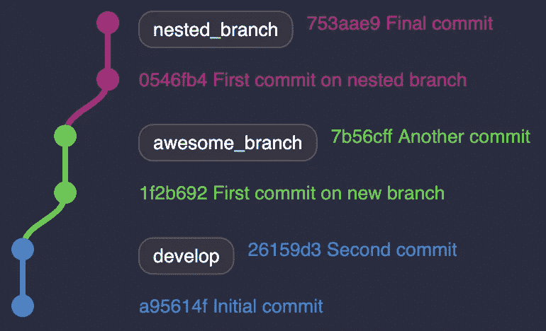
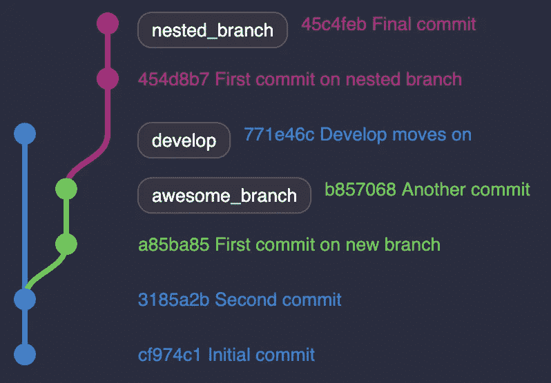
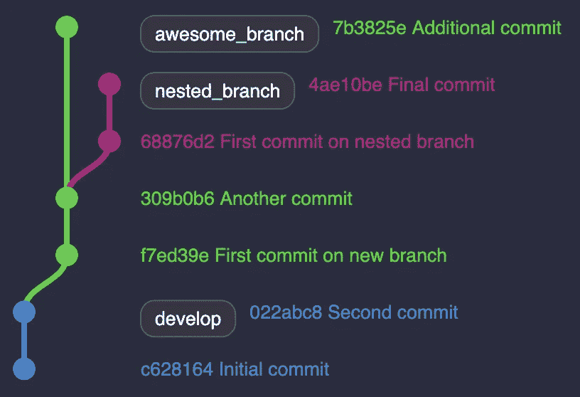
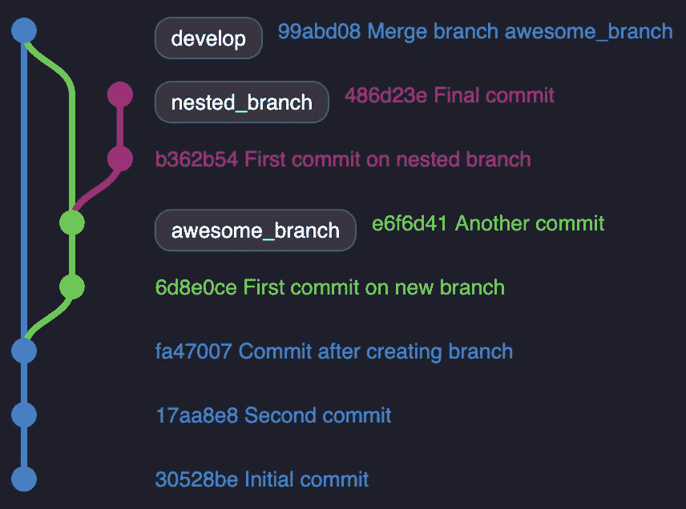
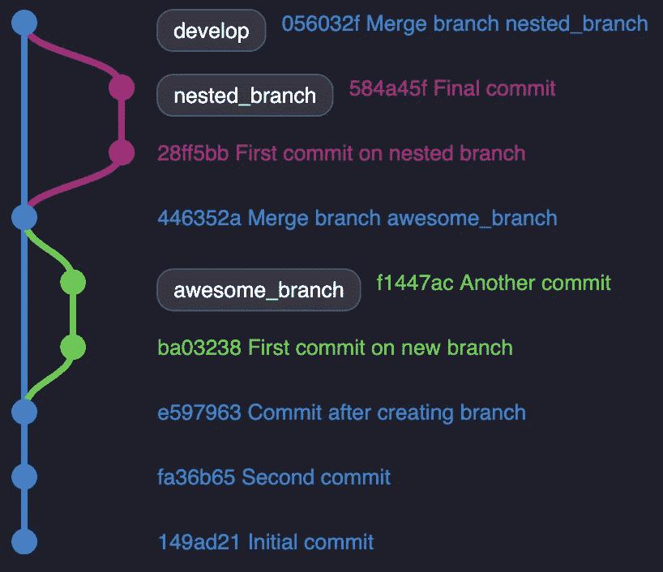

# 嵌套分支的 Git Rebase

> 原文：<https://betterprogramming.pub/git-rebase-for-nested-branches-7a6bbb4a6688>

## 如果重置基础变得乏味，你可能做错了


大卫·科瓦连科在 [Unsplash](https://unsplash.com?utm_source=medium&utm_medium=referral) 上拍摄的照片

理解 Git rebase 花了我一些时间。就在我对自己的技能建立信心的时候，我发现，有时候，有些人会感觉不舒服。我经历了痛苦的冲突。有些甚至不应该发生！

更糟糕的是，我不知道为什么特别是那些 rebases。很有可能，我做错了什么。

# 嵌套分支问题

首先，我建议查看我以前的文章，以便更熟悉 Git rebase:

[](https://medium.com/better-programming/dont-fret-with-git-rebase-75fe3ed5ca8f) [## 不要为 Git Rebase 烦恼

### 无论你的队友会告诉你什么，重新构建 Git 分支都是一件轻而易举的事情

medium.com](https://medium.com/better-programming/dont-fret-with-git-rebase-75fe3ed5ca8f) 

我将借此机会扩展那篇文章的例子。假设我的下一个任务需要`awesome_branch`的内容，我将需要从它创建一个分支。我把它叫做`*nested_branch*` *。*



我的目标是把`awesome_branch`和`nested_branch`合并成`develop`。在我这样做之前，我的其他分支可能已经转移了。我可能会面临以下情况之一:

*   `develop`进化了，使得`awesome_branch`和`nested_branch`都落后于`develop`。
*   在`awesome_branch`上发生了一些事情，需要新的提交。



(1)对(2)

(1)要求我在进一步操作之前将`awesome_branch`重置为`develop` 。与`nested_branch`和`awesome_branch`之间的(2)相同。

这两种情况最终都不会成为合并`awesome_branch`的问题。合并`awesome_branch`后再跟进(1):



如果我想将`nested_branch`合并到`develop`中，我必须首先对其进行重组:

```
$ git fetch --all
$ git rebase origin/develop nested_branch
```

当我正在解决我的矛盾时，感觉有些奇怪。我怀疑我必须修复在`develop`上重置`awesome_branch`时遇到的相同问题。

我可以再次解决它们，把事情做好。但是如果你像我一样珍惜时间，就和我在一起吧。结果是我在 Git rebase 失败了，而不是相反。

# 重新基于任何分支

把`nested_branch`换成`develop`*你可能注意到了`nested_branch`离开`awesome_branch`。简单地重新设定`develop`可能会产生意想不到的结果。*

*幸运的是，Git 提供了一个将分支**转换为任意分支的选项。您只需要找到一个特定的提交散列。***

**记住:重置基础仅仅是将一堆提交转移到一个特定的目标。**

*仔细看看上面的树。我们在寻找第一次提交，在这里`nested_branch` 开始。它匹配提交散列`e6f6d41`。*

*如果像我一样，您喜欢使用命令行，您可以使用`git log —-graph`。该命令为您提供了一个可视化的彩色图表。您可以发现您的分支离开的位置，以及选择提交散列。*

*让我们使用`--onto`选项再试一次:*

```
*$ git fetch --all
$ git rebase --onto origin/develop e6f6d41 nested_branch*
```

*该命令将把提交散列`e6f6d41`中的`nested_branch` 重置为`develop`。*

*运行它，祝贺你自己！不再有以前修复的冲突！现在我可以把`nested_branch`合并成`develop`。*

*让我们看看最后一棵树:*

**

*由嵌套的树枝构成的线形树*

# *技巧*

*有了 [ohmyzsh](https://github.com/ohmyzsh/ohmyzsh/wiki/Cheatsheet) 别名，重设基础甚至更快:*

```
*$ gco nested_branch                  // checkout your branch
$ gfa                                // fetch all branches
$ glgg                               // retrieve the hash commit
$ grb --onto origin/develop 849b03a  // rebase onto develop
$ gp -f                              // push force your local branch*
```

*感谢阅读！我希望我已经为你节省了一些时间和痛苦！*