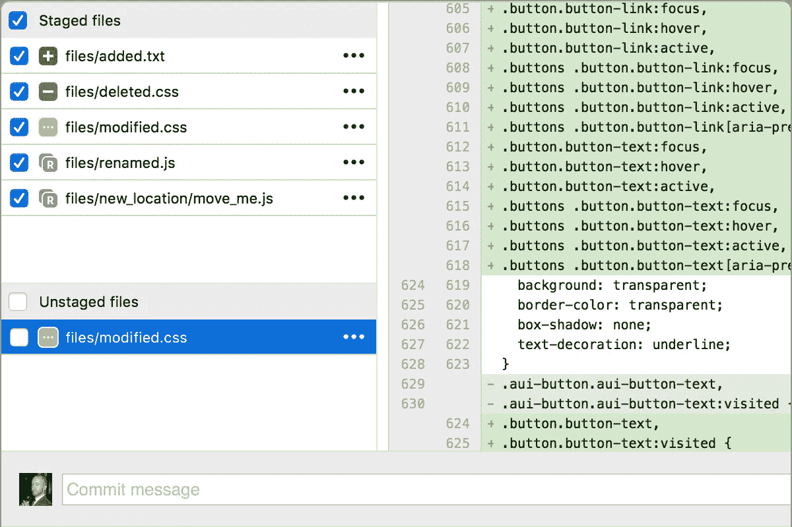
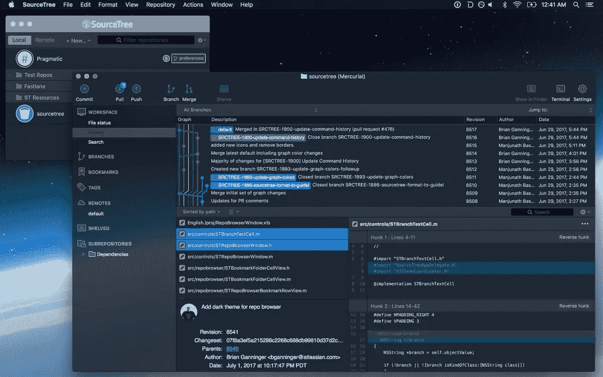

# 如何在 Mac 上设置 Git

> 原文：<https://betterprogramming.pub/git-setup-like-a-pro-67bc3fe86fd1>

## 设置一次，它应该永远工作


帕特里克·沃德在 [Unsplash](https://unsplash.com/s/photos/imac?utm_source=unsplash&utm_medium=referral&utm_content=creditCopyText) 上的照片

## 动机(也就是个人)

几个月前，我偶然发现了 Medium。最初，我发现内容范围广泛，材料注重质量。文章和整体界面已经有了显著的改进。这样，当我为实验室配置新的 iMac 时，我想我应该记录下安装和配置 Git 的过程。我打算把这篇文章作为我的第一篇文章；尽管如此，我还是认为这个简单的教程是打破僵局的好方法。我希望你喜欢它。

现在让我们转到一些好的、老式的用于 Mac 的 Git。我们将正确设置您的 Mac 电脑。具体来说，我们将涵盖:

*   Git 安装
*   初始设置
*   终端中的 Git 样式(终端中显示的颜色和分支信息)
*   Git 自动完成
*   Git 忽略
*   Git 别名
*   Git 认证
*   桌面(GUI)应用程序

# 第一件事:Git 安装

安装很简单。有几种不同的方法可以做到这一点。为了安装 brew 包管理器，我推荐使用[家酿](https://brew.sh/)。

## 自制 Git

打开终端，通过运行以下命令安装 [Homebrew](https://brew.sh/) :

然后安装 Git:

或者您可以使用 Git for Mac 安装程序。

## Git for Mac 安装程序

在 Mac 上安装 Git 最简单的方法是通过独立的安装程序:

1.  下载最新的 [Git for Mac 安装程序](https://sourceforge.net/projects/git-osx-installer/files/)。
2.  按照提示安装 Git。

# 初始设置

1.  打开终端，通过在终端中键入并运行以下命令来验证安装是否成功

2.使用以下命令配置您的 Git 用户名和电子邮件，用您自己的名字替换艾娃的名字。这些详细信息与您创建的任何提交相关联:

3.(可选)为了在使用 HTTPS 存储库时记住您的 Git 用户名和密码，[配置 git-credential-osxkeychain 助手](https://www.atlassian.com/git/tutorials/install-git#install-the-git-credential-osx)。

# 终端中的 Git 样式

有许多风格可供展示。不管怎样，让我们保持简单和整洁:设置一个 Git 配色方案和显示在终端中的分支信息。

## 颜色；色彩；色调

除非您是从单色显示器上阅读这篇文章，否则让我们利用 Git 的一些彩色特性。最确定的是，Git 的特定组件最好以彩色显示，这样更容易识别不同的组件，从而阅读起来更舒服。

从终端运行以下命令集(即，从任何文件夹):

Mac 终端可配置为使用颜色来改善显示效果。为此，将以下内容复制并粘贴到文件`~/.gitconfig`中。

## 回购和分行列表

在我看来，Git 最好的定制之一是在终端中显示分支信息。

为此，只需将以下几行文本添加到`~/.bash_profile`文件中:

现在，在当前的回购中，提示符将如下所示:

```
**[**jrobinso@blackhawk matlab **(**master**)]**$
```

# Git 自动完成

通过 Tab 键自动完成是一个非常方便的特性。但是，MacOS 上不会自动设置自动完成功能。幸运的是，设置这个只需要几个简单的步骤。

首先，安装所需的 brew 软件包，如下所示:

接下来，将以下代码片段添加到`~/.bash_profile`文件中:

`source /usr/local/etc/bash_completion.d/git-completion.bash`

要么打开一个新的终端或运行`source ~/.bash_profile`，并享受！

# Git 忽略

某些文件或文件类型通常不会添加到 repo 中。因此，如果我们忽略这些文件，状态显示打印输出会更清晰。我们需要做的就是创建并添加`~/.gitignore`文件。首先，让我们创建一个包含以下内容的文件:

```
.DS_Store
```

注意`~/.gitexcludes`也适用于每个项目，在这种情况下，文件存在于 repo 的根目录中。尽管如此，按照上面的说明，`.DS_Store`应该被全局忽略。

# Git 别名

别名，尤其是对于 Git 来说，通常是值得的。如果没有别的，至少将这个特性添加到您的全局 Git 配置中。请注意，我提到的配置是全局的。`~/.gitconfig`在系统范围内应用，特定于项目的设置在位于存储库根的`.gitconfig` 中处理(即`<repo>/.gitconfig`)。

对于别名，将它们添加到全局配置中通常是最有意义的。如果以后需要，可以为特定项目添加一个唯一的别名。也许值得注意的是，别名或所有 Git 配置首先使用本地设置进行设置，然后，如果没有在本地指定，则使用全局设置。换句话说，假设您在本地和全局配置中定义了相同的别名。那么本地定义将用于该特定的回购。

无论是局部还是全局(但建议使用全局)，将以下`[alias]`块添加到`.gitconfig`:

现在试着在你认为合适的地方添加额外的别名。就这么简单。

从现在开始，如果您发现自己经常使用一组命令，也许可以考虑将它们添加为别名。这里提供的别名只是我倾向于使用的别名。但是，这无疑是用户偏好。

# Git 认证

通常认证需要一个 [SSH 密钥](https://help.github.com/articles/generating-a-new-ssh-key-and-adding-it-to-the-ssh-agent/)。

为此，从终端生成一个密钥:

```
**[**jrobinso@blackhawk ~**]**$ ssh-keygen
```

按几次 return 键(即，将密码留空)。

接下来，通过以下方式将 SSH 密钥复制到剪贴板:

```
**[**jrobinso@blackhawk ~**]**$ cat ~/.ssh/id_rsa.pub | pbcopy
```

最后，将密钥粘贴到存储库主机的设置页面中。

# 桌面(GUI)应用程序

Git 确实有一点学习曲线。尽管克服这一点的最好方法是熟悉它的核心(即从终端)，但也许一些人更喜欢 GUI。因此，我认为有必要提一下基于 GUI 的 Git 回购工具。为此，两个选项脱颖而出: [Sourcetree](https://www.sourcetreeapp.com/) 和 [GitHub 桌面应用](https://desktop.github.com/)。



源代码树:本地项目视图



Sourcetree 屏幕截图


GitHub 桌面应用截图

SourceTree 的优势是可以与来自各种主机(GitHub、Bitbucket 等)的存储库一起工作。)，而 GitHub 桌面 App 是 GitHub 专用的。

# 结论

在大多数项目中，正确设置开发环境是首要的。通过花几分钟完成本教程，您现在已经在您的机器上正确地设置了 Git 版本控制，以增强和优化您的吞吐量。

对于那些不熟悉 Git 或不习惯使用终端的人来说，也许桌面应用程序最适合你(例如 Sourcetree 或 GitHub 桌面应用程序)。这些在 GUI 中提供了许多特性、工具和可视化。无论如何，终端在某些情况下是必须的。另外，如果面对从终端使用 g it 带来的学习曲线，将会获得对 Git 和版本控制的更好理解。

无论如何，无论是专家还是初学者，您的系统现在都应该可以使用 Git 了。我希望你喜欢它！

如果有什么缺失或可以改进的地方，请在下面分享——是否有一个你离不开的 Git 别名，一个简洁的特性，或者一个可以改进或过时的方面。当然，也欢迎大家提问。

感谢您阅读我的第一篇文章。我希望它是令人愉快的。请随时提供关于如何改进未来文章的反馈。

# 资源

*   [学习 Git 的资源](https://try.github.io/)