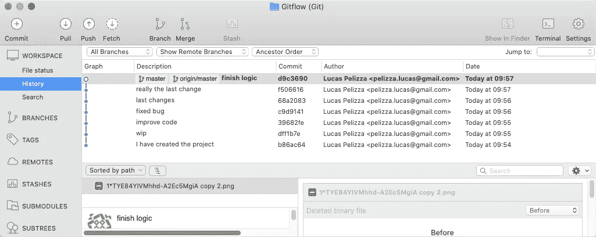
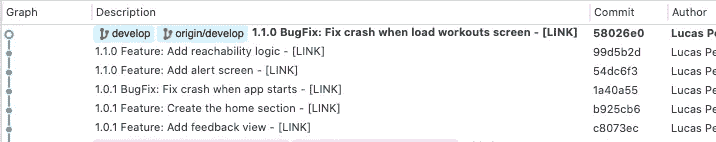
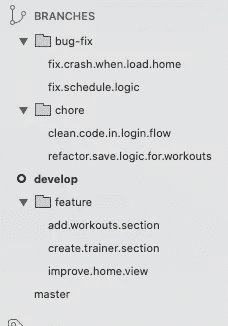
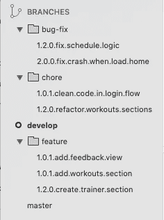
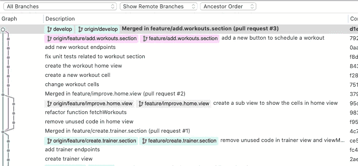
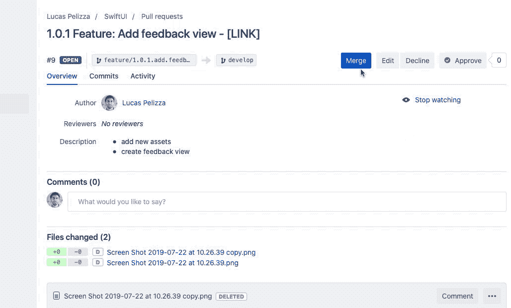

# git flow——帮助整个团队的小变化

> 原文：<https://betterprogramming.pub/gitflow-little-changes-that-help-all-the-team-5d4fb0519517>

## 改进存储库的使用

我将分享一些帮助整个团队改进 Gitflow 资源库使用的技巧。这不是使用 Gitflow 的指南——如果你想回顾这些概念，你可以输入到 [Atlassian Gitflow](https://www.atlassian.com/es/git/tutorials/comparing-workflows/gitflow-workflow) 中。

# 提交—小细节，深刻影响

通过日复一日的工作中的小变化，整个团队可以取得显著的进步。

提交消息是我们每天都在写的东西。如果我们注意提交消息，我们可以显著提高对所做更改的理解。然而，如果我们不关注提交的信息，明天整个团队可能会因为那些难以辨认的、无关紧要的、无用的提交而有缺陷。

无用提交的例子

## 改进提交消息的提示:

*   跨团队成员定义提交消息模板。这将提高质量，因为整个团队将熟悉提交消息结构。然后，他们只需看一眼就能明白提交是做什么的。
*   定义提交消息类型，如特性、缺陷修复、琐事、修补程序、文档等。
*   包括元数据，这有助于找到有关变更的更多信息:问题跟踪 id、票证链接、拉式请求编号。

前一阵子，我一直在使用这个模板:

**【App 版本】【提交类型】:【描述】—【车票网址】**

使用这个模板，我的存储库发生了很大的变化——现在可读性更好了，提交消息对于每个阅读历史的队友来说都很重要。

*单词 link 代表任务的链接应该在的地方*

# 命名分支

使用 Gitflow 一段时间后，我们发现了大量的分支。许多日常行为开始变得难以执行，比如:

*   了解应用程序的哪个版本会影响特定分支中发现的更改，以及我们何时需要更改分支。
*   直观显示某个版本的应用程序中包含的功能，一目了然。
*   在失败的情况下快速找到有问题的分支。

没有模板名称的分支

如果我们在创建分支时应用一个小的改变，我们可以解决所有上述问题，并增加一些好处。

在创建分支的时候，我们可以使用一个类似于提交部分提到的模板:**【类型】/【应用版本】。【描述】**

使用模板名称的分支

通过这个简单的改变，我们成功地建立了一个分支结构，它有几个好处。这些优势包括:

*   分支按应用版本排序
*   它们可读性很强
*   分支按应用程序版本分组
*   了解变更与哪个应用程序版本相关的简单方法

# 使用壁球

我们都知道，当团队变得更大或者/和随着时间的推移，存储库变得越来越难以理解。每次我们有更多的分支，更多的提交，所有的最终都包含在开发分支中。

当将一个特性分支合并到开发中时，该特性分支的所有提交都将被纳入开发中。这会导致包含大量消息的详细日志，无论是从功能角度还是从 bug 修复角度来看，都会非常混乱。请看下面的例子:

使用 just merge 的分支历史

为了避免这种混乱的提交历史，我们最好合并一个特性分支，并且只看到一个提交。该提交应该有特性名称和对其内容的解释。为了实现这一点，我们可以使用壁球。

例如:如果我们在进行合并时使用 Bitbucket，我们选择选项“Squash”而不是“merge ”,并在模板后添加一个标题。在我的例子中，我使用模板:

**【应用版本】【提交类型】:【描述】—【任务链接】**

使用 Bitbucket 挤压

这个简单的变化给我们带来了一系列好处:

*   Develop 分支中的提交描述在合并到 Master 时将成为您的 Changelog。
*   可读性很强
*   你手头总是有一个链接来查看变化的原因
*   实现特性、错误修复和杂务合并顺序的简单方法。如果您不确定哪个特性破坏了项目中的其他东西，这将非常有帮助。

使用壁球的分支历史

# 最后的话

希望这篇文章能帮助你有更高效准确的团队合作。

如果你的团队有类似或不同的工作流程，我会很高兴听到。