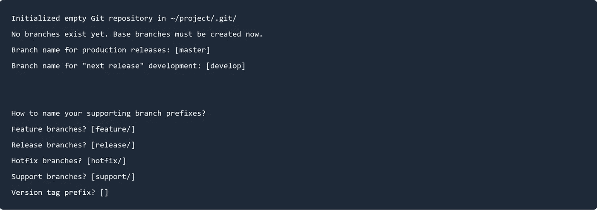

# GitFlow:快速指南

> 原文：<https://betterprogramming.pub/gitflow-quick-guide-54d4e24ba741>

## 轻松管理 Git 分支


在源代码控制下工作是当前项目，主要是敏捷项目的必备实践。但是更重要的是制定一个定义良好的策略来管理您的源代码控制，这样您就可以提高您的生产力并达到您的里程碑。

在本文中，我将把 GitFlow 作为管理 Git 分支的最著名的工作流之一来讨论。

# 什么是 GitFlow

GitFlow 是一种管理 Git 分支的新颖策略。GitFlow 策略处理两条主干: ***开发和掌握。***

GitFlow 策略定义了在项目生命周期的不同阶段起作用的不同类型的分支:

*   开发阶段:开发在独立的`feature`分支中完成。这个阶段的两个主角是`develop`和`by-feature-branches`
*   预发布阶段:准备下一次发布由`release`分支机构负责。
*   上映阶段:唯一独特的演员是`master`分公司。
*   发布后阶段:由`hotfix`分支机构保证。

# GitFlow CLI

git-flow CLI 是一组 git 宏命令。在选择 GitFlow 策略时，它们非常有用。

GitFlow 允许您在更高的抽象层次上管理不同种类的分支。假设您有一个名为`change_api_url`的热修复程序，您需要将它合并到`master`和`develop`中。使用标准的 git 命令，您需要编写以下命令:

使用 git-flow CLI 也可以做到这一点:

使用 git-flow LCI 的另一个优点是，前者会向您推荐一个符合 GitFlow 概念的标准文件夹结构，并且您可以为每个文件夹定制名称。这是在您执行命令时完成的:

```
git flow init
```



参考下面的命令结果，所有的特征都将创建在`feature/`文件夹下，…

关于 GitFlow 以及如何安装它的更多信息，你可以去[这里](https://danielkummer.github.io/git-flow-cheatsheet/)。

> 如果你选择基本的 git 命令，我会推荐你在合并时使用***——***`*no-ff*`*选项，以保持一个干净的历史，并便于恢复。*

# *掌握*

*也称为`main`或`prod`。根据定义，对这个分支的每个提交都是一个生产发布，所以您可以配置您的 DevOps 服务器来自动启动一个新的发布到生产服务器，也就是连续交付。*

> *该分支始终反映生产就绪状态。*

*仅允许从`release`和`hotfixes`分支合并到该分支。*

*最佳实践是，给这个分支中的每个合并赋予一个`tag`，它对应于发布号。*

# *发展*

*`integration-branch` **亦称*。这是任何自动每夜构建的起点，也就是持续集成。****

> *它反映了下一个版本的开发状态。*

*当`develop`达到一个准备交付的稳定状态，并且下一个版本的所有计划的特性已经被开发并从他们自己的分支合并到`develop`时。现在你可以决定平静地继续你的下一个版本。*

*从`features`、`hotfixes`和`releases`接受到该分支的合并。*

# *特征*

*`topics`又名*。**

*对于每一个新的特性，你从`develop`到*创建一个独立的分支。**

> *这种类型的分支用于为即将到来的遥远的未来版本开发新的特性。*

*因此，一旦某个功能的开发完成，我们就决定将它嵌入到下一个版本中。我们首先将它合并到`develop` *、* 中，然后我们删除特征分支。*

> *与 develop 和 master 不同，这些分支的生命周期总是有限的。*

*特性分支应该与其他分支保持隔离。他们不应该接受来自任何其他分支的合并。因此它们只反映与当前主题相关的提交。*

*特征仅合并到`develop`中。*

## *GitFlow 提示:*

*要启动新功能:*

*要发布到远程:*

*要从遥控器拉取:*

*要完成一个特征:*

# *放*

*一旦`develop`达到下一个版本的期望状态，意味着 develop 是稳定的并且包含所有下一个版本的特性。我们分出一个发布分支。*

> *发布分支支持新的产品发布的准备工作。它们允许小的错误修正和为你的发布准备元数据(版本号，构建日期等等)。*

*发布不应该接受来自其他分支的合并。*

*发布合并为`develop`和`master` ***。*** 一旦做了，就应该删除。*

*请注意，`develop`不能接受未来的发布分支，除非下一个发布分支被分支。*

> *建议您用版本号命名您的分支，因为 git-flow CLI 将使用这个名称在**主**分支中创建一个同名的标记*

## *GitFlow 提示:*

*要创建新版本:*

*要发布到远程:*

*从远程拉动*

*要完成发布:*

*不要忘记将创建的标签推送到遥控器*

# *修补程序*

*当必须立即解决生产版本中的关键错误时，可以从标记生产版本的相应标签的`master`中创建热修复分支。*

*修补程序应该合并到`master`和`develop`中。正如我们在本文前面提到的，总是建议标记主提交。*

> *建议您用版本号命名您的分支，因为 git-flow cli 将使用这个名称在`*master*`分支中创建一个同名的标记*

## *GitFlow 提示:*

*要创建新的修补程序:*

*要发布到远程:*

*要从遥控器拉取:*

*要完成修补程序:*

*不要忘记将创建的标签推送到遥控器:*

*我希望你喜欢阅读这篇文章，并给你一些澄清，以了解著名的 [GitFlow 图。](https://nvie.com/files/Git-branching-model.pdf)*