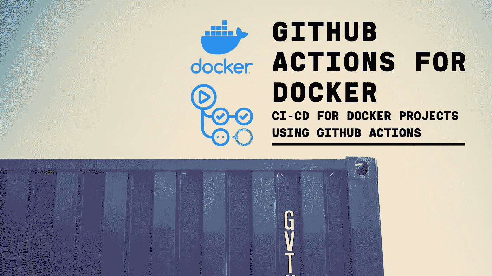
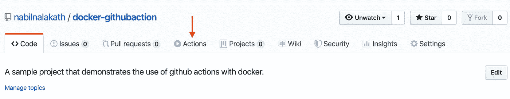
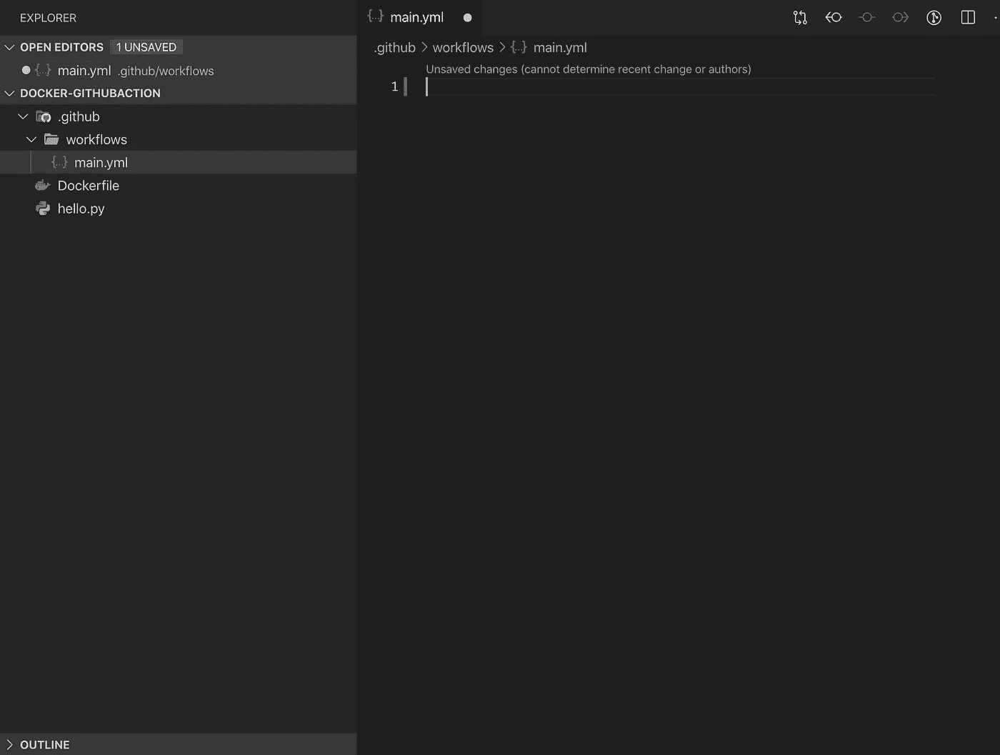
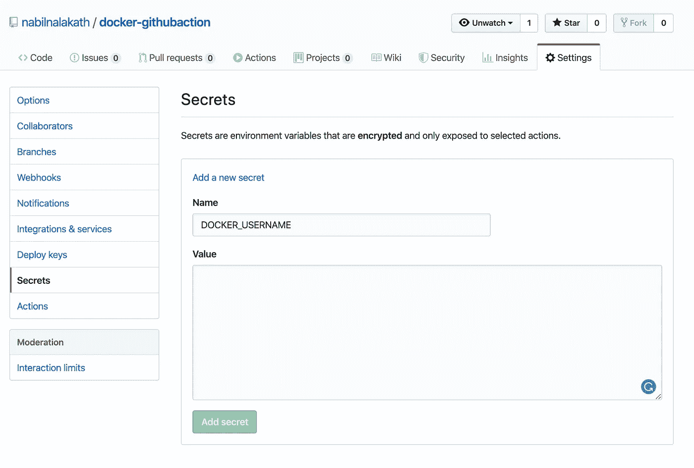
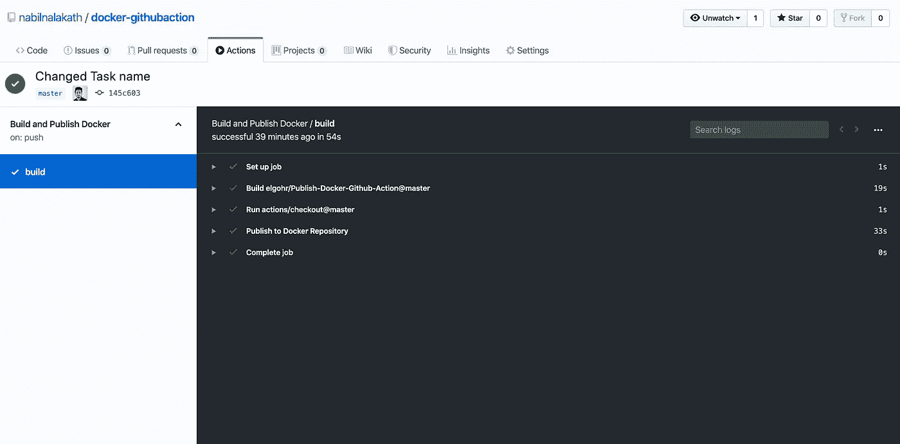
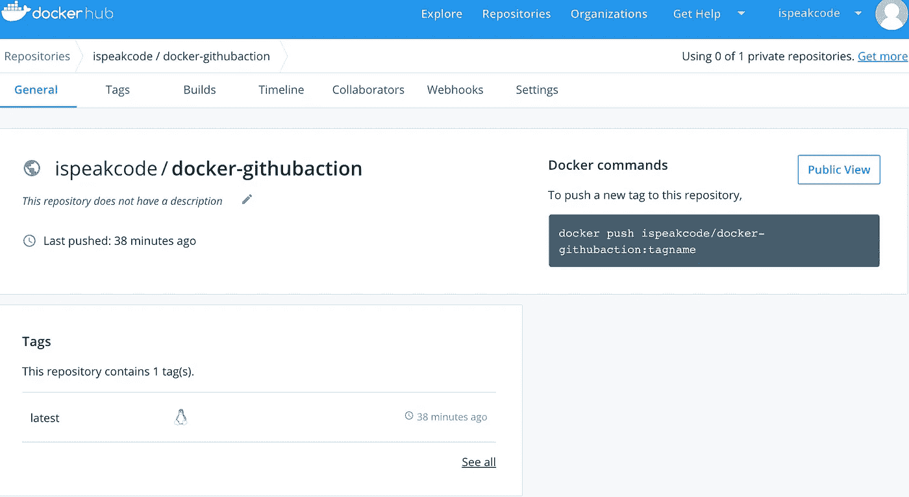

# 使用 GitHub 操作的 Docker 的 CI/CD

> 原文：<https://betterprogramming.pub/github-actions-for-docker-eaf22bbcc879>

## 在项目中配置 GitHub 操作，以构建 Docker 映像并将其推送到 Docker Hub。

图像鸣谢- Docker，Unsplash

[GitHub Actions](https://github.com/features/actions) ，为 GitHub 上的项目添加 CI/CD 工作流的自动化工具，目前已有 beta 版。

尽管离公开发布还有一个多月的时间，但在 11 月 13 日**，** GitHub marketplace 已经看到了许多帮助几乎所有主要平台的 CI/CD 的行动。

*注意:在本文中，我们将讨论在使用 Docker 的项目中集成 CI/CD 工作流的各个步骤。我们将关注使用 docker 的项目中的 GitHub actions 配置——Docker 是什么及其用途的基础知识不在本文讨论范围之内。*

# **先决条件**

本教程假设您知道 docker 是如何工作的，并且有一个使用它的项目。确保项目的根文件夹中有`Dockerfile` 。这里使用的示例项目是一个非常基本的项目，只有一个 Python 文件。完整的代码可以从 [github 库下载。](https://github.com/nabilnalakath/docker-githubaction)

如果你还没有注册，请在这里注册 GitHub Actions 公测[。](https://github.com/features/actions)

首先，我们将介绍在项目中配置 GitHub 操作所需的基本步骤。这对于在任何平台上运行的所有项目都是常见的。

# 1.创建项目并添加工作流文件

第一个明显的步骤是创建一个 GitHub 项目，并将您的 Flutter 项目与资源库连接起来。

如果您已经成功完成了 Actions beta 的注册过程，您应该能够在 pull requests 的右侧看到您的项目的新的 *Actions* 选项卡。

存储库中的“操作”选项卡。

GitHub 为许多最流行的平台提供了预定义的工作流，你也可以在可视化编辑器中定制或创建全新的工作流。

不过在这个项目中，我们将采用手动方式，通过工作流命令创建一个 YAML 文件。

在 Pytho 项目的根文件夹中，创建一个新文件夹`.github`，并创建子文件夹`workflows`。这是我们的工作流 YAML 文件将驻留的地方。

一个项目可以有多个工作流文件，如构建、发布等。，但是为了简单起见，我们将在这个项目中只使用一个文件。在工作流文件夹中创建一个名为`main.yml`的最终文件:

创建 GitHub 文件夹并添加工作流文件

# 2.编写命令

现在我们必须在 main.yml 文件中添加一个命令来执行所需的操作。以下是`main.yml.`的完整代码:

main.yml

为了更好地理解，我们将详细介绍每一行及其用法:

`line 1`:您希望在“操作”选项卡中显示的工作流名称。

`line 2`:当有人将代码推送到我们的回购协议时，我们希望触发我们的工作流。

`lines 3–6`:我们正在定义一个在`ubuntu-latest`上运行的作业。每个作业都在虚拟环境的一个新实例中运行。一个作业可以包含一个或多个`steps`。

这是我们工作流程的第一步。我们使用一个名为[*check out*](https://github.com/actions/checkout)*的 GitHub 动作从我们的存储库中提取源代码。*此操作将您的存储库签出到`$GITHUB_WORKSPACE`，以便您的工作流可以访问存储库的内容。

`lines 8–9`:这里我们使用 GitHub 动作 [*发布 docker*](https://github.com/marketplace/actions/publish-docker) ，它构建一个 docker 映像并将其推送到 docker hub。

`lines 8–9`:这里我们使用 GitHub 动作[*publish docker*](https://github.com/marketplace/actions/publish-docker)*，*构建 docker 映像并推送到 docker hub。

`lines 8–9`:这里我们定义了推送到 docker hub 所需的参数:

*   **name** 是您希望推送至 docker hub 的映像或存储库的名称。
*   **用户名**注册中心的登录用户名(docker hub 用户名)。
*   **密码**注册表的登录密码(docker hub 密码)。

# 3.添加密钥

你可能想知道:我们不能在 yml 文件中直接提到用户名和密码，因为这对安全非常不利。

因此，我们将这些凭证添加到我们项目的秘密中。

要添加它，请转到位于`<repo url>/settings/secrets`的项目的存储库设置。在*机密*选项卡中，从您的工作流文件中添加同名的机密密钥(`*DOCKER_USERNAME*`和`*DOCKER_PASSWORD*`)并粘贴值:

在存储库设置中添加新的密钥。

就是这样——只需提交您的代码并推送它。这将触发 docker 构建并自动推送图像—根据您的项目大小，在几分钟内即可完成。

# 4.检查工作流执行和图像

一旦您推送了代码，您可以通过转到`<repo URL>/actions`来检查工作流的执行情况，并通过转到`[https://cloud.docker.com/repository/](https://cloud.docker.com/repository/)`来查看图像

为推送事件执行的工作流命令

Docker hub 上从 GitHub 推送的 docker 图片。

就是这样！

我正在计划另一篇关于将 Docker 图像直接推送到实时 web 项目中以更新它们的文章。当我完成的时候，我会更新这里的链接。

同时，如果你是 docker 的新手，可以去看看 playwithdocker 的**，*网站，它会给你一个在线的游乐场来探索 docker，还有[http://dockerlabs.collabnix.com/](http://dockerlabs.collabnix.com/)的各种教程。*