# GitHub 行动在行动

> 原文：<https://betterprogramming.pub/github-actions-in-action-3b10083cc700>

## 使用 GitHub 动作自动化构建、测试、通知和部署


GitHub 动作组件以及它们之间的关系。使用的任何图片都是自画的，与 GitHub 没有任何关系。

有没有厌倦过必须运行 bash 脚本或 makefiles 来执行重复的日常任务——运行测试、构建？对于一个小型的家庭项目来说，你是否觉得建立一个 CI/CD 有点过了？
你不应该有这种感觉——使用 GitHub Actions 非常简单。

GitHub Actions 允许用户在 GitHub 上执行大量的操作，比如部署到 AWS、Terraform，如果提交破坏了任何测试，给开发人员发电子邮件，等等！GitHub Actions 允许我们非常容易地运行 CI/CD，并且不需要太多的先验知识。

如果你不熟悉 CI/CD 这个术语，我建议你读一下[什么是 CI/CD？由](https://towardsdatascience.com/what-is-cicd-where-is-it-in-2020-c3298c2802ff)on: push

所以，`Event` s 触发 GitHub 做出反应，但是他们触发了什么？这将我们带入下一个组件，工作流**。**工作流是包含所有要执行的作业的配置的名称。为工作流设置一个名称很重要，因为我们需要能够引用它们。

请记住，您可以有许多事件和许多工作流要执行。


工作流是指配置的名称。

使用配置中的`name` 关键字设置工作流名称。

```
# This will set the name of the workflow
name: my-workflow
```

下一个组成部分是乔布斯。这是一个包含所有执行步骤的容器。


作业是保存要执行的步骤的配置，可以是一个作业中的多个步骤。

通过使用工作流程配置中的`jobs`关键字来设置作业。
可以使用许多有用的设置对作业进行配置。您可以创建所需的 Docker 容器和更多的容器在`Jobs`中运行，甚至可以改变它运行的操作系统。我们稍后将在一个`Job`中运行一个 PostgresDocker。

```
#Configure jobs below
jobs:
  #Name the Job by setting a key value
  my-job:
      name: My custom job
      # Set the operation system to use on during the Job
      runs-on: ubuntu-latest
      # Configure the steps that are part of the job
      steps: #Comes later in the article
```

作业可以包含许多步骤。步骤是要执行的实际操作。


步骤是要执行的操作/命令。

这是我们开始做事情和运行命令的地方。步骤是某个命令或一系列命令的名称。步骤位于作业内部，通过使用`steps`关键字进行设置。可以配置多个步骤——下面的示例用于安装 Golang，从存储库中取出代码，然后运行终端命令:

```
steps: 
  - name: Set up Go 1.x
    uses: actions/setup-go@v2
    with:
       go-version: ^1.15.5
  - name: Check out code from the repository
    uses: actions/checkout@v2
  - name: Run a terminal command
    run: echo "Hello World" && pwd
```

起初这看起来很困惑，或者至少对我来说是这样。这就是为什么我创建了一个信息图来显示 GitHub 操作中组件之间的关系，以可视化连接。请记住，每个子组件可以包含多个组件。所以一个事件可以触发很多工作流，一个工作流可以包含很多作业，一个作业可以包含很多步骤。


GitHub 动作的组件层次结构

## 让我们开始使用 GitHub 动作

我们需要做的第一件事是建立一个 GitHub 存储库。你需要一个 GitHub 帐户来尝试这个。

登录并创建一个存储库，并确保将存储库设置为`Public`。GitHub 动作只有在资源库公开的情况下才是免费的。


在 GitHub 上创建一个新的资源库，确保它被标记为 Public。

GitHub 操作存储在 YAML 文件中，该文件位于。github/workflow。你可以通过在那里添加一个 YAML 文件来创建一个工作流程，或者你也可以使用网站来为你生成文件。进入存储库后，导航到“操作”选项卡。


Actions 选项卡带你到一个页面，GitHub 可以在这里为你生成动作。

您应该看到设置启动工作流的选项，请按“设置此工作流”进行设置。

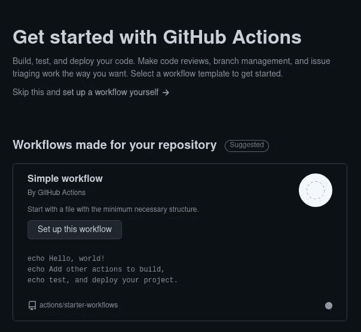

GitHub 为你生成一个简单的工作流程。

你将看到一个非常用户友好的页面。它将包含一个文本编辑器的权利，在浏览器的左侧。在右侧，您将可以访问包含预建步骤的市场。是我第一次预览这个页面，让我爱上了 GitHub Actions。在这里，我们可以编辑并提交我们的工作流。

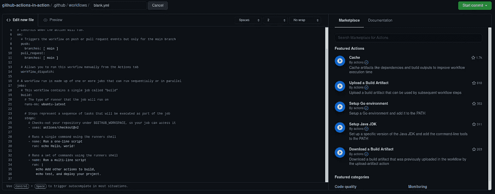

在浏览器中编辑 GitHub 动作非常流畅，可以访问文档和市场，还可以选择提交。

我们要做的第一件事是重命名工作流。现在工作流文件名为 blank.yaml，我将命名为 mine buildtest.yaml，因为它将用于此目的。我还将修改其中的名称配置以进行构建和测试。

确保你阅读了当前的 YAML，并对它感到舒适。当前工作流将触发两个事件—推送或拉取请求。只有在主分支上发生这些事件时，它才会触发。

还有一项工作叫做构建，在 Ubuntu 操作系统上运行。构建将有三个步骤:第一步提取存储库中的任何代码，接下来的两步将只使用 echo 打印到标准输出。

有趣的是在步骤中使用了 run 命令。作为用户，这就是我们如何修改一个步骤中将要发生的事情。这可以是适用于所选操作系统的任何内容。一个例子是安装依赖项。假设我有一个项目使用了`libpcap`——因为它嗅探网络，我的单元测试将使用`localhost`。但是测试仍然需要操作系统有`libpcap`，所以我在运行我的单元测试之前使用 run 命令来安装它。我的单元测试也是用`run`执行的——把它想象成一个终端。

这就足够了，让我们按下绿色的提交按钮来试试吧。提交后，再次进入 Actions 选项卡，您应该会看到一个作业在队列中或已完成。队列意味着它将运行工作流，但是等待服务器准备就绪。

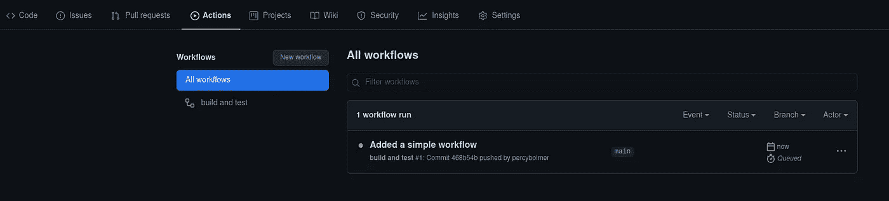

再次输入操作将显示提交的名称和工作流的状态。

如您所见，在“所有工作流”下，您现在有了一个名为“构建和测试”的工作流您可以点击它，查看工作流程中所有作业的更深入状态:

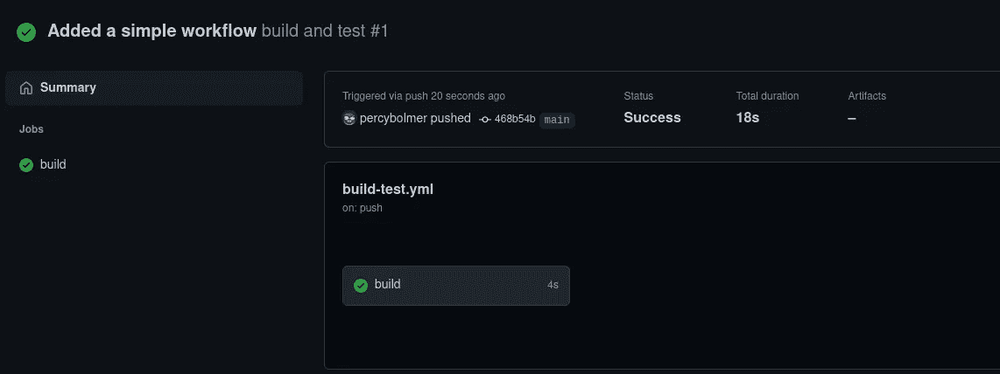

工作流视图，显示有关工作流的信息，并列出其中所有可用的作业。

在工作流视图中，您应该在左侧面板上看到属于它的任何作业。在这种情况下，我们只有一个工作，建筑工作。它也是绿色的，表示一切正常。这是对工作流程的一个很好的概述，但通常，您会希望单击作业来查看步骤的深入视图。单击构建作业以查看每个步骤的详细信息和输出。

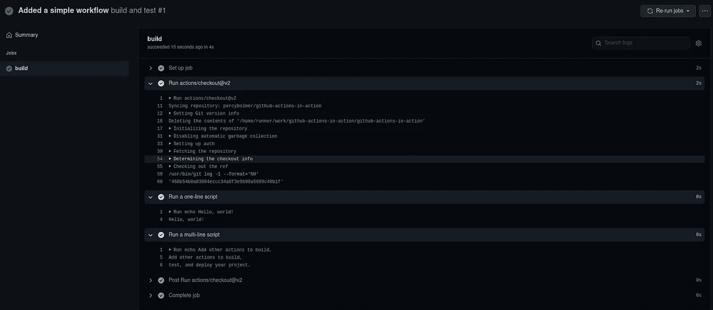

Step 视图显示了运行的每个步骤的信息以及输出。这在调试失败的工作流时非常有用。

现在转到“代码”选项卡，导航到工作流文件，然后按编辑开始更改它。记住，工作流存储在`.github/workflows`中。
现在，为了方便起见，我们将修改浏览器内部的配置，但也可以修改您本地计算机上的文件。当您提交并推送更改后的配置时，它将应用该配置。

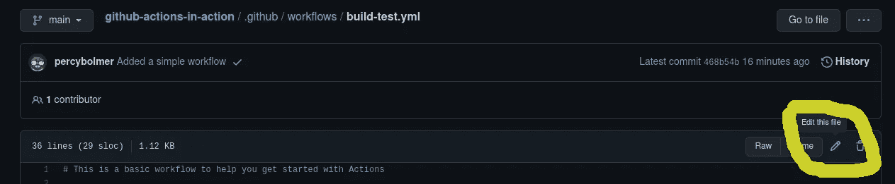

图像突出显示了开始编辑工作流程的位置

让我们试着使用 marketplace，搜索你感兴趣的任何东西并添加它。我将继续在市场中搜索名为“Setup Go”的操作。当您选择一个操作并使用它替换最后两个步骤时，我们将需要复制推荐的配置。这就是在插入新动作时使用市场是多么简单。

我还将添加两个新步骤，一个编译我的存储库代码，另一个运行我的存储库中可用的任何单元测试。这必须根据您自己的需要或编程语言进行修改，但应该很容易做到，因为您只能替换所使用的终端命令。这是我当前工作流的样子，它将编译我的 Golang 项目并运行所有单元测试:

GitHub Action 为 Golang 项目构建并运行单元测试

现在，如果你尝试复制这个要点并提交它，你会看到当 GitHub 动作失败时会发生什么。再次访问 Actions 选项卡，您应该会看到一个红色图标，而不是我们在一切都通过时看到的绿色图标。


失败的工作流标有红色叉号。

这就是为什么我展示了如何找到步骤视图的部分。我们现在需要调试工作流中的错误，进入失败作业的步骤视图。

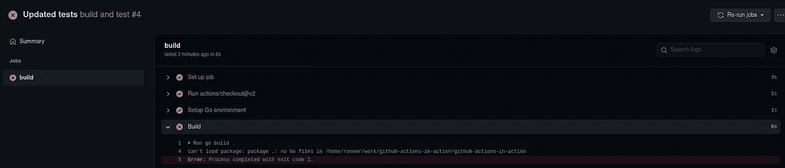

示例输出如何调试失败的步骤。

看到那个输出了吗？太神奇了。导航简单，容易找到错误。您可能已经注意到推送失败了，但它实际上仍然应用了它。如果您愿意，可以在存储库上更改这一设置—它被称为“分支保护规则”它位于“设置->分支->添加分支规则->合并前需要通过状态检查”我在主分支上配置了一个，用于我的构建检查，只是为了好玩。注意这只适用于合并和拉请求，不适用于管理员的推请求。

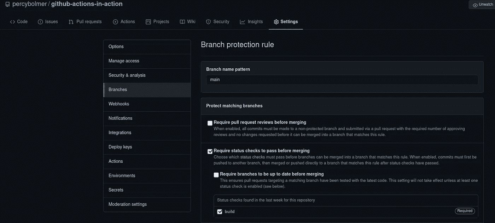

创建分支保护规则可以强制所有操作在接受推送之前通过

我将添加一些用 Go to the repository 编写的小代码片段，刚好够它编译，以及一些简单的单元测试。

我将为我的存储库创建两个新文件并推送它们。是我能构建的最小的 Go 应用程序——它会编译，这就是它所需要的。

main.go 是一个超级瘦的应用，只是为了通过 GitHub 的动作作业

还有一个`main_test.go`，里面有两个测试，只是给你看输出。

main_test.go 运行两个 golang 单元测试。

将这些文件推送到存储库将导致工作流被执行。这一次，如果我们查看测试步骤，我们应该会看到测试通过的输出:

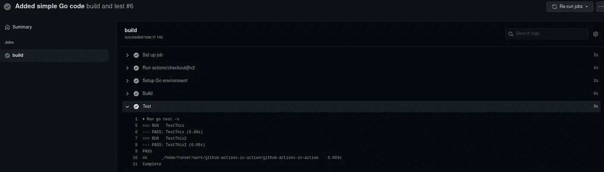

测试成功通过，一切都好合并。

是时候加快步伐了。到目前为止，我们已经使用了最简单的操作:我们可以编译和运行单元测试，这让我们走得更远，但是如果我们想要或需要并行服务运行呢？

我有一个用例，其中我有一个依赖 PostgreSQL 和 Redis 的应用程序在测试期间可用。当我们可以在测试环境中运行时，为什么要嘲笑呢？

让我们看看**服务**关键词。服务用于与您的工作流并行运行 docker 容器。你可以在这里阅读更多关于它们的[。](https://docs.github.com/en/actions/guides/about-service-containers)

> 服务容器是 Docker 容器，它为您提供了一种简单且可移植的方式来承载您可能需要在工作流中测试或操作应用程序的服务。
> 
> — GitHub 文档

熟悉 Docker 和 Docker Compose 对这一部分很有帮助，因为它将使用相同的语法。我们在服务配置中所做的与运行`docker-compose`是一样的。如果你想了解更多关于 Docker 的知识，请阅读我的 [Docker 文章](https://itnext.io/docker-skyrocketed-my-teams-productivity-e19cd89a23ea)。

我将在`main_test.go`中添加一个测试，尝试连接到一个 PostgreSQL。起初，它会失败，但是我们将添加一个运行它的服务，这样测试就可以通过:

更新的测试文件包含到数据库的连接尝试。

如果你推改变的测试，它不会工作，它不会找到主机有两个原因。首先，我们使用**环境变量**来存储连接信息。第二个原因是，没有运行 PostgreSQL 数据库。让我们通过更新工作流文件来解决这两个问题。

我们将建立一个运行 PostgreSQL 的服务，并使用`env`配置来设置环境变量。

服务将被插入到构建作业下，这将使服务可用于作业中的任何步骤。：

要点展示了在工作流中运行 PostgreSQL 的工作示例

如果您已经更新了测试文件和工作流文件，并将它们推送到存储库中，那么您现在应该会看到一个漂亮的绿色图标:

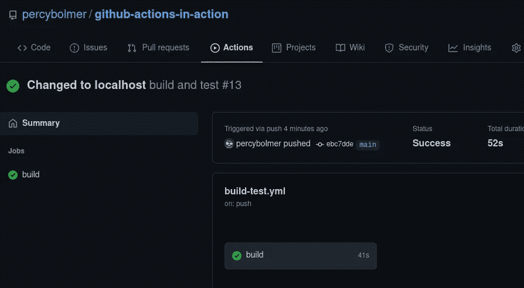

添加服务成功了，现在我们的测试可以到达数据库了。

这是一个非常好的功能。此外，由于服务是基于 Docker 的，你可以使用任何你喜欢的 Docker 图像。查看 [DockerHub](https://hub.docker.com/) 中的可用图片。

所以现在你知道如何用 GitHub 动作轻松设置一些基本的 CI/CD。让我们确保全世界都知道存储库使用了 GitHub 动作，并添加一个徽章来告诉我们最新执行的状态。这不仅在您的自述文件上看起来不错，而且还能给存储库一种信任感。如果我知道开发人员正在使用 CI/CD，并且状态是通过所有的单元测试，我倾向于信任存储库。

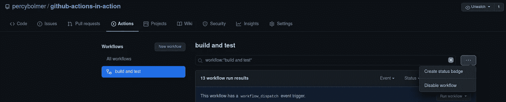

GitHub Action 可以为您自动生成徽章

进入 Actions 选项卡，选择“构建和测试”作业。按上图中右边的三个点，选择“创建状态徽章”

这将为您呈现一个漂亮的小对话框，您可以在其中定制徽章。我们将制作一个徽章，告诉访问者存储库的状态。复制生成的文本并粘贴到 README.md 中，然后提交。

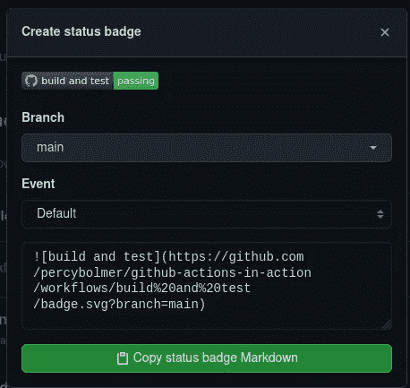

GitHub 状态动作徽章生成器。

新的访问者将会得到一个漂亮的小徽章，向他们保证你的库中的代码正在工作！

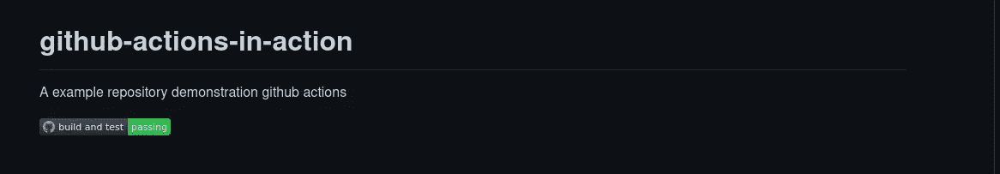

显示通过状态的我的自述文件。

本文到此为止。我建议探索市场来执行更多的动作——GitHub 动作是一个非常强大的工具。

感谢阅读。