# GitHub Actions 与 Terraform Cloud 的合作

> 原文：<https://betterprogramming.pub/github-actions-in-action-with-terraform-cloud-bfd7b5be666c>

## 为生产中的从业者、团队和组织消除不必要的工具和文档

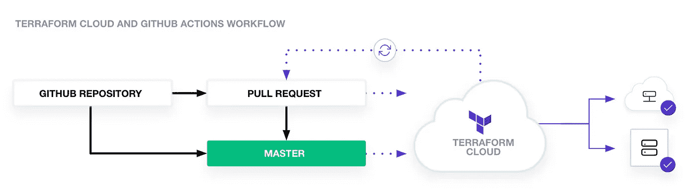

具有 GitHub 操作的 Terraform 云工作流

使用 Terraform cloud，您无需担心维护 Terraform 状态，并且它提供了使用 Terraform Cloud 在版本控制的配置上进行协作的灵活性。

设置 GitHub repo、创建 AWS secrets 和设置 GitHub secrets 已经在上一篇文章中介绍过了，请务必先阅读那篇文章[和](/infra-ci-cd-using-terraform-github-actions-8fbcca0d2226)以全面了解 Terraform 和 GitHub 操作。

在本文中，我们将重点关注以下内容:

```
Set up a Terrform Cloud
Setting up Terraform cloud access token in GitHub actions
Setting AWS credentials in Terraform cloud
GitHub action script for AWS S3 provisioning using Terraform cloud
```

# 设置地形云

首先，通过访问在 Terraform cloud 上创建一个帐户，如果已经注册，请登录。

```
[https://app.terraform.io/session](https://app.terraform.io/session)
```

如果您是新用户，那么您需要通过点击您提供的电子邮件上从 Terraform cloud 发送的确认链接来验证您的帐户。验证后，将打开一个新屏幕来选择设置工作流程。

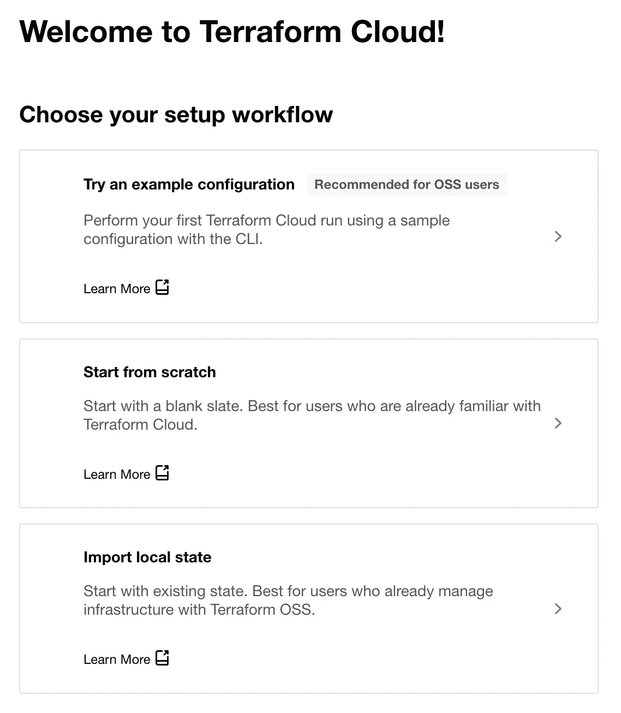

设置工作流

在下一步中选择从头开始，以提供唯一的组织名称。创建组织后，系统会提示您创建一个带有多个选项的新工作区。

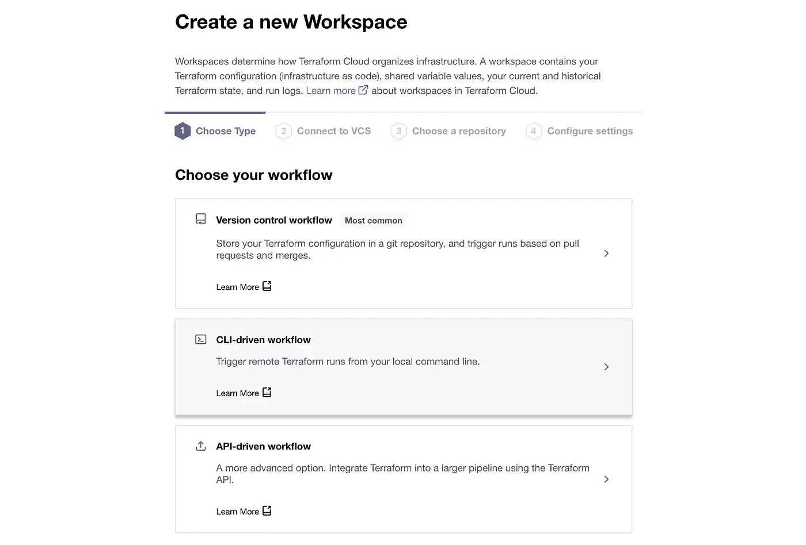

创建新工作区

对于我们的用例，选择 API 驱动的工作流，因为我们将从 Terraform cloud 中的 GitHub 操作触发 Terraform。在工作区名称区域，提供您给定组织中的任何唯一名称。

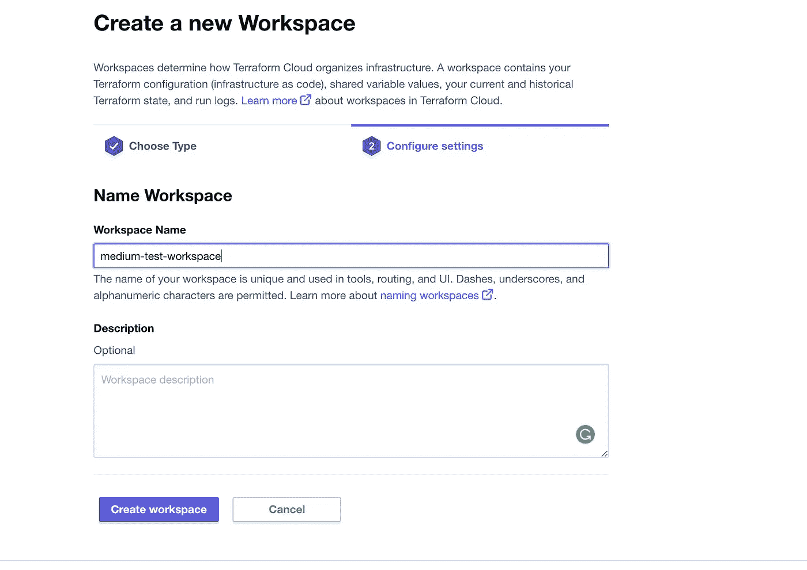

提供工作空间名称

这就完成了我们的 Terraform cloud 帐户设置和工作区创建。

# 创建 Terraform 云访问令牌

现在，我们的账户准备好了。是时候创建一个访问令牌了，它将在 GitHub 操作中使用，以调用 Terraform cloud API。

要创建访问令牌，请转到设置->安全性-> API 令牌。

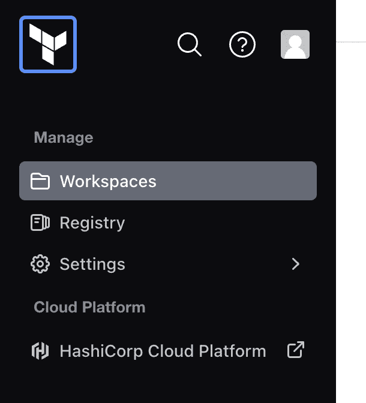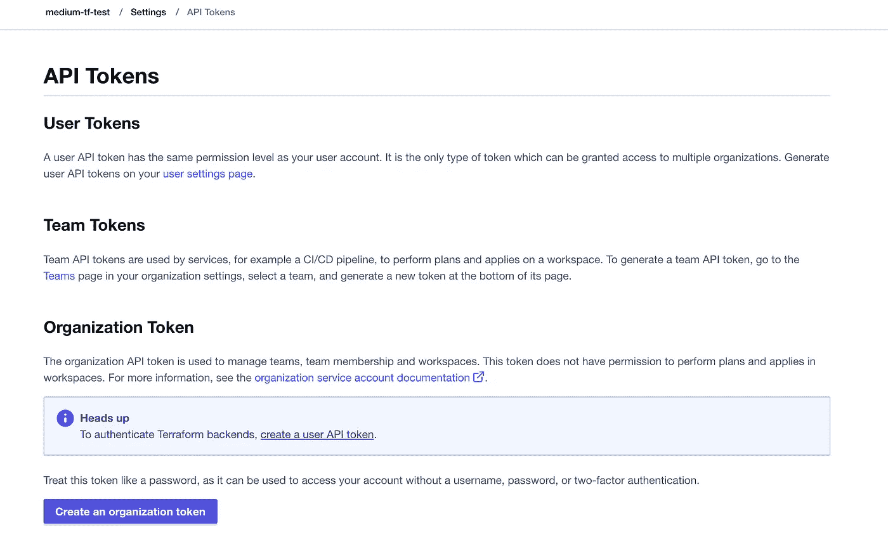

在组织令牌中，选择创建用户 API 令牌并生成新令牌。生成令牌后，请记住复制它，因为您无法再次检索它。

# 在 GitHub 操作中设置一个 Terraform 访问令牌

一旦你有了访问权标，继续设置动作秘密为`TF_API_TOKEN`。

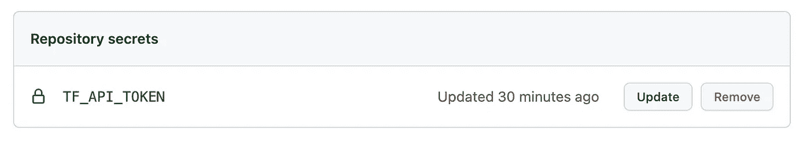

仓库机密

# 在 Terraform Cloud 中设置 AWS 凭据

在本文中，Terraform 文件的实际执行将在 Terraform cloud 中进行，因此 AWS 凭证、`AWS_ACCESS_KEY_ID`和`AWS_SECRET_ACCESS_KEY`需要在 Terraform cloud 中设置，而不是在 GitHub 操作中。

按照前面[文章](/infra-ci-cd-using-terraform-github-actions-8fbcca0d2226)中描述的流程生成`AWS_ACCESS_KEY_ID`和`AWS_SECRET_ACCESS_KEY`，打开 Terraform cloud 中的设置，选择变量集。

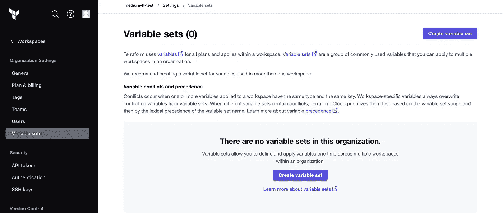

设置变量

单击“创建变量集”并提供变量集名称、描述，选择“应用于特定工作区”选项，然后在下拉列表中选择您的工作区。


然后点击“添加变量”表单中的“添加变量”。切记选择“环境”和敏感单选按钮。

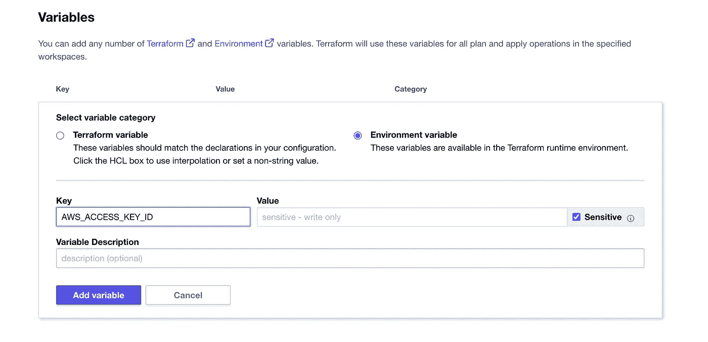

设置地形云变量

设置`AWS_ACCESS_KEY_ID`和`AWS_SECRET_ACCESS_KEY`不变后，应该是这样的:

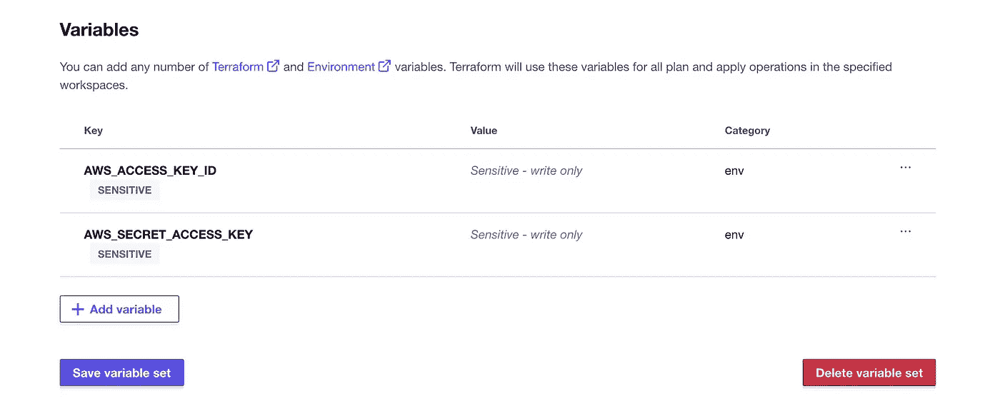

# 在 AWS 中供应 S3 存储桶的 Terraform 脚本

这些脚本与我们之前的完全相同。

```
terraform {
  required_providers {
    aws = {
      source  = "hashicorp/aws"
      version = "4.12.1"
    }
  }
}

# Configure the AWS Provider
provider "aws" {
  region = "ap-south-1" # define region as per your account
}

resource "aws_s3_bucket" "new_bucket" {
  bucket = "demo-github-action-tf-medium"

  object_lock_enabled = false

  tags = {
    Environment = "Prod"
  }
}
```

对上述脚本的唯一补充是合并 Terraform 云组织和工作空间信息。使用 Terraform 云配置的最终脚本将如下所示:

```
terraform {
    cloud {
        organization = "medium-tf-test" /// replace with your organization name
        workspaces {
          name = "medium-test-workspace" /// replace with your workspace name
        }
      }
  required_providers {
    aws = {
      source  = "hashicorp/aws"
      version = "4.12.1"
    }
  }
}

# Configure the AWS Provider
provider "aws" {
  region = "ap-south-1" # define region as per your account
}

resource "aws_s3_bucket" "new_bucket" {
  bucket = "demo-github-action-tf-medium"

  object_lock_enabled = false

  tags = {
    Environment = "Prod"
  }
}
```

> 请用您在第一步中创建的名称替换工作区名称和组织名称。

# GitHub 操作 YML 文件

我们不使用 Terraform cloud 时的早期 GitHub 操作文件如下:

```
name: 'Terraform'

on:
  push:
    branches: [ "main" ]
  pull_request:

permissions:
  contents: read

jobs:
  terraform:
    name: 'Terraform'
    runs-on: ubuntu-latest
    environment: production

    # Use the Bash shell regardless whether the GitHub Actions runner is ubuntu-latest, macos-latest, or windows-latest
    defaults:
      run:
        shell: bash

    steps:
    # Checkout the repository to the GitHub Actions runner
    - name: Checkout
      uses: actions/checkout@v3

     # Install the latest version of Terraform CLI and configure the Terraform CLI configuration.
    - name: Install Terraform
      run: |
        wget -O- https://apt.releases.hashicorp.com/gpg | gpg --dearmor | sudo tee /usr/share/keyrings/hashicorp-archive-keyring.gpg
        echo "deb [signed-by=/usr/share/keyrings/hashicorp-archive-keyring.gpg] https://apt.releases.hashicorp.com $(lsb_release -cs) main" | sudo tee /etc/apt/sources.list.d/hashicorp.list
        sudo apt update && sudo apt install terraform

    # Initialize a new or existing Terraform working directory by creating initial files, loading any remote state, downloading modules, etc.
    - name: Terraform Init
      env:
        AWS_ACCESS_KEY_ID: ${{ secrets.AWS_ACCESS_KEY_ID }}
        AWS_SECRET_ACCESS_KEY: ${{ secrets.AWS_SECRET_ACCESS_KEY }}
      run: terraform init -input=false

    # Generates an execution plan for Terraform
    - name: Terraform Plan
      env:
        AWS_ACCESS_KEY_ID: ${{ secrets.AWS_ACCESS_KEY_ID }}
        AWS_SECRET_ACCESS_KEY: ${{ secrets.AWS_SECRET_ACCESS_KEY }}
      run: terraform plan -input=false

      # On push to "main", build or change infrastructure according to Terraform configuration files
      # Note: It is recommended to set up a required "strict" status check in your repository for "Terraform Cloud". See the documentation on "strict" required status checks for more information: https://help.github.com/en/github/administering-a-repository/types-of-required-status-checks
    - name: Terraform Apply
      env:
        AWS_ACCESS_KEY_ID: ${{ secrets.AWS_ACCESS_KEY_ID }}
        AWS_SECRET_ACCESS_KEY: ${{ secrets.AWS_SECRET_ACCESS_KEY }}
      run: terraform apply -auto-approve -input=false
```

唯一的变化是安装了 Terraform。我们需要选择已经在 GitHub [actions](https://github.com/hashicorp/terraform-github-actions) 中可用的 Terraform cloud runner，并且不要传递 AWS 凭证，因为我们已经在 Terraform cloud 中设置了它们。最终的 yml 将如下所示:

```
name: 'Terraform'

on:
  push:
    branches: [ "main" ]
  pull_request:

permissions:
  contents: read

jobs:
  terraform:
    name: 'Terraform'
    runs-on: ubuntu-latest
    environment: production

    # Use the Bash shell regardless whether the GitHub Actions runner is ubuntu-latest, macos-latest, or windows-latest
    defaults:
      run:
        shell: bash

    steps:
    # Checkout the repository to the GitHub Actions runner
    - name: Checkout
      uses: actions/checkout@v3

    # Install the latest version of Terraform CLI and configure the Terraform CLI configuration file with a Terraform Cloud user API token
    - name: Setup Terraform
      uses: hashicorp/setup-terraform@v1
      with:
        cli_config_credentials_token: ${{ secrets.TF_API_TOKEN }}

    # Initialize a new or existing Terraform working directory by creating initial files, loading any remote state, downloading modules, etc.
    - name: Terraform Init
      run: terraform init -input=false

    # Generates an execution plan for Terraform
    - name: Terraform Plan
      run: terraform plan -input=false

      # On push to "main", build or change infrastructure according to Terraform configuration files
      # Note: It is recommended to set up a required "strict" status check in your repository for "Terraform Cloud". See the documentation on "strict" required status checks for more information: https://help.github.com/en/github/administering-a-repository/types-of-required-status-checks
    - name: Terraform Apply
      run: terraform apply -auto-approve -input=false
```

现在我们已经完成了配置，是时候将代码推送到 GitHub 并查看 GitHub 的实际操作了。在此之后，我们还将监控 Terraform 云工作区。

如果配置是正确的，那么您可以看到您的控制台，如下所示:

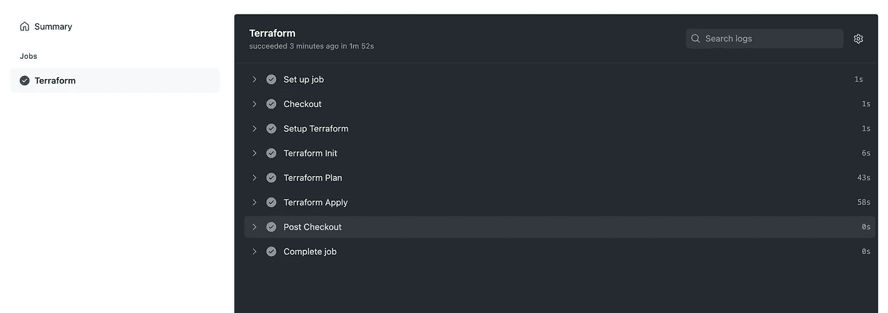

GitHub 操作控制台

监控 Terraform 云工作空间。其运行状态将显示“规划中”

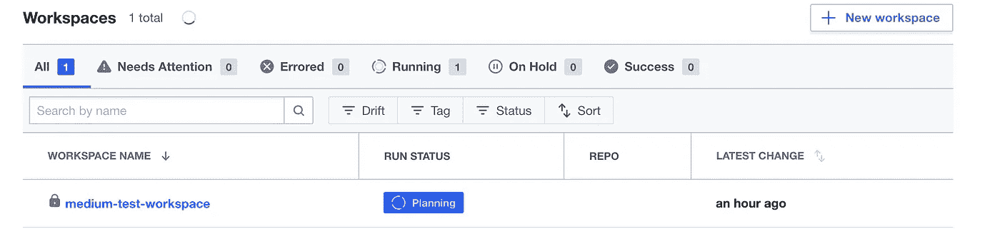

一旦在工作区中创建了 S3 存储桶，运行状态就会变为已应用。如果您打开工作区，它会有一些其他信息——创建了什么资源、何时创建的，以及输出(如果有的话)等等。

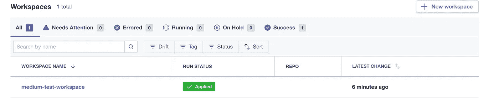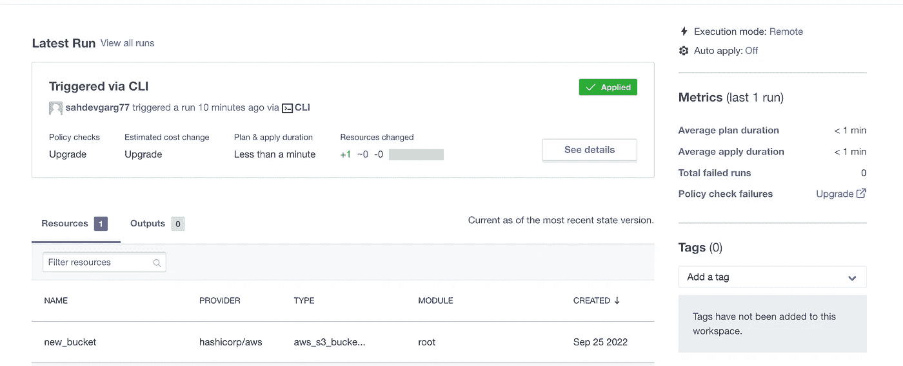

检查您的 AWS 帐户中的存储桶以进行确认。

瞧啊。我们又做了一次。

# 结论

有了 Terraform cloud，你直接和你的 VCS (GitHub，bitbucket 等)集成。因为 Terraform 提供了与 VCS 系统的直接无缝集成。我们刚刚使用的 API 方式更适合于我们想要控制流程并且需要一些自定义步骤的情况。

有了 terra form+terra form+GitHub actions，任何事情都可以实现——无论是简单的用例还是复杂的用例。更多关于 Terraform cloud 的详情，请访问[官方文档](https://www.terraform.io/cloud-docs)。如果你是企业，那么 Terraform 也有其 Terraform 云的 SAAS 版本。

感谢阅读。