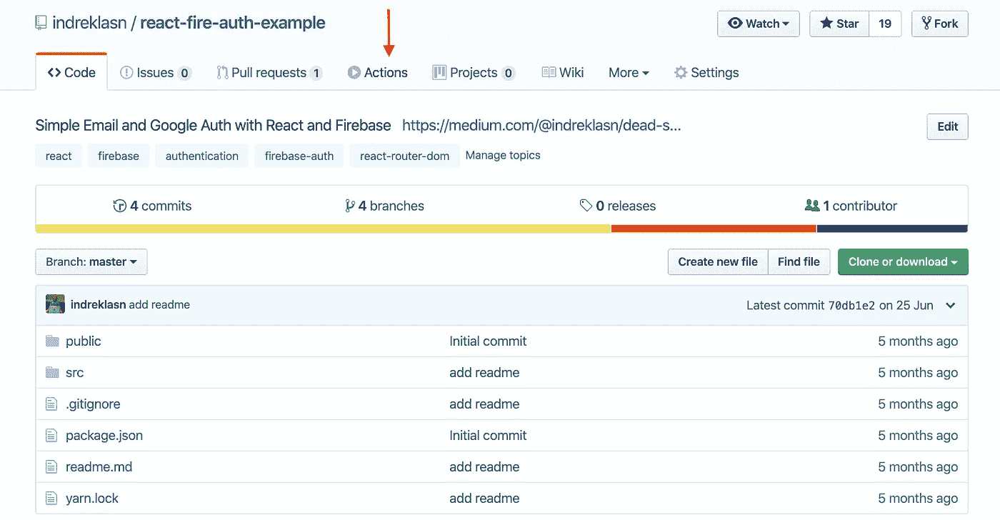
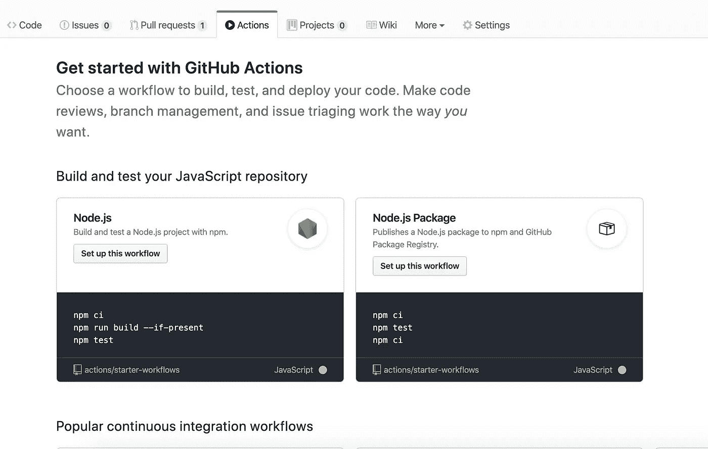
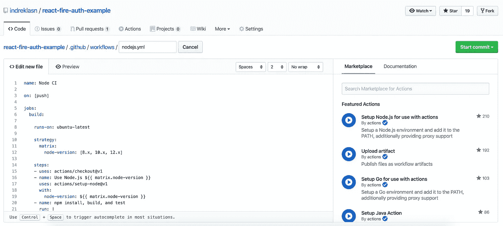
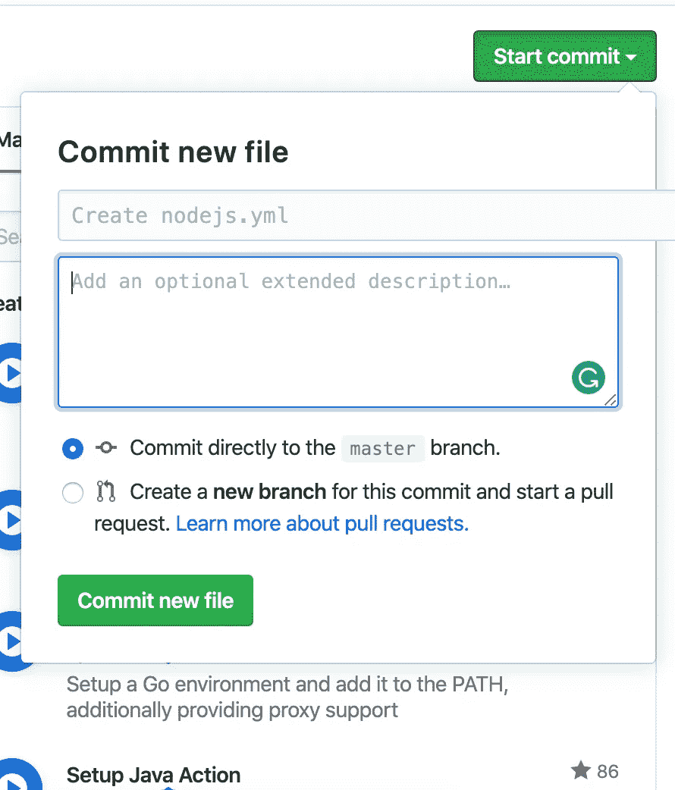
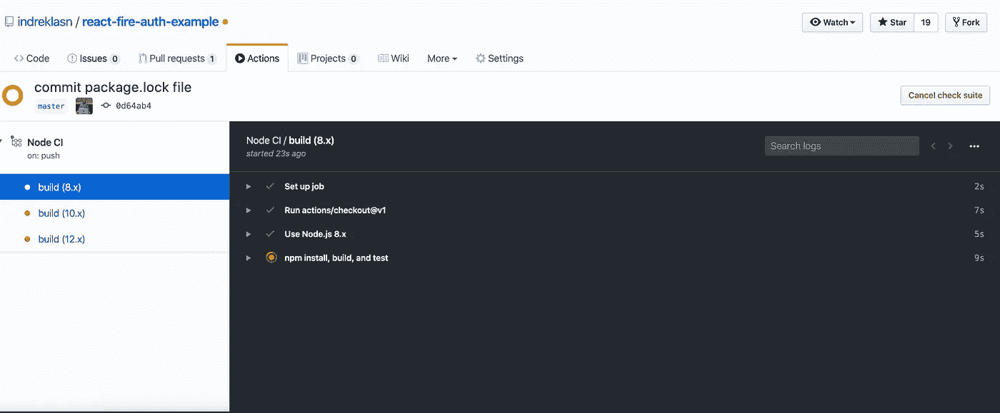
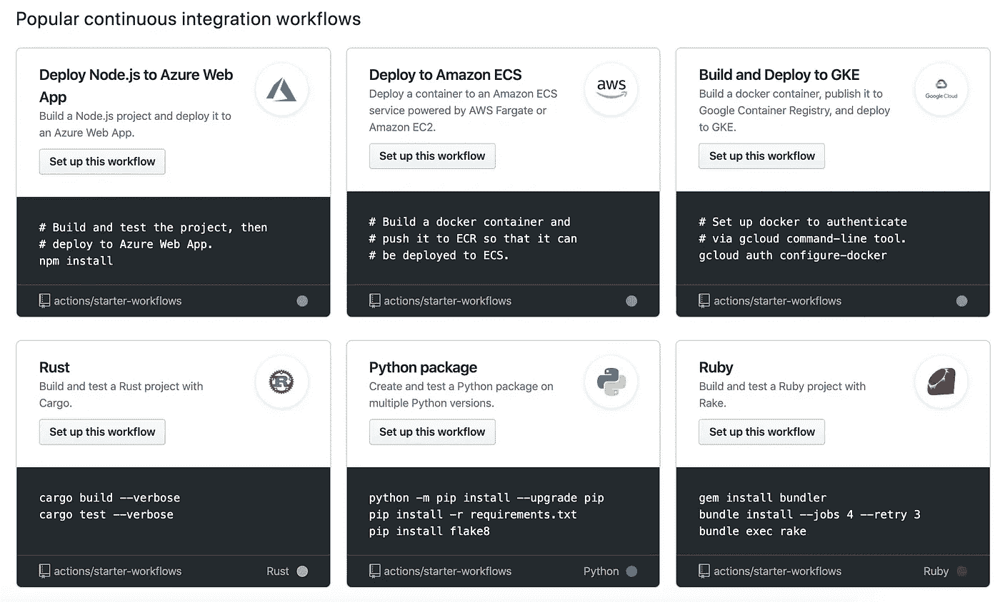

# Github 操作——什么、为什么和如何

> 原文：<https://betterprogramming.pub/github-actions-the-what-why-and-how-3868d5a86292>

## 用 Github 动作自动完成无聊的任务

凯文·霍尔瓦特在 [Unsplash](https://unsplash.com?utm_source=medium&utm_medium=referral) 上的照片

GitHub 动作让你所有软件工作流程的自动化变得容易。Github Actions 允许您直接从 Github 构建、测试和部署您的代码。您还可以分配代码审查，管理分支，并以您想要的方式对问题进行分类。

无论您想要构建一个容器、部署一个 web 服务，还是自动欢迎一个新用户加入您的开源项目，都有一个自动的操作。

最简单的方法是把 Github Actions 想象成自己的持续集成系统。您可以将 Github 包与简化包管理的操作配对，包括版本更新、GitHub 全球 CDN 的快速分发和依赖关系解析，使用您现有的`GITHUB_TOKEN`。

# 入门指南

现在每个 Github 库都支持 Github 的动作。在浏览器中打开一个存储库，您会马上看到“Actions”选项卡。

来源: [Github](https://github.com/indreklasn/react-fire-auth-example)

点击“操作”选项卡后，我们将进入“操作”页面。

动作选项卡

Github 足够聪明，可以推荐相关的行动。假设我们有一个节点项目，在将我们的代码发送到生产服务器之前，我们希望测试构建命令是否有效。按下*“在此工作流程上设置”*按钮。

nodejs.yml

每个 Github 动作都需要一个`.yml`文件。`.yml`文件用于描述动作、行为和其他一切。

`.yml` **代表 YAML**(“YAML 不是标记语言”)，是一种人类可读的数据序列化语言。它通常用于[配置文件](https://en.wikipedia.org/wiki/Configuration_file)和存储或传输数据的应用程序。

在提交新创建的 nodejs.yml 文件之前，Github 给了我们一个浏览它的机会。一切似乎都井然有序，下面是文件内部发生的情况:

*   启动 Ubuntu 服务器
*   安装 Node.js
*   为项目安装节点包
*   启动 package.json 脚本，如`npm run build`和`npm run test`

好了，现在让我们将文件提交到项目中。

提交 nodejs.yml 文件

现在，每当您推进到项目时，命令就会自动启动。甚至还有部署到 AWS 或谷歌云的行动。

每次推送时运行检查

Github 动作不仅仅针对 Web 或 Node 它们也针对语言和环境。**探索所有动作** [**这里**](https://github.com/marketplace?type=actions) 。

关于动作最好的部分是你可以写你自己的动作并开源给全世界看。

# 结论

感谢阅读，希望你学到了新的东西！快乐编码。

哦，如果你有兴趣了解更多，请查看官方现场公告。

2019 年 8 月 8 日直播