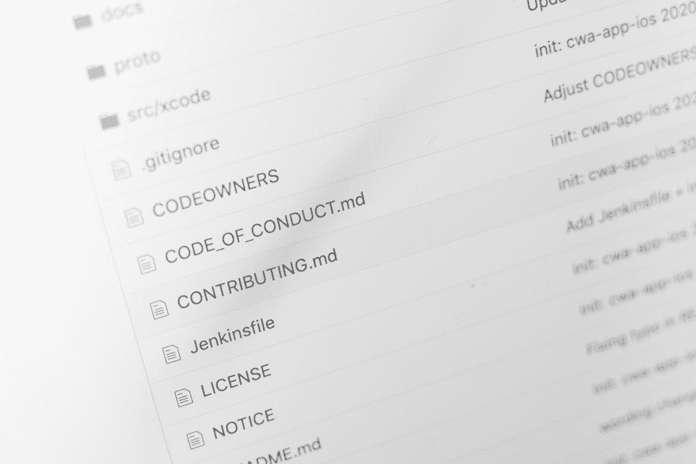
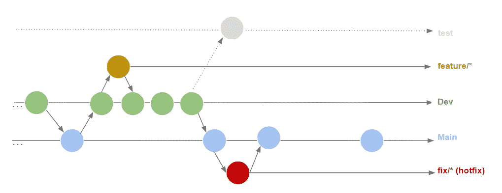
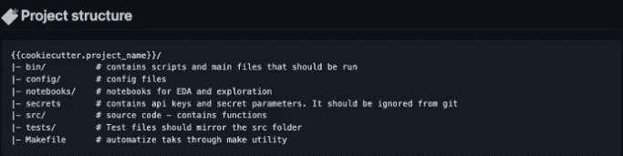
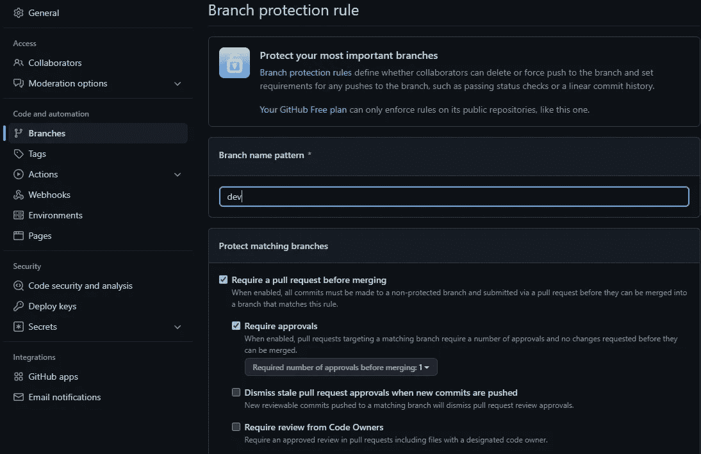
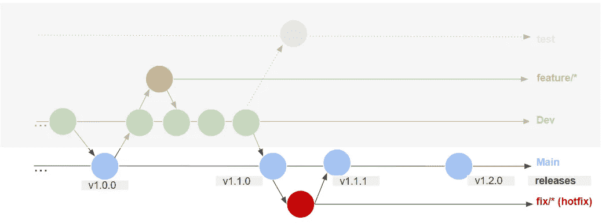

# 启动团队项目时的 GitHub 最佳实践

> 原文：<https://betterprogramming.pub/github-best-practices-when-starting-a-team-project-e557f118ef5e>

来源:unsplash.com[-马库斯·温克勒](https://unsplash.com/@markuswinkler)

下面的文章是关于在团队内和多个参与者一起处理 git 项目时需要应用的一些最佳实践。我们将解决代码质量、开发工作流程、评审和项目发布。

无论项目的规模如何，数据科学家或软件工程师总是有机会在团队中工作，共同为同一个代码库做出贡献。

尽管在团队成员中使用版本控制系统(如 git)是显而易见的，但讨论清晰的共存规则有时会被忽略。

出于这个原因，我考虑在开始一个有多个参与者的新项目时，总结一些我经常讨论的实践，这样每个团队成员都可以记住共同的标准。

# **1。同意通用 git 项目惯例**

## **1.1。编码方式**

关于编码风格有不同的约定，但是我认为最著名的一个是[谷歌风格指南](https://google.github.io/styleguide/)。它包括一套规则，以确保代码清晰易懂，不仅所有者可以理解，所有参与者也可以理解。

规则可能与变量的拼写方式有关，例如(`my_variable`、`MyVariable`...)或应该做什么的更一般的说明。例如(根据变量的用途命名变量，并在注释函数时遵循特定的格式……)。

在 Python 语言中，经常使用 pep-8 风格。幸运的是，即使您不熟悉所采用的编码风格的所有细节，您仍然可以使用像黑色这样的包来自动格式化代码或`pylint`来检测违反这些规则的代码部分。

这里有一篇关于[如何设置它们的文章，以及 git 项目的初始回购结构](https://medium.com/p/829a57b71f5e)。

## **1.2 分支机构命名惯例的使用**

在 git 项目中，典型的工作流程如下所示:

*   `main`:始终包含稳定版本的源代码，作为发行版的一部分在生产中运行。
*   `dev`:包含已开发并准备测试的功能。
*   `test`:质量工程师用来测试代码的稳定性和新开发特性的影响。

我们可以补充一点:

*   这个语法允许我们快速找到正在进行的功能。一些团队使用问题编号作为特性名称的一部分。此外，拥有这种约定有助于在合并之前在 CI 中设置对这些分支的特殊处理。
*   为了清楚起见，我们通常区分缺陷修复和特性。因为臭虫需要特殊的，有时是“紧急的”处理。当 bug 很严重时，它会在测试后立即发布。如果没有，它可以加入开发周期，成为下一个版本的一部分。

## **1.3 设置一个简单的起始项目库结构**

总是建议从包含基本文件夹结构的基本结构开始。一般来说，ide 可以生成一个起始结构，或者您可以构建自己的定制模板，并将其作为所有项目的起点。

特别是，您可以检查这个名为 cookiecutter 的工具，它允许这样做。更多细节可以在本文中找到[。](https://medium.com/p/829a57b71f5e)

## **1.4 一个特征=一个分支**

好吧，如果你正在应用命名惯例，特别是命名你的分支`feature/your_new_feature`，这个规则应该被自动遵守。这对于简化评审过程很重要，因为评审者只关注特定的功能。

# **2。保护分支并请求代码审查**

最常用的代码协作平台 GitLab 和 Github 允许保护分支不直接推送代码。

在团队环境中，经常建议保护 main 和 dev 分支，这样就不会直接对它们进行提交。相反，我们允许 dev 上的 pull 请求，并给予项目维护人员将 dev 合并到 main 中的权利。

换句话说，贡献者应该在他们的 features/*分支上提交他们的代码，然后在 dev 上打开一个 pull 请求。代码首先被审查，然后被合并。

Github 项目设置的屏幕截图，用于在允许在开发分支上合并之前设置所需的批准号

最后，当 sprint 开发准备就绪时，项目维护人员可以将其合并到`main`中。

# **3。处理机密，避免泄密**

在 Github 项目中有不同的方法来处理秘密:要么通过环境变量，要么通过本地文件。

然而，如果采用第二种方式，请确保从 git 跟踪中忽略这些文件。有时会有人提交他们自己的秘密文件。

因此，任何人都可以看到合理的信息。这就是为什么这些类型的文件应该自动添加到`.gitignore`自从项目开始。

# **4。创造一个有意义的。gitignore 文件**

秘密并不是我们不希望版本控制系统跟踪的唯一文件。有时，我们可以在本地拥有样本文件、缓存、日志或虚拟环境文件。

因此，用不需要的路径填充`.gitignore`文件很有趣。这里有一个例子:

# **5。合并时挤压提交**

此外，作为最佳实践的一部分，我们通常在合并分支时压缩提交。实际上，这意味着当一个分支被合并时，只有最后一次提交被保留。这种做法可以减少主分支上的提交数量，只保留相关的提交。

此外，为了避免以过时代码的未使用分支列表结束，我们还可以在合并时删除源分支。

挤压并合并 github 上的一个分支

# 6.使用标签和发布

标签在代码版本控制方面非常实用。它们是一种引用项目的特定版本的方法，并且可以避免拥有多个分支(每个版本一个分支),这些分支很容易过时并且落后于主分支。

这种做法以及合并时的分支删除允许保持最少数量的打开分支，从而使在回购中的导航更加流畅。

释放主分支上的标签

# **结论**

在本文中，我们已经看到了一些在团队中处理 git 项目时可以应用的最佳实践。这些实践包括团队成员之间的良好沟通，以确保每个人都有相同的工作标准以及一些管理开发工作流的技术技巧。