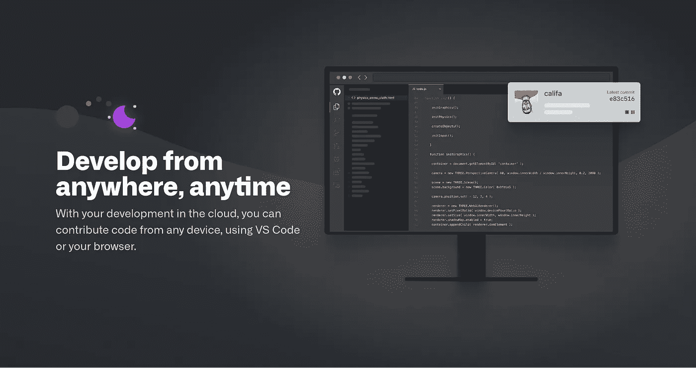
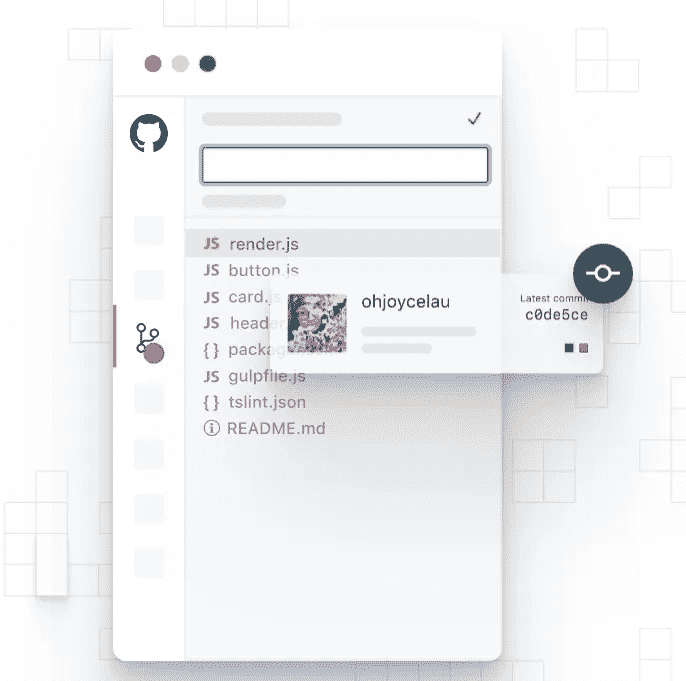
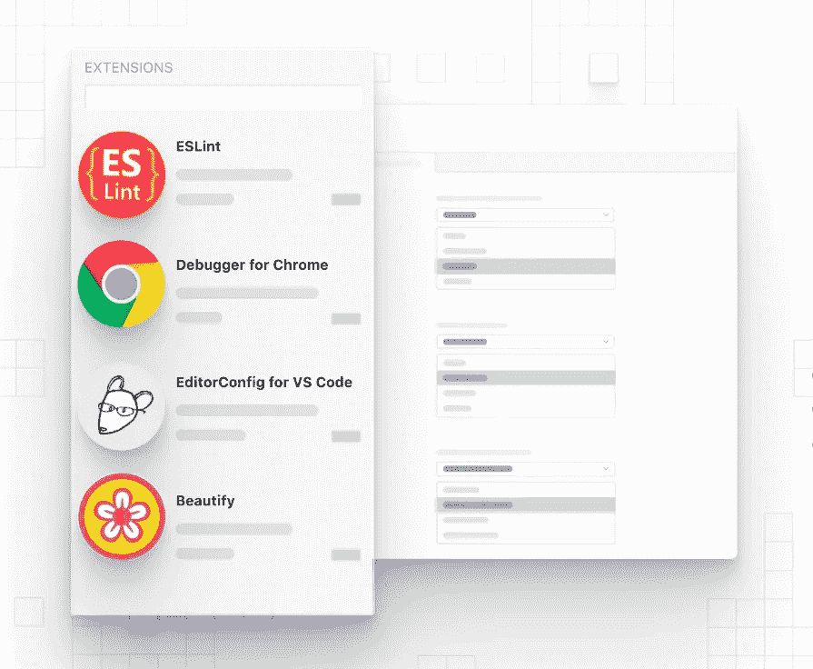
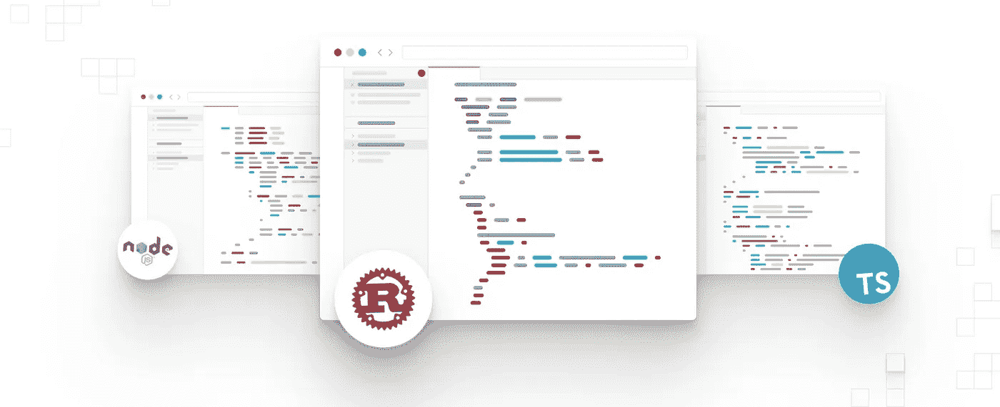

# GitHub Codespaces:任何地方、任何语言的代码，全部来自您的浏览器

> 原文：<https://betterprogramming.pub/github-codespaces-code-anywhere-anytime-in-any-language-using-github-9f27c7a6b4a1>

## GitHub 刚刚改变了编程游戏

图片来源:GitHub

新冠肺炎这种混乱的环境无法阻止科技型企业的创新。另一方面，这种情况使得人们在有限的资源内磨砺自己，进行创新。这种情况甚至无法阻止微软旗下的风险投资公司 GitHub 组织[卫星会议](https://githubsatellite.com/)，他们甚至提出了 GitHub Codespaces 的概念，即“随时随地进行开发”

正如伊万·梅塔在[Next Web](https://thenextweb.com/dd/2020/05/06/github-codespace-lets-you-code-in-your-browser-without-any-setup/)上所说:

> “GitHub 已经推出了 code spaces——一个可以让你直接在网上编码的功能。可以把这看作是云上的虚拟集成开发环境(IDE)。
> 
> “以前，要参与一个项目，您需要发出一个“拉”请求，并根据项目的要求在您的本地机器上设置环境。有了代码空间，你就不再需要这么做了。只要你点击编码按钮，网站就会在几秒钟内设置好编码环境。”

输入代码空间

# 值得注意的一点

我们都喜欢 Visual Studio 用于我们的日常开发，你们中的许多人已经知道，去年微软推出了 Visual Studio 代码的在线版本，称为 Visual Studio Code Online，用于集成在浏览器本身内的开发环境。就在上周，微软将 Visual Studio Code Online 更名为 Visual Studio Codespaces，随后 GitHub 将同一工具直接集成到其 Git repository 托管服务中。

“为社区贡献代码可能很难。GitHub SVP 产品的 Shanku Niyogi[说:“每个存储库都有自己配置开发环境的方式，这通常需要几十个步骤才能编写任何代码。](https://github.blog/2020-05-06-new-from-satellite-2020-github-codespaces-github-discussions-securing-code-in-private-repositories-and-more/)

# GitHub 代码空间的主要特性

## 即时开发环境

Codespaces 为您提供完整的 Visual Studio 代码体验，无需离开 GitHub。在不同环境之间切换很简单——您可以随时离开，也可以切换回来。代码空间将自动重新打开。您可以选择环境大小来匹配每个项目所需的资源量。

GitHub 官方推文

## 发展到在一个地方进行调试

Codespaces 自动设置源代码、运行时、工具和扩展，因此您可以毫不费力地快速开始编码。
内置命令行界面可确保从任何设备无缝编辑、运行和调试应用程序。

调试变得容易

## 简化整个工作流程

GitHub 中的 Codespaces 支持代码完成和导航、扩展、终端访问等等。如果您喜欢使用桌面 IDE，您将能够在 GitHub 中启动一个代码空间，并从您的桌面连接到它。您可以自动设置依赖项和 SSH 密钥，并更快地从代码提交到任何项目。

图片来源:GitHub

## 轻松扩展和定制

这个云托管的开发环境完全包含了 GitHub 的所有特性。它可以被设置为加载开发人员的代码和依赖项、扩展和点文件，并包括一个内置的调试器。您甚至可以从 Visual Studio Marketplace 向环境中添加扩展，以添加其他语言、调试器并连接到其他服务。

图片来源:GitHub

## 轻松快速地参与各种项目

为项目做贡献，而不会使您的本地设置变得复杂。只需点击一下鼠标，即可启动开发环境，甚至是您以前从未参与过的项目，并在它们之间轻松切换。

图片来源:GitHub

# 是付费的还是免费的？

GitHub 尚未正式宣布代码空间的价格，但他们明确提到代码空间 IDE 中的代码编辑功能将永远免费。他们计划为构建等计算密集型任务提供类似于 GitHub Actions 的简单现收现付定价。我认为它将遵循与 Visual Studio Online 相同的定价结构。

在测试期间，Codespaces 是免费的。

这项功能将很快在有限的公共测试版中推出，然后正式向所有人推出。

# 结论

整个开发者社区都期待着看到这个新的代码空间在市场上的表现，也好奇它是否会成为开发的未来，人们可以通过浏览器用 VS 代码做任何事情。

在 https://github.com/features/codespaces/signup报名测试

要更深入地了解代码空间的文档，请前往[https://help . github . com/en/github/developing-online-with-code spaces](https://help.github.com/en/github/developing-online-with-codespaces)

## 别忘了给我们你的👏！

此外，遵循出版物[更好的编程](https://medium.com/better-programming)了解与技术相关的一切。

拍手！拍手！拍手！

请关注作者，定期获取未来文章的更新。

 [## 贾尚·普里特·辛格——中等

### 阅读 Jashan Preet Singh 在媒体上的文章。全栈 Web 开发人员。每天，贾尚·普里特·辛格和成千上万的…

medium.com](https://medium.com/@singhjp) 

随时通过 Linkedin 联系:

 [## jashan Preet Singh——软件工程师——Chai Point | LinkedIn

SDE | |热情 _ 火山| |科技 _ 漫游癖| |新 _ 风险投资 _ 领导力@麻省理工学院](https://www.linkedin.com/in/singhjp006/)