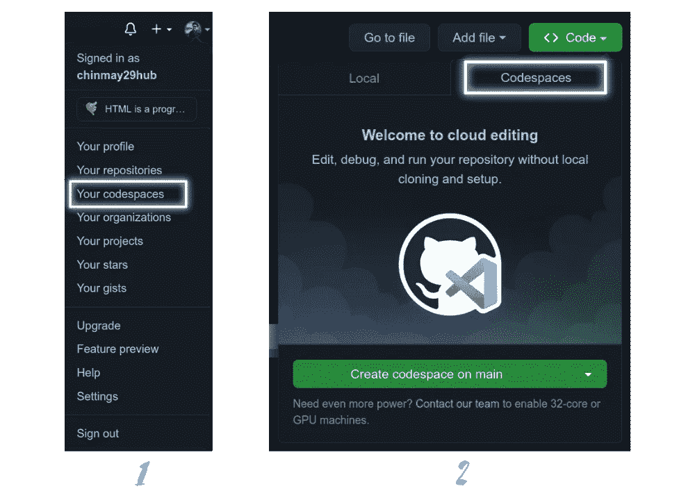
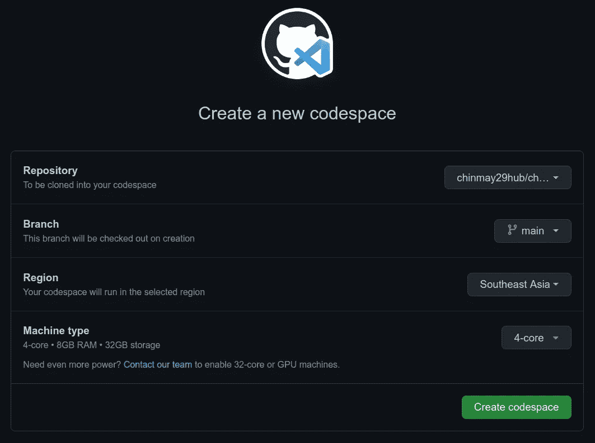
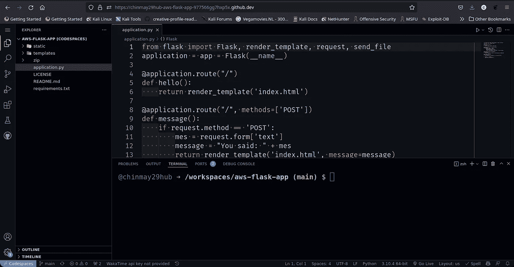
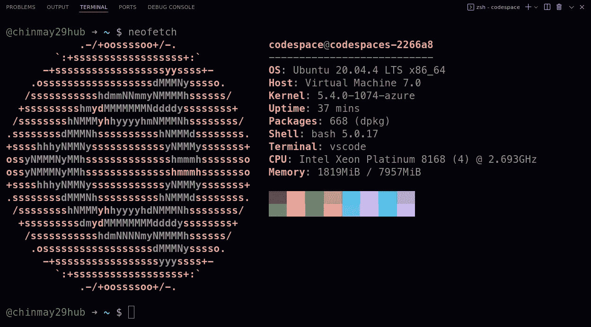
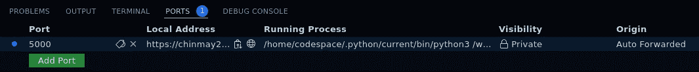
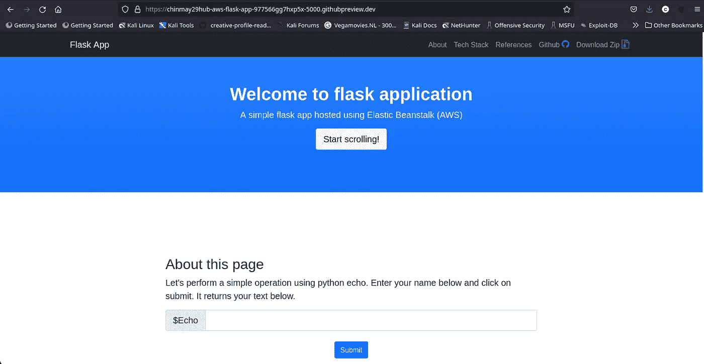
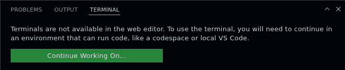

# GitHub 代码空间:学习在浏览器中编码

> 原文：<https://betterprogramming.pub/github-codespaces-learn-to-code-in-your-browser-1a426e5e665f>

## 编码环境的未来


GitHub 代码空间

前几天，当我登录 [GitHub](https://github.com/) 时，我得到了一个弹出窗口，提示我已经可以访问 [GitHub Codespaces](https://github.com/features/codespaces) Beta！虽然，我很久以前就注册了 Codespaces 测试版。由于只有少数用户可以从等待名单中访问该程序，我想分享我使用代码空间的经验。


GitHub 代码空间测试版

我将在本文中讨论以下几点:

*   介绍
*   如何使用代码空间？
*   例子
*   Github.dev 与 Github 代码空间
*   GitHub Codespaces 免费吗？
*   包裹

# 介绍

几个月前，GitHub 发布了它的新应用——Codespaces。代码空间在浏览器本身中为您提供了一个开发环境。这个环境将被托管在云上，所以不用担心硬件。如果您由于 RAM 或 CPU 内核不足而无法运行项目，Codespaces 会为您提供帮助。简单来说， [Visual Studio 代码](https://code.visualstudio.com/)在你的浏览器中运行着一个环境。

开发人员可以在 2-3 分钟内轻松地从 repo 设置项目，避免了首先克隆 repo、安装依赖项、检查兼容性等枯燥的方式。一个环境就像一台计算机，但是在云上。服务器将为开发人员完成所有工作。显然，服务器将基于 Linux，以提供快速服务。

有了 Codespaces，为 GitHub 上的各种项目做贡献也变得更加容易。因为它允许以轻松的方式打开和检查拉式请求。

另外，您使用端口转发吗？假设您有一个客户想要查看您最新的作品，但是您将它放在了本地机器上。因此，您从路由器(`port 80`)转发一个端口，客户端可以使用您的公共 IP 地址查看您的应用程序。

但是如果您在您的 Codespaces 云环境中，您如何在那里转发一个端口呢？Codespaces 会自动为您转发端口！我们将在“示例”部分看到相同的实现。

# 如何使用代码空间？

如果您可以访问代码空间，那么创建一个环境就非常简单。现在，有两种方法:



如何创建代码空间？

登录后，执行以下操作:

1.  点击你的个人资料图标，然后进入代码空间
2.  或者转到一个存储库，点击“代码”按钮和“在 main 上创建代码空间”如果您不是存储库的所有者，它将自动分叉。你可以分别开四个不同的分店。



创建代码空间

*   如果您选择第一个选项，您将得到上面的屏幕。您可以选择存储库和分支。默认情况下会选择最佳区域，但您可以更改它。机器类型代表核心、ram 和存储。默认情况下，在测试版中，我只有一种机器。如果您有团队或企业帐户。你可能有更多的选择。然后，点击创建。
*   如果您选择第二个选项，您可以从上面屏幕的下拉列表中选择高级选项。然后，点击创建。



GitHub 代码空间环境

然后嘣！你在云上！Codespaces 使用 [Docker](https://www.docker.com/) 来创建和管理映像和依赖项。你可以看看网址；每个代码空间都有不同的 URL。所有像 VS 代码一样的特性在这里都有。您还可以将设置和扩展与本地 VS 代码应用程序同步。

你看到的终端就像一个 Linux 终端。您可以安装软件包、启动服务等。如果您想知道您的环境使用的是什么 Linux 版本，您可以简单地使用以下命令:

```
$ cd$ sudo apt install neofetch$ neofetch
```

## 输出



使用 Neofetch 的 Linux 版本

如你所见，是 [Ubuntu](https://ubuntu.com/) 20.04.4 LTS 64 位！

> 如果您不习惯在浏览器中使用 VS 代码，请转到文件>在 VS 代码中打开，这将在您的本地 VS 代码应用程序中打开代码空间环境。但请确保您已经安装了该扩展— [单击此链接安装该扩展。](https://marketplace.visualstudio.com/items?itemName=GitHub.codespaces)

# 例子

我将在这里介绍两个例子:

1.  在代码空间中设置 flask 项目
2.  在代码空间中设置网站项目(HTML、CSS、JavaScript 堆栈)

## 1.在代码空间中设置 Flask 项目

我将设置这个简单的 Flask 应用程序(忽略回购名称；只是一个烧瓶 app)

[](https://github.com/chinmay29hub/aws-flask-app) [## GitHub-chinmay 29 hub/AWS-flask-app:使用 aws beanstalk 托管的简单 flask 应用程序

### 此时您不能执行该操作。您已使用另一个标签页或窗口登录。您已在另一个选项卡中注销，或者…

github.com](https://github.com/chinmay29hub/aws-flask-app) 

只需在 Main 上点击代码>代码空间>创建代码空间

现在，让我们打开终端，点击下面的命令来安装依赖项:

```
pip3 install -r requirements.txt
```

在处理 Python 项目时，最好创建一个`requirements.txt`，它包含项目中使用的库的列表。如果您没有`requirements.txt`，您可以手动安装库:

```
pip3 install <library_name>
```

让我们运行我们的项目:

```
python3 application.py
```

请注意，在终端的“端口”选项卡中，端口会自动转发。此外，还会生成一个 URL。



`CTRL + Click`本地地址上；这是我们应用的 URL。这是一个私人 URL，这意味着只有您在登录 GitHub 时才能看到该网站。但是您可以在“端口”选项卡中将网站的可见性更改为公开，以便向您的客户端显示。

## 输出



## 2.在代码空间中设置网站项目(HTML、CSS、Javascript 堆栈)

我将在 Codespaces 上设置这个使用 HTML、CSS 和 JavaScript 构建的网站项目。这是我第三学期的项目:

[](https://github.com/chinmay29hub/chinmay29hub.github.io) [## GitHub-chinmay 29 hub/chinmay 29 hub . GitHub . io

### 此时您不能执行该操作。您已使用另一个标签页或窗口登录。您已在另一个选项卡中注销，或者…

github.com](https://github.com/chinmay29hub/chinmay29hub.github.io) 

遵循上例中的相同步骤，打开存储库的代码空间。

现在，在这个项目中，端口不会自动转发，因为我们不运行任何东西，只需要一个浏览器来打开 HTML 文件。因此，我们必须手动完成。

打开终端，逐一输入以下命令:

```
$ sudo apt install apache2 -y$ sudo mkdir /var/www/html/backup$ sudo mv /var/www/html/index.html /var/www/html/backup$ sudo cp -r * /var/www/html$ sudo service apache2 start
```

我希望你不要出错。现在，转到终端中的端口选项卡，并单击添加端口。在端口号类型 80(因为 apache2 服务于端口 80)和本地地址字段中，只需点击它，它就会自动生成。

现在，点击地球仪图标——嘣！—您的网站正在运行。

输出


如果关闭代码空间，您可能需要运行以下命令:

```
$ sudo service apache2 start
```

# Github.dev **vs** GitHub 代码空间

你们中的许多人已经搞不清 github.dev 和 Codespaces 了。嗯，这两件事没什么不同。对于那些不知道 github.dev 是什么的人来说，它是一个基于 web 的编辑器，就像 VS 代码一样，可以通过导航到存储库并按下点(。)键。

它将在编辑器中打开存储库，您可以随时编辑代码。Github.dev 支持扩展，VS 代码账号同步等。

它不同于代码空间，因为它不提供任何环境，而且它就像一个移动应用程序。例如，如果您尝试在 github.dev 中打开终端，您会得到以下消息:



它告诉你终端在 web 编辑器中是不可用的。相反，您需要在一个可以安装、配置等的环境中处理代码空间。另一件事——GitHub dev 不允许你运行任何东西——只是编辑代码。

# GitHub Codespace 免费吗？

我也有同样的疑问，我联系了 GitHub 支持部门。

他们告诉我，很明显，在下一次公告之前，测试版用户是免费的。如果你不是 beta 用户，但仍然想使用 Codespaces，你可以查看下面的链接:

*   [https://github.com/pricing](https://github.com/pricing)
*   [https://docs . github . com/en/billing/managing-billing-for-github-code spaces/about-billing-for-code spaces](https://docs.github.com/en/billing/managing-billing-for-github-codespaces/about-billing-for-codespaces)

或者你可以试试运气，让[加入 GitHub codespaces 的等候名单](https://github.com/features/codespaces/signup)！

# 包裹

微软创造的东西太棒了！这就是未来。因为它是基于云的，所以既快又安全。这是开发人员在一个项目中合作的最快、最有效的方式。

```
**Want to Connect?**Connect with me on [LinkedIn](https://www.linkedin.com/in/chinmay-sonawane-38474019a/).
```