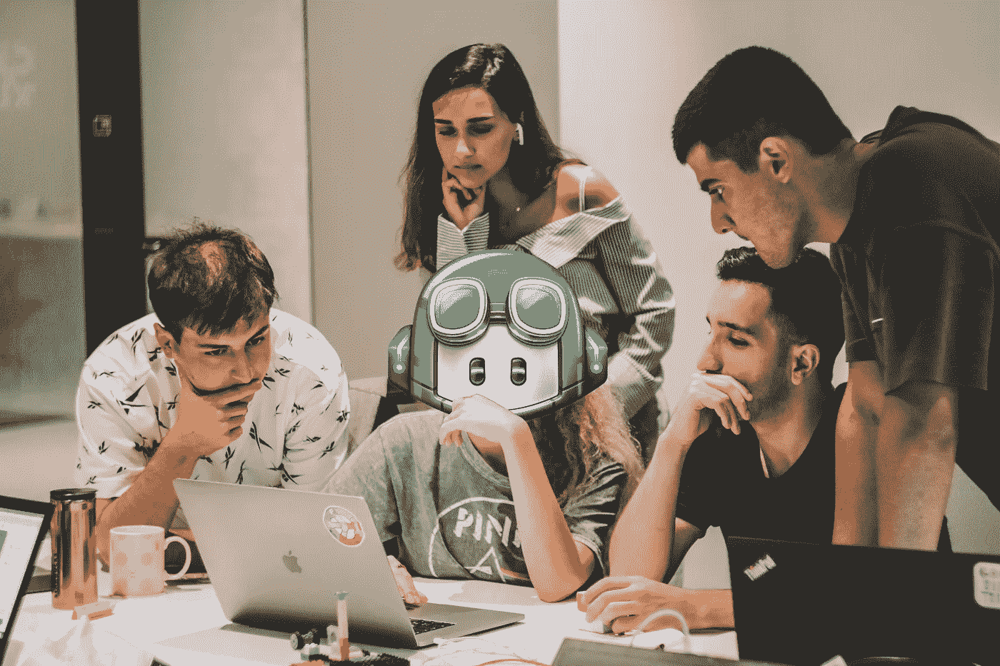

# GitHub Copilot:程序员的工具还是厄运？

> 原文：<https://betterprogramming.pub/github-copilot-a-tool-or-doom-for-programmers-dfa79ba84bbc>

## 你应该担心失业吗？

作者编辑， [Lala Azizli](https://unsplash.com/@lazizli?utm_source=unsplash&utm_medium=referral&utm_content=creditCopyText) 原图来自 [Unsplash](https://unsplash.com/?utm_source=unsplash&utm_medium=referral&utm_content=creditCopyText) 。

自从 GitHub Copilot 发布以来，它给开发者社区带来了惊喜和恐惧。许多人担心 Copilot 会使人类过时，从而将编程工作置于危险之中，而其他人仍然对它在不久的将来接管市场持非常怀疑的态度，并不太担心。

为了更好地了解情况并做出明智的预测，我们首先要看看过去在类似情况下发生了什么。

# 自然选择是如何发挥作用的

早在 1858 年，一个名叫 [Charles Darwin](https://en.wikipedia.org/wiki/Charles_Darwin) 的简单人提出了[自然选择](https://en.wikipedia.org/wiki/Natural_selection)的概念，这是一种进化的自然机制，通过这种机制，由于个体[表现型](https://en.wikipedia.org/wiki/Phenotype)的差异，个体比其他个体生存并有效地繁殖更多，表现型是一组可观察到的生物特征，如大小或行为。

自然选择，以及物种的生存，是环境和个体适应程度的函数。赫伯特·斯潘塞创造了“适者生存”这个短语，意思是一个有机体越适应它的环境，它就有越多的机会生存下来并繁衍后代。

像所有生物一样，人类也不例外。唯一的区别是，我们已经学会根据自己的喜好来改变环境。然而，这并不意味着我们不必适应我们已经建立的世界。

# 工作是如何诞生和消亡的

纵观历史，我们创造了无数新的工作岗位，尤其是在重大的技术或社会进步之后。例如，计算机的出现导致了软件开发工作和全新职业选择的诞生。

同样的，工业革命通过降低物品的生产成本，淘汰了许多手工制造的工作，而机器则更受青睐。因此，企业家不想支付昂贵和效率较低的人，以缓慢的速度制作产品。

总的来说，只要对某项特殊技能有需求，新的工作就会产生；相反，当不再需要这种技能时，它们就会消失，就像不健康的生物通过自然选择而死亡一样。

# Copilot 会是下一个环境改变吗？

为了更好地预测 Copilot 是否能取代编程工作，我们必须分析它的技能:它能完成程序员被雇佣的任务吗？

正如你们大多数人可能知道的那样，它可以访问无数的开源库进行学习。因此，它可以像人一样完美地使用最流行的框架和库。唯一的区别是，副驾驶不需要先阅读文档，也不需要从头开始学习特定的技术，因为其他人已经为他做了。

尽管如此，Copilot 无法自己编码整个系统。目前它需要一个人来设计复杂的软件，并一步一步地解释它应该做什么任务。然而，一旦它熟悉了代码库，Copilot 就能够通过分析上下文来推断程序应该做什么，从而在没有任何人工帮助的情况下生成代码。

GitHub Copilot 生成的函数，给定输入注释。

Copilot 甚至可以逆向工作，这意味着，给定一个函数，它可以生成关于其行为、参数和返回类型的较为准确的文档。

不幸的是，或者幸运的是，副驾驶并不完美，也会犯错，就像人类一样。有时它可能会混淆，特别是在跨多个文件和文件夹的大型代码库中，并提示完全错误的完成。更糟糕的是，看似合法的建议可能会在你的程序中引入一个偷偷摸摸的错误，因为副驾驶还没有完全理解你的想法。这就是为什么每一个代码建议都应该由一个对代码库足够熟悉的人类程序员来仔细监督，以检测微小的缺陷。

GitHub Copilot 不包括零分度检查。

就像手制造商已经成为工业工人，他们的工作从手工制作产品转向装载、监督和维护机器，程序员可能会遇到同样的命运:向 Copilot 描述任务，检查建议中的错误，并进一步改进它。

不过，至少在目前，Copilot 还不能取代人类，因为软件开发不仅仅是编码，而是一个非常广泛的领域，包括提出一个想法，通过选择正确的设计和技术组合来实现它，进行测试，最后部署应用程序。此外，用户的反馈应该被考虑在内，让产品适应人们的喜好，更不用说经济，还有很多 Copilot 不了解的其他领域。

Copilot 目前对开发者没有真正威胁的原因是，它不是被设计成一个通用的人工智能，而是一个只知道代码的编程助手。最重要的是，它通过分析现有的存储库来学习，所以它不太可能提出全新的软件设计和概念，而是从首先发明它们的工程师那里获得它们。

# 未来呢？

虽然你不必担心在不久的将来 Copilot 会接管编程工作，但环境变化总是在角落后面。如前所述，自然选择也适用于人类社会，尤其是在经济学领域。

由于市场永远不会静止，受欢迎的技能总是在变化。跟上新技术和趋势的发展是很重要的，这样才不会被下一个大事件搞得措手不及。这意味着你永远不应该停止学习和获取新技能，以拓展更广阔的市场视野，并保持头脑随时准备适应环境的变化。

获得一份安全工作的唯一方法是提供你的竞争对手无法比拟的服务。在需要更多努力的艰苦领域投入时间获得经验，因为与不太耗费大脑的入门级编码工作相比，它们不太可能被人工智能接管。这样，你的地位将不会受到 Copilot 或任何类似系统的威胁，因为你将是开发这些技术的人。

纵观编程的历史，我们已经有过很多类似的情况。最初的重大变革之一是编译器的发明，它逐渐使汇编开发者越来越不受欢迎，因为他们可以用更低的成本获得同样的结果。接下来，由于像 [TensorFlow](https://en.wikipedia.org/wiki/TensorFlow) 这样的框架，从零开始进行机器学习在商业环境中已经变得过时。类似地，普通的编码任务最终将由人工智能或无脑框架来执行。

# 结论

所以，编程工作不会被人工智能取代，至少在未来十年不会。正因为如此，你不应该担心副驾驶会很快抢走你的位置。尽管如此，现在是时候开始寻找环境变化的迹象，扩展你的技能组合，以免成为下一次自然选择市场事件的受害者。

> 不要把时间浪费在平庸上:任何人都可能在任何时候取代你。是你如何投资，让你与众不同。

我希望你喜欢这篇文章。感谢阅读！