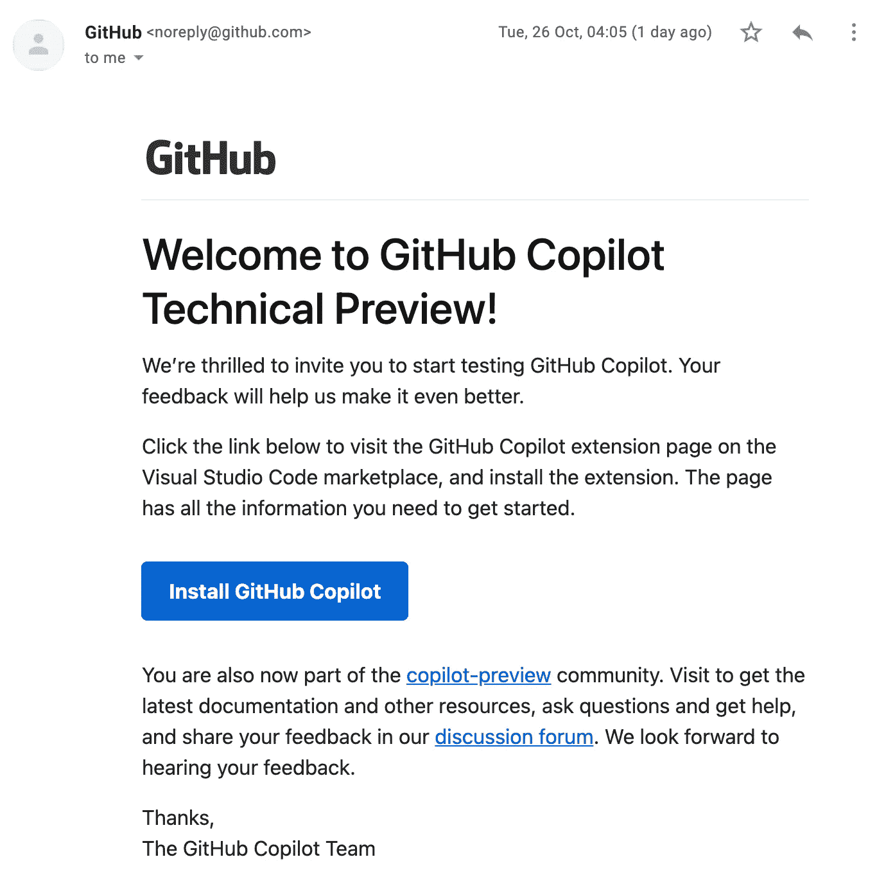
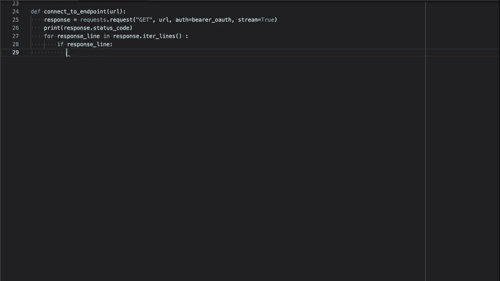
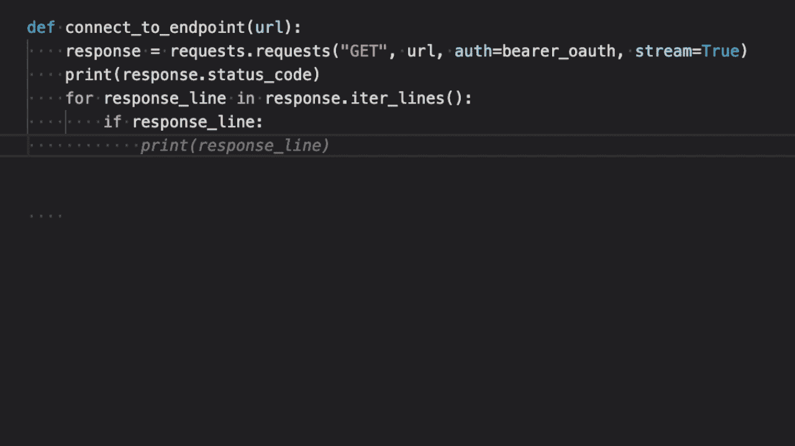
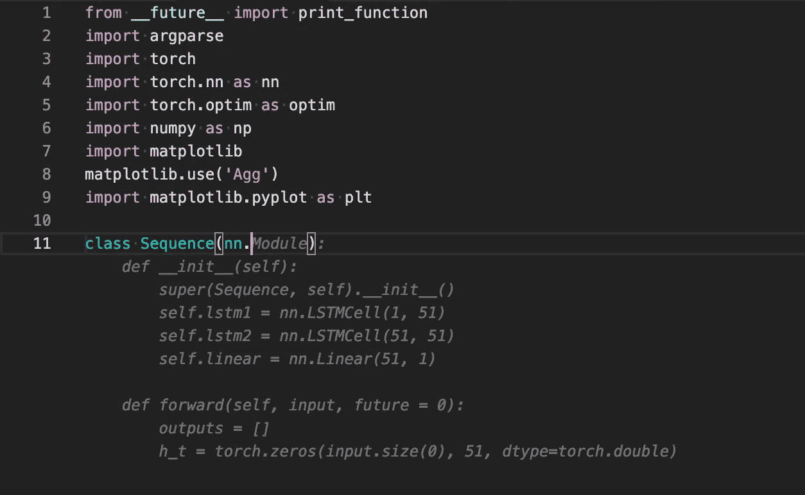
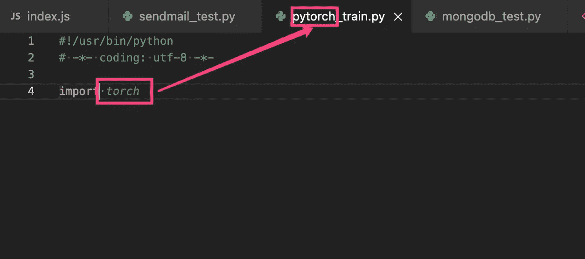
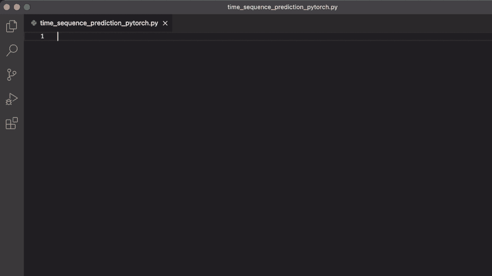

# GitHub Copilot:自动完成终止器

> 原文：<https://betterprogramming.pub/github-copilot-autocomplete-terminator-57676d2ca754>

## 测试 Copilot 与其他人工智能工具相比表现如何

迈克尔·马莱在 [Unsplash](https://unsplash.com?utm_source=medium&utm_medium=referral) 上的照片

上一篇: [*AI:自我编程，离我们还远吗？*](https://saneryee-studio.medium.com/ai-self-programming-is-it-far-from-us-66e58afca3c9) ，我们已经讨论了目前的 AI 自动补全工具。在那篇文章中，我提到过，或许 GitHub Copilot 就是程序员的未来——AI 编程助手。

邀请电子邮件

当时 Github Copilot 刚刚发布，还没有对外开放。然后，上个月，我收到了 GitHub Copilot 团队的邮件，邀请我测试 GitHub Copilot。

虽然用了不到一个月，但还是有很多惊喜想和大家分享。

# 测试

先用[测试代码 1](https://gist.github.com/gsangeryee/be201aa7f2656ed6426d71082862141e#file-test_code-py) 来自 [*AI:自编程，离我们远吗？*](https://saneryee-studio.medium.com/ai-self-programming-is-it-far-from-us-66e58afca3c9) 和[测试代码 2](https://github.com/pytorch/examples/blob/master/time_sequence_prediction/train.py)from[*Kite vs . TabNine:你应该选择哪个 AI 代码自动完成？*](https://medium.com/swlh/kite-vs-tabnine-which-ai-code-autocomplete-should-you-choose-eb6eba85c3a6) 来看看 GitHub 副驾驶的表现。在那两篇文章中，我测试了几种流行的代码自动完成工具:TabNine、Kite、IntelliCode 和 aiXcoder。

图 1:标签

图 2: GitHub Copilot

图 1 和图 2 比较了使用 TabNine 和 GitHub Copilot 输入相同的代码片段(测试代码 1)。可以看到 GitHub Copilot 的代码补全(格雷码)非常深入。它甚至可以完成整个功能，包括具体的参数。

当使用 GitHub Copilot 输入[测试代码 2](https://github.com/pytorch/examples/blob/master/time_sequence_prediction/train.py) 时，这个特性会更加明显。

使用 GitHub Copilot 测试代码 2

如图，GitHub Copilot 完成了整个代码，没有改动。因此，测试代码 2 只需要敲击键盘 359 次；该代码共有 3243 个字符(含空格)。在之前使用 TabNine 和 Kite 的测试中，击键次数超过了两千次。

两次测试的结果差距太大了。此外，由于这段代码来自 GitHub 上的 Pytorch 公共库，我怀疑 Copilot 为我找到、复制并粘贴了这段代码。

我还发现 Copilot 在测试的时候会根据你的文件名给出相关的推荐码。比如文件名包含 PyTorch(一个流行的机器学习库)像`pytorch_train.py` ，那么当我在 python 文件中输入 import 时，它会先导入`torch`库，如下图所示。

按文件名提示

## 意识流编程

此外，GitHub Copilot 还会根据评论进行代码推荐。所以我想测试一下 Copilot 只用函数的文件名和注释能生成多少可用的代码。我仍然使用测试代码 2 作为参考代码。

如图，文件名为`time_sequence_prediction_pytroch.py`，说明了这个代码的作用:`# Create a Sequence Model with 2 LSTM Layers and a Linear Layer`。这句话也是第一行评论的内容。

接下来，我只输入了关键字`class`，剩下的代码由 Copilot 提供。我只是按了几次 Tab 键(Copilot 的快捷键)。你可以看到 Copilot 生成的内容和我想要的代码几乎一模一样。

所以整个过程就好像你在看 Copilot 怎么思考，怎么写出你想要的代码。

慢慢的，在我输入了一些单词之后，我很期待 Copilot 会给我推荐什么样的代码。虽然，目前版本的 Copilot 会等几秒钟才会给出提示，你甚至能感觉到它在思考。

# 结论和想法

Andrej Karpathy 的 GitHub 副驾驶体验，来自 AK 的 Twitter。

距离 GitHub Copilot 预览版发布已经一个多月了，你仍然可以时不时在社交媒体上发现一些关于 Copilot 的趣事和批评。如果你足够细心，你会发现它是根据你的反馈不断进化的。

如果你是一个面向 GitHub 的程序员或者面向 StackOverFlow 的程序员，需要从 GitHub 和 StackOverflow“借用”代码，那么 GitHub Copilot 是你最好的选择。

如果你是一名高级程序员，Copilot 可以帮你省去很多“体力劳动”，比如函数结构代码、初始化代码、setter & getter、测试代码、注释等。你可以更专注于设计和创造活动。

我一直很欢迎 AI 的技术创新和进步，因为 AI 就是未来。尽管现阶段仍存在这样或那样的问题，但我们可以感觉到它每天或每小时都在演变。作为“程序员和艺术家”，我们应该在创造性工作中发挥我们的能力。

最后，作为一个程序员，你无论如何都要试试这个东西。

感谢阅读。