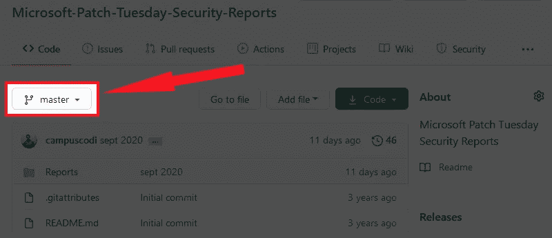

# Github 将“Master”替换为“Main ”,这是科技包容性的一大胜利

> 原文：<https://betterprogramming.pub/github-replacing-master-with-main-is-a-huge-win-for-inclusion-in-tech-bf517478275b>

## 小事就是大事

图片来源:作者

自从三年前我开始了我的软件工程之旅，有很多次我发现这个领域是不包容的。其中最令人震惊的是“主-从”架构这个术语，以及我每天从 Github 上的*开始向“主”请求更新的事实*

更糟糕的是，在软件工程中,“机器”通常被称为“工人”,所以我听到人们*在工作*讨论“杀死奴隶【工人】”时，谈到了搞垮服务器。

最近， [Github 进行了一次转型](https://www.zdnet.com/article/github-to-replace-master-with-main-starting-next-month/)，将他们的主要分支标记为“主”分支，以努力推广更具包容性的语言，今天我在 Github 上创建了我的第一个回购协议，其中术语“主”已被重命名为“主”

这符合整个科技行业向更具包容性的语言转变的许多变化，如果说这种变化虽然很小，但令人难以置信地令人满意，这是一种保守的说法。

在新的回购协议中,“主”现在被替换为“主”

它可能看起来很小。然而，许多(如果不是大多数的话)目前在软件工程岗位上的少数族裔已经找到了他们自己的方式来压制或抑制这些对奴隶制的日常提及——而我们的许多白人同事在日常工作中与“主人”或“奴隶”术语互动时会不假思索。

更重要的是，招聘人员和那些抱怨让少数族裔进入科技行业这一永远难以捉摸的“管道问题”的人不知道,“主人”和“奴隶”等不必要的非包容性术语造成了多大的障碍，导致许多进入“管道”的少数族裔的离职率高于白人。

# **《大师》差点让我退出软件工程**

就我个人而言，我回想起一个特别的例子，当我几乎放弃学习编码的时候。从表面上看，我的问题似乎是一个讨厌的，但初学者常见的错误。回想起来，我意识到我和“师父”之间的对峙才是我挣扎的真正原因。

对于非技术性问题，请想一想您忘记保存一个崩溃的文件并且丢失了所有工作的时候。想象一下，每次你保存一个文件，而不是点击“另存为”或“打开”，你必须明确地输入“主人，我能保存这个吗”和“主人，请打开这个。”这就是 Github 的工作方式——这就是软件工程师的工作方式！

对于那些技术人员来说，你知道有时“大师”会给你你想要的，但其他时候你必须乞求“大师”给你文件的更新版本。

最重要的是，我正处于失去 200 多个小时工作的边缘，唯一阻碍我的是“主”分支机构扣留了我的代码。

我花了很多时间在谷歌上搜索如何解决这个问题，所有的东西都是“主”这个“主”，“推为主”，“从主拉”，“重置为主”，“合并为主”，“源主”，“远程主”……“主”，“主”，“主”，“主”，“主”。

事实上，今天我搜索了“如何修复 Github 上的合并冲突”的顶部结果。第一名[的结果](https://stackoverflow.com/questions/161813/how-to-resolve-merge-conflicts-in-git)有 **31 次提到“大师”。**

不管实际的错误是什么，也不管修复起来有多难。我清楚地记得自己在想:

> ***“这到底为什么叫‘大师’？我凌晨 3 点在这里和“主人”打交道干什么，就像 19 世纪一样？”***

最后，我选择从头开始，而不是再读一遍关于“大师”的东西，我最终创建了一个比我最初构建的更好的版本。然而，这是*如此，如此，*接近成为一名软件工程师的旅程的终点。

# 更具包容性的术语绝对会提高技术的多样性

我能够在与“大师”的战斗中坚持下来，并最终成为一名软件工程师。

但对于每一个成功的故事，都有几十个(如果不是更多的话)其他少数民族，对他们来说，这种持续的不包容成为众所周知的“压垮骆驼的最后一根稻草”。由于这些不断提醒他们科技是由白人建立并为白人服务的，他们不再追求科技职业。

他们可能已经明确注意到非包容性语言以及许多其他例子(即黑名单意味着“拒绝”，白名单意味着“允许”)，或者它可能更潜意识，但无论如何，如果我们真的想提高多样性，消除少数群体的冒名顶替综合症，对我们在科技领域使用的语言进行这些改变是必要的。

几年前就应该这样做了——但迟做总比不做好。我为 Github 和整个行业鼓掌，因为他们做了正确的事情，做出了这些改变，让技术变得更加包容。