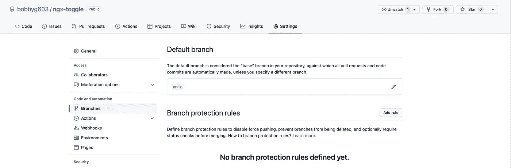
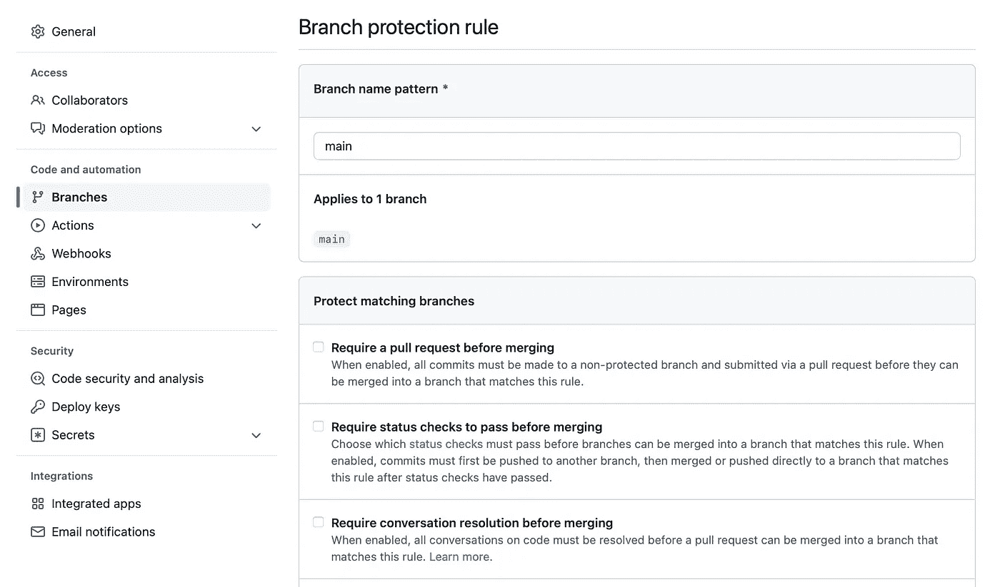
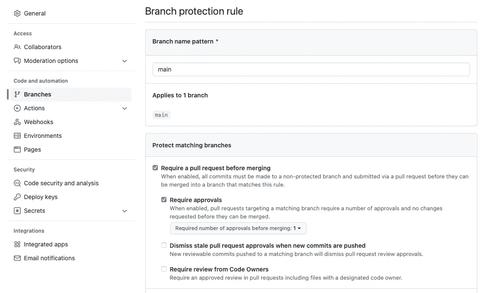
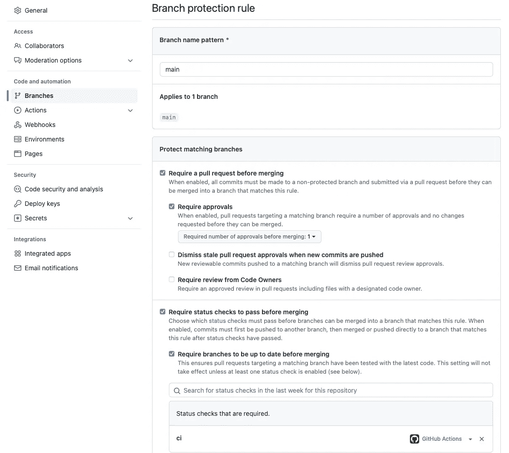
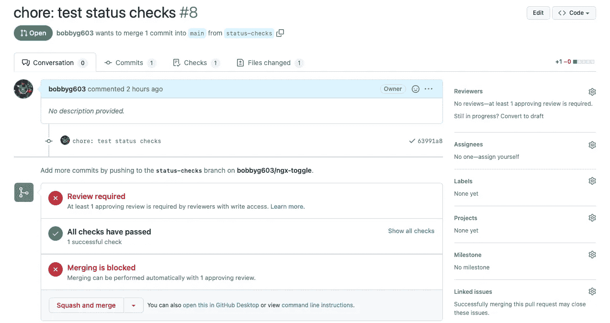

# GitHub 状态检查和分支保护变得简单

> 原文：<https://betterprogramming.pub/github-status-checks-and-branch-protection-made-easy-b70d6d9ffc76>

## 使用分行保护规则，以确保您的回购协议的质量贡献


让 GitHub 分支保护骑士守护你的回购(图片由 [motoDanmoto](https://www.shutterstock.com/image-photo/tangsel-indonesia-april-19-2021-lego-1971851282)

GitHub 提供了一套选项，允许您确定在将 pull 请求合并到存储库之前必须满足的特定标准。本文将概述如何配置一个[分支保护规则](https://docs.github.com/en/repositories/configuring-branches-and-merges-in-your-repository/defining-the-mergeability-of-pull-requests/managing-a-branch-protection-rule)，它要求对拉请求进行审查，以及一个[状态检查](https://docs.github.com/en/pull-requests/collaborating-with-pull-requests/collaborating-on-repositories-with-code-quality-features/about-status-checks)，以确保测试在各种环境中运行。在比喝一杯咖啡还短的时间内，您可以显著降低流氓合并对您的代码造成严重破坏的风险。

# 🛡保护你的分行

守护王国的第一步是增加一个[分支保护规则](https://docs.github.com/en/repositories/configuring-branches-and-merges-in-your-repository/defining-the-mergeability-of-pull-requests/managing-a-branch-protection-rule)。添加分支保护规则允许您指定一个标准列表，必须满足这些标准才能将更改合并到受保护的分支中。指定合并前必须满足的标准列表，可以让您形式化和自动化重复任务，这些任务对于确保您的 repo 的质量贡献是必要的。分支机构保护对公共回购是免费的，但需要将专业订阅添加到私人回购中。

点击 repos' GitHub 页面上的“设置”选项卡，添加您的第一条规则，并导航至“分支机构”部分。记下您的默认分支(通常是`main`)并点击 Add Rule:



GitHub Repo 分支设置菜单

在**分支名称模式**输入中输入`main`并点击**输入**或点击**保存更改**:



GitHub 分支保护规则

恭喜你。您刚刚将`main`定义为受保护的分支。在下一步中，您将开始定义必须满足的标准，以便将更改合并到您的受保护分支中。

# 👀需要审查

当需要审查时，对您的回购有推送权限的人必须在将拉取请求合并到受保护的分支之前，对打开的拉取请求进行批准。要求对拉式请求进行审查是减少引入的错误数量的一个很好的方法，因为它确保了在您的回购中有经验的人已经检查了变更并在适当的时候提出了问题。

如需查看拉动请求，点击**旁边的复选框，在合并**之前需要一个拉动请求。请确保同时单击“需要批准”旁边的复选框:



要求批准拉取请求

厉害！现在，当一个拉动请求被打开时，**合并**按钮将被禁用，直到至少有一个贡献者审核并批准了更改。在最后一步，我们将添加一个[状态检查](http://status check)来确保一个特定的动作已经成功运行完成。

# 🦿运行测试

对于贡献者提出的任何变更，运行存储库中的所有测试是非常重要的。为每个拉请求运行测试降低了回归和其他错误被引入代码的可能性，并确保合并到受保护分支的代码具有更高的质量。如果您有兴趣了解更多关于测试的知识，请查看这篇文章[中的](https://medium.com/better-programming/unit-testing-software-in-2022-b3ac00962c65)来了解单元测试基础知识的速成课程。

要配置利用 GitHub 动作来运行测试的状态检查，创建一个`.github/workflows/ci.yml`文件。以下要点包含将运行 Node.js 应用程序测试的工作流:

简单的 Node.js 测试工作流

如果您没有使用 Node.js 进行开发，您将不得不修改`ci.yml`来使用您的平台。这里有一些链接概述了如何在其他平台上用 GitHub 动作运行测试:[。NET](https://docs.github.com/en/actions/automating-builds-and-tests/building-and-testing-net) 、 [Python](https://docs.github.com/actions/automating-builds-and-tests/building-and-testing-nodejs-or-python?langId=py) 、 [Ruby](https://docs.github.com/en/actions/automating-builds-and-tests/building-and-testing-ruby) 、 [Swift](https://docs.github.com/en/actions/automating-builds-and-tests/building-and-testing-swift) 、 [Java](https://docs.github.com/en/actions/automating-builds-and-tests/building-and-testing-java-with-gradle) 。

要在合并拉请求之前要求干净的测试运行，请导航回您的 repo 的**设置**页面。点击**旁边的复选框，要求在合并**之前通过状态检查。在**输入字段中搜索`ci`搜索该存储库**上周的状态检查，并点击搜索结果以启用状态检查:



要求对受保护的分支进行状态检查

不错！如果您打开一个“拉”请求，您应该会注意到，在状态检查完成且“拉”请求已被审核之前,“合并”按钮不会变成绿色:



启用受保护分支并进行审查和状态检查后，请求拉取

```
**Want to Connect?**If you found the information in this tutorial useful please subscribe on [Medium](http://bobbyg603.medium.com), follow me on [GitHub](https://github.com/bobbyg603), and/or subscribe to my [YouTube](https://www.youtube.com/c/bobbyg603) channel.
```