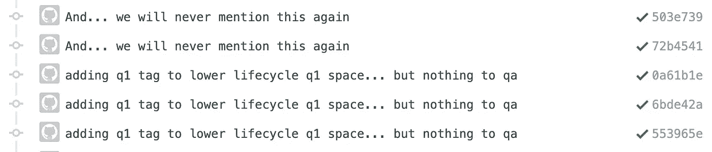
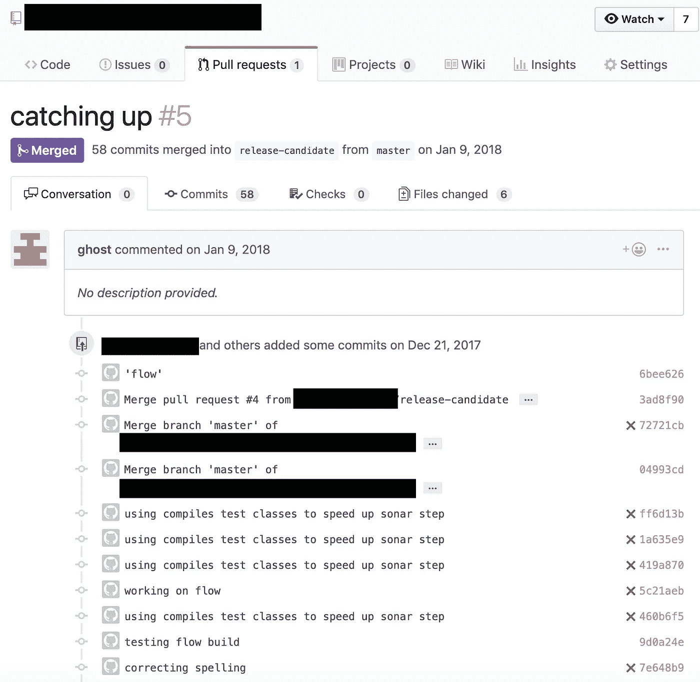
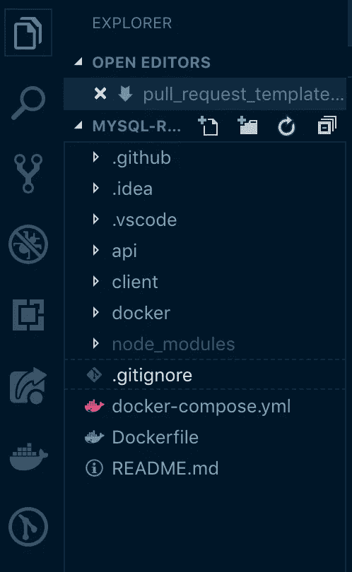
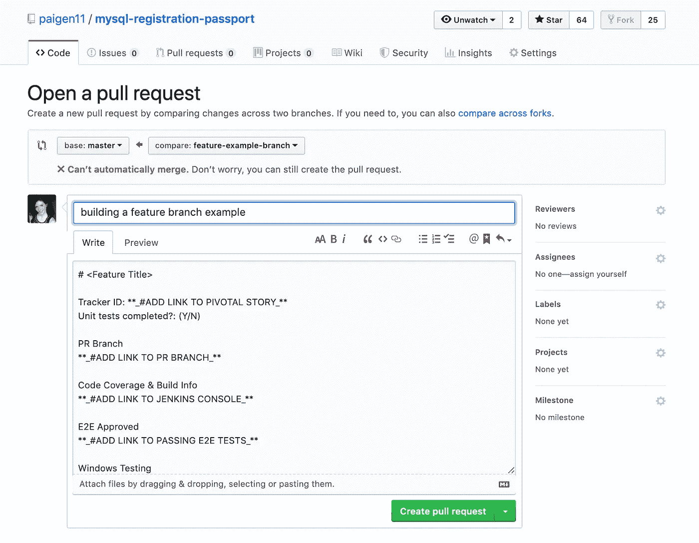

# Github 模板:在开发团队中形式化拉取请求的更聪明的方法

> 原文：<https://betterprogramming.pub/github-templates-the-smarter-way-to-formalize-pull-requests-among-development-teams-89f8d6a204f>

## 不再有令人困惑的拉取请求

照片由[rawpixel.com](https://www.pexels.com/@rawpixel?utm_content=attributionCopyText&utm_medium=referral&utm_source=pexels)从[佩克斯](https://www.pexels.com/photo/group-hand-fist-bump-1068523/?utm_content=attributionCopyText&utm_medium=referral&utm_source=pexels)拍摄

# 介绍

欢迎光临！今天我要给你一个更好、更简单、更有效的方法来保持拉请求不仅统一，而且完全定制给你的开发团队。

# 共同的问题

如果您曾经作为软件开发人员单独或作为团队的一员与 Github 一起工作过，您应该对我将要向您展示的问题很熟悉。

## 留下不太好的提交消息

首先，无意义的提交消息。这些消息通常会被发送多次，因为我们作为开发人员很懒，会不断地用相同的注释将更改推送到 Github，即使更新与该消息没有任何关系。

这是我在我的团队拥有的一个共享回购中发现的一组典型的提交消息。

**边注:**如果你想看一些笑出声来的 commit 消息，我强烈推荐网站 [*What the Commit*](http://whatthecommit.com/) 。只需不断刷新页面，获得源源不断的令人捧腹(且准确)的提交消息。

## 完全令人费解的拉请求

你已经看到了(和/或提交了)像这样的对回购的拉取请求——不要试图否认它。为了保护罪犯的隐私，姓名和识别细节被省略了。

非常好。这无疑告诉了我我需要知道的事情。

是的，这是 GitHub 上的一个实际的 pull 请求，标题只是“赶上”一大堆 commit 消息，没有给出任何上下文，也没有提供任何其他细节，任何人都不知道这里发生了什么。

在这一点上，你可能会对自己说，事实上，这和你以前看到的(或提交的)东西很相似，你可能看不出有什么大问题。

如果你是一个独自开发自己项目的人，总是知道代码库中的一切，我可能倾向于同意你的观点。然而，如果你在一个有 10 或 20 名其他开发人员的团队中，构建一个被成百上千人使用的应用程序，其他开发人员必须查看你所做的更改，确定代码和逻辑是否合理，并且不会破坏你的`master`代码分支中的任何东西，这是一个非常非常大的问题。

# 临时解决方案——不要费心使用这些选项，⚠️

为了解决这些问题，我的开发团队过去尝试了几种不同的解决方案:

## 选项 1:完全手动的过程

一个松散的需求集合，我们必须手工添加到每个新的拉请求中。比如:

*   链接到我们在 backlog 中正在制作的专题报道，
*   链接到自动化的 Jenkins 分支，我们的功能分支在这里构建并部署到 QA 中，
*   链接到用于测试的功能分支，
*   代码覆盖率报告，
*   其他回购中相关 PRs 的链接等。

这很好，除了人们通常忘记(或者只是不关心添加)一个或多个链接，我们没有一个正式的系统让新加入团队的开发人员知道如何格式化他们的 PRs。

## 选项 2:每次都需要复制/粘贴到 PR 中的模板

我们的第二次尝试稍微不太手工:我的团队将一个 pull 请求模板保存在一个 Slack `.txt`文件中，该文件被固定在我们的一个开发通道中。这看起来是这样的:

但是再一次，开发人员必须找到模板，复制 markdown 格式，并将其粘贴到每个打开的 pull 请求中，并填写其中的内容。

这种方法效果更好，因为模板至少确保了遗忘东西的可能性更小，但它仍然不是万无一失的。通常(因为开发人员也是人，人们也很懒，包括我自己)，我们只是去找一个旧的关闭的 PR，复制它的内容并粘贴到我们正在处理的新 PR 中。这是可以的，直到有人忘记更新故事链接或端到端测试链接…你看到问题了。

但这是最好的解决方案，直到我们的团队有了一些新的开发人员。

当我向我们的一个新开发人员展示我们使用的 PR 模板时(通过从另一个关闭的 pull 请求中复制)，他问我们为什么不直接使用 [Github 模板](https://help.github.com/en/articles/creating-a-pull-request-template-for-your-repository)，我说，“因为我们都没听说过它们。”然后，他给我看了一些很酷很容易做的东西。

# 更好的解决方案——我们现在使用的(你应该 Too)⭐️

## 选项 3: Github 模板——制作 PRs 的自动化方式

Github 模板是 GitHub 的一项了不起的发明，用于请求和发布。因为 PRs 是我的团队所关心的，所以我找到了 GitHub 文档来了解更多。

以下是我从医生那里了解到的情况:

> 当您将“拉”请求模板添加到存储库中时，项目参与者将自动在“拉”请求正文中看到模板的内容。— GitHub 文档

这正是我的团队需要的东西。这是一种确保每个拉取请求都是统一的方法，而我们的开发人员不必考虑这一点。完美。

事实证明，它也非常容易安装。

## 在项目中设置 Github 模板

虽然建立一个公关模板非常简单，但为了方便起见，我很乐意在这里列出步骤。

**第一步:在项目**的根目录下添加一个 `**.github/**` **文件夹**

文件上说你可以把公关模板放在根目录下，或者放在一个名为`docs/`或`.github/`的文件夹里。

因为我们想在开发的大部分时间忽略 PR 文件夹，所以我选择在隐藏的`.github/`文件夹中创建模板。

这是我的 repo 的一个镜头，在项目的根目录下有一个隐藏的`. github/`文件夹。

**第二步:在**文件夹中添加你的 `**pull_request_template.md**` **markdown 文件**

为了让 Github 自动从 PR 模板的 markdown 文件中提取格式，您必须将文件命名为`pull_request_template.md`。

下面是我的团队使用的一个例子:

这是我们团队目前使用的拉式请求模板。

**第三步:将这些文件添加到您的** `**master**` **分支中，并为顺利完成所有拉取请求做好准备**

这里有一个添加了拉式请求模板的[回购](https://github.com/paigen11/mysql-registration-passport)的截图，以及一个我提出的拉式请求示例。

这是我在这个项目中打开一个新的 PR 时自动生成的自动 PR。

事实上，在任何回购中包含一个标准化的 PR 模板非常简单。

# 结论

当你和一个开发团队一起开发一个任务关键型产品时，拉请求是不可避免的，但是在 Github 的`pull_request_templates`的帮助下，它们可以不那么痛苦。

格式化公关模板的好处有很多，但我认为最重要的是它们的灵活性；无论您的团队认为有必要审查和接受什么，拉请求都可以很容易地包含在任何回购中并实现。这是开发人员需要的那种轻松，用于 PRs 之类的必要手续。

过几周再来看看，我会写关于 JavaScript、ES6 或其他与 web 开发相关的东西。

感谢您的阅读，我希望这能帮助您更好地管理自己团队的拉动请求，使之更加简单有序。如果你觉得有帮助，请与你的朋友分享！

# **参考资料和更多资源:**

*   示例原文，手动拉取请求模板 gist:[https://gist . github . com/paigen 11/0 df 23 CDF 168057 DD 5 e 8 cf 3c 61 D5 beb 0 f](https://gist.github.com/paigen11/0df23cdf168057dd5e8cf3c61d5beb0f)
*   回购中的拉式请求模板:【https://github.com/paigen11/mysql-registration-passport T3
*   新的自动拉请求模板示例 gist:[https://gist . github . com/paigen 11/9 ef 7 FD 2 b 08 de 2 b 8 a 9976615 c 633 ada 02](https://gist.github.com/paigen11/9ef7fd2b08de2b8a9976615c633ada02)
*   Github 模板文档:[https://help . github . com/en/articles/creating-a-pull-request-template-for-your-repository](https://help.github.com/en/articles/creating-a-pull-request-template-for-your-repository)