# 如何使用 GitHub Webhooks、Docker 和 Python 进行自动端到端部署

> 原文：<https://betterprogramming.pub/github-webhooks-docker-and-python-for-automatic-app-deployments-a7f18d23d5b7>

## 深入了解自动更新应用程序的流程

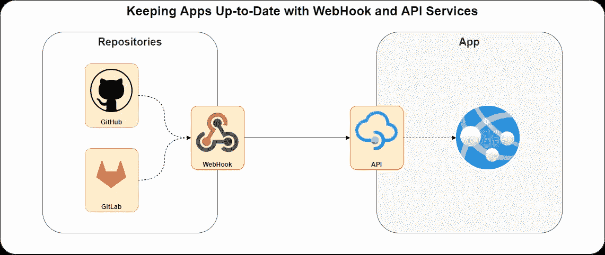

**通过 Webhooks 和 API 的**
回购应用程序(图片由作者提供，来源[此处](https://viewer.diagrams.net/?tags=%7B%7D&highlight=0000ff&edit=_blank&layers=1&nav=1&title=diagrams.drawio#Uhttps%3A%2F%2Fraw.githubusercontent.com%2Fchrimaho%2Fupdate-from-git%2Fmain%2Fblog%2Fdiagrams%2Fdiagrams.drawio)和[此处](https://github.com/chrimaho/update-from-git/blob/main/blog/diagrams/cover-image.png))

# 目录

1.[动机](#c73a)
[**第一节:语境及概述**](#241b)2 .[上下文](#b214)
3。[其他方法](#0fdc)
— 3.1。[手动流程](#637e)
———3 . 1 . 1。[优点](#c1cb)
— — 3.1.2。[缺点](#8ff4)
— 3.2 [Docker 流程](#1337)
———3 . 2 . 1。[优点](#5ddb)
———3 . 2 . 2。[缺点](#ba70)
[**第二节:关于 App 的细节**](#2aa5)4。[自动化的 Webhook 是方法](#9220)
5。[关键档案](#ffad)
— 5.1 说明。[File:/requirements . txt](#4aeb)
—5.2。[文件:/docker/uvicon。Dockerfile](#9d9d)
— 5.3。[File:/docker/docker-compose . yml](#def7)
———5 . 3 . 1。[环境部分](#4881)
———5 . 3 . 2。[各卷第](#a56b)节
———5 . 3 . 3。[港口段](#6781)
— 5.4。[File:/src/API/main . py](#3e61)
———5 . 4 . 1。[导入库](#ce60)
— — 5.4.2。[编译变量](#7b66)
———5 . 4 . 3。[设置登陆页面](#d1d7)
———5 . 4 . 4。[实例化 App](#3b74)
———5 . 4 . 5。[设置自定义功能](#177d)
———5 . 4 . 6。[设置自定义类别](#c939)
———5 . 4 . 7。[定义端点:登陆页面](#55bd)
———5 . 4 . 8。[定义终点:健康检查](#6cef)
———5 . 4 . 9。[定义端点:主端点](#cd20)
— 5.5。[File:/templates/landing _ page . html](#39e4)
[**第三节:如何使用 App**](#2088)6 .[如何使用](#65ea)—6.1。[创建服务器(使用 AWS)](#ecb0)
— 6.1。[添加 docker-compose.yml 文件](#a07e)
— 6.1。[在服务器上启动 Docker](#0b25)
—6.1。[在 Git 上添加 Webhook(使用 GitHub)](#a5e6)
— 6.1。[测试一下](#faf0)
[**第四节:更多信息**](#7fac)7。[下一步是什么](#1f33)8。[在哪里可以找到更多信息](#cc2c)
9。[完整文件为:/src/api/main.py](#76bf)
10。[联系人](#22a6)

# 1.动机

如果你和我一样，你就是一个好奇的生物。所以，当我开始学习什么是[网钩](https://en.wikipedia.org/wiki/Webhook)以及如何使用它们时，感觉就像是在拉我 t 恤上的一根松线。我拉得越多，Webhooks 的世界就解开得越多，我学得越多，我理解得越多，我就越揭开 API、Webhooks 和自动化的神秘世界，我就越想了解更多！

因此，这里的动机是创建一种从 GitHub 到生产服务器的简化的无缝部署方式。我觉得编写一个简单的 Python 应用程序来实现这一点是可能的。所以让我们来看看怎么做吧！

本文将分为四个部分，每个部分概述了这个过程的不同方面。第二部分非常详细，但是我已经尽可能多地包含了必要的描述和截图，以便更容易理解这里发生的事情。[第三部分](#2088)包含如何使用该应用程序的实际操作说明。尽情享受吧！

# 第一部分:背景和概述

# 2.语境

我现在已经编码几年了，在 [GitHub](https://github.com/) (还有 [GitLab](https://gitlab.com/) ，还有其他几个)上有不少回购。我看到这个按钮:

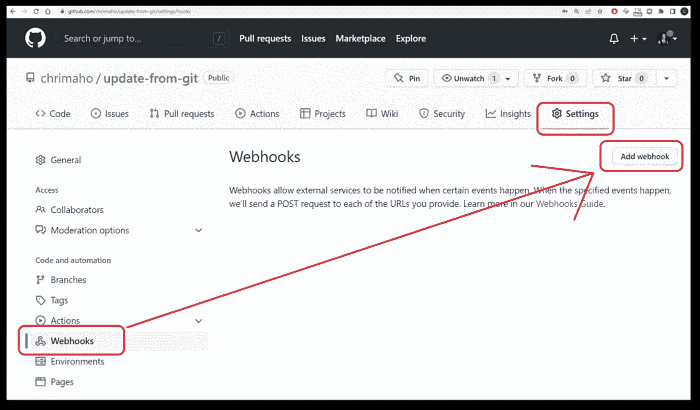

**GitHub>***`**Repo**`***>设置> Webhooks >添加 webhook**
(图片作者)

因此，我在 GitHub 的 [Webhooks 指南](https://docs.github.com/en/developers/webhooks-and-events/webhooks/about-webhooks)页面上读到了一些关于它的内容，以及一些关于如何设置它的博客(比如[这个](https://medium.com/@samarthgvashist2000/setting-up-a-github-webhook-ccd895e7b85c)和[这个](/how-to-automatically-deploy-from-github-to-server-using-webhook-79f837dcc4f4))。我的理解是这样的:

> 当你在一个 Repo 上设置 Webhooks，你`commit`然后`push`到 Repo，GitHub 会自动发送一个 HTTP `POST`请求到你指定的 URL。

该请求的有效负载将包含来自 GitHub 的事件的*元数据*，但不包含来自 Repo 本身的内容。因此，*接收*web hook 请求的系统将需要采取某种行动来从回购中获取`pull`或`clone`最新数据。

这种 Webhook 方法并不是 GitHub 所独有的，GitLab 和 BitBucket 和许多其他 Git 平台也可以使用。

# 3.其他方法

首先，重要的是要明白有很多很多(*很多！*)在生产环境中部署应用的不同方式。让我们看看另外两种常见的方法:

## 3.1.手动过程

手动干预过程如下所示:

1.  在本地 PC 上做`git commit`，然后`git push`推送到上游回购。
2.  当准备部署时，要手动将`ssh`放到目标服务器上。
3.  To do `git clone`(如果是第一次)或`git pull`(对于后续更新)从 Repo 获取最新代码到服务器。

显然，这个手动过程有很多步骤，非常复杂。但是，我只将它放在高级部署步骤中，这样您就可以了解这个过程。

**3.1.1。优点:** —易于维护
—开发人员拥有完全控制权
—不需要/依赖外部工具或应用程序(如 Docker)

**3.1.2。缺点:** —部署时需要开发者的时间、精力、注意力
—一步走错，容易出错；开发人员甚至可能直到很久以后才意识到这一点
——除了这个 Git 过程之外，任何依赖项(如其他应用程序、其他库等)都需要手动执行。

## 3.2.码头工艺

Docker 应用程序大大简化了这个过程，让开发者的生活变得更加轻松。高级流程是:

1.  在本地 PC 上运行`docker build`和`docker run`以确保图像/容器正常工作(这可以通过运行`docker compose up`来简化)
2.  使用`docker login`发布容器，然后使用`docker push`将容器上传到容器存储库(这可以是 [AWS ECR](https://aws.amazon.com/ecr/) 或 [Azure ACR](https://azure.microsoft.com/en-us/services/container-registry/) 或 [Docker Hub](https://hub.docker.com/) ，或任何其他容器托管平台)
3.  然后到服务器上的`ssh`，做`docker pull`，接下来是`docker build`和`docker run`(或者只是简单的`docker compose up`，假设编写文件设置正确)。

虽然看起来这个过程中有更多的步骤，但实际上这个过程要简单得多。因为它不是通过部署*一个 Git 仓库，而是一个容器仓库。意思是说，容器可以完全构建并在本地 PC 上运行，当部署到服务器时，它将以完全相同的方式运行。*

**3.2.1。优点:**
— Docker 会在任何系统上运行，完全一样的方式；所以它是非常可靠的
——所有的依赖都已经通过 Docker 处理了，因此开发人员需要更少的努力/专注/关注

3.2.2。缺点:
—配置设置有时会有点混乱
—如果开发人员不熟悉 Docker，设置和调试可能需要一点时间才能完成

# 第二部分:应用程序的详细信息

# 4.自动化 Webhook 方法

这个过程很容易自动化。这里的解决方案是创建一个非常非常简单的 Python 应用程序(使用 [FastAPI](https://fastapi.tiangolo.com/) )，它将接收来自 Git 的 HTTP `POST`请求，然后调用一个 Python 脚本来`pull`来自 Git 上游 Repo 的最新更新。它与上述手动过程非常相似；其中开发者将`pull`来自回购的最新代码。然而，这里的不同之处在于，我们将使用 Python 的力量来自动为我们拉取最新的代码。

端到端流程如下所示:

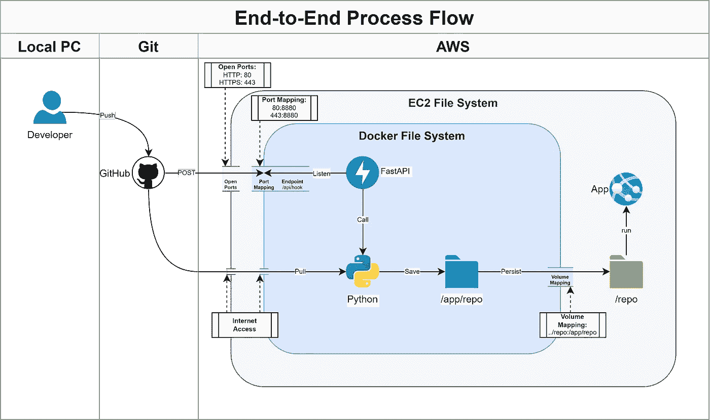

**端到端流程** (图片由作者提供，来源[此处](https://viewer.diagrams.net/?tags=%7B%7D&highlight=0000ff&edit=_blank&layers=1&nav=1&page-id=I7LHdRjH9WNjt-zTn0nW&title=diagrams.drawio#Uhttps%3A%2F%2Fraw.githubusercontent.com%2Fchrimaho%2Fupdate-from-git%2Fmain%2Fblog%2Fdiagrams%2Fdiagrams.drawio)和[此处](https://github.com/chrimaho/update-from-git/blob/main/blog/diagrams/end-to-end.png))

一步一步来看，这是正在发生的事情:

1.  开发者将在他们的本地电脑上开发应用程序
2.  开发者会将更新推送到上游 Git repo(本例中，我们使用 GitHub 但是任何其他托管平台也可以工作)，
3.  然后 Git Repo 将触发 Webhook 进程，并向指定的 URL 发送 HTTP `POST`请求，
4.  那个 URL 后面是一个 IP 地址，应该托管在一个云计算平台上(这里我们用 AWS，但是其他任何云计算平台，比如 Azure 也可以)，
5.  取决于 Git repo 使用 HTTP 还是 HTTPS，它将在端口`80`(HTTP)或端口`443`(HTTPS)上攻击服务器，
6.  然后，服务器会将其端口`80`和端口`443`暴露给公众，以允许网络流量通过。
7.  托管在服务器上的是 Docker 容器，该容器会将外部端口`80`和`443`映射到内部端口`8880`，然后可以由内部应用程序使用，
8.  安装在 Docker 容器中的是 FastAPI 应用程序，它将监听端口`8880`和由开发者定义的端点，
9.  一旦 HTTP `POST`消息命中端点 URL，那么 FastAPI 应用程序将调用一个 Python 脚本，
10.  该 Python 脚本将触发一个`git clone`(或`git pull`)进程从上游 repo 获取最新代码，
11.  Python 然后会将该信息保存到 Docker 上的一个目录中(在本例中，我们将它保存到`/app/repo`目录中，但这是可配置的，您可以将其保存到任何地方)，
12.  Docker 随后将使用一个名为[卷映射](https://docs.docker.com/storage/volumes/)的过程将容器上该目录的数据持久化到容器外的一个目录中(这意味着一旦容器上的`/app/repo`目录被更新，容器外的`/repo`目录也将立即被更新)，
13.  一旦在服务器级更新了`/repo`目录，就可以根据需要执行任何其他应用程序。

对于精明的人来说，你会注意到，将多个 Docker 容器聚集在一起实际上是可能的，这样一个容器将自己运行应用程序，而不是依赖于服务器级别来运行它。对，没错，而且这样做也很常见。然而，为了简单起见，我在这里保留了这个过程，以便简单地展示从 Git 到服务器的 Webhook 过程。以此为基础，就有可能增加更多的复杂性。

# 5.关键文件的说明

在这个过程中使用了许多关键文件。接下来的几节将详细解释这些文件。

## 5.1.File: /requirements.txt

要求超级简单。我们只需要三个包:

1.  `[fastapi](https://fastapi.tiangolo.com/)`:实际构建 API 端点
2.  `[gitpython](https://gitpython.readthedocs.io/en/stable/index.html)`:来自上游回购的`clone`/`pull`
3.  `[python-decouple](https://pypi.org/project/python-decouple/)`:用于处理默认环境变量

将会有一些其他的库在运行时被导入；然而，这些将是 Python 内置的一部分，不需要添加到`requirements.txt`文件中。

**/requirements.txt** (图片由作者提供，来源[此处](https://carbon.now.sh/wn0OdSeb5pxMP6doAnLO)和[此处](https://github.com/chrimaho/update-from-git/blob/main/requirements.txt)和[此处](https://gist.github.com/chrimaho/e86f7fb846fcceec001e975506fa4cd1))

## 5.2.文件:/docker/uvicon。Dockerfile 文件

在 [Docker](https://www.docker.com/) 的世界里，`[Dockerfile](https://docs.docker.com/engine/reference/builder/)`是一组应该在特定容器上执行的“指令”,以便为它的操作进行设置。趁着还有很多很多(*很多*！)，不同的选项和配置可用，这里我们保持事情相当简单。

具体步骤是:

1.  使用基本映像作为`[tiangolo/uvicorn-gunicorn-fastapi](https://hub.docker.com/r/tiangolo/uvicorn-gunicorn-fastapi)`，它包含了建立和运行服务器以成功运行 FastAPI 所需的所有源基础设施。
2.  将本地环境中的`requirements.txt`文件复制到容器中。
3.  运行三个不同的 PIP 语句来:
    1 .升级`[pip](https://pip.pypa.io/en/stable/)`，万一过时，
    2。从`requirements.txt`文件
    3 安装软件包。升级`[uvicorn](https://www.uvicorn.org/)`包，以防它过时。
4.  从本地环境的`src`和`templates`目录中复制所有需要的文件到容器中。
5.  将容器内的工作目录设置为`/app`目录。
6.  设置命令行，该命令行将在容器构建完成并准备运行时执行。

**/docker/uvicon。Dockerfile** (图片由作者提供，来源[这里](https://carbon.now.sh/JzjQqSh7Jv7KTOjgWlIS)和[这里](https://github.com/chrimaho/update-from-git/blob/main/docker/uvicorn.Dockerfile)和[这里](https://gist.github.com/chrimaho/c25d5b4031d0f9eef5c99fe4cd27e78f))

最后一行(即`CMD`那一行)相当有趣。让我指出一些重要的信息:

*   它将执行`uvicorn`应用程序，这实际上是一个用于处理 FastAPI 进程和命令的服务器
*   它将执行在`[main.py](https://github.com/chrimaho/update-from-git/blob/main/src/api/main.py)`模块中被称为`[app](https://github.com/chrimaho/update-from-git/blob/main/src/api/main.py#L65)`的应用程序。
*   `main.py`模块实际上位于容器的子目录中，可以在`/src/api`目录中找到。
*   它被托管来监控 IP 地址:`0.0.0.0`。这实际上是在说“监控本地主机”。这是因为外部系统(通过 URL)使用服务器 IP 地址，但是信号在服务器内部，它将在本地主机 IP 上找到。因此，Uvicorn 只需要监视服务器本身的本地主机。
*   系统将监控端口`8880`，这就是为什么将外部端口映射到内部端口很重要的原因(这将在下一节关于`docker-compose.yml`文件的内容中介绍)。
*   应用程序的根路径在当前文件夹中(用`"."`语法表示)。
*   应用程序的输出将被打印到终端上，使用一些漂亮的颜色；这有助于以后阅读日志文件和消息。

## 5.3.文件:`/docker/docker-compose.yml`

在 Dockerfile 之后，`[docker-compose.yml](https://docs.docker.com/compose/compose-file/)`文件是逻辑上的下一步，它将再次进一步处理这个过程。它可以用来创建容器集群，每个容器都可以被设置为协同工作并相互依赖。虽然这是一个令人惊奇的功能，但它不是我们这里的目的所需要的。在这种情况下，我们将只需要一个容器，它将使用上面定义的 Dockerfile 来构建。我们之所以使用`docker-compose.yml`方法是因为它很方便；它允许轻松添加`environment`变量和`volume`映射。

`**/docker/docker-compose.yml**`(图片由作者提供，来源[此处](https://carbon.now.sh/DXPEYxx2Mv8sE9gTz2FR)和[此处](https://github.com/chrimaho/update-from-git/blob/main/docker/docker-compose-sample-local.yml)和[此处](https://gist.github.com/chrimaho/741c96e658833e509a8e547982b3ce1e))

注意，这是一个`docker-compose.yml`的样本文件。从中提取数据的 Git URL 实际上并不是一个应用程序(仅仅是代码片段的集合)。因此，这仅仅是展示如何设置应用程序的过程。

5.3.1。 `**environment**` **章节:**

有 9 个值可以/应该包含在`environment`部分，包括:

1.  `GIT_URL` ( *强制*):从中克隆回购的 URL。
2.  `API_ENDPOINT` ( *可选*，默认`/api/webhook`):web hook 将调用的端点。
3.  `REPO_DIR` ( *强制*):回购将被克隆到的目录。
4.  `VERSION` ( *可选*，默认`0.0.1`):app 的版本号。
5.  `TITLE` ( *可选*，默认`Update from Git`):app 的标题。
6.  `DESCRIPTION` ( *可选*，默认`Automated process for pulling from Git repo upon webhook call.`):app 的描述。
7.  `CONTACT_NAME` ( *可选*，默认`None`):关于 app 的联系人姓名。
8.  `CONTACT_URL` ( *可选*，默认`None`):联系人的网址。
9.  `CONTACT_EMAIL` ( *可选*，默认`None`):联系人的电子邮件。

更多详情见[此处](https://github.com/chrimaho/update-from-git#explanation-on-the-environment-variables)。

**5.3.2。** `**volumes**` **部分:**

以便利用父容器(即服务器)和 Docker 容器中，[卷](https://docs.docker.com/storage/volumes/)部分是为实现两个环境之间的持久性而设计的机制。实际上，冒号(`:`)左边的值是父容器*上的目录位置，右边的值是 Docker* 容器本身上的目录位置。这样，对任何一个目录的任何更改都会立即更新另一个目录。

默认值:

```
- ../repo:/app/repo
```

5.3.3。 `**ports**` **章节:**

[端口映射](https://docs.docker.com/compose/networking/)对于确保外部端口能够正确映射到 Docker 中的内部进程非常重要。因为端口`80`用于 HTTP，而端口`443`用于 HTTPS 进程，所以期望任何上游 Git 进程使用其中任何一个都是合理的。由于 FastAPI 应用程序正在监听端口`8880`，因此将这两个外部端口(`80`和`443`)映射到内部端口`8880`是合乎逻辑的。对于服务器来说,`8880:8880`的映射可能是多余的，但是这里包含了它，因为它对于在本地 PC 上进行测试是必要的。

为了便于参考，冒号(`:`)左边的值是*外部*端口，右边的值是*内部*端口。

默认值:

```
- 8880:8880
- 443:8880
- 80:8880
```

## 5.4.文件:/src/api/main.py

由于文件的大小，我把它分成了几个部分，并分别解释了每一部分。完整文件复制到本文末尾(见[此处](#76bf))。

**5.4.1。导入库**

首先要做的是导入所需的库。这种结构的方式是不从每个库中导入完整的代码库；而是仅从每一个导入所需的函数/类。

更具体地说:

*   `[exec_info](https://docs.python.org/3/library/sys.html#sys.exc_info)`用于处理错误并通过 API 返回错误
*   `[config](https://github.com/henriquebastos/python-decouple/#usage)`用于处理默认环境变量
*   `[FastAPI](https://fastapi.tiangolo.com/tutorial/first-steps/#first-steps)`和`[Query](https://fastapi.tiangolo.com/tutorial/query-params/#query-parameters)`用于运行 API 端点
*   `[BaseModel](https://fastapi.tiangolo.com/tutorial/response-model/?h=base+model#response-model)`为迂腐(或‘pydantic’😂)通过 API 端点处理对象的方法
*   `[PlainTextResponse](https://fastapi.tiangolo.com/advanced/custom-response/?h=htmlresponse#plaintextresponse)`、`[JSONResponse](https://fastapi.tiangolo.com/advanced/custom-response/?h=htmlresponse#jsonresponse)`和`[HTMLResponse](https://fastapi.tiangolo.com/advanced/custom-response/?h=htmlresponse#htmlresponse)`是 FastAPI 端点将返回的特定对象
*   `[Repo](https://gitpython.readthedocs.io/en/stable/tutorial.html#meet-the-repo-type)`用于实际调用`[git clone](https://git-scm.com/docs/git-clone)`和`[git pull](https://git-scm.com/docs/git-pull)`方法
*   `[exists](https://docs.python.org/3/library/os.path.html#os.path.exists)`用于检查`/repo`文件夹是否存在
*   最后，`[rmtree](https://docs.python.org/3/library/shutil.html#shutil.rmtree)`用于在执行`git`过程之前物理删除`/repo`中的数据。

`**/src/api/main.py (lines: 19–27)**`(图片由作者提供，来源[此处](https://carbon.now.sh/7VkaMQVQKLqQB1Lp3DWI)和[此处](https://github.com/chrimaho/update-from-git/blob/main/src/api/main.py#L19-L27)和[此处](https://gist.github.com/chrimaho/b069d33231cddd69425793a873d99dec))

**5.4.2。编译变量**

如上述中的[所述，该过程中使用了 9 个环境变量。其中两个*为强制*，其余为*可选*。使用`python-decouple`包的`config()`功能设置这些强制和可选过程的处理方式。实际上，这将允许开发人员为环境变量定义一个默认值，并将解析的任何值转换为所需的数据类型。](#4881)

`**/src/api/main.py (lines: 30–45)**`(图片由作者提供，来源[此处](https://carbon.now.sh/n9LOcmp3DJnrBUw5UgPl)和[此处](https://github.com/chrimaho/update-from-git/blob/main/src/api/main.py#L30-L45)和[此处](https://gist.github.com/chrimaho/49a898548146e86e895f3234732cbcf9))

**5.4.3。设置登陆页面**

登录页面非常简单。这只是一个基本的 HTML 表格，它允许开发人员(实际上任何其他用户)直接在应用程序的登录页面上看到关键的环境变量。加载的模板将在下面的**段落中进一步概述。将其物理导入 Python 环境的过程实际上非常简单，如下所示。此外，`str.format()`方法被用来直接解析 HTML 字符串中的特定环境变量。从计算上来说，这是非常高效的。**

**`**/src/api/main.py (lines: 48-61)**`(图片由作者提供，来源[此处](https://carbon.now.sh/RVSU4aooarVriuTPx5LX)和[此处](https://github.com/chrimaho/update-from-git/blob/main/src/api/main.py#L48-L61)和[此处](https://gist.github.com/chrimaho/8ed3828f349b13cb77dc8f427e7d8b0d))**

****5.4.4。实例化应用程序****

**一旦加载了所有包并定义了常量，就该实例化应用程序了。FastAPI 包有一套非常直观、非常简单、非常有用的过程。大多数默认值都是完全可用的，这为开发人员消除了许多复杂性(以及模糊性)。只需几行代码，就可以定义整个 FastAPI 应用程序，并且随时可以使用。如下图所示**

**唯一需要详细说明的方面是`openapi_tags`部分。这是一个美学选择，因此当加载`/swagger`页面时，很容易看到哪些 API 端点被分组到了哪些部分。这是另一个完全可选(但强烈建议)的配置。**

**`**/src/api/main.py (lines: 64-76)**`(图片由作者提供，来源[此处](https://carbon.now.sh/iBO9GuRnthQQvtnujjDE)和[此处](https://github.com/chrimaho/update-from-git/blob/main/src/api/main.py#L64-L76)和[此处](https://gist.github.com/chrimaho/684776c6addd081b59e22fd048c5873c))**

****5.4.5。设置自定义功能****

**虽然我保留了一部分来制作一些自定义函数，但实际上我在这里只添加了一个。这是一个助手功能，用于删除目录中的所有文件。这是必要的，因为有时`gitpython`包不喜欢`clone`一个目录中的回购，当已经有其他数据和文件存在于相同的位置。因此，这个功能将随时删除过时的文件。**

**`**/src/api/main.py (lines: 85-89)**`(图片由作者提供，来源[此处](https://carbon.now.sh/UrjufcAzwgQ2GhaAN4wx)和[此处](https://github.com/chrimaho/update-from-git/blob/main/src/api/main.py#L85-L89)和[此处](https://gist.github.com/chrimaho/1a9c574b44833cf845335a162c2a1f34))**

****5.4.6。设置自定义类别****

**FastAPI 包依赖于包含在`pydantic`包的`BaseModel`类中的有用进程。通过使用这个类，定义 API 使用的请求和响应对象非常容易。更多详情可在[这里](https://fastapi.tiangolo.com/tutorial/body/)找到。对于我们这里的目的，我只定义了三个定制类，它们的结构非常简单明了。**

**`**/src/api/main.py (lines: 97-110)**`(图片由作者提供，来源[此处](https://carbon.now.sh/FCk7FX0NJnS5ejwBfdIq)和[此处](https://github.com/chrimaho/update-from-git/blob/main/src/api/main.py#L97-L110)和[此处](https://gist.github.com/chrimaho/7b4b6c24494de73382f6b9cb46cda8a2))**

****5.4.7。定义端点:登陆页面****

**既然一切都已设置就绪，是时候定义实际的端点了。这里，我们将使用三个特定的端点；第一个是登录页面。每个端点都将利用 FastAPI 的[装饰](https://peps.python.org/pep-0318/)方法，特别是`@app.get()`或`@app.post()`方法。**

**对于第一个端点，我们知道这是登录页面，因为我们已经定义了`path="/"`，这基本上意味着这将是该网站的根目录。其他所有内容都将构建在这个根目录之上。这是一个非常简单的端点，它返回一个`[HTMLResponse](https://fastapi.tiangolo.com/advanced/custom-response/?h=htmlre#return-an-htmlresponse-directly)`类，其中包含我们之前定义的`LANDING_PAGE`。此外，这个端点的`schema`被关闭，因此当检查`/swagger`页面时，读者不会看到不必要和多余的模式定义。**

**代码看起来像这样👇**

**`**/src/api/main.py (lines: 118-134)**`(图片由作者提供，来源[此处](https://carbon.now.sh/TJI6GcPi71Tu8jPMVFEc)和[此处](https://github.com/chrimaho/update-from-git/blob/main/src/api/main.py#L137-L153)和[此处](https://gist.github.com/chrimaho/965d3ef3ed0d69386033c8c795eefc36))**

**当它运行时，Swagger 页面如下所示👇**

**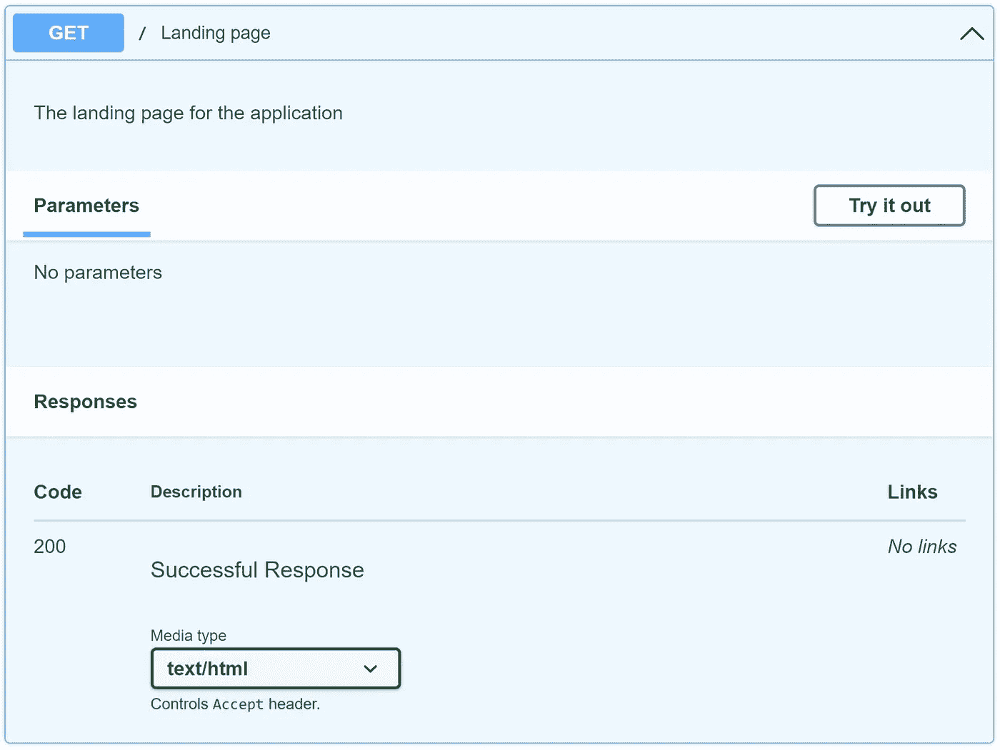**

**`**The Swagger page for the Landing Page Endpoint**`(图片作者提供)**

**当它运行时，URL 看起来像这样👇**

**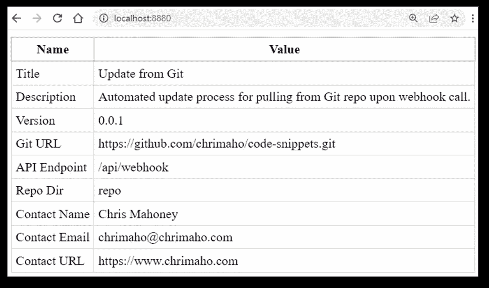**

**`**The URL page for the Landing Page Endpoint**`(图片由作者提供)**

****5.4.8。定义终点:健康检查****

**要声明的第二个 API 端点是健康检查。这一点很重要，这样用户就能够知道整个应用程序是否启动并运行，并返回健康的响应。为此，最佳做法是设置一个端点。**

**这个端点的结构就像登录页面一样简单。也许更简单，因为它返回一个`[PlainTextResponse](https://fastapi.tiangolo.com/advanced/custom-response/?h=htmlre#plaintextresponse)`，它只会返回一个短的文本字符串。**

**代码如下所示:**

**`**/src/api/main.py (lines: 137-153)**`(图片由作者提供，来源[此处](https://carbon.now.sh/nXNwHVWixhIeY2me5bKX)和[此处](https://github.com/chrimaho/update-from-git/blob/main/src/api/main.py#L137-L153)和[此处](https://gist.github.com/chrimaho/2aaeb0649346f47b0f50ed5a63793010))**

**运行时，Swagger 页面如下所示:**

**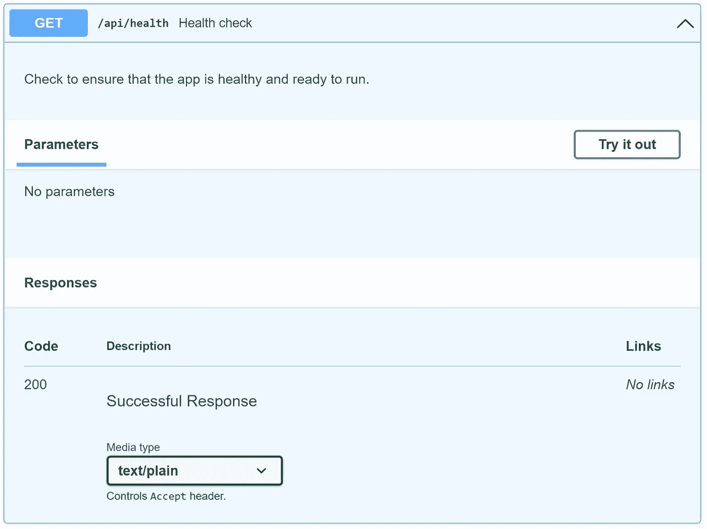**

**`**The Swagger page for the Health Check Endpoint**`(图片作者)**

**当它运行时，URL 如下所示:**

**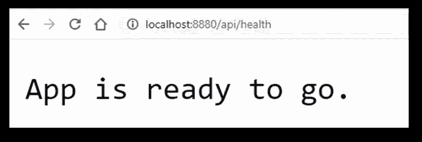**

**`**The URL page for the Health Check Endpoint**`(图片作者)**

****5.4.9。定义端点:主端点****

**最后，我们到达主要终点。这是主要的魔法发生的地方。虽然这个端点看起来很长，但实际上并不长。这段代码可以分为三个部分:**

1.  **装饰器部分:
    —这是实际定义它是一个 HTTP `POST`方法的部分。
    —`path`是一个参数，由用户在`environment`变量的`API_ENDPOINT` 部分定义。
    —`description`被分成三行(主要是为了让它在屏幕上看起来更美观😉)，它还包括特定的`GIT_URL`和`REPO_DIR`，如用户在`environment`变量中所定义的。
    —它将始终返回一个 JSON 对象。
    —根据数据如何被解析*到*该 API 端点，它将返回三种状态之一:`200`表示成功，`422`表示验证错误，或者`500`表示存在内部服务器错误。这是我们在上面定义的三个自定义类[。](#c939)**
2.  **声明部分:
    —该部分只有两个参数:从中*拉取数据的位置的`git_url`，以及将*数据保存到*的位置的`repo_dir`。
    ——在引擎盖下，他们每个人都将成为`[Query](https://fastapi.tiangolo.com/tutorial/query-params-str-validations/)`的对象。
    —唯一看起来长的是因为`description`部分覆盖了多行。***
3.  **函数执行部分
    ——实际的代码执行部分将进入`try`以完成两件事:1)检查目标目录(并删除其中存在的任何内容，如果必要的话)，以及 2)从上游回购克隆最新的数据。
    —如果遇到错误，它将通过 API 向调用者返回一个`InternalServerError`响应，这样他们就可以在必要时看到并调试错误。
    —如果成功，那么它将向调用者返回一个`Success`响应。**

**代码如下所示:**

**`**/src/api/main.py (lines: 156-205)**`(图片由作者提供，来源[此处](https://carbon.now.sh/3hjKf2WfLKxK7Cvcy8KZ)和[此处](https://github.com/chrimaho/update-from-git/blob/main/src/api/main.py#L156-L205)和[此处](https://gist.github.com/chrimaho/f874e19fe6d32f59982ce3997936d901))**

**当它运行时，Swagger 页面如下所示👇**

**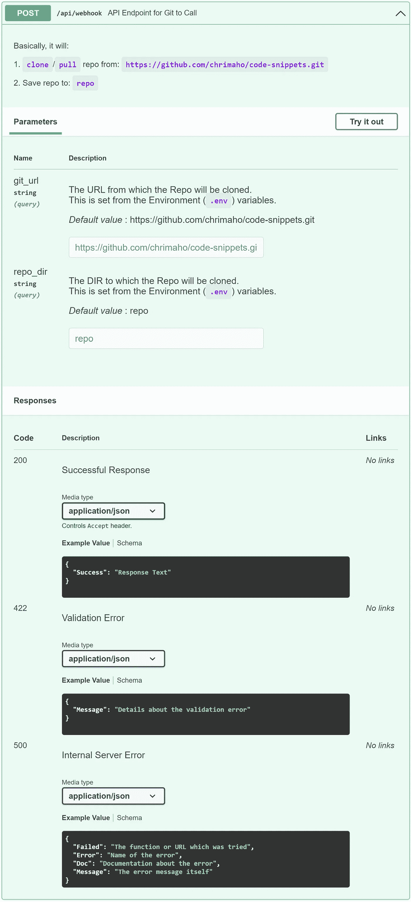**

**`**The Swagger page for the Main Endpoint**`(图片作者提供)**

## **5.5.文件:`/templates/landing_page.html`**

**正如上面的提到的[，我写了一个超级简单的 HTML 页面，可以用于 API 的登陆页面。您会注意到这里有两个特点:](#d1d7)**

1.  **`<style>`标签中的值不是正确的 CSS 语法，因为它们有双花括号(`{{`、`}}`)。这是因为这些信息将被解析到 Python 中，然后 Python 将把花括号中的任何内容解释为参数，并尝试给它们分配变量。为了避免这种情况，使用了双花括号语法。这个过程在 [Python 文档](https://docs.python.org/3/library/string.html#format-string-syntax)中定义。**
2.  **单花括号内的值是全局常量，由环境变量定义(见上文中的[)。](#7b66)**

**`**/templates/landing_page.html**`(图片由作者提供，来源[此处](https://carbon.now.sh/3TgeFLSMUpRmTg6XbREp)和[此处](https://github.com/chrimaho/update-from-git/blob/main/templates/landing_page.html)和[此处](https://gist.github.com/chrimaho/d81fcd3d76374ca3cc62aafe90f1f012))**

# **第三部分:如何使用应用程序**

# **6.如何使用它**

**既然我们已经构建了应用程序，并且了解了所有组件的功能，现在是时候设置并开始使用它了。**

## **6.1.创建服务器(使用 AWS)**

**首先，有必要在云中创建服务器。有可能使用许多不同的云计算平台；最受欢迎的两个是[亚马逊网络服务](https://aws.amazon.com/ec2)[(又名 AWS)平台上的](https://aws.amazon.com/)[弹性计算云](https://aws.amazon.com/ec2)(又名 EC2)，以及[微软 Azure](https://azure.microsoft.com/) (又名 Azure)平台上的 [Azure 虚拟机](https://azure.microsoft.com/services/virtual-machines/)(又名 AVM)。如果你想了解这两个平台之间的差异，可以看看这篇文章:[比较 AWS 和 Azure 计算服务](https://docs.microsoft.com/en-us/azure/architecture/aws-professional/compute)。**

**出于本教程的目的，我们将使用 AWS EC2 平台。在这里，有许多不同的关于创建 EC2 实例的教程*。比如[这个](https://docs.aws.amazon.com/AWSEC2/latest/UserGuide/EC2_GetStarted.html)或者[这个](https://medium.com/serverlessguru/creating-an-aws-ec2-instance-d5cf332fdb0c)或者[这个](https://medium.com/edureka/aws-ec2-tutorial-16583cc7798e)。我个人认为简·贾科姆利的文章最有帮助，因为他包含了大量的细节、解释和截图。参见教程:[用 Docker](https://testdriven.io/blog/django-docker-https-aws/) 将 Django 部署到 AWS。***

**请密切注意本教程中在服务器上安装 Docker 的步骤。除此之外，Docker 文档上还有另外两个页面可以帮助指导您进行安装:[在 Ubuntu 上安装 Docker Engine](https://docs.docker.com/engine/install/ubuntu/)和[在 Linux 上安装 Docker Compose V2](https://docs.docker.com/compose/cli-command/#install-on-linux)。一旦您`ssh`进入服务器，您将需要运行的特定指令集是:**

**`**Install Docker and Docker Compose on EC2 Instance**`(图片由作者提供，来源[此处](https://carbon.now.sh/hPmRP97XwzNzE82qRxoO)和[此处](https://github.com/chrimaho/update-from-git/blob/main/src/cli/aws/install-docker.sh)和[此处](https://gist.github.com/chrimaho/bcbe79f2f8d0f400acadef43c08575bf))**

**一旦创建了 EC2 实例并成功运行，添加一个额外的步骤是很重要的。也就是将 GitHub 的 IP 地址列入白名单，这样当 GitHub 触发针对 EC2 实例的 HTTP `POST`请求时，它就不会被 EC2 上默认设置的网络规则所阻止。有关这一点为什么重要的更多信息，请参见[上关于 GitHub 的 IP 地址](https://docs.github.com/en/enterprise-cloud@latest/authentication/keeping-your-account-and-data-secure/about-githubs-ip-addresses)和[将 Webhooks IP 地址](https://github.com/stakater/gitwebhookproxy/issues/62)和 [GitHub Webhooks IP 范围](https://github.blog/changelog/2019-04-09-webhooks-ip-changes/)列入白名单的可能性的详细信息。**

**要将这些 IP 加入白名单，请遵循本教程中给出的说明:[授权 EC2 实例的入站流量](https://docs.aws.amazon.com/AWSEC2/latest/UserGuide/authorizing-access-to-an-instance.html)。完成后，您的入站规则应该如下所示👇**

**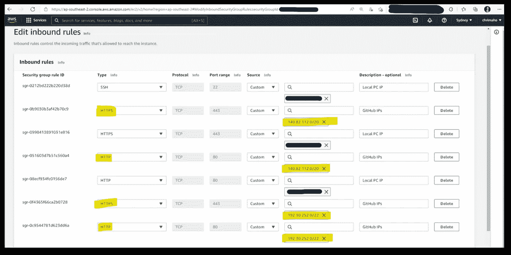**

**`**Inbound Rules required for GitHub to access EC2 Instance**`(图片由作者提供)**

**你可能会问这样的问题:“但是我为什么要这么做呢？”或者也许是“我怎么知道它起作用了？”或者也许是“我如何知道 GitHub 失败是因为 IP 没有被列入白名单？”。所有这些问题的答案都是一样的。**

**具体来说:如果 GitHub IP*没有*列入白名单，那么当 Webhook 从 GitHub 触发到 AWS 时，将被阻止，返回的错误信息将是:`failed to connect to host`。请参见下面的屏幕截图示例:**

**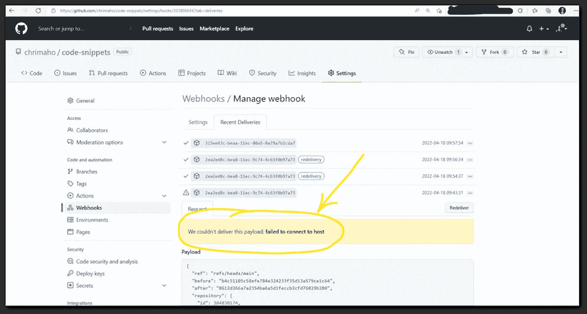**

**`**Error message received when IP Addresses are not correctly whitelisted**`(图片作者)**

## **6.2.将`docker-compose.yml`文件添加到服务器**

**现在 EC2 实例已经准备好了，接下来的步骤是向它添加`docker-compose.yml`文件。为此，有三种方法可以将文件添加到服务器:**

1.  **使用`ssh` :
    —遵循此处[和此处](https://docs.aws.amazon.com/AWSEC2/latest/UserGuide/AccessingInstancesLinux.html)和[的说明，了解如何使用`ssh`登录 EC2 实例。
    —一旦在服务器上，使用`touch docker-compose.yml`添加一个空文件。
    —使用`nano docker-compose.yml`打开文件。
    —直接将文本从本地 PC 复制粘贴到服务器。
    —通过按`ctrl+O`然后按`ctrl+X`保存并关闭文件。](https://docs.aws.amazon.com/AWSEC2/latest/UserGuide/ec2-instance-connect-methods.html)**
2.  **使用`scp` :
    —按照这里的和这里的的说明执行`scp`脚本，将文件推送到安全服务器。
    —该命令应该类似于:
    `scp -i path/to/pem/file/ec2_identity_file.pem /path/on/localpc/docker-compose.yml username@server:path/on/server`**
3.  **使用 FileZilla(或其他类似的 FTP 软件):
    —按照说明[这里](https://stackoverflow.com/questions/16744863/connect-to-amazon-ec2-file-directory-using-filezilla-and-sftp)和[这里](https://www.youtube.com/watch?v=e9BDvg42-JI)和[这里](https://filezillapro.com/docs/v3/basic-usage-instructions/ssh-private-keys-for-sftp/)和[这里](https://medium.com/@shivambhanvadia/how-to-upload-files-on-ec2-using-filezilla-and-host-a-static-website-ae1eccad141d)，了解如何使用 FileZilla 将文件推送到 EC2 实例。**

**下面给出了您应该复制到服务器的确切文件。确保用您的具体信息更新`<update>`部分。**

**`**Template for the**` **docker-compose . yml** `**file**`(图片由作者提供，来源[这里](https://carbon.now.sh/1HzLtSfZlsEZ5pNiJA5N)和[这里](https://github.com/chrimaho/update-from-git/blob/main/docker/docker-compose-template.yml)和[这里](https://gist.github.com/chrimaho/4a83f74de423903e8daf75def6ed4263))**

## **6.3.在服务器上启动 Docker**

**既然一切都已准备就绪，下一步就很容易了。启动 Docker 容器并启动 API 监听器只需要一行代码👇**

**`**Install Docker and Docker Compose on EC2 Instance**`(图片由作者提供，来源[此处](https://carbon.now.sh/9GgdqwKJVOEjM97kKmPg)和[此处](https://github.com/chrimaho/update-from-git/blob/main/src/cli/docker/up.sh)和[此处](https://gist.github.com/chrimaho/e8db51a3e187b3464258c4ff68ba1d42))**

**当您在服务器上运行它时，它看起来是这样的:**

**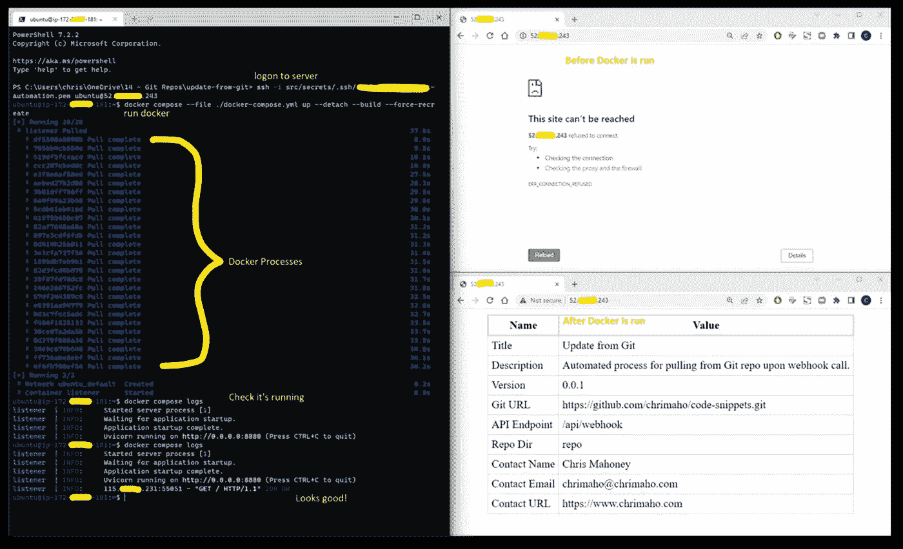**

**`**Script for setting up Docker on the EC2 Server**`(图片作者)**

## **6.4.在 Git 上添加 Webhook(使用 GitHub)**

**接下来，我们需要实际配置 GitHub 来触发 Webhook。GitHub 提供的[文档实际上对此很有帮助，并且很容易理解。此外，网上也有一些非常好的博客和教程，包括:](https://docs.github.com/en/developers/webhooks-and-events/webhooks/about-webhooks)[使用 Webhook 从 Github/Gitlab 部署到服务器](https://medium.com/the-sysadmin/deploy-from-github-gitlab-to-server-using-webhook-d1cb6496368f)和[使用 Jenkins 和 Github 创建您的第一个 CI/CD 管道](https://towardsdatascience.com/create-your-first-ci-cd-pipeline-with-jenkins-and-github-6aefe21c9240)。**

**在这个例子中，我将使用我的另一个 Repo，名为[代码片段](https://github.com/chrimaho/code-snippets/settings/hooks)。虽然从技术上来说，它本身不是一个应用程序，但它仍然足够简单，可以帮助我们理解这个过程。**

**当我们导航到 Repo 时，我们可以打开**设置**，然后打开 **Webhooks** 部分，然后按下**添加 Webhook** 按钮。如下图。**

**这个的网址也很简单:[https://github.com/<用户名> / <回购>/设置/挂钩](https://github.com)。**

****

**`**Where to find Webhooks on GitHub Repo**`(图片作者)**

**下一个菜单要求您添加 URL。这是您在 EC2 实例中设置的弹性 IP 地址(参见[本节](https://testdriven.io/blog/django-docker-https-aws/#elastic-ip))。如果你知道如何添加子域到你现有的网站，那么你也可以这样做。IP 地址在之后的部分*与您在`docker-compose.yml`文件的`environment`部分的`API_ENDPOINT`值中配置的值相同。现在一切都开始明朗了。***

**对于**内容类型**，选择`application/json`，将**事件**保留在`push`事件上，然后选择**添加 Webhook** 。**

**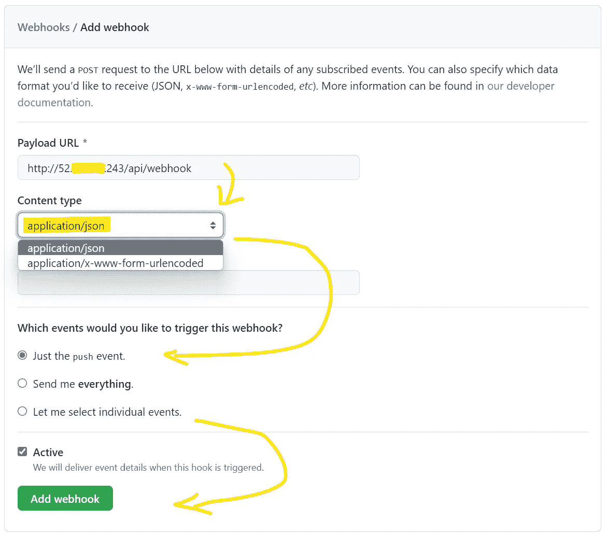**

**`**Settings for adding a Webhook on GitHub**`(图片作者提供)**

**保存后，您会在屏幕顶部看到一条消息:**

```
Okay, that hook was successfully created. We sent a ping payload to test it out!
```

**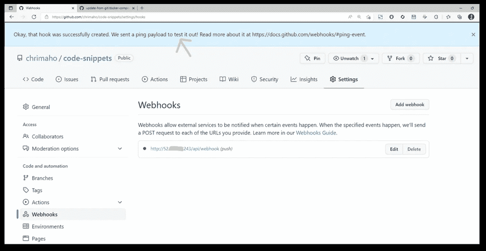**

**`**Successfully Created Webhook on GitHub Repo**`(图片作者提供)**

**当您进入 Webhook 检查最近的交付时，您会发现已经发送了一个请求，并且已经收到了一个响应。并且，*希望是*，如果您的所有配置都成功设置，您将看到一个绿色勾号和一个响应状态代码:`200`。**

**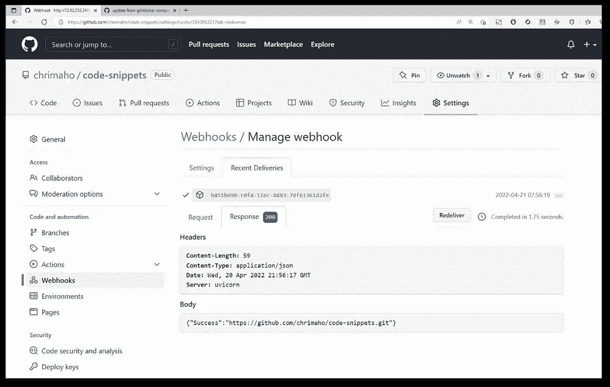**

**`**Confirmation of Successful response from GitHub Webhook ping**`(图片由作者提供)**

## **6.5.测试一下**

**测试它超级简单。首先，让我们跳到 EC2 服务器上，检查一下`docker compose logs`看起来是否正常。然后我们将使用`ls repo`检查目录的内容。这是结果:**

**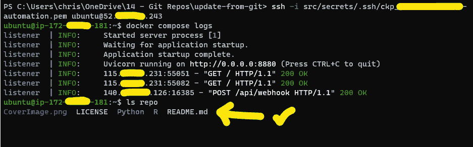**

**`**Checking the files on the Server**`(图片作者提供)**

**首先，你可以看到来自 GitHub 的`ping`请求已经成功通过！并且`/repo`目录已经*包含来自上游 Git repo 的更新信息*！**

**接下来，在我们的本地 PC 上，在您想要`push`到 GitHub 的回购目录中，让我们只创建一个*非常小的*文本文件，名为`test.txt`。然后我们会做`git add`、`git commit`、`git push`把它拿到上游回购。代码看起来像这样👇**

**`**Add a new file to Git and**` **推** `**to upstream Repo**`(图片由作者提供，来源[此处](https://carbon.now.sh/FCKwSx8GZq2rqvyB2lOz)和[此处](https://github.com/chrimaho/update-from-git/blob/main/src/cli/git/add.sh)和[此处](https://gist.github.com/chrimaho/8d5ed49800f94f8b6f45a0d39314a3c3))**

**终端看起来像这样:**

**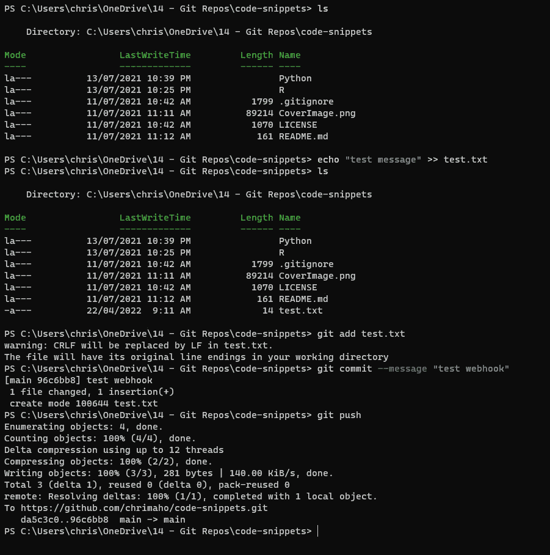**

**`**Add a new file to Git**`(图片作者提供)**

**然后当我们回到 EC2 服务器检查它时，我们可以重新运行`docker compose logs`来检查它是否成功通过(它确实成功了！)，并检查`ls repo`以确认该文件现在已经存在(确实存在！).看起来是这样的:**

**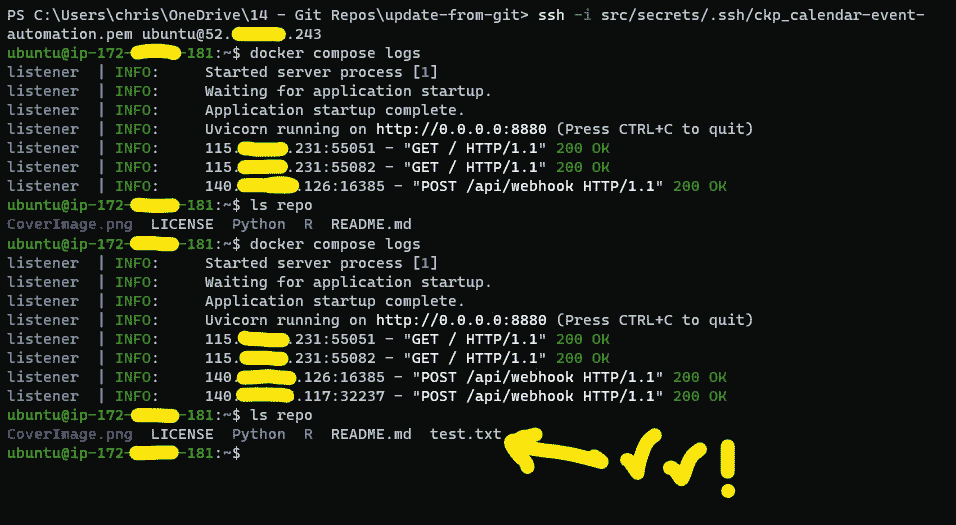**

**`**Re-Checking the files on the Server**`(图片作者提供)**

**现在一切都运转良好！**

# **第四部分:更多信息**

# **7.下一步是什么**

****注意:**现在 Webhooks 已经设置好了，你的服务器会自动更新，技术上来说还有一个步骤你需要做。这通常是重新启动你在服务器上运行的应用程序，以确保它总是引用最新的源文件。但是，因为各种应用程序有不同的重启方式，所以我不打算在这里提到它们。**

**此外，最近，我发现有一个 Webhook 进程可用于各种 Docker 容器进程。包括在 [Docker Hub](https://docs.docker.com/docker-hub/webhooks/) 、 [AWS ECR](https://aws.amazon.com/blogs/containers/create-a-ci-cd-pipeline-for-amazon-ecs-with-github-actions-and-aws-codebuild-tests/) 、 [Azure ACR](https://docs.microsoft.com/en-us/azure/container-registry/container-registry-webhook) 上。这给了我灵感，让我写了另一篇关于如何使用它的博客！**

# **8.哪里可以找到更多信息**

**谢天谢地，这个过程并不难。我已经把它设置成开源的，随时可用。所有的源代码都保存到 [GitHub](https://github.com/chrimaho/update-from-git) 中，这个现成的容器托管在 [Docker Hub](https://hub.docker.com/r/chrimaho/update-from-git) 上。**

**[](https://github.com/chrimaho/update-from-git) [## chrimaho/从 git 更新

### 一个 Python 应用程序，托管在 Docker 映像上，用于监听 git 存储库，然后从中提取数据。

github.com](https://github.com/chrimaho/update-from-git)  [## chrimaho/从 git 更新

### 一个 Python 应用程序，托管在 Docker 映像上，用于监听 git 存储库，然后从中提取数据。

hub.docker.com](https://hub.docker.com/r/chrimaho/update-from-git) 

## 9./src/api/main.py 的完整文件

`**/src/api/main.py**`(图片由作者提供，来源[此处](https://carbon.now.sh/e2pEa9JxpvuyO9OdkUxL)和[此处](https://github.com/chrimaho/update-from-git/blob/main/src/api/main.py)和[此处](https://gist.github.com/chrimaho/111fee2575979a9ff1e2d5f8ba856868))

感谢阅读。

```
**Want to Connect?**Shoot me queries,ideas and suggestions at [https://chrimaho.com](https://chrimaho.com).
```