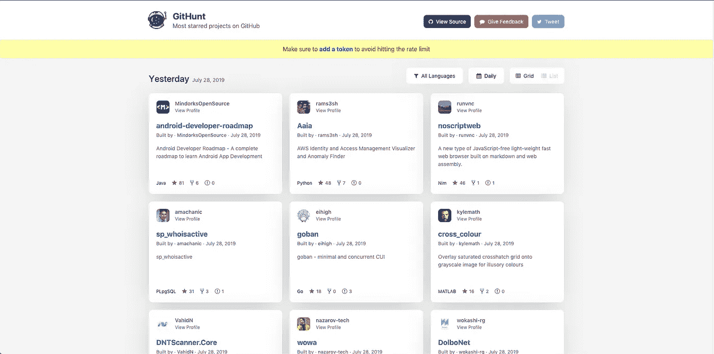

# 在你的 Chrome 新标签界面中的 GitHub 项目

> 原文：<https://betterprogramming.pub/githunt-trending-github-projects-in-your-chrome-new-tab-screen-d57168922918>

## 趋势开源项目，就在您的浏览器中

GitHub 是最著名和广为人知的版本控制库之一。在里面，你可以找到无数用多种编程语言编写的公共项目。

它使得与您的团队成员和世界各地的开发人员协作变得容易。你们可以一起学习，也可以为这些项目做出贡献。

# 寻找和处理趋势项目

除了许多其他东西，GitHub 还展示了*趋势项目*。这样更容易知道哪些项目得到了最多的关注。您可以找到最近获得了许多来自开发伙伴的明星的项目。

寻找新趋势项目的过程变得更加容易——现在有一个 Chrome 扩展，叫做 [*GitHunt*](https://github.com/kamranahmedse/githunt) ，致力于增加你对开源项目的了解。

GitHunt 可以作为 Chrome 扩展安装在你的浏览器中，让你能够在新标签页中看到 GitHub 上的热门项目。您可以查看每日、每周或每月的趋势项目。

您可以选择仅用一种语言或所有语言显示趋势项目。但是，目前没有选择一种以上语言而不包括所有语言的选项。

除了项目标题和星级数，您还可以查看简短的项目描述(如果已经添加)和打开的问题数。您也可以通过简单地点击显示在新标签中的项目来访问该项目。

# 为什么要安装这个扩展？

GitHub 被称为软件开发人员的新简历。这是向潜在的招聘者宣传你的知识、技能、专长和编码风格的好方法。

因此，许多开发人员在 GitHub 上发布他们的一些最佳作品。这使得其他开发人员可以从中学习，为其做出贡献，并发布他们自己的创新。

即便如此，有时也很难偶然发现最好的项目。你可能没有直接查看 GitHub 的习惯，只是为了查看趋势项目。但是，如果你在 Chrome 的新标签中有它们，你会增加发现对你有帮助的新的有趣项目的机会。

像[脸书、](https://readwrite.com/2013/10/17/is-facebook-the-worlds-largest-open-source-company/)和[微软](https://opensource.org/node/901)这样的大公司从开源项目中受益匪浅。让这说服你，甚至更多，在你的浏览器中使用这个扩展。

您可能会在新标签页中找到一个简单的项目，它已经为困扰您的问题提供了解决方案。也许你计划在谷歌上搜索一个看似合理的解决方案，但是这个解决方案可能就在这里。

这些项目可以激发你新的知识、想法和模式，帮助你构建下一个流行的开源项目。

GitHunt 也是一个开源项目，你可以[在 GitHub](https://github.com/kamranahmedse/githunt) 上找到。如果你有任何关于如何改进它的想法，作者已经呼吁你的贡献。

我做了一些[小的错别字修复](https://github.com/kamranahmedse/githunt/pull/15)，并邀请您继续改进这个伟大的项目。

您可以通过访问其 [GitHub 页面](https://github.com/kamranahmedse/githunt)来阅读更多内容并查看该扩展的源代码。你可以通过 [Chrome 网络商店](https://chrome.google.com/webstore/detail/githunt/khpcnaokfebphakjgdgpinmglconplhp)下载安装。