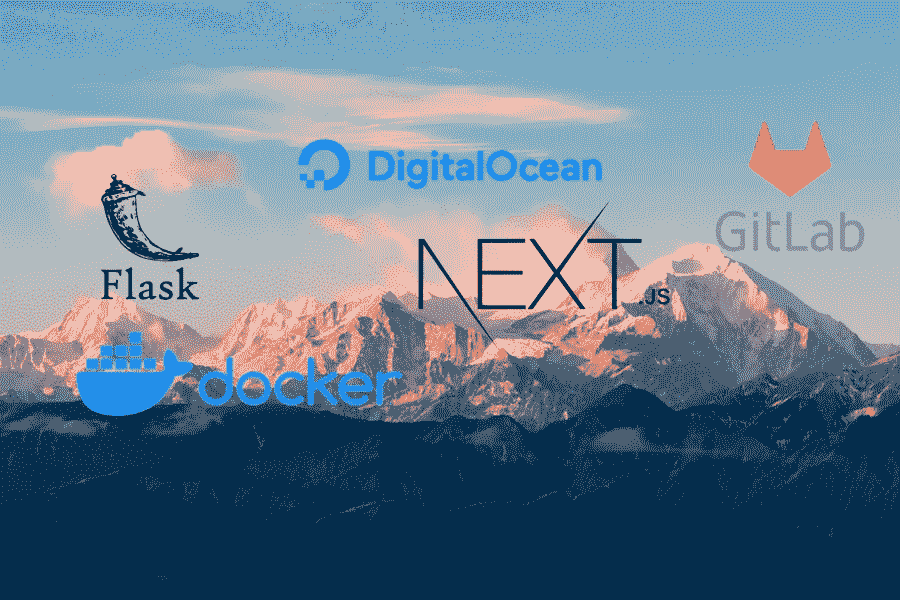
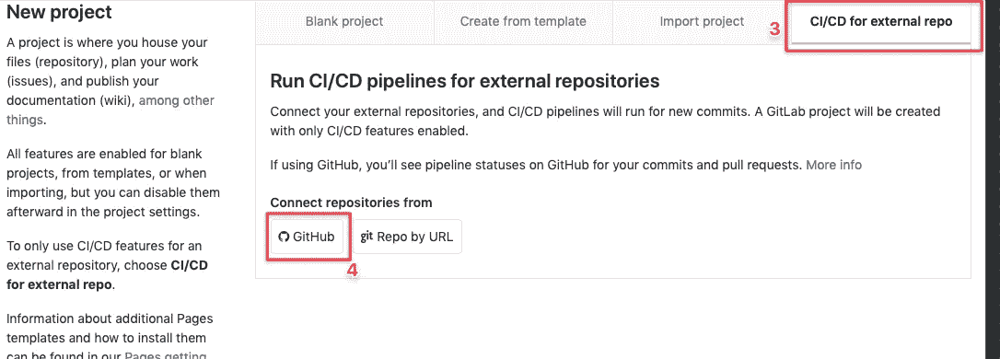
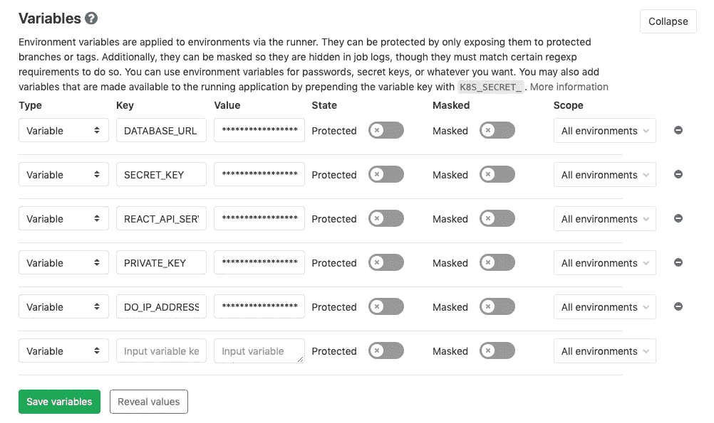
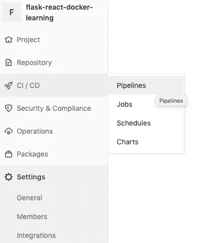
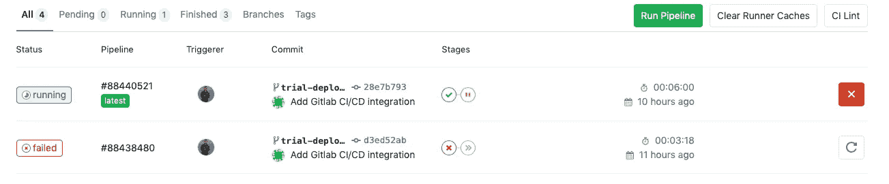
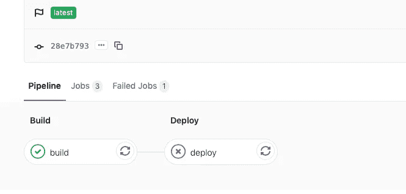
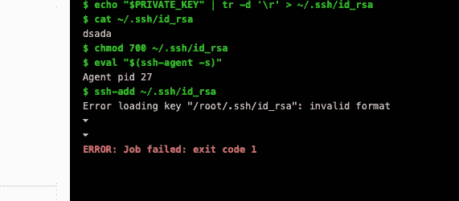

# 用于 Dockerized Flask 和 Next.js 应用程序的 Gitlab CI/CD

> 原文：<https://betterprogramming.pub/gitlab-ci-cd-for-dockerize-flask-and-nextjs-application-b01868401904>

## 让我们为您的应用程序设置持续集成

Gitlab，Docker，Flask，Next.js，DigitalOcean

几周前，我写了一篇关于用 [Flask、Next.js 和 Docker](https://medium.com/better-programming/setup-flask-nextjs-application-with-docker-97e82a897573) 构建应用程序的文章。在那篇文章中，我描述了如何对后端的 Flask 应用程序进行 dockerize。现在是前端，而 [NGINX](https://www.nginx.com/) 是反向代理服务器。

我还展示了一种使用`docker-compose`为本地开发轻松运行所有容器的方法，并使用`docker-machine`将其直接部署到 [DigitalOcean](https://www.digitalocean.com/) 。

如果您还在玩一个玩具项目，我在那篇文章中描述的设置就足够了。在真实的、基于团队的协作环境中，很难只允许本地机器部署。

因此，我们需要能够让我们安全、自动地将应用程序部署到云服务器的技术。

# 持续集成/持续部署

这就是 CI/CD 技术的用武之地。正如 ThoughtWorks 在他们的文章中解释的那样:

> *持续集成(CI)是一种开发实践，它要求开发人员每天数次将代码集成到共享存储库中。然后，每个签入都由一个自动构建来验证，允许团队尽早发现问题。*
> 
> *持续部署与持续集成密切相关，是指将通过自动化测试的软件发布到产品中。*

简而言之，CI/CD 允许开发人员将代码推送到存储库，并自动构建和部署到我们的部署环境中。

在本文中，我将向您展示如何使用 GitLab CI/CD 基础设施轻松集成我们的项目，以自动部署到我们在 DigitalOcean 中的服务器。

有几种 CI/CD 技术或提供商可供您使用。比如一个 SASS 平台比如 [circleci](https://circleci.com/) 、 [Travis CI](https://travis-ci.com/) 、 [Buildkite](https://buildkite.com/) ，或者用 [Jenkins](https://jenkins.io/) 搭建自己的基础设施。

在本文中，我使用 GitLab 进行 CI/CD 基础设施演示。我选择 GitLab 的原因是我最近正在为我的项目集成它。此外，它是提供免费 CI/CD 基础架构和合理功能的平台之一。

# 与 GitLab CI/CD 集成

在本教程中，我将演示如何使用 GitLab CI/CD 基础架构运行自动 Docker 映像构建，并将其部署到 dockered[Flask](https://palletsprojects.com/p/flask/)和 [Next.js](https://nextjs.org/) 应用程序的 DigitalOcean droplet。

要完成本教程，您可能需要事先做一些准备:

*   [GitLab 账户](https://gitlab.com/users/sign_in#register-pane)
*   数字海洋账户。

本文中的所有示例都可以在本[报告](https://github.com/martindavid/flask-react-docker-learning)中找到。回购包含一个简单的应用程序，包括:

*   具有`Users`和`Auth`端点的后端的 Flask API。
*   Next.js 应用程序的前端，有一个简单的主页和登录页面。
*   NGINX 用于 Flask API 和 Next.js 应用程序的反向代理。

GitLab 中的 CI/CD 工作流使用一个名为`.gitlab-ci.yml`的文件进行配置。让我们将`.gitlab-ci.yml`文件添加到我们的根项目文件夹中。

在脚本中，我们将创建两个阶段；一个用于构建 Docker 映像，另一个用于部署它。

在这个配置中，我们将使用 GitLab Docker 映像注册表来存储 Docker 映像。如果您愿意，也可以使用 [Docker Hub](https://hub.docker.com/) 。

# 初始脚本

上面的脚本在工作流的每个阶段之前运行。`before_script`部分是在配置文件中为工作流的每个阶段重用相同步骤的方法。

脚本的第一步是导出存放 Docker 图像的地址的环境变量。然后，它安装`open-ssh`客户机，以便稍后登录到我们的数字海洋服务器，并安装`[Bash](https://www.gnu.org/software/bash/)`来执行 Bash 脚本，以便设置环境变量。

之后，该脚本登录到 GitLab Docker 注册表，这样我们就可以从中推送和提取图像。

上面脚本中的最后一步执行`setup_env.sh`脚本。`setup_env.sh`脚本获取 GitLab CI/CD 配置中设置的所有环境变量，并将其放入`.env`文件中。

该文件将在接下来的步骤中执行。`setup_env.sh`的内容是这样的:

# 构建阶段

上面的构建阶段包括三个主要步骤。

1.  首先，如果图像存在于注册表中，它会提取图像。
2.  接下来，它根据我们在`docker-compose.ci.yml`文件中的配置构建映像。
3.  最后，在构建映像之后，它将最新的构建映像推回 GitLab Docker 映像注册中心。

`docker-compose.ci.yml`文件非常简单，它只包含 Flask 和 Next.js 应用程序的配置。

# 部署阶段

对于部署阶段，脚本包含几个步骤。

1.  将用于 [SSH](https://www.ssh.com/) 的私钥提取到 DigitalOcean droplet 中，并将其添加到 GitLab CI/CD 进程中。
2.  通过 SSH 将部署所需的所有工件复制到 DO droplet。
3.  运行部署脚本。部署脚本执行:

*   SSH 到 DO droplet。
*   从 DO droplet 登录 GitLab Docker 注册表。
*   提取所需的 Docker 图像。(Flask 和 Next.js docker 图片。)
*   运行`docker-compose`在液滴上运行。

下面的代码展示了如何在`.gitlab-ci.yml`文件中实现它。

从上面这段代码可以看出，我们需要添加一个名为`docker-compose.prod.yml`的新文件。

最后，上一步中的`deploy.sh`脚本完成了大部分部署工作。脚本内容如下所示:

总之，该脚本将:

1.  SSH 进入数字海洋水滴。
2.  导出 Docker 映像所需的所有环境变量。
3.  从 GitLab Docker 注册表中提取 Docker 图像。
4.  运行`docker-compose.prod.yml`。

最后，这是我们最终的 GitLab 工作流脚本，GitLab 将选择并运行 CI/CD 流程。

# 在 GitLab 中运行 CI/CD

如果您的项目存储库在 GitLab 中，一旦您将该脚本推入存储库，GitLab 将自动选择新的 CI/CD 配置并立即运行它。

如果你没有将你的回购存储在 GitLab 中(比如在 GitHub 中)，你仍然可以将你的项目与 GitLab CI/CD 基础设施集成。在本节中，我将向您展示如何做到这一点。

1.  登录您的 GitLab 帐户。
2.  在主页上，点击`New project`按钮。
3.  在创建新项目页面上选择`CI/CD for external repo`选项卡。
4.  点击`Github`按钮进行`Connect repositories from`选择。
    您可能需要先创建一个 GitHub [个人令牌](https://github.com/settings/tokens)并向 GitLab 注册。
5.  选择要与 GitLab CI/CD 管道集成的 repo，然后单击`Connect`。连接到回购并完全集成它需要几分钟时间。这个进程在幕后做的是镜像我们的 GitHub repo，并将其放入 GitLab。有一个后台进程运行我们的 GitHub repo 和 GitLab repo 之间的同步过程。
6.  一旦连接上，对 repo 的每个提交都会自动触发 CI/CD 管道。

在下一步中，在我们对 repo 进行修改之前，我们需要首先设置 DigitalOcean droplet。接下来，我们需要在 GitLab 上设置 CI/CD 工作流中所需的所有环境变量。

# 设置数字海洋水滴

出于本教程的目的，让我们创建一个新的数字海洋水滴。当你创建一个新的 droplet 时，确保你添加了一个`ssh-key`，类似于你将要放入 GitLab CI/CD 环境中的那个。

在你创建了一个新的 DigitalOcean droplet 之后，你可能需要 SSH 到这个 droplet 并在根系统中创建一个新的文件夹`/app`。我们将使用这个文件夹来存储我们所有的部署工件。

# 设置 Gitlab CI/CD 环境变量

我们还需要在 GitLab CI/CD 的环境变量中设置另一个东西。

正如您在上一部分中看到的，我们有一个`setup_env.sh`脚本，它从 GitLab CI/CD 环境变量中获取所有内容，并将其放入`.env`文件中。

要在 GitLab CI/CD 中添加环境变量，您需要进入设置-> CI/CD，然后展开变量选择。以这种形式添加我们需要的可变环境。

将 Github 连接到 Gitlab CI/CD 管道

对于我们的示例应用程序，我们需要将这些变量放入 CI/CD 环境变量中:

*   `DATABASE_URL` : [Postgres](https://www.postgresql.org/) 可以在云中访问的连接字符串。
*   `SECRET_KEY`:我们的 Flask 应用程序的随机字符串。
*   `REACT_API_SERVICE_URL`:Flask API URL。这个变量值就是 droplet API/域名(如果有的话)。例如`http://<droplet IP address>`。
*   `PRIVATE_KEY` : SSH 到 DigitalOcean droplets 的 SSH 私钥。
*   `DO_IP_ADDRESS`:数字海洋水滴 IP 地址。

GitLab CI/CD 环境变量

# 将变更推送到回购

在我们设置好一切之后，现在我们可以将我们的更改推送到存储库。一旦你推了，你就可以去 GitLab，打开 CI/CD 管道页面。

从页面上，您可以看到有一个 CI/CD 流程正在运行。您可以单击正在运行的流程，查看当前正在运行哪个阶段。

Gitlab CI/CD 管道菜单

GitLab CI/CD 运行管道

GitLab CI/CD 运行阶段

如果其中一个阶段失败，您可以单击失败的阶段，查看流程中发生的事情的完整日志以及错误消息。

GitLab CI/CD 失败阶段

GitLab 失败阶段错误详细信息

# 最后的想法

如果我们想同时运行多个 Docker 容器，Docker 和 Docker Compose 是一个很好的组合。这也使得从本地机器直接使用`docker-machine`进行部署变得容易。

但是在现实世界中，很多人都在使用应用程序，并且经常发生更改，我们需要一种更安全的机制来将更改部署到生产服务器。

这就是 CI/CD 技术的用武之地。使用 CI/CD，可以通过一组配置自动测试、构建和部署应用程序。

在本文中，我展示了如何将 dockerized Flask 和 Next.js 应用程序集成到 GitLab CI/CD 基础设施中。项目存储库不一定要在 GitLab 中。

当我们的项目驻留在其他源代码控制平台(例如 GitHub)时，我们可以利用 GitLab CI/CD runner。

在本文中，我将展示如何从`docker-compose.yml`文件构建 Docker 映像，将映像推送到 GitLab Docker 注册表，并将应用程序部署到 DigitalOcean droplet。

您可以在工作流中添加更多步骤，例如，运行单元测试、运行集成测试等。希望这篇教程能帮助你了解更多关于 CI/CD 的知识，尤其是在 GitLab 环境下。

# 资源

*   [ThoughtWorks 的 CI/CD](https://www.thoughtworks.com/continuous-integration)
*   [项目仓库](https://github.com/martindavid/flask-react-docker-learning)