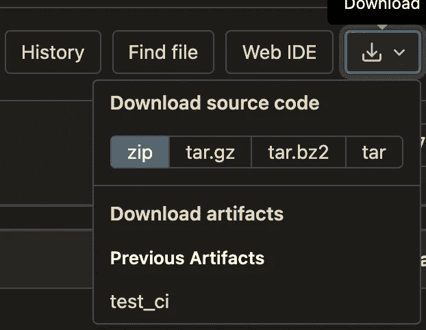
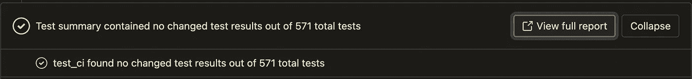

# 用于节点测试和覆盖的 Gitlab CI

> 原文：<https://betterprogramming.pub/gitlab-ci-for-node-testing-and-coverage-d8f8c82f8c1e>

## Nodejs 的 Gitlab CI v15.0 特性


照片由 [Rodion Kutsaev](https://unsplash.com/@frostroomhead) 在 [Unsplash](https://unsplash.com/photos/xNdPWGJ6UCQ) 上拍摄

Gitlab 是一个流行的开源版本控制系统，可以免费使用，并可以构建在内部网中，Gitlab 有许多有用的功能，如 Gitlab CI。

Gitlab 长期以来一直将 CI/CD 管道集成到 Gitlab 中，并演化出了所谓的 [Gitlab 流程](https://docs.gitlab.com/ee/topics/gitlab_flow.html)。在本文中，我不会浏览整个 Gitlab CI 指南，也不会解释 CI/CD 的概念，而是将重点放在如何使节点测试报告更具代表性。

为什么是这个话题？主要原因是我们经常一起使用`nyc`和`mocha`来构建 Node 的测试报告，但是这样的组合需要一点小小的改动，以便适应 Gitlab 的丰富功能。这篇文章就是关于这些方法的，并将使用一个真实的`.gitlab-ci.yml`作为例子。

> *请注意，本文是基于 Gitlab v15.0* 编写的

# 测试报告

在一份好的测试报告中，我们需要几个重要的特征。

1.  完整报告的人工制品。
2.  每个*拉取请求*或*合并请求*的测试总结。
3.  每个*拉取请求*或*合并请求*的变更覆盖范围。
4.  整个管道的状态，包括最近的成功或失败及其覆盖范围，最好是徽章的形式。

# 报告工件



这是最新的管道报告，为了能够在这里下载，我们需要添加一个新的`artifacts`字段来指定我们希望在所需阶段导出的路径。例如，在上图中，设置如下。

```
test_ci:
  script:
    - npm run test
  artifacts:
    paths:
      - coverage/
```

这意味着我们将把`coverage`文件夹下的所有东西打包导出。

# 测试总结



为了在 *Merge Request* 中显示一个测试的结果，包括测试了多少个用例，多少个成功或者失败，甚至为了查看每个用例用了多长时间，你需要让 Gitlab 知道测试报告的格式，并以相应的格式产生结果。

所以我们继续延伸上面的`.gitlab-ci.yml`例子。

```
test_ci:
  script:
    - npm run test
  artifacts:
    paths:
      - coverage/
    reports:
      junit:
        - test-results.xml
```

在本例中，我们使用 JUnit 格式创建测试报告，并将 CI 报告的路径通知 Gitlab。这样，Gitlab 就有能力在每个*合并请求*中呈现正确的报告内容和摘要。

# [更改覆盖范围](https://docs.gitlab.com/ee/user/project/merge_requests/test_coverage_visualization.html)

在进行代码评审时，我们都点击进入*变更*来看看哪些部分被变更了。


对于评审者来说，在一个地方看到变更的测试覆盖率会更有效率。所以，我们想让评审者容易知道哪些代码没有被测试。


在这张图中，我们一眼就能看出 14 号线没有被测试覆盖，而其他线都在测试中。值得一提的是，即使有测试覆盖，也不代表测试就完成了，比如这里就无法确定边界测试的条件，我们还得依靠评审人员的经验。

然后，我们继续扩展原来的设置。

```
test_ci:
  script:
    - npm run test
  artifacts:
    paths:
      - coverage/
    reports:
      junit:
        - test-results.xml
      coverage_report:
        coverage_format: cobertura
        path: coverage/cobertura-coverage.xml
```

# [管道徽章](https://gitlab.svc.langlive.tech/help/ci/yaml/index#coverage)


在现在流行的开源项目中，用户在`README.md`开头就被告知项目的健康状况，这是对用户有用的信息，也是开发者了解项目健康状况的快捷方式。

如果您看到管道的状态为失败，那么一定有问题。另一方面，覆盖率徽章是项目测试覆盖率是否完整的一个很好的指示器。

幸运的是，徽章是 Gitlab 的内置功能。你可以在 Gitlab 设置中找到徽章的位置。

> *设置> CI/CD >综合管线*

有三种类型的徽章，*管道状态*、*覆盖报告*和*最新发布*。你可以挑选你想要的。

从 Gitlab v15.0 开始，我们可以在`.gitlab-ci.yml`的 **re2 语法**中指定一个正则表达式来标识覆盖率数字。

```
test_ci:
  script:
    - npm run test
  coverage: '/All files\s+\|\s+\d+\.\d+/'
```

这个 **re2 语法**的规则是找到跟在`All files`后面的浮点数作为覆盖率。如果您没有使用`nyc`，您必须根据内容调整规则。

# 详情请见`package.json`

上面的例子已经完全实现了开发的必要特性。但是我们还没有解释如何同时生成覆盖率报告、JUnit 报告和变更覆盖率。

这一切的关键就在`npm run test`，也就是`package.json`。

```
{
  "script": {
    "test": "nyc --reporter=html --reporter=text --reporter=cobertura mocha"
  }
}
```

从上面的设置中我们可以看到，这个 busy `nyc`负责为三种不同的特性产生三种类型的输出。

*   html:作为整个项目的覆盖报告，将在下载工件时使用。
*   text:生成徽章需要控制台输出。
*   cobertura:正如我们从上一节中所知道的，变更覆盖率是使用`cobertura`格式来表示的。

等等，少了一个？谁为 JUnit 创建报告？答案是`mocha`。但是这不是`mocha`的内置特性，所以我们必须使用一个额外的工具来完成。

首先，下载`mocha-junit-reporter`包。

```
npm i mocha-junit-reporter — save-dev
```

接下来，创建`mocha`配置文件`.mocharc.js`。

```
module.exports = {
  reporter: "./junit-spec-reporter.js"
};
```

在配置文件中，我们告诉`mocha`通过另一个文件生成报告，这个文件也是 JUnit 生成器。

以下是`junit-spec-reporter.js`的内容。

```
const mocha = require("mocha");
const JUnit = require("mocha-junit-reporter");
const Spec = mocha.reporters.Spec;
const Base = mocha.reporters.Base;function JunitSpecReporter(runner, options) {
  Base.call(this, runner, options);
  this._junitReporter = new JUnit(runner, options);
  this._specReporter = new Spec(runner, options);
  return this;
}
JunitSpecReporter.prototype.__proto__ = Base.prototype;module.exports = JunitSpecReporter;
```

此时，我们需要的所有格式都可以正确生成，Gitlab CI 将基于这些输出呈现丰富的视图，开发人员可以在 Gitlab 的网页上完成大部分日常工作，而无需在本地实际构建输出。

# 结论

CI/CD 是非常重要的软件开发实践。然而，为了让每个开发人员都有兴趣甚至信心去“继续”实践，人们必须能够“看到”变化。

对于工程师来说，眼见为实是我们大多数人的信仰。因此，这些丰富的特性对于管道足够有效是必不可少的。

完整的`.gitlab-ci.yml`，包括所有提到的功能，如下所示。

```
test_ci:
  script:
    - npm run test
  artifacts:
    paths:
      - coverage/
    reports:
      junit:
        - test-results.xml
      coverage_report:
        coverage_format: cobertura
        path: coverage/cobertura-coverage.xml
  coverage: '/All files\s+\|\s+\d+\.\d+/'
```

以我的经验来看，当一个测试平台搭建完成后，并不是所有人都乐于使用它，毕竟编写测试是额外的工作。但是当平台足够丰富的时候，大部分人都会愿意尝试。

对于一个刚刚开始建立开发过程的团队来说，让人们愿意尝试比什么都重要。

所以本文重点介绍 Gitlab CI，从不同的角度介绍 CI 在开发过程中的作用。