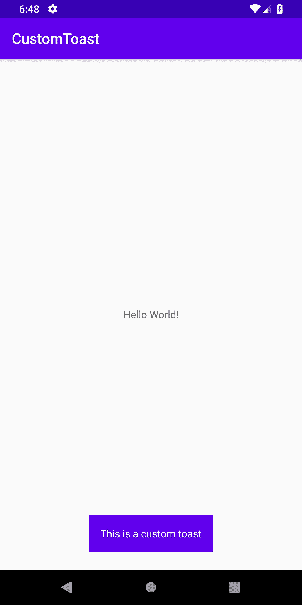

# 使用 TastyToasty 在 Android 上为您的祝酒词赋予生命

> 原文：<https://betterprogramming.pub/give-life-to-your-toasts-on-android-using-tastytoasty-45d0d673129e>

## 向您的用户显示更友好的提醒


使用 TastyToasty 库可以实现类似 Instagram 的吐司

toast 是 Android 应用程序开发中经常使用的元素，用于向用户提供一些反馈或提示。这是一个非常强大的 UI 元素，让应用程序以一种温和的方式向用户传达任何提示、错误或更新。我创建了一个名为 [TastyToasty](https://github.com/usman18/TastyToasty) 的库，它提供了适用于不同场景的各种吐司。

在我们看到如何用 TastyToasty 烤面包之前，我们将看到如何在 Android 中创建自定义烤面包。这样，我们将更好地了解如何使用这个库来节省时间和精力——尽管如果您愿意，可以跳过这一步。

# 在 Android 中创建自定义祝酒词

对于创建定制的祝酒词，简单的过程(我们马上会看到细节)是我们创建一个定制的布局，展开这个布局，将视图设置为我们的`Toast`对象，并最终显示它。所以还是一步一步来吧。

## 第一步。创建您的自定义吐司布局

*   在`res/layout`文件夹中创建一个新的布局资源文件。将布局文件命名为`toast_layout.xml`。
*   我们的布局基本上将是一个彩色背景和白色文本的祝酒词。(你可以根据自己的要求定制，也许还会放一个图标在上面。)代码如下:

## 第二步。放大创建的布局

*   为了放大我们创建的布局(即`toast_layout.xml`)，我们将利用`LayoutInflater`类来放大我们的布局，并获得相同的视图。
*   在您的活动中，创建一个名为`showToast(String message)`的方法，它将包含所有的 toast 创建代码。

```
*void* **showToast**(String **message**) {

}
```

*   现在将布局膨胀代码放入这个方法中，如下所示:

```
*void* **showToast**(String **message**) {
       **View** view = **LayoutInflater**.*from*(MainActivity.*this*)
              .inflate(R.layout.**toast_layout**, *null*);
}
```

## 第三步。创建 Toast 对象并显示它

*   这是最后一步，我们将视图绑定到 toast 对象，设置它的上下文，最后显示它。因此，让我们用与下面相同的方法创建一个`Toast`对象，并向它传递一个上下文。

```
**Toast** toast = *new* **Toast**(**MainActivity**.*this*);
```

*   在最终将视图设置为 toast 并显示它之前，我们需要将消息设置为我们的`TextView`

```
**TextView** tvMessage = view.**findViewById**(R.id.**tvMessage**);
tvMessage.**setText**(message);
```

*   最后，为我们的祝酒词设置视图并展示它。

```
toast.**setView**(view);
toast.**show**();
```

*   您的方法应该如下所示:

无论您想在哪里调用这个方法，屏幕都应该显示如下的祝酒词:



我们的祝酒词已经制作好了，但对我来说，准备一份定制的祝酒词似乎花费了很多时间和精力。所以我创建了 [TastyToasty](https://github.com/usman18/TastyToasty) ，它封装了所有这些代码并提供了简单的一行程序供调用，这有助于我们创建自定义的祝酒词。

以下是可以用 TastyToasty 制作的不同种类的祝酒词。

# Instagram 祝酒词

1.  `instaLike` : 只要用户在 Instagram 上收到赞，就可以用一行代码创建类似弹出窗口的祝酒词，如下所示:

```
TastyToasty.**instaLike**(MainActivity.this, "1").**show**();
```


Instagram“喜欢”喜欢使用 TastyToasty 的吐司

同理，2。`instaFollower`和 3。`instaComment`可以用来说明可以产生以下结果:


Instagram 新增“关注者”和“评论”祝酒词

4.`instaAll`:还可以创建新的赞、关注者和评论。

```
TastyToasty.**instaAll**(MainActivity.this, "101","20","60").**show**();
```


InstaAll

# 振动祝酒

有时，我们可能想要创建一个特定颜色的烤面包。TastyToasty 提供了一种快速的方法。

1.  紫罗兰

```
TastyToasty.**violet**(MainActivity.this, "Its lit", R.drawable.ic_whatshot).**show**();
```


紫罗兰背景吐司

同样，VIBGYOR 的其余部分也可以使用:


用靛蓝、蓝色、绿色、黄色、橙色和红色祝酒

您可以为那些不希望出现在 toast 中的参数传递 null(例如，没有图标或文本的 toast)。我们已经帮你处理好了。

# 标准祝酒词

1.  成功

```
TastyToasty.**success**(MainActivity.this, "Task Successful").**show**();
```


吐司使用方法**成功**

类似地，可以使用其余的标准祝酒词(误差、趋势、星形):


使用趋势图、星形图和误差图祝酒

# 习俗祝酒

1.  使用`makeText()`


定制吐司

2.`Builder`方法(更容易使用)


使用生成器方法吐司

# 注意

使用`Builder`方法，你可以非常容易地创建定制的祝酒词。只调用您希望包含在 toast 中的属性的方法。例如，如果您想要一个只有图标的祝酒词，只需调用那个方法(但是要确保您总是传递上下文)并忽略其余的属性设置方法。下面是一个例子:


回购链接: [usman18/TastyToasty](https://github.com/usman18/TastyToasty)