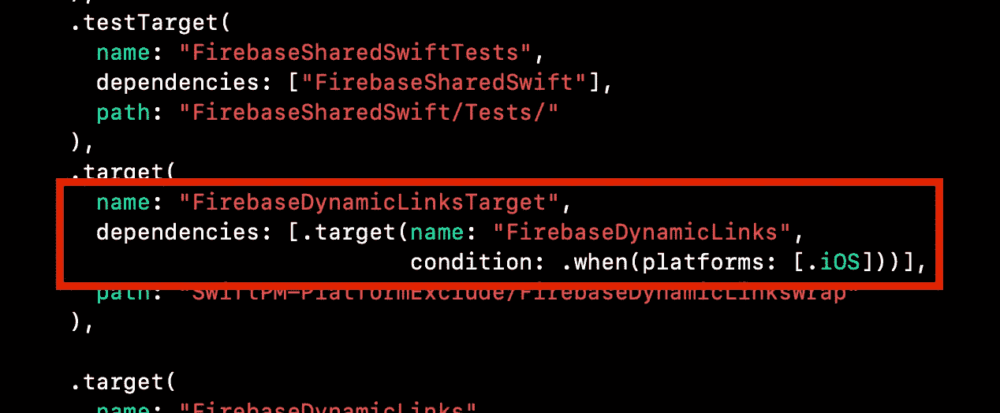
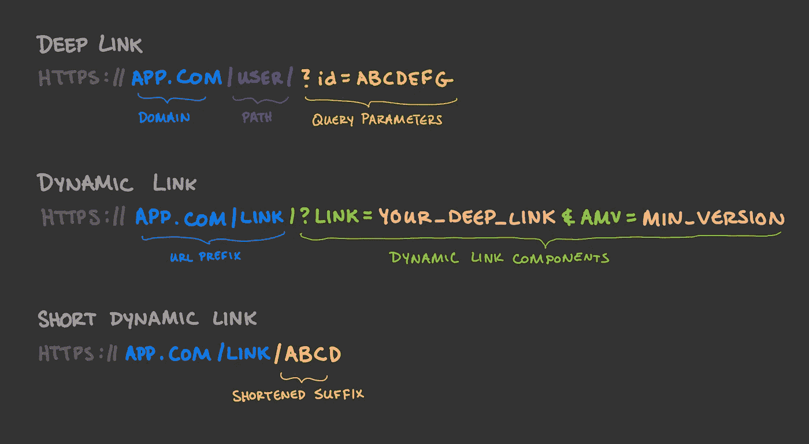
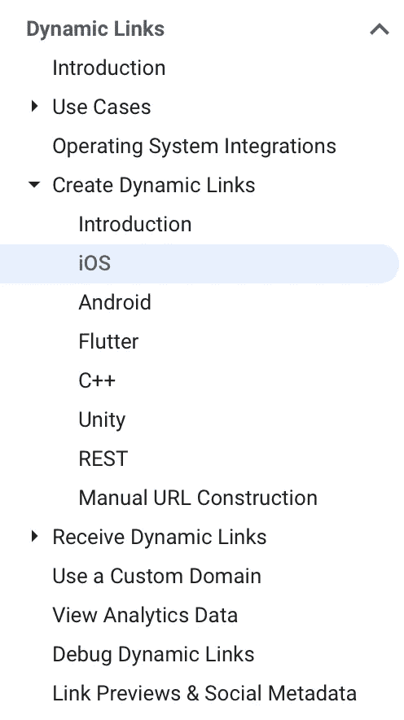
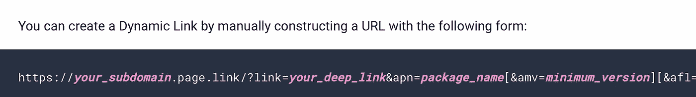
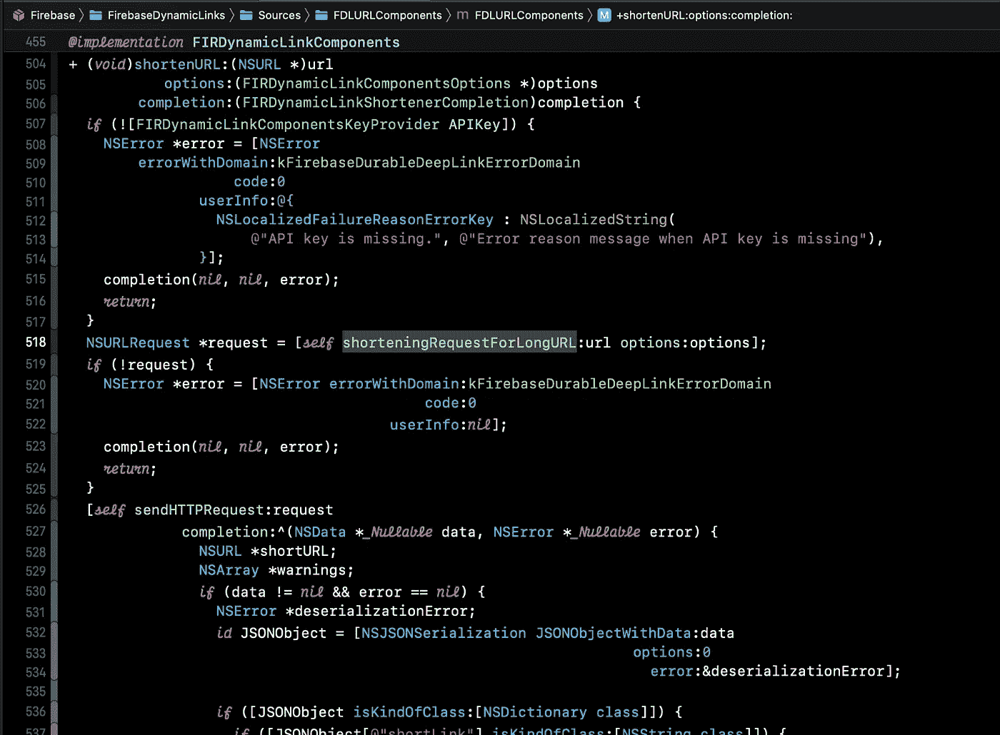
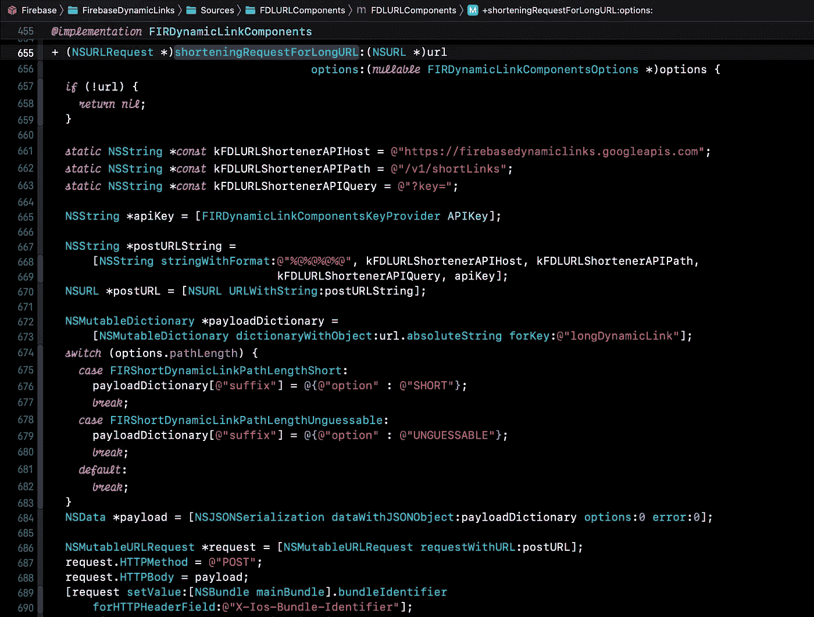
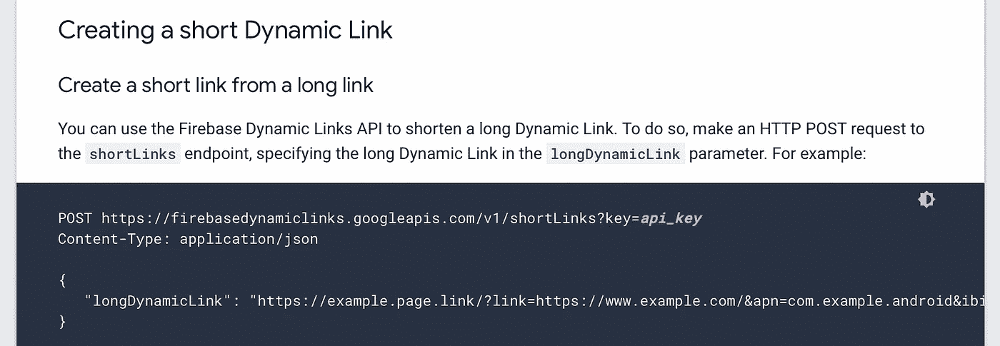
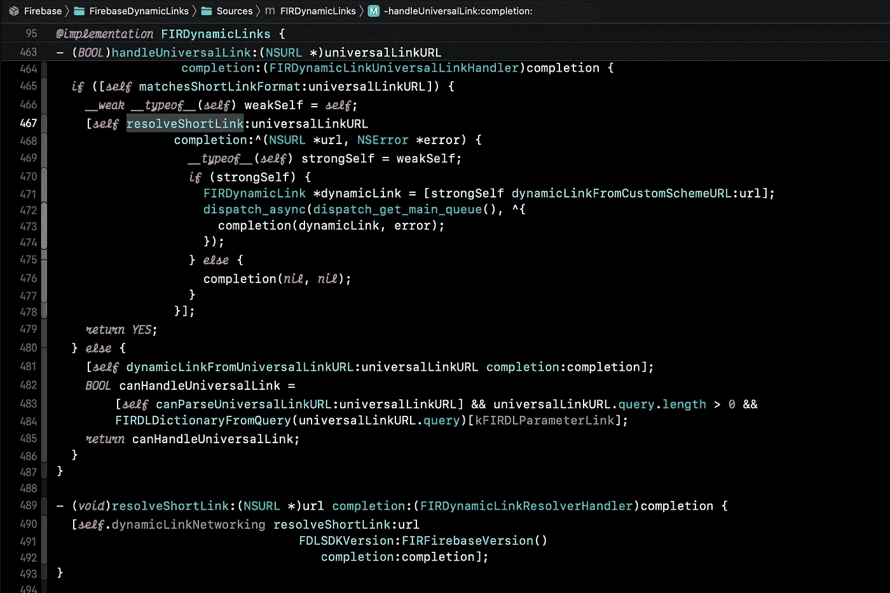
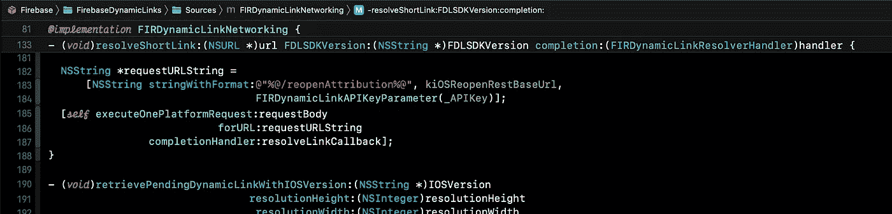
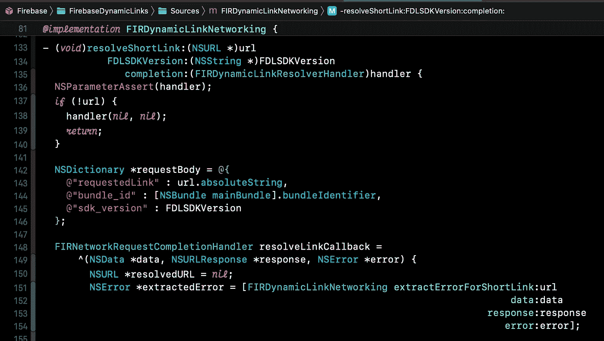

# 给予 Firebase 动态链接 macOS 支持

> 原文：<https://betterprogramming.pub/giving-firebase-dynamic-links-macos-support-fc8e9672180f>

## 对 Firebase iOS SDK 进行反向工程


作者图片

根据他们的文档，Firebase 动态链接[只在 iOS](https://firebase.google.com/docs/dynamic-links/ios/create?hl=en&authuser=0#create-a-dynamic-link-from-parameters) 上受支持。我将向您展示我如何通过逆向工程 Firebase iOS SDK 来添加 macOS 对动态链接的支持。

我很高兴使用 Firebase 构建我的 iOS 和 macOS 跨平台应用程序，直到我了解到 Firebase 动态链接只适用于 iOS。我想将在线会话集成到我的应用程序中，我使用动态链接作为其他用户加入会话的方式。

因此，发现 macOS 不支持动态链接令人失望。但我必须核实一下。



Firebase 动态链接目标仅在 iOS 上受支持。

证据就在 Firebase 的包里，swift:动态链接目标只支持 iOS。真扫兴。

但这让我想到…为什么？SDK 中 Firebase 动态链接库的核心特性是

*   从深层链接创建动态链接
*   向动态链接添加回退 URL、社交参数、最低版本和其他说明符
*   缩短动态链接
*   以及处理完成的链接。

很明显，看起来应该由 Firebase 来处理这些事情。我们信任他们在 SDK 中开发的东西；它一定会成功的！

但是是什么阻止了我们开发自己的 API 来解决 macOS 的问题呢？来自几个 Firebase 端点的几个 URL 请求；一些手动的 URL 解析和创建…这还不算太糟糕！

但是在深入研究代码之前，让我们先了解一下动态链接是如何工作的。

# Firebase 动态链接:复习

好了，你已经阅读了动态链接文档，但是现在是时候快速复习一下相关词汇了。像“深度链接”、“通用链接”、“回退 URL”等行话。会让人困惑。所以，我们先明确一下 Google 是什么意思。



快速概述深层动态链接和简短动态链接之间的主要区别。

*   在[移动上下文](https://en.wikipedia.org/wiki/Mobile_deep_linking)中，深度链接使用统一资源标识符(URI)链接到移动应用程序中的特定位置，而不是简单地启动应用程序。例如，如果您的应用程序没有安装，它可以用来打开应用程序商店。
*   动态链接是由 Firebase 托管和管理的链接。它包含关于您的应用的信息(如捆绑包 ID 和应用商店 ID)、社交元参数等。动态链接最大的卖点是跨平台的兼容性，可以兼容很多平台，比如 iOS、Android、Flutter 等。你的动态链接的有效载荷就是你的深层链接。
*   通用链接是指*可以*成为你的动态链接，并由你的应用程序处理的链接。Firebase 将尝试将通用链接解析为动态链接，这样它就可以给你真正的有效负载:深度链接。

动态链接是用 URL 前缀生成的。在 Firebase 中，默认情况下，您的 URL 前缀被生成为`your-firebase-project.page.link`。

如果使用自定义域，可以创建一个 URL 前缀，比如`my-website.com/link`。

*   短动态链接是您的动态链接的缩短版本。像普通的动态链接一样，它以你的 URL 前缀开始。但是，动态链接中的查询参数被缩短为 4 个(或更多)字符的随机字符串。

这些不同的链接类型看起来很棒。现在让我们回顾一下动态链接是如何工作的:

## **创建链接**

1.  首先，我们需要建立我们的**深层链接**。
2.  获取你网站的域名。比如，我会用`app.com`。
3.  为您的内容选择路径。我想链接到我的用户模型，所以我的路径将是`/user`。路径是可选的，你可以随心所欲地定制应用内处理。
4.  为额外的应用内处理添加查询参数。例如，我使用`?id=ABCDEFG`来指定我将获取 ID 为“ABCDEFG”的用户。
5.  你现在有你的深度链接有效载荷。在我的例子中，这是`[https://app.com/user?id=ABCDEFG](https://app.com/user?id=ABCDEFG.)` [。](https://app.com/user?id=ABCDEFG.)
6.  接下来，抓住你的域名网址前缀。我就用`app.page.link`。
7.  从这里开始，您使用 Firebase iOS SDK 创建一个“长”动态链接，其中包含附加参数，如所需的最低应用程序版本，或您的应用程序的应用程序商店 ID:

```
guard let link = URL(string: "https://app.com/user?id=ABCDEFG") else { return }
let dynamicLinksDomainURIPrefix = "https://app.page.link"
let linkBuilder = DynamicLinkComponents(link: link, domainURIPrefix: dynamicLinksDomainURIPRefix)
linkBuilder.iOSParameters = DynamicLinkIOSParameters(bundleID: "com.example.ios")
linkBuilder.androidParameters = DynamicLinkAndroidParameters(packageName: "com.example.android")guard let longDynamicLink = linkBuilder.url else { return }
print("The long URL is: \(longDynamicLink)")
```

8.通常情况下，你的长动态链接会…很长…你需要缩短它:

```
DynamicLinkComponents.shortenURL(url: longDynamicLink, options: nil) { url, warnings, error in
  guard let url = url, error != nil else { return }
  print("The short URL is: \(url)")
}
```

9.一旦缩短，你就有了可分享的动态链接。我的长得像`[https://app.page.link/ABCD](https://app.page.link/ABCD.)` [。](https://app.page.link/ABCD.)

## **办理环节**

1.  好了，我们已经打开了应用程序中的 URL。在 SwiftUI 中，这看起来像:

```
MyView()
.onOpenURL { url in
  // Handle universal url here.
}
```

2.我们使用 SDK 来处理(通用)URL 以解析动态链接:

```
DynamicLinks.dynamicLinks().handleUniversalLink(url)
{ dynamicLink, error in
  // Dynamic link passed here
}
```

3.我们从动态链接中获得深层链接 URL:

```
let deepURL: URL? = dynamicLink?.url
```

4.如前所述，深层链接包含我们的有效负载。例如，我可以打开一个用户的个人资料页面:

```
// deepURL = "https://app.com/user?id=ABCDEFG"if deepURL.path == "/user" {
  let components = URLComponents(string: deepURL.absoluteString)
  let userID = components?.queryItems.first?.value
  // Handle opening user ID here
}
```

嘣。我们完了。创建和处理的链接。

# 远离 SDK

但这些在 macOS 上都不起作用。这是一个问题，因为我希望能够*至少*从我的桌面应用程序(或任何其他 Swift-running 平台)创建链接。

所以，让我们看看我们是否能挑出`firebase-ios-sdk`和 Firebase 文档来完成我们的目标。

让我们从创建链接开始。最好从 Firebase 的[动态链接文档](https://firebase.google.com/docs/dynamic-links?authuser=0)开始。通常，我们会去 iOS 区。然而，你是否注意到文档中的另一部分可以帮助我们将动态链接引入 macOS？



你能在这里找到帮助我们在任何设备上创建动态链接的部分吗？

是**手动 URL 构建**。我在浏览文档时发现了这个页面，它最初给了我这样的希望，即这种努力在 macOS 上是可能的。

[检查一下](https://firebase.google.com/docs/dynamic-links/create-manually?authuser=0):



Firebase 文档向我们展示了动态链接可以手动构建。

使用典型的 URL 前缀和查询参数，我们可以嵌入我们的深度链接有效负载(`?link=`)和我们的所有元数据(即`&apn=` **、** `&amv=` **、** `&afl=`)，全部在本地:

```
var builder = URLComponents()
builder.scheme = "https"
builder.host = "app.page.link"
builder.queryItems = [
  .init(name: "link", value: "[https://app.com/user?id=ABCDEFG](https://app.com/user?id=ABCDEFG)"),
  .init(name: "ibi", value: "com.myapp.bundleid"),
  // add other items, like "isi", "imv", "ofl", "st", "sd"...
]
let longDynamicLink: URL? = builder.url
```

Swift 的`URLComponents`将会光荣地把它转换成一个适当格式的 URL，这就是我们的长动态链接。

现在，是时候缩短我们漫长的动态链接了。这是我们自己做休息工作将真正发光的地方。

我们知道 SDK 提供的 shorten 方法有一个转义完成处理程序，这意味着一定有与后端相关的事情正在进行。

事实上，正是如此:一个 POST 请求被调用。该请求包含关于新 URL 的长动态链接和期望的缩短链接的信息。

跳到 Firebase SDK 的`shortenURL`方法的定义，我们可以看到在第 518 行发出了一个 URL 请求:



Firebase iOS SDK 在第 518 行发出 URL 请求。

深入挖掘，我们看到“缩短请求”其实是一个啰嗦的 POST 请求……叫它！



第 661–663 行给了我们一些信息，我们需要这些信息来创建一个 POST 请求来缩短链接。

探索这种方法给了我们一些关键信息:

*   主持人:`[https://firebasedynamiclinks.googleapis.com](https://firebasedynamiclinks.googleapis.com)`
*   路径:`/v1/shortLinks`
*   查询:`?key=`(这是您在`GoogleService_Info.plist`中找到的 API 键)
*   请求正文(JSON):

```
{
  "longDynamicLink": longDynamicLink,
  "suffix": ["option": "SHORT"]
}
```

*   当然，这个方法是 POST with JSON content type。

我们已经做了调查，所以现在是时候作弊看看文件了。转到创建动态链接中的 REST 部分向我们展示了如何通过 REST 缩短一个长的动态链接[:](https://firebase.google.com/docs/dynamic-links/rest?authuser=0#create_a_short_link_from_a_long_link)



Firebase 文档向我们展示了如何通过 REST 缩短一个长的动态链接。

太棒了。这与我们刚刚设置的相匹配。

# 应用我们的挖掘来处理 URL

遗憾的是，这是文档所能告诉我们的。当谈到在我们的设备上处理 URL 时，没有关于使用 URL 请求从缩短的动态链接中解析深度链接或任何其他信息的信息。

好消息是什么？我们知道如何挖掘 SDK。让我们检查一下`DynamicLinks.dynamicLinks().handleUniversalLink(_:)`，看看我们能发现什么:



看起来像是`handleUniversalLink`在第 467 行调用了另一个方法`resolveShortLink`。跳到第 490 行的`resolveShortLink`的定义，我们收集了更多信息:



第 183 行给出了关于我们调用的 API 端点的信息。

注意，检查“/reopen attribute”，`kiOSReopenRestBaseUrl`和`FIRDynamicLinkAPIKeyParameter(_APIKey)`都用于形成处理我们的动态链接所需的基本 API 端点:

*   端点:`[https://firebasedynamiclinks.googleapis.com](https://firebasedynamiclinks.googleapis.com)`
*   路径:`/v1/reopenAttribution`
*   查询:`?key=`(与之前相同的 API 键)

至于 POST 请求正文，让我们向下滚动一点:



第 142–146 行告诉我们 POST 请求主体。

我们可以看到 POST 主体的形式是:

```
{
  "requestedLink": url.absoluteString,
  "bundle_id": "com.app.bundleid",
  "sdk_version": "9.0.0"
}
```

来自 URL 请求的回调 JSON 为我们提供了深层链接 URL:

```
URLSession.shared.dataTask(with: request) { data, response, error in
  guard
    let data = data,
    let dict = try? JSONSerialization.jsonObject(with: data) as? [String: Any],
    let deepLink = dict["deepLink"] as? String,
    let url = URL(string: deepLink)
  else {
    completion(nil)
    return
  }
  // Handle your deep link URL here
}.resume()
```

当然，在 macOS 上，处理应用程序中打开的 URL 的选项是有限的，所以这里有一个快速的解决方法建议:

1.  如果用户使用的是 macOS 设备，让您的营销网站打开一个基于您的深度链接 URL 的备用 URL。这里，回退 URL 将包含像用户 ID 这样的有效负载信息。
2.  使用 JavaScript 处理 URL 并准备要打开的自定义 URL 方案。URL 方案是运行在 macOS 上的原生应用可以处理的东西，比如`my app://additional-information`。
3.  处理应用程序中的 URL 方案，直接访问有效载荷数据并处理您的业务。

# 总结

总之，重要的是要记住，作为开发人员，解决我们自己的问题并为我们自己和我们的同行开辟一条道路是我们的责任。

给 macOS 动态链接支持曾经似乎很困难，但是通过耐心和一点挖掘，我们设法克服了这个问题。

作为一名开发人员，对自己的学习和研究能力保持积极的心态是拥有解决难题的信心的关键。所以，保持耐心，尽力而为！反正那样你会学到更多。

# 额外收获:这在 Swift 包中提供

如果你读过我的文章，你会知道我正在开发 EasyFirebase，这是一个让 Firebase 更容易使用的 Swift 包。在开箱即用的包中支持 iOS 和 macOS 的动态链接，所以如果你[使用我的包](https://github.com/Flowductive/easy-firebase)，你不必自己实现这一切。

首先，您可以创建如下链接:

```
EasyLink.urlPrefix = "https://app.page.link"***var*** link = EasyLink(host: "app.com", path: "/user", query: ("id", "ABCDEFG"))
```

然后像这样缩短它:

```
link.shorten { url in
  // ...
}
```

像这样处理它:

```
EasyLink.handle(url) { easyLink in
  guard let easyLink = easyLink else { return }
  if easyLink.path == "/user" {
    if let id = easyLink.query["id"] {
      // Handle user ID here.
    }
  }
}
```