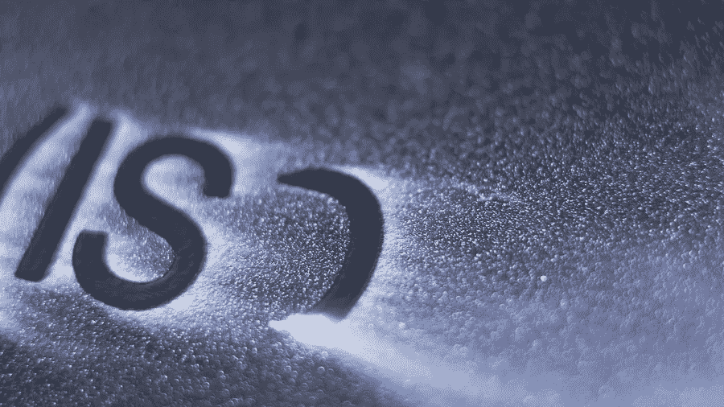
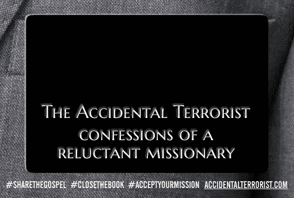
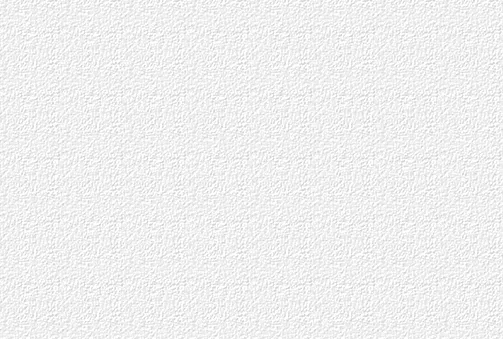
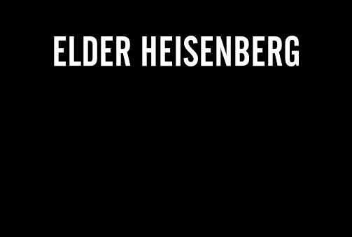
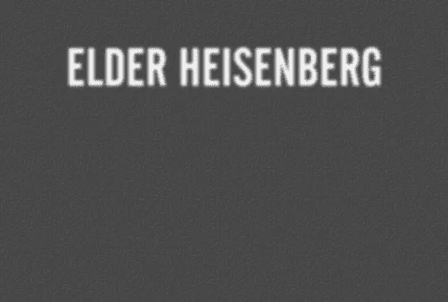
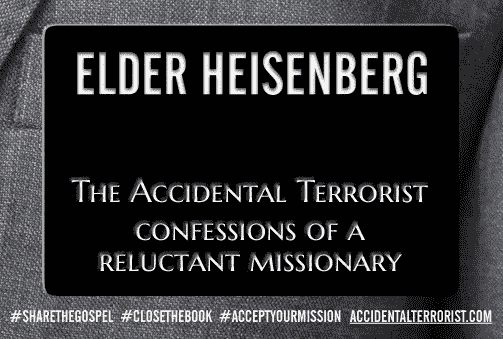
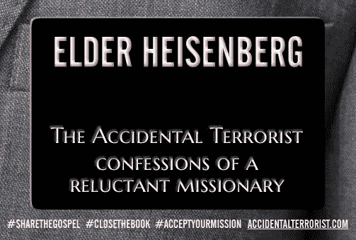

# 用 ImageMagick 和 Perl 给文本添加内阴影

> 原文：<https://betterprogramming.pub/giving-text-an-inner-shadow-with-imagemagick-and-perl-d8efd83affb8>

## 创建一个 CGI 脚本，将文本和花哨的效果合成到现有的图像上，比你想象的要容易得多

从 Bigstock 获得许可的图像

我的回忆录，**讲述的是我作为一名摩门教传教士年轻时的不幸遭遇。传教士总是戴着黑色的姓名标签，所以为了宣传我的书，我想给粉丝们一种方式[创造和分享他们自己定制的姓名标签图片](https://dogb.us/heisenberg)会很好。**

**为了实现这一点，我认为用 Perl 编写一个简单的 CGI 脚本是最好的。我有一种模糊的感觉，我可以使用 [Perl 接口](https://imagemagick.org/script/perl-magick.php)到 [ImageMagick](https://imagemagick.org/) 将一个名字以粗体白色文本覆盖到一个空白的姓名标签图像上，就像这样:**

****

***空白姓名标签图形****【image-magick-step-1.jpg】*****

**更重要的是，我希望这个名字看起来像是被印在或钻在名字标签上的，也许再加上一点鹅卵石的白色表面，给人一种质感。**

**我以前曾用 ImageMagick 做过一些简单的应用，我知道它是一个非常强大的图形处理包。然而，它也很神秘，没有多少用户友好的文档。(哦，有大量的文档。这有助于理解图形处理的流利程度。堆栈溢出，仅举一个论坛为例，充斥着关于如何用 ImageMagick 做这做那的问题。**

**我在网上寻找一个答案，我认为这是一个非常简单的问题，关于如何制作一个内在的阴影，但我一无所获。最后，我所能做的就是开始到处玩，直到我自己弄明白为止。**

**我*找到了*的答案，我会在下面列出我的方法，以防其他人也在寻找同样问题的答案。我并不认为这是最好的解决方案，事实上，我确信在 ImageMagick 中可能有一些非常聪明的方法，只需一个复杂的命令就可以做到这一点。不过，我喜欢一步一步来，这样我就可以很容易地看到每一点都发生了什么以及为什么。**

**话虽如此，我的方法相当简单，尽管一些细节有点棘手。我们将从声明开始，初始化一堆我们以后需要的变量(其中一些我们可以随意修改以调整我们的输出):**

**这应该是不言自明的，尽管我们将在下面更多地讨论这些变量。**

**接下来，我们声明几个`Image::Magick`对象，并分别加载上面的空白名称标签图形和下面的鹅卵石纹理图形:**

****

***卵石纹理图形****【image-magick-step-2.jpg】*****

**到目前为止，一切顺利。但是，在我们实际尝试在这些图像上打印任何文本之前，我们需要收集一些关于文本本身的信息，具体来说，就是渲染时文本的宽度:**

**`QueryFontMetrics`是 Image::Magick 的一个方法，当传递一些文本描述符时，它返回一个关于文本将如何呈现的统计数组。这里我们感兴趣的唯一返回值是`$width`，它将帮助我们正确地将文本居中。**

**我们的变量`$startx`和`$starty`描述了姓名标签上我们将文本居中的点。知道了文本的宽度，我们可以很容易地计算出左上角需要落在哪里:**

**如果我们也想让文本垂直居中，我们可以通过`$height`值来计算，但是在这种情况下，我们只需要知道文本的上边缘会落在哪里。**

**现在我们开始有趣的东西。我们的下一步是构建一个*蒙版*，这是一个灰度图像，在将一个图像合成到另一个图像上时用作滤镜。蒙版的黑色部分将使合成层透明，而白色部分将使其不透明。两者之间的灰度等级提供了不同程度的不透明度。**

**不过，我觉得用这些术语来思考面具有点困难。将遮罩视为模板可能更简单。你可以把你的模板放在你想要合成的图像的底层，然后通过它“喷涂”你的顶层。**

**再走几步你就会明白我的意思了。现在，我们将通过初始化一个新的`Image::Magick`对象来创建我们的蒙版图像，用黑色填充它，然后用白色在它上面打印我们的(正确定位的)文本:**

**上面的代码块产生了下图:**

****

***我们的蒙版图层，存储在****$蒙版*** *对象***

**看，那不像模板吗？我们将在最后一步中使用这个遮罩将一幅图像的一部分喷到另一幅图像上，同时遮挡其他部分。**

**好了，现在我们要构建我们的影子。这就是我们最终将与我们的文本层复合，给我们的姓名标签我们想要的三维外观。为了创建这个阴影，我们需要构造一个新的图像，这个图像看起来很像面具，但实际上不是。**

**这个过程与制作我们上面的面具非常相似。我们希望我们的阴影形状像我们的文本，所以我们再次建立了一个黑色背景上的白色文本的图像(尽管我们可以很容易地使用棕色或紫色背景，或者任何我们感觉像的东西):**

**但这次我们做了两件不同的事情。我们稍微偏移文本，在这种情况下，垂直向下移动两个像素。然后，我们对图像应用高斯模糊效果，使用几个影响图像模糊程度的变量(使用这些值来看看会发生什么)。这给了我们以下结果:**

****

***我们的阴影层，储存在****$阴影*** *物体***

**就像我说的，虽然这看起来很像我们的面具图像，但并不是完全一样的东西。我们要用它做的事情——这就是魔法真正开始发生的地方——是在我们的纹理图像上叠加一个半透明的版本。这样做的代码非常简单:**

**这给了我们下面的图像:**

****

***我们的复合阴影/纹理层，现在存储在****$纹理*** *对象***

**我们现在有了一个合成图像，看起来像投射到卵石木炭墙上的明亮模糊的字母。纹理只有微弱可见的事实是我们的`$opacity`参数的结果，我们可以很容易地向上或向下拨动，这取决于我们想要的效果。**

**现在我们已经为最后一步做好准备。我们从很远的地方拿起模板，将我们的复合阴影层*到*喷涂到我们最初的空白姓名标签上:**

**我们将结果写入文件系统，然后*瞧！*这是我们的最终图像，看起来很不错:**

****

***我们最终的合成影像****(image-magick-step-6.jpg)*****

**毫无疑问，有一种方法可以用更少的步骤来做到这一点，但是对于我的目的来说，我们这里所拥有的肯定是可以接受的，并不那么困难。**

**如果你用你自己的图像来尝试这段代码，我会建议你花时间来处理初始参数的值，并为阴影层使用不同的颜色。你可能会对你的结局感到惊讶！**

****

***Hellfire 斜角:****$ offset x****=-2、****$ offset y****=-2、***$ sigma***= 2、**$不透明度* *= '85% '、***

***最后，我的脚本比我在这里展示的稍微复杂一点，让用户可以输入名字，也可以从不同大小的图像中选择不同的标语。但是上面的代码是魔法(或者更确切地说，是魔法！)一切皆有可能。***

# ***资源***

*   ***[ImageMagick](https://imagemagick.org/) :免费图像处理软件***
*   ***[Image::Magick](https://imagemagick.org/script/perl-magick.php):ImageMagick 的 Perl 接口***
*   ***[姓名标签生成器](https://gist.github.com/shunn/45f552ea87ee7e5e2dd42ae8b2bf1e20):Github 上的完整脚本***
*   ***[分享福音](https://dogb.us/heisenberg):行动中的脚本***