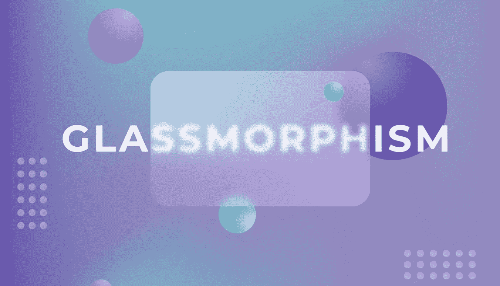
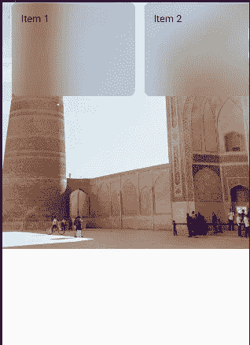
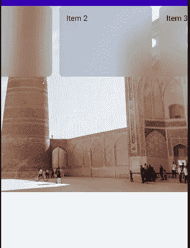
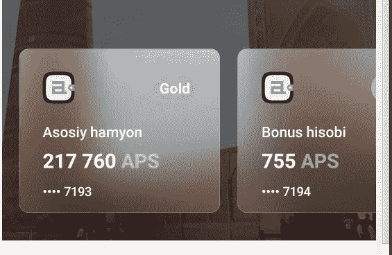

# Jetpack 合成中的玻璃态

> 原文：<https://betterprogramming.pub/glassmorphism-in-jetpack-compose-for-scrolling-item-b0c5824b55d0>

## 创建漂亮的 Android 用户界面



[叶卡捷琳娜·考尔金娜的艺术作品《行为》](https://www.behance.net/gallery/111132863/Glassmorphism)

如果你用谷歌搜索“Glassmorphism ”,你会看到很多关于创建 glass morphism UI 设计的文章，它基本上是一个面板，模糊了它背后的背景。截至 2022 年，这将成为一个巨大的趋势，不要说谎，它看起来真的很酷！

当你想到实现它的时候，首先能想到的就是`Modifier.blur()`，它只是模糊了自身的背景(“Psst，只在 Android 12 及以上版本上有效”)。

但是，当您试图创建的 glassmorphic 组件有一个动态位置(比如可滚动视图中的项目)时，事情会变得更加复杂。

说够了！让我们看看如何让它工作。

我们想要达到的目标是这样的:



地点:乌兹别克斯坦布哈拉

# 安装

韵律学

两个位图:

一个用于背景，另一个是同一个位图的拷贝，但是模糊了。我们的用户界面将如下所示:

```
Bg Image -> Canvas { drawBlurred image but clip scroll item positions } -> Scrollable Row
```

就是这样！

我在这里做的技巧是让`Canvas`和`Row`的可组合修饰符有相同的`rememberScrollState()` 。

此外，你可以让事情变得更`Clean` 和使用`.onGloballyPositioned {}` 修饰符，给你的位置和大小后，其组成…但我认为这将更容易理解没有它。

# 奖金！

在`clipPath{}`模块后添加这些行，并用`blendModes`进行实验:

所以你可以做出这样的东西:



没关系！

这是一个小的库，它有自己的快速模糊方法，并给你玻璃态的列和行组件。

[](https://github.com/jakhongirmadaminov/glassmorphic-composables) [## GitHub-jakhongirmadaminov/glass morphic-composables

### GlassmorphicColumn @ Composable GlassmorphicRow @ Composable With Non-Image background Setup Gradle:all projects {…

github.com](https://github.com/jakhongirmadaminov/glassmorphic-composables)