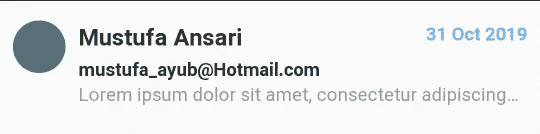
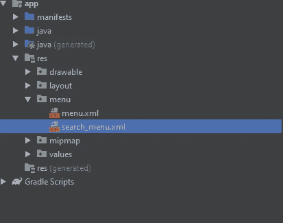

# 使用 RecyclerView 构建多选列表

> 原文：<https://betterprogramming.pub/gmail-like-list-67bc51adc68a>

## 你曾经在 Gmail 中选择过多个邮件吗？这就是我们今天要建造的


由[网站主持](https://unsplash.com/@webaroo?utm_source=unsplash&utm_medium=referral&utm_content=creditCopyText)在 [Unsplash](https://unsplash.com/s/photos/gmail?utm_source=unsplash&utm_medium=referral&utm_content=creditCopyText) 上拍摄的照片

> **“问的人五分钟是傻子。从来不问的人是一辈子的傻瓜。”**

看看我们将要建造的东西。


在本教程中，您可以看到可以选择和删除多个`recyclerView`项目。与此同时，选中的项目计数显示在动作栏上，动作栏有一个小动画，当我们使用长按选择项目时，它会改变颜色。

激动吗？让我们开始吧。

重要的事情先来。按照以下步骤准备构建这个项目:

1.  创建新项目。
2.  将这些依赖项添加到您的`build.gradle`中。

```
implementation 'androidx.recyclerview:recyclerview:1.0.0'
implementation 'com.google.android.material:material:1.0.0'
implementation 'com.balysv:material-ripple:1.0.2'
```

3.通过在您的`build.gradle`中添加这一小段代码来启用数据绑定。

注意:如果你不知道数据绑定，请阅读我的文章，这是关于数据绑定的。

```
dataBinding{
    enabled true
}
```

我希望到目前为止一切都好。现在我们来做一个模型类`Inbox.java`。

回收查看项目`list_item.xml`:



让我们为 recycle view 制作一个 recycle view 适配器。目前，我只是通过填充数据来完成我的 recyclerView 工作。

为了在我们的 recyclerView 中添加一些数据，我创建了一个新的`Util.java`类，在这个类中，我添加了一个函数，该函数将返回包含一些虚拟数据的 inbox 对象的列表。

我在我的`array.xml.`中添加了一些虚拟数组

*   `R.array.people_names`

```
<string-array name="people_names">
    <item>Anderson Thomas</item>
    <item>Adams Green</item>
    <item>Laura Michelle</item>
    <item>Betty L</item>
    <item>Miller Wilson</item>
    <item>Garcia Lewis</item>
    <item>Roberts Turner</item>
    <item>Mary Jackson</item>
    <item>Sarah Scott</item>
    <item>Kevin John</item>
    <item>Elizabeth</item>
    <item>Evans Collins</item>
    <item>Roberts</item>
    <item>Betty C</item>
    <item>Susan Lee</item>
</string-array>
```

*   `R.array.general_date`

```
<string-array name="general_date">
    <item>05 Dec 2019</item>
    <item>22 Apr 2019</item>
    <item>14 Sep 2019</item>
    <item>11 Feb 2019</item>
    <item>29 Aug 2019</item>
    <item>10 Nov 2019</item>
    <item>23 Jun 2019</item>
    <item>20 Jul 2019</item>
    <item>09 Mar 2019</item>
    <item>01 Jan 2019</item>
</string-array>
```

让我们转到`MainActivity.java`来实现我们的 recyclerView 功能。

我的`activity_main.xml` 长这样。

让我们运行应用程序。您将看到类似这样的内容:


现在是时候添加一些功能了。我把这部分分成几部分。

首先，我将在 recyclerView 的每个项目上添加点击侦听器。

为此，我们需要在适配器类的接口中添加两个抽象方法。

```
public interface OnItemClick { void onItemClick(View view, Inbox inbox, int position); void onLongPress(View view, Inbox inbox, int position);
}
```

让我们在 recyclerView 项目上实现 click listeners，使它们具有交互性。

我的`MainActivity.java`应该是这样的。

立即运行应用程序！


是时候添加主要功能了:当用户长按任何项目时，它将作为一个选择，并将字母图标更改为复选图标。除此之外，我们还将实现在应用程序栏被选中时对其进行更改。

我们需要添加一个内部类来改变动作栏的动作模式。

我们需要一个`ActionMode.Callback`实现，它将帮助我们通过用户交互使我们的动作栏执行某个动作。

```
private class ActionCallback implements ActionMode.Callback {
    @Override
    public boolean onCreateActionMode(ActionMode mode, Menu menu) {
        return true;
    } @Override
    public boolean onPrepareActionMode(ActionMode mode, Menu menu) {
        return false;
    } @Override
    public boolean onActionItemClicked(ActionMode mode, MenuItem item) { return false;
    } @Override
    public void onDestroyActionMode(ActionMode mode) { }
}
```

把这个加在你的`MainActivity.java`下面。

现在我要回到我的适配器。在适配器中，我将添加一些功能以使其工作。

这里你可以看到一个变量`selectedItems`，它是一个`[SparseBooleanArray](https://developer.android.com/reference/android/util/SparseBooleanArray)`。这个数组将整数映射到布尔值。它像散列表一样工作。基本上它会在相应的物品上加上`true`或者`false`。例如，如果用户点击第 1 项，那么它将存储该键作为该项的索引，即 1，以及它自己的值`true`或`false`。这里不需要加`hashMap`。

在您的 Util 类中，添加此方法。

→进入分辨率>值>样式，将这些线条添加到您的主题中。

```
<item name="windowActionModeOverlay">true</item>
<item name="android:actionModeBackground">#546E7A</item>
```

如果您不添加这些行，当您选择任何项目时，操作栏不会隐藏，因为它需要覆盖在现有的操作栏上。

现在我要在我的`MainActivity.java`里面添加一些函数。

在 res 目录中添加两个菜单项。



`menu.xml`

```
<menu xmlns:android="http://schemas.android.com/apk/res/android"
    xmlns:app="http://schemas.android.com/apk/res-auto">

    <item
        android:id="@+id/delteItem"
        android:icon="@drawable/ic_delete"
        android:orderInCategory="100"
        android:title="Delete"
        app:showAsAction="always">

    </item>
</menu>
```

`search_menu.xml`

```
<menu xmlns:android="http://schemas.android.com/apk/res/android"
    xmlns:app="http://schemas.android.com/apk/res-auto">

    <item
        android:id="@+id/action_search"
        android:icon="@drawable/ic_search"
        android:orderInCategory="100"
        android:title="Search"
        app:showAsAction="always" />

    <item
        android:id="@+id/action_settings"
        android:orderInCategory="100"
        android:title="Settings"
        app:showAsAction="never" />
</menu>
```

最终的`MainActivity.java`会是这个样子。

最终的`ListAdapter.java`会是这个样子。

运行应用程序，看看神奇！


你可以在这里得到[完整的源代码](https://github.com/Mustufa786/MultiSelectionList)。

觉得这篇文章有用？下面是我阅读量最大的文章:

*   [想成为一名成功的 Android 开发者？遵循此路线图](https://medium.com/better-programming/android-free-courses-3b550ce388e6)
*   [成为 Android 开发者所需的基本技能。](https://medium.com/dataseries/skills-for-android-developer-4c4fdbf15999)
*   [全屏底片](https://medium.com/better-programming/bottom-sheet-android-340703e114d2)
*   [如何使 RecyclerView 项目可扩展？](https://medium.com/better-programming/recyclerview-expanded-1c1be424282c)
*   [想要制作更多选项的动画浮动动作按钮？](https://medium.com/better-programming/animated-fab-button-with-more-options-2dcf7118fff6)
*   [用漂亮的动画制作 RecyclerView！](https://medium.com/better-programming/android-recyclerview-with-beautiful-animations-5e9b34dbb0fa)