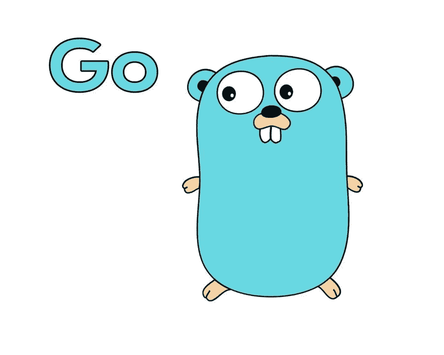

# 去 101

> 原文：<https://betterprogramming.pub/go-101-hello-world-3f56e7b1146c>

## “你好，世界！”



Gopher，官方围棋吉祥物。信用:雷尼·弗伦奇

Go 或 Golang 是一种编程语言，由三名谷歌员工开发:罗伯特·格里斯默、罗伯特·派克和肯·汤普逊。该语言于 2009 年首次发布，1.0 版于 2012 年初向公众发布。创建者的两个主要目标是创建一种语言来加强软件工程的良好实践，并使大型系统的工作过程更具生产力和可伸缩性。

Go 是一种相当容易学习的语言，但功能强大，这有助于它实现逐步取代 C++的目标，同时保留 C 家族的最佳特性。事实上，Go 是一种静态类型语言(这有助于创建更安全和设计更好的程序)，也是一种编译语言(这提高了运行时效率)。在过去的几年里，开发者们一直在努力让 Go 变得尽可能的用户友好。Go 是一个开源项目，并得到其社区的大力支持，这一事实进一步加强了这一点。社区已经建立了无数的框架和库，让用 Go 开发变得尽可能愉快。

正因为如此，在过去的几年里，Go 在不同的指数和调查中连续被选为最受欢迎的编程语言之一，包括[栈溢出](https://insights.stackoverflow.com/survey/2020#technology-most-loved-dreaded-and-wanted-languages)年度调查。

现代软件开发最常用的产品之一 Docker 就是用 Go 构建的。许多大公司，如谷歌、Dropbox、IBM 和优步，也将部分服务迁移到 Go。

由于这些原因，Go 是一种非常有趣的学习语言(对于有或没有编程经验的人来说)。这就是为什么在本系列中，我将向您介绍 Go 的主要特性，以便您将来能够使用这种语言构建自己的项目。

# 先决条件和基本概念

为了用 Go 编写你的第一个程序，你首先需要满足一些先决条件。

第一个，很明显，是安装 Go 的工具集。您可以通过导航到 [Go 下载页面](https://golang.org/dl/)并为您的操作系统安装最新的 Go 稳定版来实现。

其次，这一部分是专门为那些没有任何编程经验的人准备的，你需要安装一个文本编辑器以及设置你的终端。文本编辑器是您编写实际 Go 代码的地方。作为个人偏好，我真的推荐 [Visual Studio 代码](https://code.visualstudio.com/download)，它相当容易使用，并且还提供对 Go 的支持(自动格式化、自动完成等等)。

另一方面，终端是您运行命令的地方(例如，为了构建或运行您的项目，或者通过它们导航)。打开终端取决于您使用的操作系统:

*   **Windows** : 通过按 Windows 键+ R 来访问终端或命令提示符。然后您应该键入“cmd.exe”并按 Enter 键*。*
*   **Mac** :可以通过访问 Finder，然后点击应用程序，接着点击实用程序*来访问终端。从那里，您可以启动终端应用程序。*

为了验证到目前为止一切都已正确完成，您可以在终端中编写以下命令，

```
go version
```

如果您的操作正确，您应该会在终端上看到输出，告诉您当前使用的是哪个版本的 Go，如下例所示。

```
*go version go1.15 darwin/amd64*
```

由于各种原因，您可能会在尝试运行前面的命令时出错。如果是这样，请参考本文的评论部分，我们将努力解决您的问题。作为一种好的做法，你也可以在谷歌上搜索你的问题，在 Stack Overflow 这样的网站上找到解决方案。

如果在 Mac 上使用 zsh 而不是 Bash，就会出现一个常见的问题(错误是`‘go’ command not found`)。在这种情况下，您必须添加一个路径到您的`~/.zshrc`文件(位于您的主目录中)。添加下面一行，保存，`go`命令现在应该可用了。

```
export PATH=$PATH:/usr/local/go/bin
```

为了构建你的第一个围棋程序，你需要做的最后一件事就是理解`gopath`。`gopath`是一个环境变量，它显示了 Go 的工具集，可以在你的计算机上查找源代码、编译包或可执行二进制文件。默认情况下，`gopath`位于用户的个人文件夹中(对于 Mac 和 Linux，为 Users/your name/go；对于 Windows，为 c:\Users\YourName\go)。

这个`go`文件夹要细分成三个子文件夹，分别是`src`、`bin`和`pkg`。为了创建它们，您应该使用您的终端并运行以下命令:

*   在**窗口**上:

```
md go
cd go
md src bin pkg
```

*   在 **Mac** 和 **Linux** 上:

```
mkdir go
cd go 
mkdir src bin pkg
```

`src`子目录(子文件夹，换句话说)是目前最重要的一个，因为它是我们的源代码所在的地方。另外两个子目录将存储编译后的包以及可执行的命令(我们将在后面看到更多)。

# “你好，世界！”

为了构建我们的第一个程序，我们首先需要在`src`目录中创建一个新目录，并在其中创建一个空的`go`文件。为了我们的教程，让我们把我们的新目录叫做`hello`，把我们的文件叫做`main.go`。为此，让我们在终端中运行以下命令。取决于您的操作系统:

*   在**视窗上**

```
md src\hello
cd src\hello
copy nul main.go
```

*   在 **Mac 上** / **Linux 上**

```
mkdir src/hello
cd src/hello
touch main.go
```

这些命令将创建`hello`目录，允许您导航到同一个目录，最后创建一个名为`main`、的空文件，文件扩展名为`go`(告诉 Go 的工具集，这个文件中的内容是用 Go 编写的代码)。

从那里，您需要用您选择的文本编辑器打开新创建的文件。如果您正在使用 VS 代码，并且您已经使用[命令面板](https://code.visualstudio.com/docs/getstarted/tips-and-tricks)安装了`code`命令，您可以简单地从您的终端运行以下命令。

```
code .
```

这将直接在 VS 代码中打开当前目录。

一旦你用文本编辑器打开了`main.go`文件，你应该写下下面的代码并保存它。

您的 main.go 文件应该是这样的

现在让我们一步一步地检查每一行并解释发生了什么。

1.  `package main`:这就是所谓的*包声明*。每个 Go 程序都以一个包声明开始。这种设计是为了鼓励更好的设计和代码可重用性。要在 Go 中运行一个程序(我们将在后面看到可执行文件和库之间的区别)，必须定义一个名为“main”的包。我们的文件叫什么并不重要(我们本来可以叫它`hello.go`，但是出于惯例我们叫它`main.go`，但是编译器需要找到这个`package main` 行才能成功运行。同样值得一提的是，同一目录下的每个文件都应该有相同的包名(在我们的例子中，当前目录下的每个文件都应该有`package main`行)。
2.  `import “fmt”`:import 关键字用于从另一个包中导入代码(我们将在后面看到，Go 使用包范围，这意味着我们可以使用另一个文件中定义的某段代码，而不必导入它，只要两个文件在同一个包中)。在这种情况下，我们导入一个名为“fmt”(格式化的简写)的包。这个内置的包用于格式化输入和输出(我们将主要使用它在运行程序时将输出打印到终端)。正如我们将在后面看到的，我们当然可以在同一个文件中导入多个包。
3.  `func main() { <someCode> }`:这叫做*函数声明*。函数必须以关键字`func`开头。这个关键字后面是函数名(在本例中是`main`)。在括号之间，我们可以定义一系列参数。例如，我们可以想象一个将两个数相加的函数。我们的函数会有两个参数，a 和 b，我们的两个数字。花括号之间是函数体。这是我们定义函数实际做什么的地方。在这个具体的例子中，当我们处理主包的主文件时，必须有一个名为`main`的函数。这确实是我们程序运行的切入点。没有它，我们的程序将无法编译。同样重要的是，这个 main 函数不能接受任何参数，也不能返回任何值。
4.  这是我们函数体的唯一一行。在这一行，我们访问 fmt 包(前面提到的 Go 的语言内置包)中定义的`Println`函数。对于这个函数，我们传递下面的参数:`“Hello, World!”`。这个参数被称为字符串。在 Go 中，字符串表示双引号中定义的任何一组字符。最后，我们调用这个相同的`Println` 函数，一旦程序运行，它将导致我们的终端输出下面的行。

```
*Hello, World!*
```

# 运行程序

前面说过，Go 是一种编译语言。因此，我们的程序首先需要编译成机器码才能运行。为此，我们可以从终端使用两个选项。

首先，我们可以用下面的命令编译我们的程序:

```
go build main.go
```

程序编译完成后，我们可以根据您的操作系统，使用以下命令直接运行新创建的可执行文件:

*   在**窗口上**

```
main
```

*   在 **Mac** / **Linux** 上

```
./main
```

整个工作流程也可以使用一个命令来完成:

```
go run main.go
```

最新的命令确实在幕后做了两件事，一件接一件。它首先运行`go build` 命令，然后运行新创建的可执行文件(在临时目录中)。虽然`go run` 命令在开发设置中很有用，但是出于性能原因，由`go build` (或者更好的是，`go install`)创建的永久二进制文件在生产设置中应该是有特权的。

# 再见，世界！

恭喜你！如果你已经按照这个教程学习了，你应该已经运行了你的第一个 Go 程序。如果在此过程中出现任何问题，请随时在评论中联系我，我会帮助您解决您的问题。

在这一课中，我们已经讲述了 Go 的基本知识，从设置本地机器到运行第一个程序。在接下来的课程中，我们将详细介绍 Go 的不同主要特性，包括它的数据类型、控制流和函数，以及该语言的许多其他方面。我期待着它，我希望你会喜欢这个旅程！

# 资源

在这里，您可以找到本教程中提到的所有资源的完整列表。

*   栈溢出开发者调查:[https://insights . stack Overflow . com/survey/2020 # technology-most-loved-terror-and-wanted-languages](https://insights.stackoverflow.com/survey/2020#technology-most-loved-dreaded-and-wanted-languages)
*   下载 Go:[https://golang.org/dl/](https://golang.org/dl/)
*   正在下载 Visual Studio 代码:【https://code.visualstudio.com/download 
*   Visual Studio 代码的提示和技巧:[https://Code . Visual Studio . com/docs/get started/提示和技巧](https://code.visualstudio.com/docs/getstarted/tips-and-tricks)
*   本课的源码要点:[https://gist . github . com/Agilulfe/8309 e 1818 e 61d 23 c 57 FD 917 b 8 c 43112 b](https://gist.github.com/Agilulfe/8309e1818e61d23c57fd917b8c43112b)