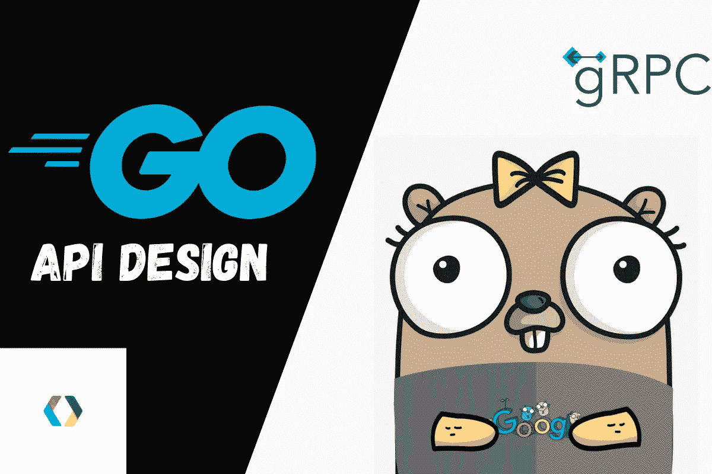
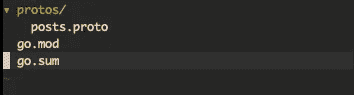
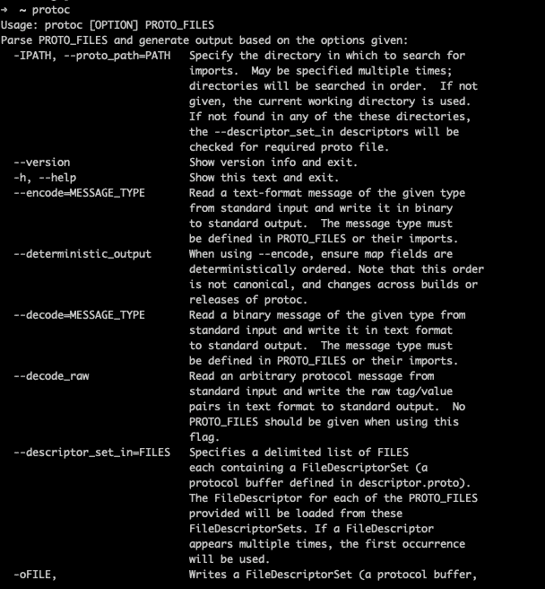
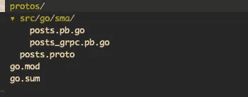
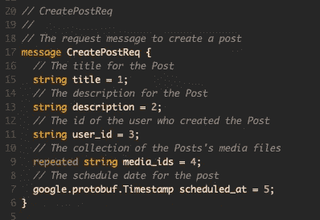
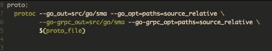
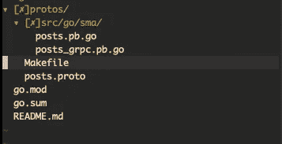
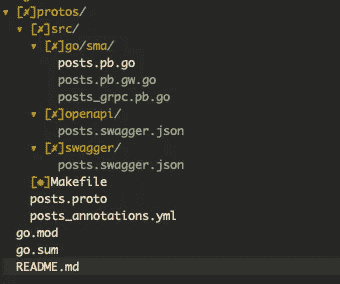

# 使用协议缓冲区和 gRPC 的 Go API 设计

> 原文：<https://betterprogramming.pub/go-api-design-with-protocol-buffers-and-grpc-991838e4852b>

## 基于社交媒体应用的分步指南



当使用 gRPC 构建 API 时，API 设计通常使用协议缓冲区来定义 API 端点、请求消息和响应消息。这通常是通过使用 proto 文件来完成的，稍后可以使用 proto 文件来生成 go 代码以进行实际的 RPC 调用，还可以生成一个反向代理来将 gRPC 翻译成 JSON APIs 等。

我建议按以下顺序阅读这些文章:

1.  使用协议缓冲区和 gRPC 的 Go API 设计
2.  [建立反向代理(gRPC-Gateway)](/building-reverse-proxy-grpc-gateway-621696b29b0)
3.  [Go API —数据库连接](https://yairfernando.medium.com/go-api-database-connection-d47e463cea37)

在本文中，我们将重点关注以下内容:

*   使用协议缓冲区构建 API 设计
*   创建端点
*   定义请求消息
*   定义响应消息
*   使用可枚举数
*   处理时间戳
*   返回空响应

我不会详细介绍 gRPC 是什么，或者为什么应该使用协议缓冲区而不是 JSON，但是如果您有兴趣了解更多，这里有另一篇[文章](https://levelup.gitconnected.com/grpc-how-to-make-effective-unary-calls-4c9fa68cd9d5)对此有更多的解释。

对于本文，API 设计将基于一个社交媒体应用程序。

在开始之前，重要的是要提到我将使用 Go 模块。因此，为了继续本系列，有必要让 Go 模块在您的机器上正常工作，因为我们稍后将在 Go 应用程序中测试 API。

首先，让我们使用以下命令导航到$GOPATH:

```
cd $GOPATH
```

然后创建或导航到以下路径:

```
cd src/github.com/YourGithubHandle/sma
```

现在创建这个路径对以后会有帮助，因为我们最终会将这个代码推送到 GitHub。

一旦我们进入代表社交媒体应用的`sma`文件夹，让我们初始化一个 Go 模块。

```
go mod init github.com/YourGithubHandle/sma
```

这个命令将为我们创建`go.mod`文件。

然后我们将在 protos 下创建`posts.proto`文件。

因此，让我们创建该文件夹并将`posts.proto`文件放入其中。



我们将首先定义创建端点。这个端点将接收一个带有一些参数的请求消息，它将返回一个响应消息，通知我们 post 对象已经创建。

让我们看看下面的定义:

这个 proto 文件的第一行定义了我们使用的 proto 语法。在这种情况下，这就是 proto3 语法。如果没有指定这一行，protobuf 编译器将假设使用了 proto2 语法。如果你想进一步了解它们的区别，这里有 [proto3](https://developers.google.com/protocol-buffers/docs/proto3) 和 [proto2](https://developers.google.com/protocol-buffers/docs/proto) 的文档。

在第 3 行，我们有了包定义。如果您需要在不同的包名下定义相同的消息定义，这可以帮助您避免名称冲突。

然后我们还有`option go_package`。在 Golang 的例子中，这将被用作包名，但是在这个例子中，它与原来的包名相同。如果你需要它与众不同，你可以使用这个选项。

然后我们有一个进口。这个导入允许我们正确地序列化`created_at`和`updated_at`时间戳。这个导入实际上是 protobuf 将用来处理时间戳的另一个 proto 文件`[timestamp.proto](https://github.com/protocolbuffers/protobuf/blob/main/src/google/protobuf/timestamp.proto)`。就像我们导入这个外部原型文件一样，我们将出于不同的目的使用其他外部原型文件。

此外，如果需要，我们可以使用我们拥有的其他原型文件中的定义，包括不是来自 Google 的定义。我们稍后会谈到这一点。

在第 9 行，我们有帖子的服务定义。通过在 proto 文件中定义服务，我们可以在协议缓冲编译器使用这个文件时生成 Go 代码。它将生成包含所有代码的服务器和客户端接口来进行 RPC 调用。

我们定义了我们希望在该服务中支持的端点。在本例中，我们有一个创建 post 端点，它接受`CreatePostReq`并返回创建的`Post`对象。

我们先来关注一下`CreatePostReq`消息。

该消息定义了该端点将在请求中接受的参数。

该结构首先定义字段的类型，然后是字段的名称，最后是字段的编号。

字段的`type`指定该参数的数据类型，可以是字符串、整数、布尔、浮点、双精度、字节等。

字段的`name`只是参数本身的名称。

字段的`number`是用于识别二进制格式的每个字段的唯一数字。并且一旦您的消息类型已经被使用，就不应该改变。这里需要注意的一点是，你应该尽量为你的信息中最重要和最频繁的字段保留 1 到 15 的数字。

这是因为从 1 到 15 的字段编号需要一个字节来编码，而从 16 到 2047 需要两个字节。因此，如果一条消息中有 10 个从 1 到 10 的字段，然后有两个字段的字段编号大于 15，这是完全没有问题的，因为您希望为未来的字段保留这五个编号。

关于这个`CreatePostReq`消息，最后要提到的是最后一个字段在定义的开头有一个额外的单词。这是因为最后一个参数是一个数组，在协议缓冲区中表示它的方式是在字段定义的开头使用`repeated`字。重复字段的默认值将是一个空列表或数组，这取决于该消息被翻译成的编程语言。

现在让我们检查一下`Post`消息的定义。前四个字段是不言自明的，所以让我们转到 status 字段。这里我们使用 enum(在第 50 行中定义)作为字段的类型。使用枚举将确保该字段只接受枚举中的一个选项。如果没有传递值，字段编号为 0 的枚举值将是默认值。

枚举的几个注意事项是它必须有一个零值，因为零值被认为是默认值。另一件事是，为了与 proto2 语法兼容，零值必须是枚举中的第一个元素。

最后，我们在`Post`消息中有创建和更新的字段，这里字段的类型是`google.protobuf.Timestamp`，它又有另一个 protobuf 消息，有两个字段:秒和毫微秒。

我们将向这个文件添加更多的端点，但是现在，让我们继续为这个原型文件生成 go 代码。

首先，让我们用这个命令安装 protobuf:

```
brew install protobuf
```

我们还需要安装 protoco-gen-go 和 protoco-gen-go-grpc，如下所示:

```
go install google.golang.org/protobuf/cmd/protoc-gen-go@latest
go install google.golang.org/grpc/cmd/protoc-gen-go-grpc@latest
```

然后确保你更新你的路径

```
export PATH="$PATH:$(go env GOPATH)/bin"
```

之后，确保“启用模块”打开

```
export GO111MODULE=on
```

如果您键入 protocol，您应该会看到以下内容:



现在，让我们导航到`protos`文件夹，运行下面的命令来生成 Go 代码。在这样做之前，确保创建了`src/go/sma`文件夹结构。

```
protoc --go_out=src/go/sma \
       --go_opt=paths=source_relative \
       --go-grpc_out=src/go/sma \
       --go-grpc_opt=paths=source_relative \
       posts.proto
```

这将生成带有`Posts`服务和端点定义的 Go 代码。



太好了！我们已经为包含创建端点的 Posts 服务生成了代码。

为了继续构建 Posts 服务，我们需要添加`UPDATE`、`SHOW`、`LIST`和`DELETE` 端点。

下面是更新端点的定义:

像往常一样，我们用请求消息和响应消息定义 RPC 端点。在这一点上，这并不新鲜。让我们检查一下`**UpdatePostReq**`消息的定义。

该报文的第一个字段为`update_mask`，类型为`google.protobuf.FieldMask`。

字段掩码有两个用途，一个是显式定义 get 操作应该返回的字段集，另一个是在 update 操作中要更新的字段。它过滤掉修补请求中发送的字段，只留下或允许掩码中指定的字段。

对于 get 操作，它将接受响应，并且只返回掩码中存在的字段。其余字段将默认为它们所保存的数据类型的默认值。对于返回对象集合的终结点，字段掩码将应用于集合中的每个对象。在这种情况下，掩码对象是该消息中的最后一个字段。

稍后，当我们为这个原型文件编写注释时，我们将看到如何使用这个字段。这里需要注意的一点是，这个端点的 REST 动词将是 PATCH，因为我们使用的是字段掩码。PUT 仅用于完全更新。

在第 8 行，我们导入了这个原型文件来使用`FieldMask`。

`UpdatePost` 保存允许更新的属性。这意味着端点将允许更新`title`、`description`、`media_ids`和`schedule_at`属性。

`PostId`是要更新的帖子的 id。

好了，让我们继续到显示端点，如下所示:

这是一个非常简单的问题。在`PostIdReq`消息中，我们只有一个字段，就是我们要显示的帖子的`post_id`。作为响应，我们返回之前声明的`Post`消息。

下面是`ListPosts`端点定义的代码:

对于这个端点，我们将返回与给定用户相关联的帖子集合，以便在请求消息中需要用户 id。

如果我们看一下`ListPostsReq`消息，第一个字段是实际的`user_id`，下一个字段是搜索查询字符串，以防我们想要搜索整个集合。它还有`page` 和`per_page`字段来指定返回哪个页面以及每个页面应该有多少个元素。

最后一个元素是`filter`，这里我们有一个 enum 来表示这个字段的类型，这意味着我们只能通过`Filters` enum 中指定的元素进行过滤，它映射了文章的状态。

在`ListPostsResp`中，我们只有两个字段。第一个表示将返回的文章集合，第二个关注分页数据对象。

最后，让我们看看删除端点的定义:

这个端点非常简单；它使用我们之前定义的`PostIdReq`并返回一个空的响应消息。

让我们也更新一下`CreatePostResp`消息，添加`scheduled_at`字段，因为我已经将它添加到了`UpdatePost` 端点中。



CreatePostResp 已更新。代码如下。

我们已经完成了 Posts 服务的 API。

以下是完整的原型文件:

现在，让我们为这个服务生成 Go 代码。

为了避免记住我们为生成 Go 代码而运行的最后一个协议命令，让我们在`protos`文件夹下创建一个 Makefile，代码如下:



生成文件

现在，让我们打开`protos`文件夹下的终端并运行 make 命令:

```
make proto proto_file=posts.proto
```

这将生成 Go 代码！太好了，我们已经使用协议缓冲区和 gRPC 为 Posts 资源定义了 API 端点！

文件夹结构如下所示:



文件夹结构

现在让我们看看如何为 Posts API 生成 swagger 和 openapi 文档。

首先，让我们为`posts.proto`文件定义服务配置文件。这个文件包含了从 gRPC 到 REST API 的 HTTP 配置和映射。

在`protos`文件夹中创建一个新文件，并将其命名为`posts_annotations.yml`。代码如下:

这里我们有来自`posts.proto`文件的每个端点的 HTTP 规则。

选择器指定 RPC 端点，然后我们指定 HTTP 谓词，后跟我们希望将该端点映射到的 rest 路径。这里我们指定了路径中必须包含的参数。在这种情况下，`user_id`和`post_id`取决于每个端点。

在`UpdatePost`端点中，我们使用了一个字段掩码，并将可更新的对象称为`Post`。这就是为什么主体有一个字符串表示“post”这是指我们在`UpdatePostReq`消息中的`Post`消息。

运行以下命令安装 swagger 和 protoco-gen-open API v2:

```
go install github.com/grpc-ecosystem/grpc-gateway/protoc-gen-swagger@latest
go install github.com/grpc-ecosystem/grpc-gateway/v2/protoc-gen-openapiv2@latest
```

让我们创建两个新文件夹。在`src`下，创建 swagger 文件夹和 openapi 文件夹。

现在，我们需要扩展 Makefile 中的命令，用 swagger 和 openapi 生成 API 文档。我们还将包含生成 gateway Go 代码的命令，以便我们的 API 可以实现反向代理。

新命令如下所示:

让我们生成代码。

```
make proto annotation_file=posts_annotations.yml proto_file=posts.proto
```

这将创建 swagger JSON 文件和一个新文件`posts.pb.gw.go`，其中包含实现反向代理的代码。

这是运行 make 命令后的新文件夹结构:



文件夹结构

太好了。我们已经覆盖了很多，我们的 API 设计已经可以在 gRPC 项目中使用了。如果你想看看如何实现反向代理和消费这个 API，请留下评论！

感谢您的阅读。敬请关注。