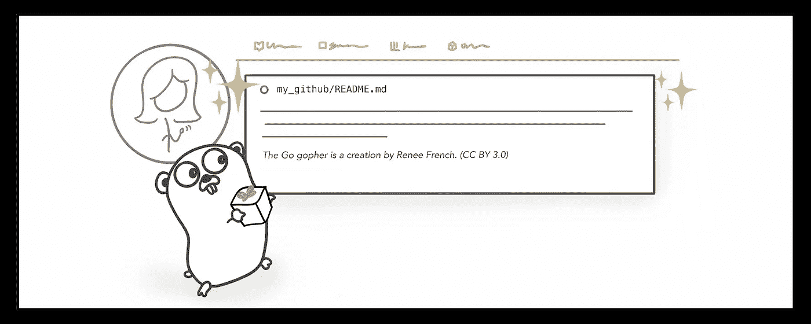

# 去自动化你的 GitHub 简介自述文件

> 原文：<https://betterprogramming.pub/go-automate-your-github-profile-readme-d0ce2252f8aa>

## 使用 Go 和 GitHub 操作创建动态降价文件



作者插图

GitHub 的新个人资料页面 README 特性给开发者互联网的 MySpace 页面带来了一些个性化的奇妙效果。尽管 Markdown 最适合标准的静态文本内容，但这并没有阻止有创造力的人们努力创建下一级自述文件。你可以包括 gif 和图片来增加一些动感和活力(它们在 [GitHub Flavor Markdown](https://github.github.com/gfm/) 中有所介绍)，但我在考虑一些更有活力的东西。

在你的 GitHub 个人资料的前面和中心，你的自述是一个很好的机会，让人们知道你是什么，你认为什么是重要的，并展示你工作的一些亮点。你可能想炫耀你最新的知识库、推文或博客文章。由于 GitHub Actions 等持续交付工具，保持更新也不一定是一件痛苦的事情。

我当前的自述每天都会更新，提供我最新博客文章的链接。下面是我如何用 Go 和 GitHub 动作创建一个自我更新的`README.md`。

# 用 Go 读写文件

最近写了很多 Python，但是对于某些东西，我真的很喜欢用 Go。你可以说它是我在 just-for-T1 项目中的首选语言。抱歉。我控制不了自己。

为了创建我的`README.md`，我将从一个现有的文件中获取一些静态内容，将它与一些我们将使用 Go 生成的新的动态内容混合在一起，然后在 400 度下烘烤整个东西，直到一些令人惊叹的东西出来。

下面是我们如何读入一个名为`static.md`的文件，并将其放入`string`表单中:

您的动态内容的可能性只受到您的想象力的限制！这里，我将使用`[github.com/mmcdole/gofeed](https://github.com/mmcdole/gofeed)` [包](https://github.com/mmcdole/gofeed)从我的博客中读取 RSS 提要并获取最新的帖子。

为了将这些位连接在一起并产生字符串，我们使用`[fmt.Sprintf()](https://golang.org/pkg/fmt/#Sprintf)`创建一个格式化的字符串。

```
// Whisk together static and dynamic content until stiff peaks form
blog := "Read my latest blog post: **[" + rssItem.Title + "](" + rssItem.Link + ")**"
data := fmt.Sprintf("%s\n%s\n", stringyContent, blog)
```

然后，为了从这个混合中创建一个新文件，我们使用`[os.Create()](https://golang.org/pkg/os/#Create)`。关于推迟 `[file.Close()](https://www.joeshaw.org/dont-defer-close-on-writable-files/)`还有更多的事情需要了解，但是我们不需要在这里深入那些细节。我们将添加`file.Sync()`，以确保我们的自述文件被写入。

在我的自述文件库中查看完整代码[。](https://github.com/victoriadrake/victoriadrake/blob/master/update/main.go)

嗯，闻起来不错吧？让我们通过一个 GitHub 操作让这一点在日常生活中发生。

# 按照行动计划运行您的围棋程序

您可以创建一个 GitHub 动作工作流，该工作流在推送到您的`master`分支时以及在每日计划中由[触发](https://docs.github.com/en/actions/reference/events-that-trigger-workflows)。下面是`.github/workflows/update.yaml`的一部分，它定义了这一点:

```
on:
  push:
    branches:
      - master
  schedule:
    - cron: '0 11 * * *'
```

要运行重建自述文件的 Go 程序，我们首先需要文件的副本。我们用`actions/checkout`来表示:

```
steps:
    - name: 🍽️ Get working copy
      uses: actions/checkout@master
      with:
        fetch-depth: 1
```

这一步运行我们的 Go 程序:

```
- name: 🍳 Shake & bake README
  run: |
    cd ${GITHUB_WORKSPACE}/update/
    go run main.go
```

最后，我们将更新的文件推回我们的存储库。了解更多关于使用工作流程中的变量和秘密中的[所示变量的信息](https://docs.github.com/en/actions/configuring-and-managing-workflows/using-variables-and-secrets-in-a-workflow)

在我的自述文件库中查看此动作工作流程[的完整代码。](https://github.com/victoriadrake/victoriadrake/blob/master/.github/workflows/update.yaml)

# 前进并自动更新您的自述文件

恭喜你，欢迎来到酷孩子俱乐部！您现在知道如何构建自动更新的 GitHub 概要文件自述文件了。你现在可以向前迈进，向你的页面添加各种各样的整洁的动态元素——只是不要使用 gif，好吗？