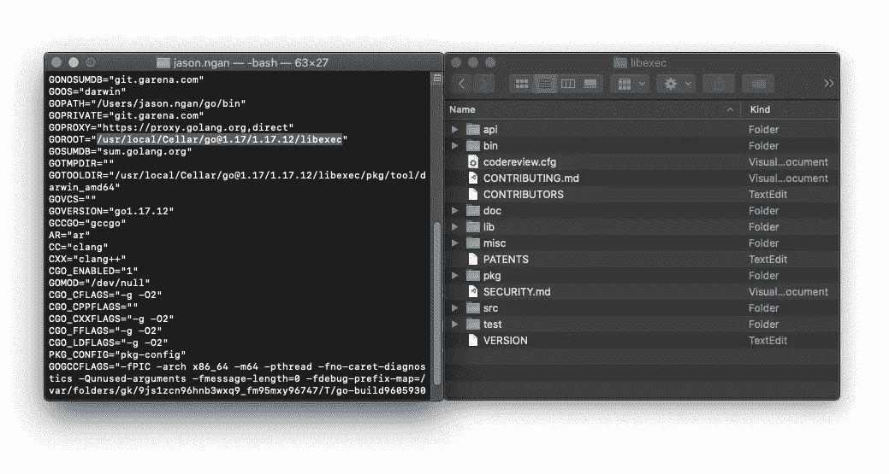
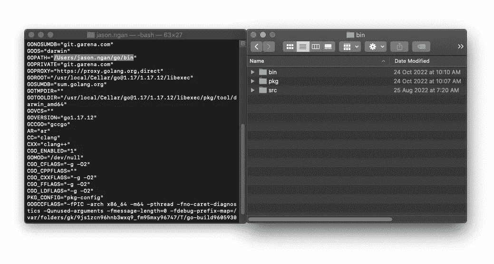
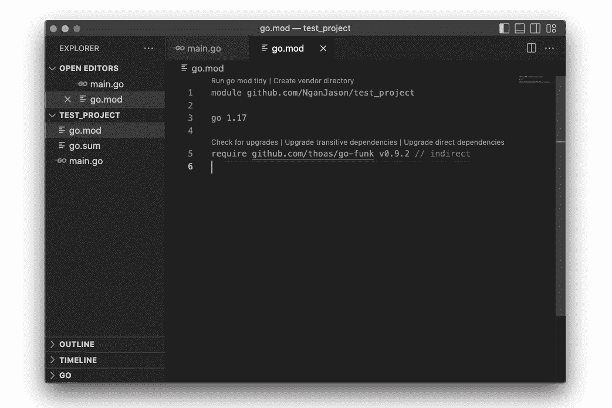
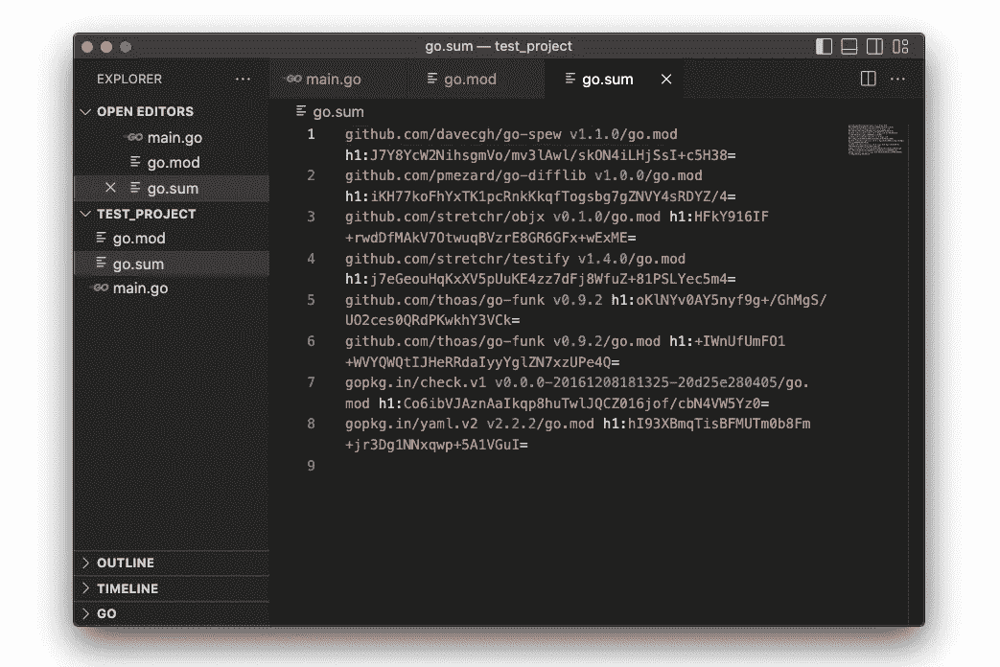
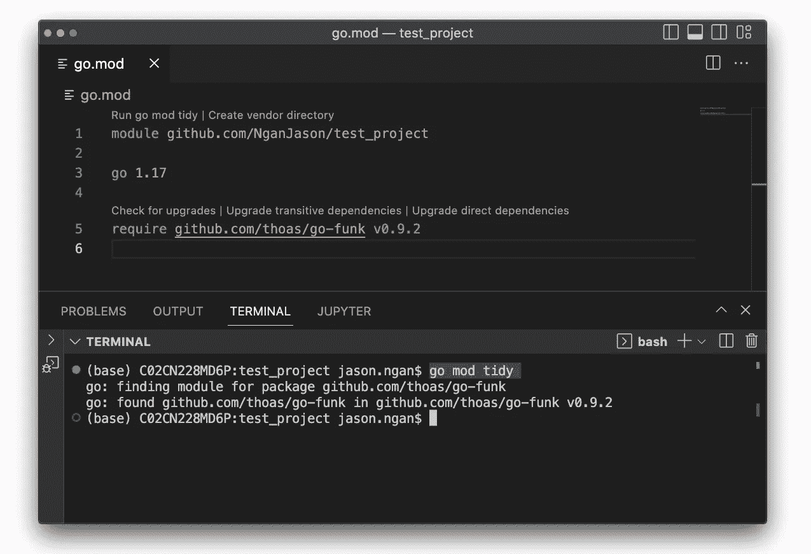
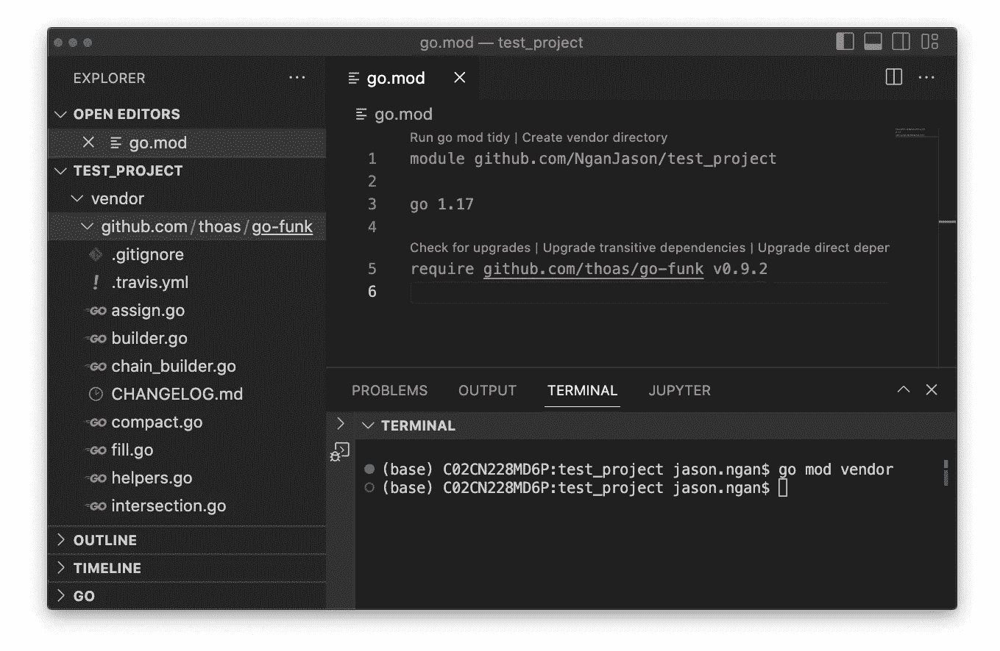
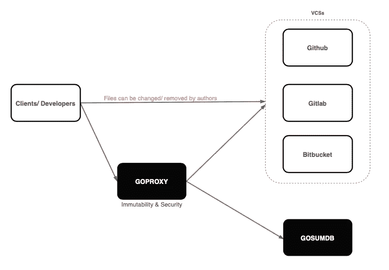
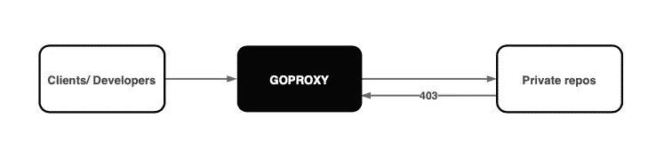
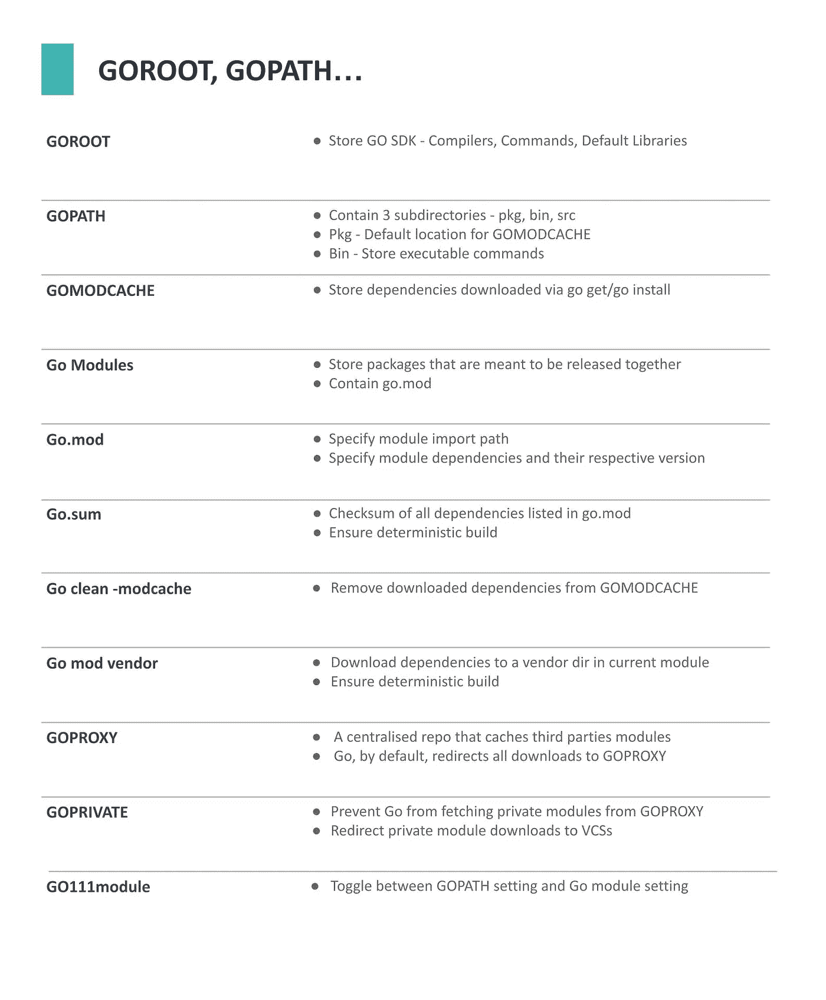

# 每个开发人员都应该知道的 Go 命令和 Env 变量

> 原文：<https://betterprogramming.pub/go-commands-and-env-vars-every-developer-should-know-549feaddc755>

## GOPATH、GOPRIVATE 等等


亚历克斯·安德鲁斯在[像素](https://www.pexels.com/photo/dslr-camera-flat-lay-821652/)上拍摄的照片

如果你是一名围棋开发人员，你很可能曾经和这些看起来神秘的术语斗争过——比如`GOPATH`、`GOPRIVATE`、`Go111module`等等。

很多时候，你不需要关心它们是什么。但是有时，您可能会遇到严重阻碍您开发的错误。

在这篇文章中，我将省去你的痛苦，向你展示你所需要的基础知识。

我们开始吧！

**注**:以下细节仅适用于 Go1.15 及以上版本。

# 戈鲁特



GOROOT 存储 Go SDK

GOROOT 是存储 Go SDK 的地方。

它存储了默认的 Go 编译器、Go 可执行命令和 Go 库。

除非您计划使用不同的 Go 版本，否则不需要修改这个变量。

导入库时，Go 首先在`GOROOT`中搜索文件。如果文件不存在，那么它会退回到`GOPATH`。

# GOPATH



GOPATH 包含三个子目录

`GOPATH` 包含三个目录:`pkg`、`src`和`bin`。

## **$GOPATH/pkg**

*   `$GOPATH/pkg/mod`是`GOMODCACHE`的默认位置。
*   因此，`$GOPATH/pkg/mod`存储并缓存通过`go get`或`go install`下载的依赖关系。

## **$GOPATH/bin**

*   bin dir 存储通过`go install`安装的可执行命令。
*   这些命令包括第三方命令和您的源文件命令。
*   Go 默认命令如`gofmt`存储在`GOROOT/bin`目录中。

## **$GOPATH/src**

*   在引入 Go 模块之前，src 目录存储 Go 源文件。
*   自从围棋模块出现以来，它就变得不那么重要了。

# Go 模块


叶卡捷琳娜·贝林斯卡娅在[像素](https://www.pexels.com/photo/carton-box-on-yellow-lines-of-an-asphalt-road-4744757/)上拍摄的照片

在引入 Go 模块之前，Go 项目和依赖项需要存储在`$GOPATH/src/`目录下。

没有版本管理。src 目录下的项目共享同一个稳定版本下的库，master 分支。

引入 Go 模块后，以下内容发生了变化:

*   开发者可以在`$GOPATH/src/`目录之外创建项目。
*   每个项目，也就是模块，都是一个文件和软件包的集合，它们应该一起发布。
*   每个模块都包含一个`go.mod`文件，该文件定义了所需的依赖项和版本。
*   在构建期间，从各自的存储库中下载依赖项。

# Go.mod



Go.mod 包含模块路径和模块依赖关系

`go.mod`文件驻留在每个 go 模块中。

`go.mod`文件执行以下操作:

*   定义模块的路径—在同一个 go 模块下导入包/文件时使用的路径。
*   定义成功构建模块所需的依赖项和版本。

# Go.sum



Go.sum 包含校验和列表

当远程服务器构建一个模块时，它从各自的 VCS 中获取并下载`go.mod`文件中指定的依赖项。

这不可避免地导致几个问题:

*   如果有人恶意篡改指定版本的库会怎么样？
*   我们如何确保远程服务器将包含准确内容的库作为我们的本地副本？

这就是`go.sum`发挥作用的地方。

*   它是`go.mod`中列出的所有直接和间接依赖项的校验和。
*   它验证并确保依赖关系的本地下载副本与远程副本相似。

# 保持适度整洁



Go mod tidy 确保 go.mod 得到更新

`go.mod tidy`确保`go.mod`被更新。

当您运行`go mod tidy`时，它执行以下操作:

*   下载所需的依赖项并更新`go.mod`。
*   从`go.mod`中删除不必要的依赖项。(注意:它不会从本地缓存中删除库，也就是`$GOPATH/pkg/mod`)

# 清除-modcache


照片由 [Yan Krukov](https://www.pexels.com/@yankrukov/) 在[像素](https://www.pexels.com/photo/charming-child-sweeping-concrete-pavement-with-broomstick-4458033/)上拍摄

当你执行`go get`或`go mod tidy`时，Go 下载依赖项并缓存在`GOMODCACHE`中，默认为`$GOPATH/pkg/mod/`。

有时候，你可能希望删除所有下载的软件包，这就是`go clean -modcache`所做的。

它会删除`GOMODCACHE`目录中所有下载的包。

# Go mod 供应商



Go mod vendor 在当前模块中创建一个供应商目录

当在远程服务器中构建模块时，服务器获取并下载在`go.mod`文件中指定的依赖项。

如果出现网络问题或者远程 VCS 中的某个依赖项被删除，将会导致构建失败。

为了确保确定性的构建，`go mod vendor`在 Go 模块中创建一个文件夹，并将依赖项的源文件存储在该目录中。

供应商目录将与您的代码更改一起提交。

这允许

*   确定性和一致性的构建。
*   对依赖关系的更改可以很容易地被看到和检查。

但是，它会占用额外的空间，增加克隆一个存储库的时间，导致 CI/CD 更长。

# GOPROXY



在`GOPROXY`出现之前，依赖项是直接从远程 VCS 下载的。

这导致了两个基本问题—安全性和可用性。

*   远程 VCS 中的依赖项可以随时删除。
*   远程 VCS 中的依赖关系可能被篡改和破坏。

`GOPROXY`是一个集中的存储库，托管和缓存公开可用的第三方模块。

Go 不是从远程 VCSs 获取，而是将每个下载请求重定向到一个公共的`GOPROXY`并根据公共的 Go 校验和数据库验证下载的模块。

`GOPROXY`默认为

```
GOPROXY="https://proxy.golang.org,direct"
```

如果在`GOPROXY`中找不到所请求的模块，在`GOPROXY`中添加一个`direct`允许返回到 VCSs。

# GOPRIVATE



`GOPROXY`适用于公共模块。然而，这给我们留下了另一个问题。

如果请求的依赖关系来自私人回购，例如，您的公司回购，会发生什么？

这就是`GOPRIVATE`来救援的地方。例如，它控制 Go 命令认为哪些模块是私有的

```
GOPRIVATE=*github.com/org_name
```

Go 将匹配此模式的任何路径视为私有路径，因此不会使用代理和全局校验和数据库。

# go 111 模块

`GO111module`代表模块感知模式。

当 Go 第一次发布时，在 Go1.11 中引入 Go 模块之前，没有包管理器。

在此期间，源文件存储在`$GOPATH/src`下，而`go get`将获取依赖项并将其存储在`$GOPATH/src`中。

简而言之，我们存储、下载和导入依赖关系的方式在模块时代之前和之后是不同的。

`GO111module=on` forces 遵循 Go 模块的方式，而`GO111module=off` forces 遵循 GOPATH 的方式。

因为 Go 模块现在是事实上的实践，`GO111module=on`是默认行为。

# 关闭



关于 Go 命令和 env 变量的细节还有更多的内容要介绍。

在您的开发工作流程中，您几乎每天都会碰到提到的那些。

我希望这能对你有所帮助，下次再见！