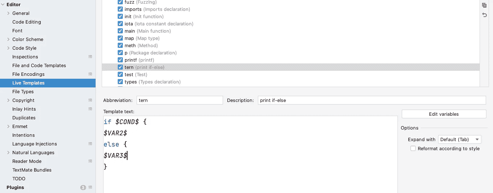

# 围棋缺少三元运算符。以下是一些对等物

> 原文：<https://betterprogramming.pub/go-has-no-ternary-operators-here-are-some-equivalents-316debbc9caa>

## 围棋中三元算子的替代方案


来自 Unsplash [donio3d](https://unsplash.com/photos/KyCzR06ypjI)

如果你像我一样，在写 Go 之前是一个纯 Java 开发人员，你一定在想为什么 Go 不支持像`return a > 1 ? 0 : 1`这样的三元运算符。

大多数主流语言像 C 和 Java 都支持三元运算符；像 Python 和 Ruby 这样的语言支持简化的`if-else`一行程序，比如`a = 0 if a > 1`。但是，围棋不在其中。它不仅仅是添加操作符，而且是一种以更方便的方式编码的概念，例如`?:`表达式可以被`if-else,`完美地替换，但是如果你被要求复制它几十或几百次呢？你必须毫不犹豫地寻求优化。

```
if a > 1 {
  return 0
else {
  return 1
}​
```

# Go 中没有三元运算符

早在 2012 年就有过关于是否添加三元运算符的[讨论](https://groups.google.com/g/golang-nuts/c/dbyqx_LGUxM/m/tLFFSXSfOdQJ)，最终被否决，并将[答案](https://go.dev/doc/faq#Does_Go_have_a_ternary_form)添加到 FAQ 中。

> Go 中没有`?:`的原因是这种语言的设计者已经看到这种操作经常被用来创建极其复杂的表达式。`if-else`形式虽然更长，但无疑更清晰。一种语言只需要一个条件控制流结构。

这个回答并不能让所有人满意，Github issues 中仍有提案([提案](https://github.com/golang/go/issues/20774)2017)在请求拥有它。我个人对 Go 团队的视角保持保守的态度，想把他们的理由一个个“打”出来。

## **原因 1:明确性**

`if-else`可以完成任务，但代价是“牺牲”我的键盘和手指。例如，在前面的例子中使用`if-else`而不是`?:`意味着我敲击键盘至少 13 次以上(`if + else + { + { + } + return`)，这个数字在一个生产项目中可能会呈指数增长。

三元运算符不仅可以用于返回、变量赋值，还可以用于函数参数、`printf` 参数等。如果在下面的`printf`案例中改成 `if-else`，我们可以看到一个明显的重复代码。

```
printf("I’m %s 21 years old, so I %s drink", age > 21 ? "above":"below", age > 21 ? "can" : "cannot") 
// if - else, duplicated code
if age > 21 {
printf("I’m above 21 years old, so I can drink")
} else {
printf("I’m below 21 years old, so I can drink")
}​
```

通常，重复的代码是一种不好的味道，即使我们封装了一个额外的函数来减少重复的代码，代码的可读性也会降低。只看打印方法，完整的逻辑被撕成碎片。​

```
if age > 21 {
print("above", "can")
else {
print("below", "cannot")
}
// wrap function
func print(a string, b string) {
printf("I’m %s 21 years old, so I %b drink", a, b)
}​​
```

`if-else`有一个转换，其中使用了初始化变量，而不是`else`，将上面的例子改为如下。它更简洁，但失去了不变性，可读性仍然很低。

```
b := 0
if a <= 1 {
 b = 1
}
return b​
```

## **原因 2:易读性**

易读性是一个很有争议的概念。至少，我觉得`return a > 1 ? 0:1`的可读性不弱于`if-else`。但是根据我多年的 Java 经验，我无法判断是否存在偏见。而且从提案的各种评论来看，我猜想 Go 官方考虑的是滥用三元运算符导致的可读性差，而不是三元运算符本身，比如像`a = b > 100 ? 99 : ( b > 1000 ? 999 : (b > 10000 ? 9999 : ( b > 100000 ? 99999 : …. )))).`这样的多级嵌套表达式将其转换为`if-else`更好理解。

```
if b > 100 {
a = 99
else if b > 1000 {
a = 999
else if b > 10000 {
a = 9999
....​
```

但是，仅仅因为有被滥用的风险，就对一个带来效率的经营者说不，是没有足够说服力的。

## **原因 3:并非所有语言都支持三元运算符**

除了 Go，还有一些其他语言也不支持三元运算符，比如 Rust，他们的团队也给出了一个原因。

> Rust 试图避免用多种方式做同一件事。此外，`:`符号已经超出了我的想象，经典的三元语法与已经被接受的类型归属 RFC 在语法上是不明确的。此外，还有模糊的计划在将来使用`?`符号来支持语言级别的错误处理。​​

但是他们也提到了他们对`?`和`:`运营商的未来规划吧？

# 备选方案 s

Go 用户在三进制运算符失败后仍在孜孜不倦地提出其他类似的优化来简化`if-else`。

建议[有条件分配(？=)对于有限的三元运算符功能](https://github.com/golang/go/issues/31659)希望实现`?=`来完成单行`if-else`和变量赋值，比如`a ?= a > 1, 0, 1`。这个提案也没有通过。

提案[支持内联“if”语句语法](http://Support inline "if" statement syntax)，希望有 Python 和 Ruby 那样的一行程序`if-else`，也因关注和支持不足而被否决。

正如所看到的，无论被问多少次，Go 团队可能都不会考虑添加三元运算符。转向替代品是短期内唯一的出路。

## IDE 模板

我们可以用 IDE 创建模板来简化代码生成，避免重复的`if-else`。例如，我们可以在 IntelliJ 中创建一个名为`tern`的实时模板。



然后我们可以在需要`if-else`的地方使用 tern，在三个变量中输入相关表达式。

## 泛型三元运算符

一个更好的解决方案来自于 [StackoverFlow](https://stackoverflow.com/questions/19979178/what-is-the-idiomatic-go-equivalent-of-cs-ternary-operator) ，由用户提供，支持泛型的实现。

```
func If[T any](cond bool, vtrue, vfalse T) T {
    if cond {
        return vtrue
    }
    return vfalse
}
```

然后我们可以把前面的例子变成`return If(a > 1, 0, 1)`，就像三元运算符一样方便。自己试试[这里](https://go.dev/play/p/nl_-04X1_GN)。​​​

# 结束了

我喜欢三进制运算符带来的便利，然而，Go 团队坚持不添加它，尽管周围总是有提议。在 Go 官方真正改变主意之前，我们可以依靠其他方法来提高我们的编码效率。

感谢阅读！

# 参考文献

[https://github.com/golang/go/issues/33171](https://github.com/golang/go/issues/33171)

​