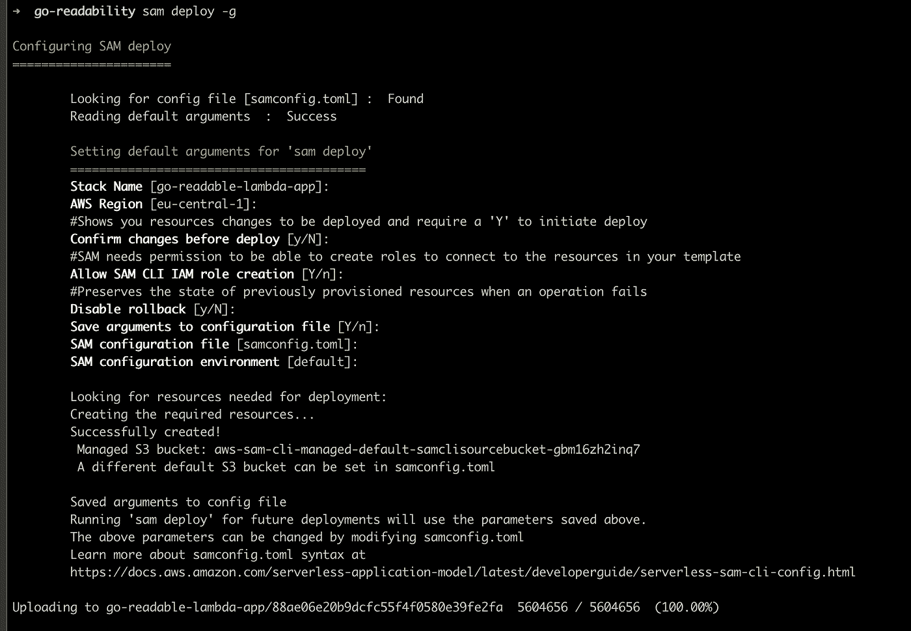
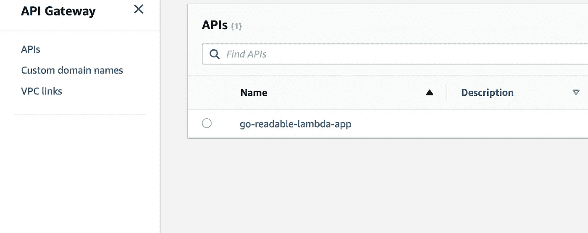
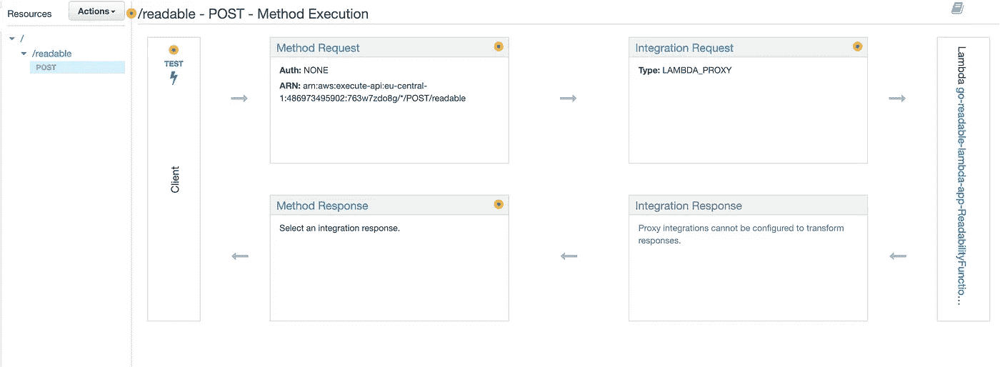
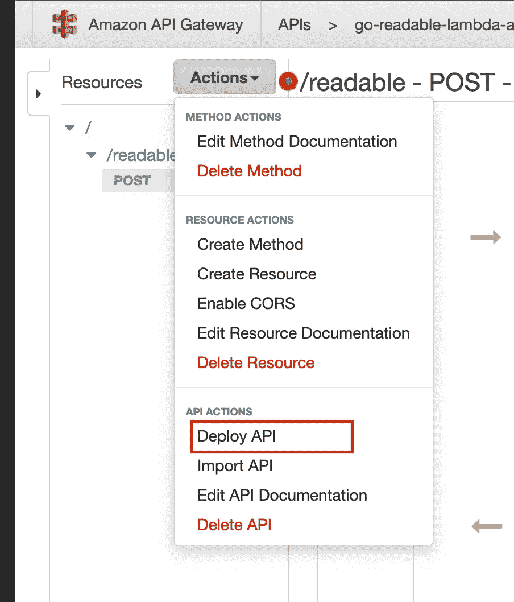
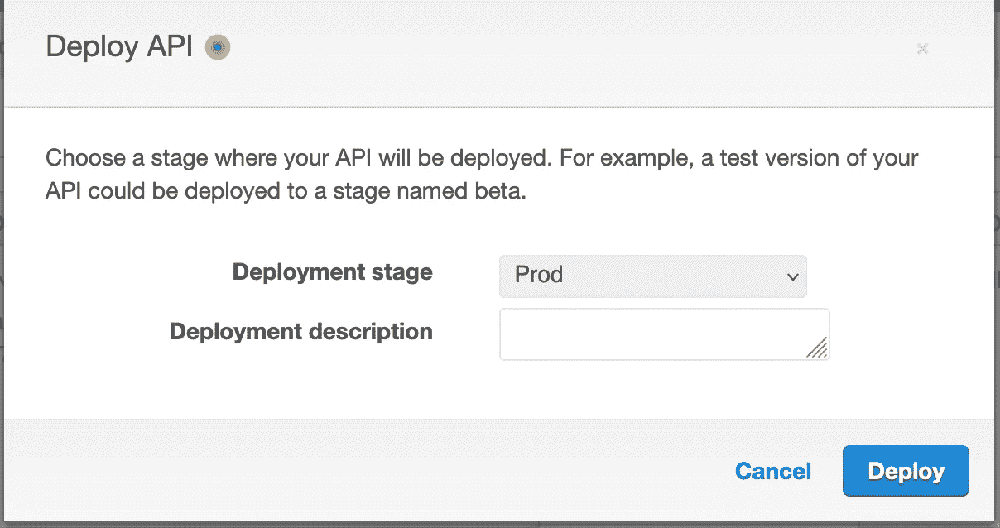
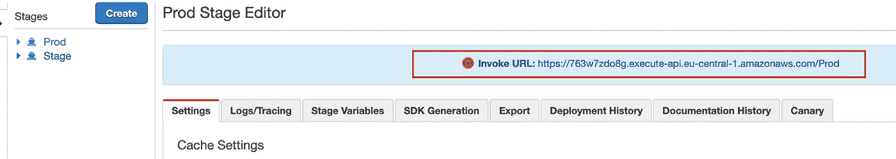

# Go(lang)和 AWS Lambda:通过 API 网关触发 Lambda 函数

> 原文：<https://betterprogramming.pub/go-lang-and-aws-lambda-trigger-a-lambda-function-through-an-api-gateway-44fc12bb855c>

## 从 Go 应用程序的 URL 中删除不需要的 HTML 标签


照片由[杰克逊·索](https://unsplash.com/@jacksonsophat?utm_source=medium&utm_medium=referral)在 [Unsplash](https://unsplash.com?utm_source=medium&utm_medium=referral) 上拍摄

在这里，我们用 Go 编写了一个应用程序，它接收一个 URL 并删除不需要的 HTML 标签以使其可读。然后我们将它部署到 AWS Lambda，并配置 AWS API 网关与我们的 Lambda 函数进行交互。

# 先决条件

请在您的系统上安装并配置以下软件包。

*   安装 [AWS CLI](https://docs.aws.amazon.com/cli/latest/userguide/getting-started-install.html)
*   安装 [AWS SAM CLI](https://docs.aws.amazon.com/serverless-application-model/latest/developerguide/serverless-sam-cli-install.html)
*   安装 Go

# 我们学到了什么

*   如何在 Go 中编写一个 AWS Lambda 函数
*   构建和部署 Lambda 函数
*   使用 API 网关触发 Lambda 函数

# Go 可读性 API

为了让本教程有点用处，我决定用一个 API 来接收一个 URL 并返回其内容的可读版本，这正是已经由 [Pocket](http://getpocket.com/) 完成的任务。

在开始编写代码之前，请安装以下 Go 包:

```
$ go get github.com/go-shiori/go-readability
$ go get github.com/aws/aws-lambda-go/events
$ go get github.com/aws/aws-lambda-go/lambda
```

`go-readability`通过删除不需要的 HTML 标签将文章转换成可读版本。`aws-lambda-go/lambda`负责通过传递所需的参数来执行处理函数，并将返回的响应发送回 AWS Lambda API。而`aws-lambda-go/events`帮助我们访问请求的主体，并发回适当的响应。

安装包后，创建目录并命名为`go-readable`:

```
$ mkdir go-readable && cd go-readable
$ go mod readability
```

创建一个文件`main.go`，并在其中添加以下内容:

`main`函数调用 AWS SDK 提供的`lambda.Start`函数，它接收一个处理函数，执行它，并将响应发送回 AWS 运行时 API。

`handler`函数接收两个参数，`ctx`给出函数的一些信息，request 包含请求的信息。`handler`函数可以有以下签名之一:

```
func ()
func () error
func (TIn) error
func () (TOut, error)
func (context.Context) error
func (context.Context, TIn) error
func (context.Context) (TOut, error)
func (context.Context, TIn) (TOut, error)
```

正如您所看到的，这个函数非常简单，它接收请求体，并在将其转换为`Event`结构后，将`Url`传递给`readability`，并将输出附加到响应中。

# 构建和部署 Lambda 函数

为了触发这个功能，我们将使用 AWS API Gateway 创建一个 API 端点。在您项目的根目录下，创建一个文件`template.yaml`，并在其中添加以下内容:

在`Resources`下，有一个我们希望由 AWS SAM CLI 创建的 AWS 服务列表。在这种情况下，我们只有一个资源，即 Lambda 函数。Lambda 函数资源具有一些属性:

*   `CodeUrl`表示其中是项目的根目录。在我们的例子中，`.`表示当前目录。
*   `Handler`是 Lambda 运行时 API 将查找并执行的函数的名称。
*   `Runtime`被设置为`go1.x`，这意味着我们正在使用 Go 运行时。
*   `Policies`向 Lambda 函数添加一个或多个 IAM 策略。
*   `Events`指定该函数可以由以下事件触发，在我们的例子中，我们希望通过一个`API`请求来触发我们的函数。
*   `Events`下的`Properties`表示我们 API 的`Path`，它是我们的端点，必须是一个`POST`请求，不需要任何认证。

创建此模板后，运行`sam build`和`sam deploy -g`并回答问题:



它会在您的根目录下创建一个名为`samconfig.toml`的文件，并在其中存储所有提供的信息。下一次，您只需要运行`sam deploy`来部署您的功能。它还会创建一个 CloudFormation 堆栈，将您的代码上传到 AWS Lambda，并在 API Gateway 中创建一个 API 资源。

# 部署我们的 API

现在是时候部署我们的 API 了。打开 AWS 管理控制台并转到 API 网关服务。您应该会看到类似这样的内容:



点击`go-readable-lambda-app`:



如您所见，我们在左侧栏中有一个资源，它只接受`POST`请求。在页面的右侧，您可以看到我们的 API 的流程。它接收请求，将其传递给 Lambda_PROXY，然后触发我们的 LAMBDA 函数，然后从我们的 LAMBDA 函数接收响应，并在进行一些集成后，将响应发送回来。为了访问这个端点，我们需要部署它。点击页面顶部的`Action`按钮，选择部署 API



然后选择一个阶段来部署 API:



部署之后，您将获得一个指向您的 API 的 URL。



让我们测试我们的 API:

```
$ curl --header "Content-Type: application/json" \
  --request POST \
  --data '{"url":"[https://smoqadam.me/posts/books-i-loved-most-in-2021/](https://smoqadam.me/posts/books-i-loved-most-in-2021/)"}' [https://763w7zdo8g.execute-api.eu-central-1.amazonaws.com/Prod/readable](https://763w7zdo8g.execute-api.eu-central-1.amazonaws.com/Prod/readable)
```

如果你做了所有正确的事情，你会看到给定 URL 的可读结果。

就这些，如果你有任何反馈或问题，请告诉我。